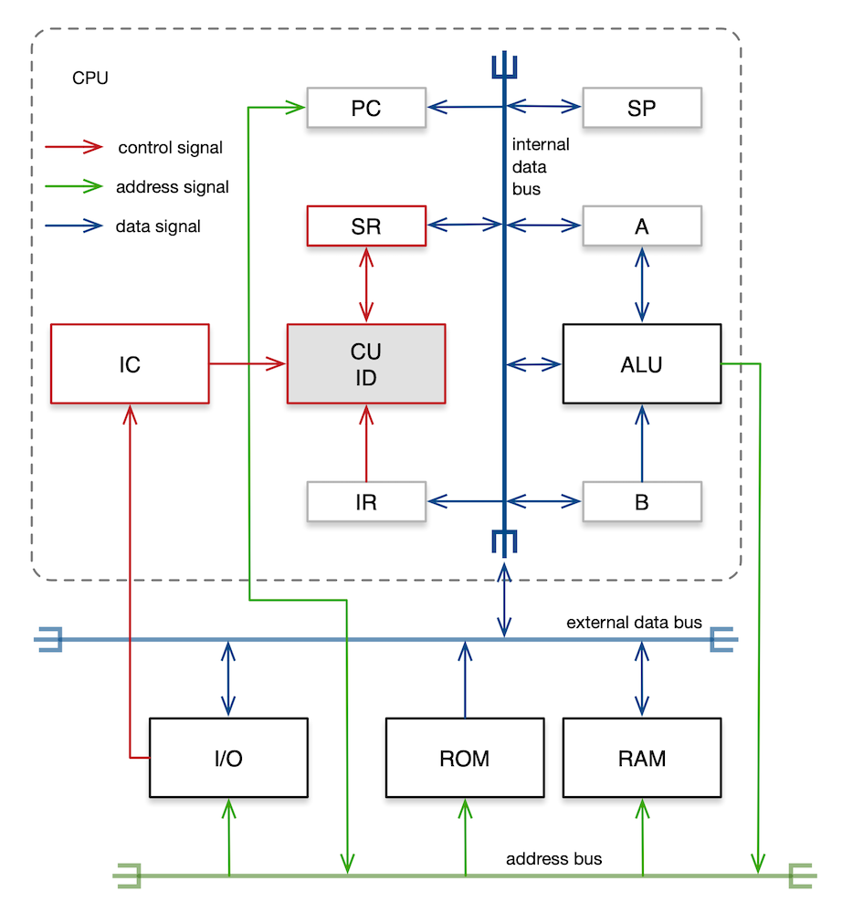

# INTRODUCTION

For generations, large systems have been built in layers, with well-defined interfaces between each layer. This design allows any old layer to be replaced with a newer, better implementation, without disrupting the rest of the system. Eventually, though, the once-good design becomes too outdated and the whole lot must be replaced with a new design and a new implementation that better fits current needs.

But in recent years, computing technologies have advanced at a ferocious pace and IT systems have become immensely complex. To keep pace with the rapidly changing worldwide market, the IT industry takes the expedient approach: it builds newer, more complex software technologies atop outmoded, simple technologies, instead of taking the correct—but costly, time-consuming, and disruptive—approach of replacing old technologies with newer, better ones. This situation is due in part to the economics and practices of modern software development and in part to the deeply enmeshed nature of some older, shortsightedly planned, hastily developed technologies.

The progressively deep and complex layering of software technologies moves programmers farther and farther away from the hardware, so much so that many experienced programmers today no longer understand something as fundamental as the instruction execution cycle or system reset sequence. Surely, a software developer can have a profitable career working on social media and line of business applications in JavaScript, without ever having peered inside a computer case. But software development is more than captivating user interfaces, elegant GraphQL requests, undocumented microservices, and neck-deep layers of NPM packages. To be effective, a programmer must, at the very least, possess an accurate mental model of how a computer executes programmes.

I wrote this article for programmers who work exclusively with software, far above hardware. My goal here is modest; I aim to explain the most basic aspects of computing: how a computer is built from disparate subsystems, how these subsystems collectively perform simple calculations, and how complex system behaviour emerges from combinations of just two symbols, a `0` and a `1`.

But who really cares about such lowly matters? Every IT practitioner should, I say. Recognising that things happen when they do is a sign of intelligence, a commonplace phenomenon within [Animalia](https://en.wikipedia.org/wiki/Animal). But the drive to understand why things are as they are— that is a mark of intellect, a quality unique to [Homo sapiens](https://en.wikipedia.org/wiki/Human).

# COMPUTING

Bears, birds, and many other species can plan for the future. But we humans, unlike our fellow animals, possess a unique ability to plan far into the future. But to exercise this ability, we are obliged to assume the burden continually to observe, record, analyse, calculate, and predict. To ease that weighty responsibility we set upon ourselves, we have over millennia amassed a collection of ingenious tools and techniques. Thousands of years ago, we used [stones to build computers](https://en.wikipedia.org/wiki/Stonehenge) that can measure the passage of seasons, so that we may plan a bountiful harvest thereby saving the tribe from starvation, come winter. Today, we use silicon, stones in a different guise, to make supercomputers that can predict the paths of winter storms, so that we may save the lives of millions of coastal residents.

The term "computer" can be applied broadly to any mechanical means that can be used to ease the task of calculation. So, [beans](https://en.wikipedia.org/wiki/Bean_machine) and [bones](https://en.wikipedia.org/wiki/Ishango_bone) are as much "computing devices" as are [slide rules](https://en.wikipedia.org/wiki/Slide_rule) and [supercomputers](https://en.wikipedia.org/wiki/Supercomputer). And until the 1940s, a "computer" was the [person who performed numerical computations](https://en.wikipedia.org/wiki/Computer_(job_description)) using the slide rule. In this article, "computer" means the modern digital computer. With all its hardware sophistication (and software sophistry) the modern digital computer is still a mechanical aid for calculating. Yet, simple calculations like additions and subtractions, when mixed with human ingenuity, achieves marvellous, and seemingly miraculous, feats like weather prediction simulation, air traffic control, global positioning satellites, artificial intelligence (AI), and even [Minecraft](https://youtu.be/ydd6l3iYOZE).

## *from bits to thoughts*

***bits, bytes, and booleans***—The name "digital computer" derives from the fact that this device can manipulate only *b*inary dig*its* (bits). A *[bit](https://en.wikipedia.org/wiki/Bit)* can be either `0` (false) or `1` (true). The simplest modern computer is the 1980s 8-bit [home computer](https://en.wikipedia.org/wiki/Home_computer). Such a computer is called the "8-bit" machine, because it manipulates an 8-bit quantity, a byte, at a time. Traditionally, a [*byte*](https://en.wikipedia.org/wiki/Byte) was the number of bits needed to hold a character. At one time, [6 bits](https://en.wikipedia.org/wiki/Six-bit_character_code), [7 bits](https://en.wikipedia.org/wiki/ASCII), and [9 bits](https://en.wikipedia.org/wiki/Honeywell_6000_series) were also used as the byte datum. In the early 1970s when the microprocessors first emerged, they were costly. So, the [4 bit *nybble*](https://en.wikipedia.org/wiki/4-bit_computing) (also spelled nibble) was used as the datum on some machines. But every modern CPU uses the 8-bit byte as the basic unit of computation. The byte is also known as the *word* on an 8-bit machine. But on a 16-bit, 32-bit, or 64-bit computer, a word is respectively those quantities. That is, the word matches the CPU's native datum size.

Boolean (true or false) values are represented using the individual bits within a byte. But a particular bit can be access only through its containing byte. This is the consequence of the byte-at-a-time processing scheme used by the 8-bit CPU. Logical operations on boolean values are directly implemented using [logic gates](https://en.wikipedia.org/wiki/Logic_gate) inside the CPU.

These days, even the simplest of computers, like Raspberry Pi, iPhone, etc., employ 64-bit CPUs. But the 8-bit CPU is most assuredly not gone, [nor is it forgotten](https://youtu.be/HyznrdDSSGM); the popular [Arduino](https://en.wikipedia.org/wiki/Arduino) single-board microcontroller platform uses a modern, sophisticated 8-bit CPU. So, we focus exclusively on the 8-bit CPU in this article. This keeps the presentation simple, yet relevant.

***numbers and letters***—Just as a decimal (base-10) digit can represent 0 up to 9, a binary (base-2) digit can represent 0 up to 1. The decimal number system requires multiple digits to represent a number greater than 9. Likewise, the binary number system requires multiple digits to represent a number greater than 1. Hence, decimal 0 is represented as binary `0`, 1 as `1`, 2 as `10`, 3 as `11`, 4 as `100`, and so on. The minimum value a byte can represent is `00000000` (decimal 0), and the maximum value it can represent is `11111111` (decimal 255). Thus, a byte can represent $2^8 = 256$ different values. Numbers greater than 255 must be represented by placing two bytes, side by side. An 8-bit CPU manipulates data one byte at a time. So, to load a 16-bit quantity from memory, the CPU must access the memory twice. Since the 1940s, the dawn of the electronic computer, numbers have been represented and manipulated using various formats. But all modern computers use [2's complement](https://en.wikipedia.org/wiki/Two%27s_complement) format to represent signed integers and [IEEE 754](https://en.wikipedia.org/wiki/IEEE_754) floating-point format to approximate real numbers.

To represent characters, computers use ASCII and Unicode standard formats. [ASCII](https://en.wikipedia.org/wiki/ASCII) was adopted as the standard binary format in the 1960s, with the advent of the modern digital computer. The numbers, letters, and myriad symbols that appear on the American standard keyboard are mapped to the ASCII symbol table. Although the original ASCII specification used 7-bit characters, the modern version uses 8-bits to represent one character, so it can represent up to 256 different character symbols. For instance, the word `"hi"` in ASCII binary representation requires two bytes: `01101000` for `h` and `01101001` for `i`. But tens of thousands of symbols are needed to represent all the languages in the world. The 1980s personal computer revolution prompted various efforts to represent [complex characters](https://en.wikipedia.org/wiki/Chinese_characters) in multiple bytes, which culminated in the [Unicode](https://en.wikipedia.org/wiki/Unicode) standard of the 1990s. The ASCII standard 8-bit character format has now been subsumed into Unicode as [UTF-8](https://en.wikipedia.org/wiki/UTF-8).

Note that even an advanced, modern CPU supports only the following data types: 1-bit boolean, 8-bit integer (byte), 16-bit integer, 32-bit integer, 64-bit integer, 32-bit single-precision floating-point, 64-bit double-precision floating-point, and 64-bit pointer (memory address). The character value is represented as a Unicode unsigned integer quantity as described above, and a string value is represented as a sequence of character values. All other data types supported by high-level languages are represented in hardware as a combination of pointers and byte sequences.

***addition, subtraction, multiplication, and division***—With standard formats like 2's complement, IEEE 754, and Unicode, the computer can represent numbers and letters. But representation is one thing, computation is quite another matter. The most basic arithmetic operation that a digital computer performs is the addition. The CPU adds numbers using a circuit with an unimaginative name—the *adder*. Two binary integers are added just like two decimal integers. In the decimal number system, 9 + 1 = 10, because adding 1 to the maximal value that a decimal digit can represent, namely 9, exceeds the capacity of a digit, and hence must be represented by two digits. Similarly, in the binary number system, 1 + 1 = 10 (decimal 2), because adding 1 to the maximal value that a bit can represent, namely 1, exceeds the capacity of a bit, and hence must be represented by two bits. When bits are assembled into an 8-bit quantity, this quantity can represent a total of $2^8 = 256$ different values. This is analogous to an 8-digit decimal quantity being capable of representing $10^8 = 100,000,000$ different values.

But what about negative numbers? In the 2's complement format, the left-most bit of a binary quantity represents the negative sign: `0` is positive, and `1` is negative. Hence, `00000001` is +1, and `11111111` is -1. Because this format reserves the left-most bit for sign representation, the largest positive integer an 8-bit quantity can represent is `01111111` (decimal 127) and the smallest negative number is `10000000` (decimal -128). An 8-bit singed integer, therefore, can represent 128 negative values, the 0 which is conventionally treated as a positive value, and 127 other positive values, giving a total of 256 different values. In other words, an 8-bit quantity, singed or unsigned, can represent 256 different integer values. So, an unsigned byte can represent decimals in the closed interval $[0, 255]$, and a signed byte can represent decimals in the closed interval $[-128, +127]$. By using the 2's complement representation of negative integers, the integer adder unit can compute subtraction and represent negative integers: 7 + (-9) = -2.

Integer arithmetic (`add`, `sub`, `mul`, `div`) is performed by the [arithmetic logic unit](https://en.wikipedia.org/wiki/Arithmetic_logic_unit#INTOP) (ALU) inside the CPU. The ALU also performs boolean logic (`not`, `and`, `or`, `xor`, `shift`, `rotate`)—hence, the "logic" in its name. The 8-bit CPUs performed floating-point arithmetic in software, because including specialised, floating-point hardware would have made the machines uneconomical for the home market of the time. Even more powerful 16-bit CPUs of that era, Intel 8086 for example, also lacked floating-point hardware, but it could be augmented with an optional add-on [floating-point unit](https://en.wikipedia.org/wiki/Floating-point_unit) (FPU) that supported floating-point arithmetic (`fadd`, `fsub`, `fmul`, `fdiv`). The FPU was then known as the [floating-point coprocessor](https://en.wikipedia.org/wiki/Intel_8087). Modern CPUs, starting with the 32-bit [Intel 80486](https://en.wikipedia.org/wiki/Intel_80486) processor, have integrated FPU hardware on chip.

***decision and repetition***—A sequence of bits (`0`s and `1`s) can represent letters and numbers. And the adder unit can add and subtract numbers. But programmes must also make decisions based on conditions:

```assembly
  ...
  jump a < b ⇒ con ⇏ alt
con: ; consequent code block
  ...
alt: ; alternative code block
  ...
```

For clarity and concision, the above code is written in pseudo assembly language. The condition `a < b` is computed by comparing two integers `a` and `b`. The CPU compares these two integers by first computing the subtraction `a - b`, then checking if the result is negative, zero, or positive. A negative means `a < b`; a zero means `a = b`; a positive means `a > b`. By taking one execution path or another on the basis of this result, the CPU accomplishes conditional branching.

Repetitive execution of a block of code, also known as looping, is accomplished by jumping back to the top of the block, based on the conditional branch located at the bottom of the block:

```assembly
  ...
loop: ; start of loop
  n ← 10    ; define maximum loop index
  i ← 0     ; initialize loop index
  ...
  i ← i + 1 ; increment loop index
  jump i < n ⇒ loop ⇏ end
end: ; end of loop
  ...
```

Above, integer `i` is the loop index which is initialised to 0 at the top of the loop, and `n` is the maximum number of iterations. The index `i` is incremented after each iteration. While `i < n`, the CPU jumps back to the top of the loop. But when `i = n`, the loop termination condition is met, so the CPU jumps out of the loop.

***algorithm and intelligence***—A CPU equipped with logic operations, character and string operations, integer and floating-point operations, and branching and looping constructs is capable of simple, but general, computations. For example, exponentiation $b^e = b \cdot b \cdot ... \cdot b$ is computed as $e$ repeated multiplications of $b$, and factorial $n! = (n - 0) \cdot (n - 1) \cdot ... \cdot 2 \cdot 1$ is computed as $n$ repeated multiplications of $n - i$ where $i$ ranges over the closed interval  $[0, n-1]$. The exponentiation algorithm uses looping and multiplication, and the factorial algorithm uses looping, subtraction, and multiplication. A more complex computation, $sin(a)$ where $a$ is an angle in radians, can be computed using Taylor series expansion with a sufficiently large number of iterations $n$:

<div>
$$
sin(a) = \sum_{i=0}^{n} \frac{(-1)^i}{(2i+1)!} a^{2i+1}
$$
</div>
The sine algorithm and its constituents, the exponentiation and the factorial, use looping, addition, subtraction, multiplication, and division. In this way, arbitrarily complex computations can be constructed from combinations of simple ones.

Algorithms like these are implemented as functions that take inputs and return results. Functions may be invoked using the `call` instruction from anywhere in the code. A function call, just like a branch, alters programme execution flow. But there is a difference: upon encountering a branch the CPU jumps immediately to the designated code block and the execution continues from there; but when calling a function the CPU must assemble the input values for the function to use and also must arrange for the function to return its result to the calling code, before jumping into the function's code block. And when the function finishes, execution returns to the caller, along with the computed result.

More sophisticated functions, like [sorting](https://en.wikipedia.org/wiki/Sorting_algorithm), [searching](https://en.wikipedia.org/wiki/Search_algorithm), and [graph](https://en.wikipedia.org/wiki/Graph_theory) algorithms, are implemented by composing simpler functions. Complicated AI algorithms like [chess](https://en.wikipedia.org/wiki/Computer_chess) and [Go](https://en.wikipedia.org/wiki/Computer_Go) use sorting, searching, and graph algorithms. Thus arose semblance of human thought from streams of two symbols, a `0` and a `1`.

By its very name, "artificial intelligence" is not intelligence, but an imitation thereof. Thinking, feeling machines have not been invented, because humans do not yet understand the true nature of human intellect. There are two broad categories of AI algorithms: rule-based AI and connectionist AI. *Rule-based* AI is used when the problem is well understood and the solution can be expressed as a small set of clearly defined rules. Board game algorithms are prime examples of rule-based AI. *Connectionist* AI, more popularly known as artificial neural networks (ANNs), is used when the problem is poorly understood, has a large set of potential solutions which makes it impracticable to describe it in terms of rules, and a vast amount of data can be collected beforehand. Autonomous vehicle navigation, crowd behaviour modelling, and similar open-ended problems are solved using ANNs.

# SOFTWARE

In this section, we explore the software aspects of computing, in particular the software that is the closest to hardware—the machine code. Machine code is all  `0`s and `1`s. It is generated from assembly language, which is in human-readable mnemonics, like `add`, `sub`, `jump`, `call`, and so on. There is one-to-one correspondence between machine instructions and assembly mnemonics. That is, an assembly programme can be assembled into its equivalent machine code programme, and the machine code programme can be disassembled back into the original assembly programme.

Every CPU family implements its own set of instructions. This is known as the [instruction set architecture](https://en.wikipedia.org/wiki/Instruction_set_architecture) (ISA) of the CPU. A typical ISA comprises instructions for clock and peripheral configuration, for arithmetic and logic, for memory access, and for input and output. The ISA is the programmer-visible aspects of the hardware.

In a typical, 1980s 8-bit home computer system, memory was a scarce resource, so the ISA had to provide ways for programmers to access memory efficiently and effectively. Naturally, instructions that access memory on these CPUs were numerous and complex. A typical 8-bit CPU, for example, supports many different [memory addressing modes](http://www.6502.org/users/andre/65k/af65002/af65002admodes.html): immediate, absolute, relative, implied, indirect, indexed, and combinations thereof. The complicated details of these addressing modes are not relevant to our discussions. But recognise that this complexity enabled a low-end CPU to do as much work as possible using as few bits of instructions as necessary. This increased code density of the ISA and thus reduced memory requirements of programmes.

***procedure calls***—The only abstraction mechanisms that assembly language offers are the ability for the programmer to declare variables and to organise code into procedures. And the most important procedures on an 8-bit home computer were the interrupt service procedures and the system service procedures, which were all stored in the ROM. The ROM also held the ubiquitous [BASIC](https://en.wikipedia.org/wiki/BASIC) interpreter. Interrupt service procedures are handlers for I/O, software errors, and hardware exceptions. System service procedures are analogues of system calls in modern operating systems.

When the 8-bit machine powers up, the CPU performs a system-wide hardware reset. Hardware reset clears CPU's internal registers (accumulator, general purpose registers, programme counter, etc.) and also clears peripherals' registers (configuration registers, data transfer registers, etc.). This puts the whole system in the well-defined initial state. The CPU then executes the reset interrupt service procedure. The CPU knows where to find this procedure, because the entry address of the procedure is conventionally stored in the ROM at a well-known address, such as `00000000,00000000` or `11111111,11111111`. The reset procedure first checks the health of memory and I/O devices. It then completes the system initialisation by performing a few housekeeping tasks, like setting up the interrupt service vector table, putting status register bits to appropriate initial values, and so on. The vector table is a list of addresses for various service procedures for handling timer, I/O, software error, hardware exception, and other interrupts.

Once the system has been fully initialised, the reset procedure starts the BASIC interpreter. The BASIC interpreter served not only as the high-level language interpreter, it also served as a programme editor and a simple command line interpreter to access system services, such as loading programmes from external storage devices.

A programmer-defined procedure in assembly language is just a sequence of instructions grouped under a label. The following pseudo-assembly procedure (a function, actually) doubles its integer argument:

```assembly
  ...
dbl: ; procedure that doubles input integer supplied in accumulator A
  mul 2  ; multiply input value in A with 2; store result back in A
  return ; pop (SR + ret addr) off stack at SP; load PC with retaddr
  ...
```

This procedure can be invoked as follows:

```assembly
  ...
  A ← 13   ; load A with argument value 13
  call dbl ; push (ret addr + SR) on stack at SP; load PC with dbl's addr
  A → mem  ; store result value in A to RAM location mem
  ...
```

The above pseudo assembly code is stripped to its essentials so as to highlight how procedures are defined and invoked in assembly, using addresses, programme counter (PC), stack pointer (SP), accumulator A, `call` instruction, and `return` instruction. To call the `dbl` procedure, the caller passes 13 as the argument to `dbl` via the accumulator A, and `dbl` returns its result value, 26, to the caller via A, as well. The `call` instruction automatically pushes onto the stack the return address and the contents of the status register (SR). The stack is a specially designated portion of the RAM used when calling procedure. The 16-bit return address is the address of the instruction immediately after the `call dbl`, which is `A → mem`. The 8-bit SR holds the state of the CPU. Next, the CPU jumps to the first instruction in `dbl`, which is `mul 2`. When the `dbl` procedure finishes, the `return` instruction at the end automatically loads the SR and the PC with corresponding contents popped off the stack. The CPU then jumps to the `A → mem` instruction, and programme execution continues from there. The above code sequence would be written in C as follows:

```C
...
int dbl(int a) { return 2 * a; }
...
mem = dbl(13);
...
```

Every time a procedure is called, some data are pushed onto the stack, thereby preserving the pre-call state of the CPU. If the current procedure calls another procedure, more state will be pushed onto the stack. Hence, a runaway recursive call will very quickly exhaust the stack memory, and will throw the [stack overflow exception](https://en.wikipedia.org/wiki/Stack_buffer_overflow).

***input/output***—Although the BASIC language is far removed from the underlying processor, special language constructs provide direct [read/write](read/write) access to memory and registers inside the CPU and the peripherals. This gave hobbyist programmers efficient and precise ways to initialise, configure, and control peripherals, like video, audio, and storage, without having to descend into assembly. Some [BASIC implementations](https://en.wikipedia.org/wiki/BBC_BASIC) even accept assembly instructions embedded inside the BASIC programme.

One way of programatically interacting with peripherals is [memory-mapped I/O](https://en.wikipedia.org/wiki/Memory-mapped_I/O). A processor that implements the memory-mapped I/O scheme allocates portions of the address space to ROM, RAM, and I/O registers. This method allows the programmer to access both memory and peripherals uniformly using memory access instructions along with sophisticated addressing modes. This approach is simple, effective, and convenient. But because significant portions of the address space are allotted to ROM and I/O, the total addressable RAM is much reduced. All 8-bit machines were equipped with 16-bit address bus capable of addressing $2^{16} = 65,536$ bytes (64 KB). Early machines were equipped with only 16 KB or 32 KB of RAM. In those minimal configuration, the conveniences of memory-mapped I/O outweighed the loss of usable RAM addresses. The popularity of memory-mapped I/O is ever greater, now; the [ARM](https://en.wikipedia.org/wiki/ARM_architecture) processor, arguably the most successful processor architecture in history, uses this scheme in its [Cortex-M](https://developer.arm.com/ip-products/processors/cortex-m) line of modern microcontrollers. And because the Cortex-M's 32-bit address bus has $2^{32} = 4,294,967,296$ bytes (4 GB) of address space and most microcontrollers are equipped with a few hundred KB of ROM and a few tens of KB of SRAM, the loss of a few addresses to memory-mapped I/O devices is hardly noticeable.

***interrupt services***—A classic 8-bit CPU handles I/O in two ways: synchronous and asynchronous. In synchronous I/O mode, the CPU would send a block of data to the peripheral, say a storage device, and wait for this much-slower device to complete receiving the data block, before sending another block to it. The time the CPU spent waiting for the peripheral could not be put to other profitable uses, such as handling another device or performing calculations.

In asynchronous I/O mode, the CPU cues up a chunk of data transfer by filling a data buffer, either in RAM or on the peripheral, issue a write instruction, and immediately move on to perform other tasks. When the peripheral has completed receiving the block of data, it sends an interrupt signal to the CPU. When an interrupt is received by the CPU, it completes the currently executing instruction, but immediately jumps to the corresponding service procedure for handling the interrupt. The service procedure then cues up another chunk of data and immediately returns to the interrupted code to resume execution. The interrupt service procedure is invoked just like a normal procedure, as mentioned above. Indeed, the reset service procedure mentioned above is the service procedure associated with the reset interrupt.

There are two types of interrupts: maskable interrupt request (IRQ) and non-maskable interrupt request (NMI). Some interrupt service procedures are critical to the proper functioning of the CPU, and hence they must be attended to, immediately. But most interrupts, especially I/O, are maskable IRQs. IRQs are assigned priorities, based on their importance. A higher priority IRQ (say, a keyboard input request) may interrupt the execution of a lower priority IRQ (say, a disc write request) service procedure. In this situation, the CPU will push the state of the disc write service procedure onto the stack, and jump to the keyboard input service procedure. The reset signal is the ultimate NMI. Hence, no matter what the CPU is doing, when the reset signal arrives, it must immediately perform hardware reset, and invoke the reset service procedure.

***high-level languages***—The only data types an 8-bit processor can natively support are 1-bit flat, 8-bit byte, and 16-bit address. For 16-bit (or 32-bit) integer values, the CPU performs byte operations two (or four) times, and it emulates floating-point values in software. On the other hand, a 32-bit processor, like the Cortex-M, supports natively 1-bit flag, 8-bit byte, 16-bit half-word, 32-bit word, and 32-bit address. And if the microcontroller is equipped with a floating-point hardware, as in the case of the [Cortex-M4F](https://www.st.com/en/microcontrollers-microprocessors/stm32f303cc.html) processor on the [RobotDyne Black Pill board](https://stm32-base.org/boards/STM32F303CCT6-RobotDyn-Black-Pill), it natively supports 32-bit single-precision floating-point. The Cortex-M4F must perform 32-bit operations twice for 64-bit double-word integer and emulate in software 64-bit double-precision floating-point operations, since its FPU cam only handle single-precision floating-point operations.

The C programming language supports char (8-bit), short (16-bit), int (32-bit), long (64-bit), float (32-bit single-precision), and double (64-bit double-precision) data types, plus 32-bit or 64-bit pointer, depending on the processor architecture. C's native data types closely match those supported by the underlying hardware. Hence, C is the lowest (the closest to hardware), high-level (non-assembly) language in popular use. Indeed, many statements in C can either be translated directly into assembly or they can be expressed as combinations of a few mnemonics. Yet, C is far more convenient to use than assembly language, because of its comprehensibility and its support for high-order, low-overhead organisational constructs, like data structures, functions, and modules. Indeed, modern optimising C compilers can produce code that out performs hand-crafted assembly, in many situations. For this reason, most embedded programming is done in C, now.

As capabilities of processors have grown rapidly over the past few decades, even minuscule microcontrollers can now tolerate the overhead associate with higher-level languages like [C++](https://en.wikipedia.org/wiki/Processing_(programming_language)), [Python](https://micropython.org/), [TypeScript](https://www.microsoft.com/en-us/research/uploads/prod/2019/09/static-typescript-draft2.pdf), [Rust](https://www.rust-lang.org/what/embedded), and [OCaml](https://link.springer.com/chapter/10.1007/978-3-319-19686-2_10). The growth of hardware capabilities will inevitably bring about the explosion of software complexity. As software complexity increase, type safety, modularity, composability, and other benefits these higher-level languages offer will become necessities, in a not-so-distant future.

# HARDWARE

To keep the discussions in this section short and simple, we shall talk about a fictional computer with minimal functionality: it has a CPU with 16-bit addresses and 8-bit data; it has a memory system with ROM and RAM; it executes a programme stored in ROM, and the programme can access the RAM; it can performs simple calculations like addition and subtraction; but, it has no keyboard input, no display of any kind, and no permanent storage. We will not discuss real 8-bit homes computers of the 1980s; simple as they were, they still were laden with real-life complexities that can muddy the presentation with too many details.

An implementation of the ISA in hardware is called the [microarchitecture](https://en.wikipedia.org/wiki/Microarchitecture). A simple CPU microarchitecture that can perform arithmetic and logic operations, execute loops, call procedures, and handle interrupts is shown in the diagram below. It consists of the following components: control unit (CU) which comprises control logic, timing logic, and instruction decoder (ID); interrupt controller (IC); instruction register (IR); status register (SR); arithmetic logic unit (ALU); accumulator (A); general purpose register (B); programme counter (PC); stack pointer (SP); internal data bus to which these components are attached; buffer circuit that isolates the internal data bus from the external data bus on the motherboard; and address lines that connect directly to the external address bus on the motherboard. ROM, RAM, and I/O peripherals are located outside the CPU on the motherboard, and so are the address bus and the external data bus.



It is often said that the CPU is the brain of the computer. If that were so, the CU is the [cerebrum](https://en.wikipedia.org/wiki/Cerebrum); with the aid of ID, IC, and SR, the CU controls all activities that take place inside the CPU. Many circuitries inside the CPU as well as those in external components are [synchronous circuits](https://en.wikipedia.org/wiki/Synchronous_circuit). These components must be driven by the master clock signal in order for them to operate in synchrony. Timing signals go to every component in the system. To reduce clutter, timing signal paths are not shown in the above diagram. A typical classic 8-bit home computer ran at 1 MHz clock frequency. This clock signal is supplied by an external [crystal oscillator](https://en.wikipedia.org/wiki/Crystal_oscillator).

The CPU chip is plugged into a socket on the motherboard, and the socket pins are connected to clock line, interrupt line, reset line, power line, ground line, address bus lines, and data bus lines. The buses connect the CPU chip to ROM chips, RAM chips, video interface, audio interface, keyboard interface, and other peripherals located around the motherboards. The unidirectional address bus is 16 bits wide, so the CPU can address 64 KB of memory. Address signals travel from the CPU to the address decoders inside the peripherals. The bidirectional data bus is 8 bits wide. Data signals travel in both directions between the CPU and the peripherals. The external data bus is connected to the internal data bus via a [tri-state digital buffer](https://en.wikipedia.org/wiki/Digital_buffer#Tri-State_Digital_Buffer). This buffer electrically isolates the internal data bus from the external data bus. It connects the two buses only when the CPU instructs it to do so. And it also controls the I/O data flow direction.

The primary function of the CPU is to run programmes. Programmes are sequences of machine instructions. The CPU runs the programme by fetching, decoding, and executing the first instruction, then the next, and the next, and so on. The very procedure executed after the CPU powers up is the reset interrupt service procedure. This procedure, along with other interrupt service procedures are stored in the ROM. When an interrupt occurs during normal operation, the CPU suspends the currently executing procedure, and runs the interrupt service procedure. Once the interrupt has been serviced, the CPU resumes executing the suspended procedure. We shall now examine these operational stages, individually.

***fetch***—For the CPU to execute an instruction, it must first fetch the instruction from memory. System service procedures and interrupt service procedures are stored in the ROM and user programmes are stored in the RAM. The address of the instruction to be fetched must already be held in the PC. At the start of the fetch stage, the CU transmits the instruction address held in the PC along the address bus. The address decoder of the ROM (or that of the RAM) recognises this address as being one of its own, retrieves the contents of the addressed byte, and transmits the contents along the data bus. The CU knows that the transmitted byte is an instruction, so it loads the instruction into the IR.

***decode***—The CU now proceeds to the decode stage. The CU instructs the ID to interpret the contents of the IR. The circuitry inside the ID recognises the instruction type: arithmetic operation, logic operation, conditional branch, procedure call, memory access, I/O access, or whatever.

***execute***—Having decoded the instruction, the CPU enters the execution stage. If the instruction is a read-from-RAM, say one that uses absolute addressing, the CU knows that the instruction comprises three bytes—one byte for the opcode and two bytes for the operand address. The CU uses the operand address to retrieve the addressed byte from RAM, and loads the contents into accumulator A. The ALU can now use the value in accumulator A as an operand. The CU then increments the PC by 3, so the PC now holds the address of the next instruction.

If the instruction is an `add` operation, the CPU instructs the ALU to add the 8-bit contents of accumulator A and register B, and puts the sum into accumulator A. An addition may generate a carry. A subtraction, on the other hand, may yield a zero or a negative. The CU sets the carry, zero, or negative bit in the SR, depending on the result in accumulator A.

If the instruction is a conditional branch, say one that uses relative addressing and with a loop termination condition `i < 10` where `i` is the loop index, the CU increments the loop index and subtracts 10 therefrom. If the result in accumulator A is not 0, the loop must continue. Then, the CU decrements the PC by the jump distance specified in the branch instruction. At the start of the next fetch stage, the CU will execute the first instruction at the top of the loop, thereby iterating through the loop once more. If the result in accumulator A is 0, however, the CU increments the PC by 2, so the PC now holds the address of the instruction that follows the end of the loop. The CU will fetch that instruction at the start of the next fetch stage.

***interrupt***—When the CPU receives an interrupt signal from a peripheral, the IC checks if the interrupt is an IRQ or an NMI. If the interrupt is an IRQ, the IC checks if it has sufficient priority to interrupt the currently executing procedure. If the interrupt is an NMI, however, the IC informs the CU to handle the interrupt, immediately.

Before handling an interrupt, the CU finishes the currently executing instruction first, and pushes the current values of the SR and the PC onto the stack. This effectively suspends the currently executing procedure. Next, the CU loads the PC with the address of the interrupt service procedure. The CU knows where to fetch the service procedure's address, because the address is stored in the interrupt vector table, indexed by the interrupt number. The interrupt vector table is located in ROM at `00000000,00000000` (or, `11111111,11111111`, depending on the CPU design). So, if the interrupt number is `1`, its service procedure address is stored in the vector table at the following location:

```code
(00000000,00000000 base) + (interrupt number 1) * (2 bytes/address) =
  00000000,00000010 holds low byte of handler address
  00000000,00000011 holds high byte of handler address
```

Since every address is 2 bytes in length, the low byte value of the service procedure's address is at ROM location `00000000,00000010` (decimal 2) and the high byte value of the address is at ROM location `00000000,00000011` (decimal 3). The values of these two bytes together form the address of the service procedure for interrupt `1`, and this address is loaded into PC. The CU will execute the first instruction of the handler procedure, starting at the next fetch stage.

Upon reaching the interrupt return instruction at the end of the handler procedure, the CU pops the saved PC and SR values off the stack and loads the saved PC value into the PC and saved SR value into the SR, thereby restoring the suspended procedure's state. The suspended procedure resumes execution at the start of the next fetch stage.

# CONCLUSION

I explained in this article how a computer is built, how it boots up, how it executes instructions, how it performs simple calculations, how these calculations when combined exhibit behaviours as complex as playing chess. My main goal here was to give software developers a better understanding of how the computer hardware executes programmes, with the hope that this low-level understanding may make them more mechanically sympathetic programmers. This hardware execution model I presented also sheds light on the inner workings of [virtualisation technologies](https://en.wikipedia.org/wiki/Hardware_virtualization), [hardware emulators](https://en.wikipedia.org/wiki/Hardware_emulation), [virtual machines](https://en.wikipedia.org/wiki/Virtual_machine), and [microcontrollers](https://en.wikipedia.org/wiki/Microcontroller).

As much as possible, I avoided descending into the low-level details like clock signal phases, clock skew, signal degradation during bus transfer, serial and parallel I/O protocols, power regulation, heat dissipation, circuit layout, chip fabrication, etc. I also shunned modern, advanced topics like pipelining, branch prediction, vector processing, SIMD, VLIW, multi-core processors, on-chip instruction and data caches, on-chip high-speed buses, NUMA, etc. Those interested in modern processors and microcontrollers should read textbooks like *[Computer Architecture: A Quantitative Approach](https://www.amazon.com/Computer-Architecture-Quantitative-Approach-Kaufmann/dp/0128119055/ref=sr_1_2?dchild=1&keywords=computer+architecture&qid=1614712937&sr=8-2)* and *[The Designer's Guide to the Cortex-M Processor Family: A Tutorial Approach](https://www.amazon.com/Designers-Guide-Cortex-M-Processor-Family/dp/0081006292/ref=sr_1_8?dchild=1&keywords=cortex-m&qid=1614714051&sr=8-8)*.

