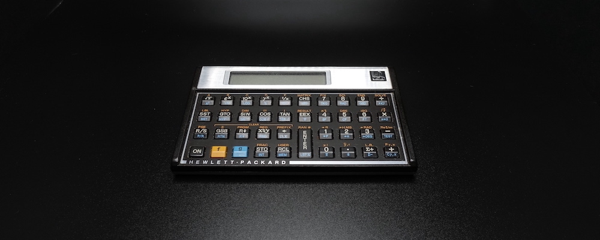
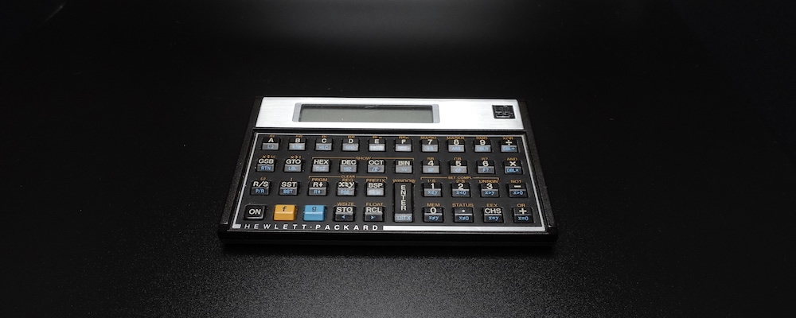
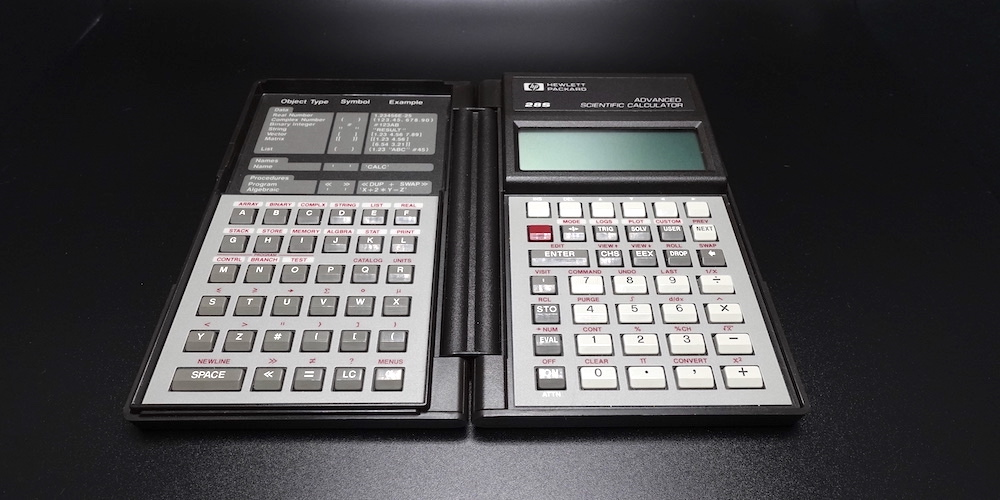

# INTRODUCTION

In the annals of computing, calculators reigned supreme in a period, between early 1970s and early 2000s. The first electronic pocket scientific calculator, the HP-35, came out in 1972, and it displaced the [slide rule](./HowSlideRulesWork.md) in just a few years. The slide rule had been the predominant calculating device for almost 400 years, since its invention by [William Oughtred](https://en.wikipedia.org/wiki/William_Oughtred) in 1622. But in 30 short years, the calculator was outmoded by the touch-screen mobile phone. [Just deserts](https://legal-dictionary.thefreedictionary.com/Just+Desserts), I suppose. Brief though their reign was, scientific calculators did leave an indelible mark on engineering, physics, and other hard sciences of the 20th century.

In this article, I mean by "calculator" a commonly available electronic pocket calculator with a microprocessor. I am excluding from this definition mechanical calculators, valve (vacuum tube) calculators, transistor calculators, and desk calculators. In fact, it is evident from the title of this article that I am focusing narrowly on [Hewlett-Packard](https://en.wikipedia.org/wiki/Hewlett-Packard) (HP) calculators with reverse Polish notation (RPN) input method, in particular the programmable scientific models made in, and after, the 1980s. To an engineer like me, anything less than RPN is insupportable.

The [microprocessor](https://en.wikipedia.org/wiki/Microprocessor) is the little engine that powers the modern world. Children in 2021 play games on powerful CPUs, like the 64-bit AMD Ryzen. But only five decades earlier in 1971, the first microprocessor, the 4-bit [Intel 4004](https://en.wikipedia.org/wiki/Intel_4004) was invented. In its day, the 4004, which integrated 2,300 transistors on a single chip, was a massive leap forward in technology. The 4004 came about because [Busicom](https://en.wikipedia.org/wiki/Busicom), a Japanese electronic calculator company, asked Intel in 1969 to develop a microprocessor for use in calculators. Naturally, Busicom calculators, like the [141-PF](http://www.vintagecalculators.com/html/busicom_141-pf.html), were the first production electronic devices to be powered by a microprocessor. Although the 141-PF holds the distinction of being the first microprocessor-based calculator, its design was unremarkable; it was a four-function desk calculator with a few business-friendly features, like memory and percentage.

Then only a year later in 1972, HP introduced their game-changing device, the [HP-35](https://www.hpmuseum.org/hp35.htm), the world's first pocket scientific calculator. This device was very small for its day, but massive by today's standards. Indeed, the adjective "pocket" referred to the large pocket of a lab coat. Contrary to the prevailing conventions, but in keeping with the HP tradition, the HP-35 employed the RPN input method. At 395 USD introductory price (almost 2,700 USD in 2021), the HP-35 was initially a rich man's toy; most engineers just kept using their slide rules, at least for a few more years, until electronic calculators became more affordable. Incidentally, the "35" in the name is a nod to the 35 keys, which were rather a lot and something to be proud of in the days of four-function calculators.

Only 10 years later in 1982, the [HP-15C](https://www.hpmuseum.org/hp15.htm) shown below, was introduced. It was the engineers' all-time favourite advanced, programmable, scientific pocket calculator. It was an impressive achievement by HP to have crammed so many capabilities into a device the size of a wallet. The HP-15C was priced only 135 USD (about 400 USD in 2021). Typical engineering students of the era could not afford it, because it would have required a month's fasting.

HP's latest and most advanced scientific calculator, the [HP Prime](https://en.wikipedia.org/wiki/HP_Prime), which was introduced in 2013, is no calculator; it is a screaming computer. It has a 500 MHz 32-bit ARM Cortex-A7 CPU, 256 MB of SDRAM, 512 MB of flash memory, and a 16-bit colour touch screen. But it is about the same size as the 2021 iPhone 13. The HP Prime, being almost a decade older, is nowhere near as capable as the iPhone 13, but it can be had for a mere 100 USD in 2021. And it has tonnes of scientific software and hardware interfacing capabilities that are not available on the iPhone.

Despite the immense capabilities of the latest calculators, their market has been taken over by mobile phones, tablets, and laptops. I expect that calculators will completely disappear from common use soon. But I am certain that there will always be enthusiasts of calculators, especially the RPN variety, among STEMers. I dedicate this article to my fellow RPN fanciers. And I hope that the information provided here will ignite in future generations of STEMers a spark of interest for these fascinating little devices.

# RPN

In mathematics, a generic binary function $f$ is written as $f(a, b)$, and a generic binary operator $\bigotimes$ is written as $a \bigotimes b$. In prefix notation, they are written as `f a b` and `⨂ a b`. In postfix notation, they are written as `a b f` and `a b ⨂`. Mathematical notations evolved organically through the centuries. But the prefix notation was invented by the Polish logician [Jan Łukasiewicz](https://en.wikipedia.org/wiki/Jan_%C5%81ukasiewicz) in 1924. Therefore, the prefix notation is called the Polish notation. It is the [s-expression](https://en.wikipedia.org/wiki/S-expression) syntax of LISP programming language. The postfix [reverse Polish notation](https://en.wikipedia.org/wiki/Reverse_Polish_notation) (RPN) is the opposite of the prefix notation. Both the prefix and the postfix notations are reviled by the uninitiated, but revered by the cognoscenti.

Because mathematical notation is meant to be read by humans, it can be fussy and, sometimes, downright quirky. The irregular syntax is quite a chore for a computer to interpret. For instance, the expression $2 - (\frac{5}{4 -2} + 8) = -8.5$ is parsed by building the a symbol tree consisting of nine nodes (one node per symbol) in memory in the first pass, and by reducing the tree to the result $-8.5$ in the second pass:

- $-$
  - $2$
  - $+$
    - $÷$
      - $5$
      - $-$
        - $4$
        - $2$
    - $8$

Building the symbol tree requires processor cycles and a lot of memory, for the symbol values, pointers, etc. Evaluating the symbol tree to obtain the result requires additional processor cycles. However, if this mathematical expression is rewritten in the postfix notation, we get $2↵\ 5↵\ 4↵\ 2\ -\ ÷\ 8\ +\ -$. The symbol $↵$ is the operand delimiter, which is represented by the `[ENTER]` key on HP RPN calculators. On an RPN calculator, we can simultaneously parse and evaluate this postfix expression using only three memory locations `x`, `y`, and `z`:

- `[2][ENTER]` → `x←2`
- `[5][ENTER]` → `x←5 | y←2`
- `[4][ENTER]` → `x←4 | y←5 | z←2`
- `[2][-]` → `x←4-2=2 | y←5 | z←2`
- `[÷]` → `x←5÷2=2.5 | y←2`
- `[8][+]` → `x←2.5+8=10.5 | y←2`
- `[-]` → `x←2-10.5=-8.5`

To compute the expression $2^3 = 8$ on an RPN calculator, we press the `[2]` key, then the `[ENTER]` key, the `[3]` key, then the `[`$\color{darkred}{y^x}$`]` key. That is, we enter the operands first, then we press the operator key to obtain the result. A binary operator, like $y^x$, uses the `y` register as the first operand and the `x` register as the second operand, and accumulates the result in the `x` register, clearing the `y` register in the process. A unary operator, like $x^2$, uses the `x` register both as the input and as the output. There is no `[=]` key on an RPN calculator.

When using RPN, we must first parse the expression, mentally. But the RPN input method is comparatively much more efficient when the expressions are lengthy and contain many parentheses, such as those that appear in engineering calculations. Hence, we are purchasing mechanical efficiency with a small amount of mental effort. This mental parsing becomes second nature to RPN users within a couple of days.

Computers in the late 1950s had very little processing power and memory storage, parsing mathematical expressions was a very difficult task. To simply parsing, [John McCarthy](https://en.wikipedia.org/wiki/John_McCarthy_(computer_scientist)) adopted the much simpler s-expression as the syntax for his LISP programming language. The [IBM 704](http://www.columbia.edu/cu/computinghistory/704.html) on which the first LISP implementation ran occupied a large, climate-controlled room. A little over a decade later in the early 1970s, the HP-35 was the most powerful scientific calculator and the first one designed to fit an engineer's shirt pocket. But the HP-35 had a miserly 1-bit serial processor and a meagre 4-register (`x`, `y`, `z`, and `t`) memory. So, the time- and space-efficient RPN input method was not merely a nicety, but a clear necessity. A *register* is a fast, on-chip, temporary storage used by the CPU while performing operations. A collection of registers is called a register *file*. You can read a detailed explanation of how the CPU uses registers in my article *[How Computers Work](HowComputersWork.md)*.

Technically speaking, the HP-35 (1972) is a [stack architecture](https://en.wikipedia.org/wiki/Stack_machine) computer, albeit a wee one. The Burroughs [B5000](http://www.retrocomputingtasmania.com/home/projects/burroughs-b5500/b5000_b5500_gallery) (1961) and the Hewlett-Packard [HP 3000](http://www.hpmuseum.net/display_item.php?hw=100) (1972) are stack machines, too, though slightly bigger, each being about the size of a room. But all stack machines operate on the same principle: they all use a stack register file to store temporary values during computations. A *stack* is a data structure that holds values in a last-in, first-out (LIFO) fashion. If we push `[1][ENTER] [2][ENTER] [3][ENTER] [4][ENTER]` onto the stack of the HP-35, its registers would contain the following values: `x=4 | y=3 | z=2 | t=1`. Then, when we operate on those values, the operator consumes the values, starting with the last value, namely `x=4`. But had we pushed one more operand `[5][ENTER]` without performing operations, the stack would become `x=5 | y=4 | z=3 | t=2`, and the oldest value $1$ would have fallen off the bottom of the stack and lost forever. As the newer values are consumed off the top of the stack by operations, the oldest value in the register `t` is replicated upward, one step at a time.

RPN is essentially about user interface design and usability. Most people loathed RPN, but engineers back in the day adored it. While we are on the topic of usability, I should mention how we engineers used calculators: we placed on the desk our RPN calculator and our notebook, side by side, writing in the notebook with our dominant hand and operating the calculator with our non-dominant hand. This made the workflow efficient and kept the desk neat.

# PROGRAMMING

Let us be honest. Calculators are no longer a thing today, programmable calculators less so, programmable RPN calculator much less. Although writing programmes using tiny keys and a cramped display is not worth the trouble now, programming was a big part of using HP calculators, back then. In this section, I shall describe programming these calculators at a high level. If you are interested in the details, read the user's manual for the appropriate calculator, which are available online in PDF format.

HP RPN scientific calculators can be programmed in one of three ways: RPN keystroke, reverse Polish LISP (RPL), and Prime Programming Language (PPL). Keystroke programming simply records the RPN key input sequences. An RPN keystroke programme reads like an assembly programme. RPL is a LISP programming language with postfix instead of prefix functions. Because RPL uses the reverse Polish syntax, it does not need parentheses like LISP does. As such, calculator users find RPL far less intimidating than LISP. PPL is a BASIC programming language with added Pascal-like constructs. Because BASIC was the first programming language designed expressly for novices, programmes written in PPL are easily comprehensible to any calculator user.

On an RPN calculator, we use programmes to minimise repetitive tasks. Programmes also reduce the potential for human errors. A *programme* is typically a short procedure that accepts input values via the stack registers, and returns the output either in the stack registers or in named memory locations. A more sophisticated programmes use internal variables and labels. Some programmes, though, are a bit more elaborate, consisting of multiple procedures, each specialising in one small task.

The HP-65 from the early 1970s was HP's first programmable pocket calculator. It used magnetic strips to store small keystroke programmes. This storage technology was used into the late 1970s on advanced programmable models, like the HP-41C. The more advanced Voyager Series from the early 1980s, like the HP-11C and the HP-15C, used an internal, battery-backed programme memory. The HP-15C's programme memory is less than 500 bytes in capacity, and is capable of storing up to a couple of hundred steps. The HP-28S from the late 1980s had 32 KB of programme memory and a LISP-like RPL high-level programming language. Because it has a builtin LISP, the HP-28S is capable of performing symbolic computations, the first pocket calculator with such a powerful capability. HP's latest flagship pocket calculator, the HP Prime, has 512 MB of flash programme memory, 256 MB of SDRAM, and a 500 MHz 32-bit ARM Cortex-A7 CPU. It supports a BASIC-like PPL high-level programming language. Frankly, the HP Prime is not a pocket calculator; it is a 3D-capable, touch-screen-equipped, full-fledged computer with built-in computer algebra system (CAS) that fits in a pocket.

## *RPN Programming*

In terms of interaction, RPN keystroke programming is similar to the macro recording facility of a word processor. To create a programme on a programmable RPN calculator like the HP-15C, you press the `[P/R]` key to enter the programming (record) mode, punch in the desired keystrokes, and terminate the input sequence with the `[RTN]` key. By the `[P/R]` key I mean the key sequence `[g][R/S]`, and by the `[RTN]` key I mean the key sequence `[g][GSB]`. HP RPN calculators have a yellow shift key, labelled `f` or `↰`. Some calculators have an additional blue shift key, labelled `g` or `↱`. The HP-15C has both the shift keys.

In terms of readability, an RPN keystroke programme reads like an assembly code, complete with conditionals, labels, gotos, addresses. To those of us who grew up programming 6502 assembly in the early 1980s, RPN keystroke programming felt natural. But no engineering student today would countenance such hardship—why would they, really.

The HP-15C, the top-of-the-line programmable, scientific, pocket calculator of the the early 1980s, had less than 500 bytes of programme memory, and each instruction takes a couple of bytes on average. So, the largest programme this calculator could store is about 200 or so instructions. They may shock today's tablet users, but it was adequate for engineers of the day. Pray do not pity us; if we needed to write more sophisticated programmes, we had the [VAX-11/780](https://en.wikipedia.org/wiki/VAX-11) minicomputer, the [SUN](https://en.wikipedia.org/wiki/Sun-1) workstation, the [IBM PC](https://en.wikipedia.org/wiki/IBM_Personal_Computer) personal computer, the [Commodore 64](https://en.wikipedia.org/wiki/Commodore_64) home computer, and many others.

## *RPL Programming*

## *PPL Programming*

# COLLECTION

## *Voyager*

#### HP-11C

#### HP-15C

#### HP-16C

## ***Pioneer***

#### HP-32S

## *Clamshell*

#### HP-28S

## *Anniversary*

#### HP 35s

## *CAS*

#### HP Prime

There is a free [HP Prime emulator](https://apps.apple.com/us/app/hp-prime-lite/id1208226883) that runs on the iPhone—a decent app, that is.

# CONCLUSION

When the HP-15C, the calculator that every engineer lusted after, came out in 1982, I had just entered the engineering college in Burma. In those days, very few college students in Burma could afford an electronic pocket calculator, let a lone a top-of-the-line model like the HP-15C. To ensure fairness, my college required all students to use the [slide rule](./HowSlideRulesWork.md). So, I was one of the few slide rule users in the early 1980s. A few years later, I emigrated to the US, and became an HP calculator devotee, overnight. In the 1980s, the HP-15C with its paltry 500 bytes of programme memory was adequate, and the HP-32S with its 32 KB programme memory was a extravagant luxury. But by the early 2000s, at the dawn of modern, all-in-one mobile phones, the calculator was no longer a desk necessity. The arrival of the iPhone in 2007 permanently demoted the calculator to a desk clutter. By the time the HP Prime was introduced in 2013, high school calculus students were the only remaining group of calculator users, and even they used it mainly for plotting. By 2021, the iPhone 13 and its Android competitors can out perform many tablets and laptops. They now have apps that emulate popular HP scientific calculators, like the HP-15C, the HP-42S, and the HP Prime.

Today, primary school children scurry about with large-screen mobile phones glued to their little hands, and they already knew how to program in Python on powerful devices, like the BBC micro:bit and the Raspberry Pi. To them, the calculator is but an ancient curiosity. To those of us who grew up on logarithm tables and slide rules, however, the calculator will always remain the marvel of technology that it was. And although I no longer use calculators for my work, an HP scientific calculator had always sat on my desk during much of my engineering career. So for nostalgic reasons, I continue to collect HP RPN calculators.

# RESOURCES

- [The Museum of HP Calculators](https://www.hpmuseum.org/)
  - MoHPC is the site maintained by HP calculator experts. They have the most comprehensive collection of classic HP computing devices. They also have a tonne of interesting historical information on HP.
- [SwissMicros](https://www.swissmicros.com/)
  - SwissMicros is a Swiss company that manufacture modern replicas of classic HP calculators, like the HP-42S, the HP-15C, the HP-41CX, etc. Their calculators have metal bodies, modern hardware, and modern software. Quality of these calculators is superb, but the keys simply do not have the same tactile feel of the original.
- Emulators
  - [HP-35](https://hpmuseum.org/simulate/hp35sim/hp35sim.htm)
  - [HP-11C](https://stendec.io/ctb/hp11c.html)
  - [HP-15C](https://stendec.io/ctb/hp15c.html)
  - [HP-16C](https://stendec.io/ctb/hp16c.html)
  - [HP Prime](https://apps.apple.com/us/app/hp-prime-lite/id1208226883)
- Manuals
  - [HP-15C](http://h10032.www1.hp.com/ctg/Manual/c03030589.pdf)
  - [HP-32S](https://www.forward.com.au/HP_32S_Manual.pdf)
  - [HP-28S](http://holyjoe.org/hp/HP-28S_Owner's_Manual.pdf)
  - [HP 35s](http://h10032.www1.hp.com/ctg/Manual/c01579350)
  - [HP Prime](http://h10032.www1.hp.com/ctg/Manual/c05332710)
