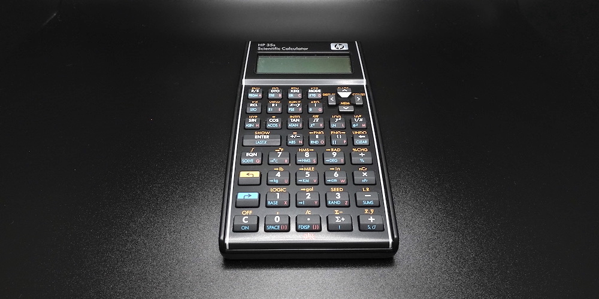
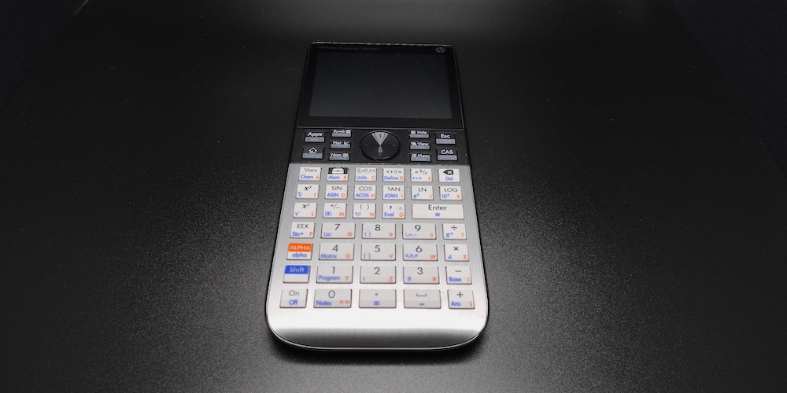

# INTRODUCTION

In the annals of computing, calculators reigned supreme in a brief 30-year period, between early 1970s and early 2000s. Here, by "calculator", I mean a commonly available electronic pocket calculator with a microprocessor. I am excluding from this definition mechanical calculators, valve (vacuum tube) calculators, transistor calculators, and desk calculators. In fact, it is evident from the title of this article that I am focusing narrowly on [Hewlett-Packard](https://en.wikipedia.org/wiki/Hewlett-Packard) (HP) programmable calculators with reverse Polish notation (RPN) input method and LCD display. To an engineer like me, anything less is insupportable.

The [microprocessor](https://en.wikipedia.org/wiki/Microprocessor) is the little engine that powers the modern world. Children in 2021 play games on powerful CPUs, like the 64-bit [AMD Ryzen](https://www.amd.com/en/processors/ryzen). Only 50 years earlier in 1971, the first microprocessor, the 4-bit [Intel 4004](https://en.wikipedia.org/wiki/Intel_4004), came out. At the time, the 4004, which integrated 2,300 transistors on a single chip, was a massive leap forward in technology.

The 4004 came about because [Busicom](https://en.wikipedia.org/wiki/Busicom), a Japanese electronic calculator company, asked Intel in 1969 to develop a microprocessor for use in calculators. Naturally, Busicom calculators, like the [141-PF](http://www.vintagecalculators.com/html/busicom_141-pf.html), were the first production electronic devices to be powered by a microprocessor. Although the 141-PF holds the distinction of being the first microprocessor-based calculator, its design was unremarkable; it was an ordinary, large, four-function desk calculator with a few business-friendly features, like memory and percentage.

Then only a year later in 1972, HP introduced their game-changing model, the [HP-35](https://www.hpmuseum.org/hp35.htm), the world's first pocket scientific calculator. And bucking the trend, it uses the RPN input method. At 395 USD introductory price (almost 2,700 USD in 2021), the HP-35 was a rich man's toy; most engineers just kept using their [slide rules](HowSlideRulesWork.md), at least for a few more years, until electronic calculators became more affordable. Incidentally, the "35" in the name is a nod to the 35 keys, which was rather a lot, something to be proud of, in the days of four-function calculators. By 1982, engineers' all-time favourite advanced, programmable, scientific calculator, the [HP-15C](https://www.hpmuseum.org/hp15.htm) shown below, costs only 135 USD (about 400 USD in 2021). HP's latest and most advanced scientific calculator, the [HP Prime](https://en.wikipedia.org/wiki/HP_Prime), was introduced in 2013. It has a 500 MHz 32-bit ARM Cortex-A7 CPU, 256 MB of SDRAM, 512 MB of flash memory, a 16-bit colour touch screen, and is about the size of the iPhone 13. The HP Prime is nowhere near as capable as the iPhone 13, but it can be had for a mere 100 USD in 2021. By the way, there is a free [HP Prime emulator](https://apps.apple.com/us/app/hp-prime-lite/id1208226883) that runs on the iPhone—a decent app, that is.

# RPN

In mathematics, a generic binary function $f$ is written as $f(a, b)$, and a generic binary operator $\bigotimes$ is written as $a \bigotimes b$. In prefix notation, they are written as `f a b` and `⨂ a b`. In postfix notation, they are written as `a b f` and `a b ⨂`. Mathematical notations evolved organically through the centuries. But the prefix notation was invented by the Polish logician [Jan Łukasiewicz](https://en.wikipedia.org/wiki/Jan_%C5%81ukasiewicz) in 1924. Therefore, the prefix notation is called the Polish notation. It is the [s-expression](https://en.wikipedia.org/wiki/S-expression) syntax of LISP programming language. The postfix [reverse Polish notation](https://en.wikipedia.org/wiki/Reverse_Polish_notation) (RPN) is the opposite of the prefix notation. Both the prefix and the postfix notations are reviled by the uninitiated, but revered by the cognoscenti.

Because mathematical notation is meant to be read by humans, it can be fussy and, sometimes, downright quirky. The irregular syntax is quite a chore for a computer to interpret. For instance, the expression $2 - (\frac{5}{4 -2} + 8) = -8.5$ is parsed by building the a symbol tree consisting of nine nodes (one node per symbol) in memory in the first pass, and by reducing the tree to the result $-8.5$ in the second pass:

- $-$
  - $2$
  - $+$
    - $÷$
      - $5$
      - $-$
        - $4$
        - $2$
    - $8$

Building the symbol tree requires processor cycles and a lot of memory, for the symbol values, pointers, etc. Evaluating the symbol tree to obtain the result requires additional processor cycles. However, if this mathematical expression is rewritten in the postfix notation, we get $2↵\ 5↵\ 4↵\ 2\ -\ ÷\ 8\ +\ -$. The symbol $↵$ is the operand delimiter, which is represented by the `ENTER` key on HP RPN calculators. On an RPN calculator, we can simultaneously parse and evaluate this postfix expression using only three memory locations `x`, `y`, and `z`:

- $2↵\ →\ $`x←2`
- $5↵\ →\ $`x←5 | y←2`
- $4↵\ →\ $`x←4 | y←5 | z←2`
- $2\ -\ →\ $`x←4-2=2 | y←5 | z←2`
- $÷\ →\ $` x←5÷2=2.5 | y←2`
- $8\ +\ →\ $ `x←2.5+8=10.5 | y←2`
- $-\ →\ $ `x←2-10.5=-8.5`

To compute the expression $2^3 = 8$ on an RPN calculator, we press the `2` key, then the `ENTER` key, the `3` key, then the $\color{darkred}{y^x}$ key. That is, we enter the operands first, then we press the operator key to obtain the result. A binary operator, like $y^x$, uses the `y` register as the first operand and the `x` register as the second operand, and accumulates the result in the `x` register, clearing the `y` register in the process. A unary operator, like $x^2$, uses the `x` register both as the input and as the output. There is no `=` key on an RPN calculator.

It is no denying that $2↵\ 5↵\ 4↵\ 2\ -\ ÷\ 8\ +\ -$ is more difficult for a human to read than $2 - (\frac{5}{4 -2} + 8) = -8.5$. So, when using RPN, we have to perform a bit of mental parsing. But the RPN input method is comparatively much more efficient when the expressions are lengthy and contain many parentheses, such as those that appear in engineering calculations. In other words, we are trading 

Computers in the late 1950s had very little processing power and memory storage, parsing mathematical expressions was a very difficult task. To simply parsing, [John McCarthy](https://en.wikipedia.org/wiki/John_McCarthy_(computer_scientist)) adopted the much simpler s-expression as the syntax for his LISP programming language. The [IBM 704](http://www.columbia.edu/cu/computinghistory/704.html) on which the first LISP implementation ran occupied a large, climate-controlled room. A little over a decade later in the early 1970s, the HP-35 was the most powerful scientific calculator and the first one designed to fit an engineer's shirt pocket. But the HP-35 had a miserly 1-bit serial processor and a meagre 4-register (`x`, `y`, `z`, and `t`) memory. So, the time- and space-efficient RPN input method was not merely a nicety, but a clear necessity. A *register* is a fast, on-chip, temporary storage used by the CPU while performing operations. A collection of registers is called a register *file*. You can read a detailed explanation of how the CPU uses registers in my article *[How Computers Work](HowComputersWork.md)*.

Technically speaking, the HP-35 (1972) is a [stack architecture](https://en.wikipedia.org/wiki/Stack_machine) computer, albeit a wee one. The Burroughs [B5000](http://www.retrocomputingtasmania.com/home/projects/burroughs-b5500/b5000_b5500_gallery) (1961) and the Hewlett-Packard [HP 3000](http://www.hpmuseum.net/display_item.php?hw=100) (1972) are stack machines, too, though slightly bigger, each being about the size of a room. But all stack machines operate on the same principle: they all use a stack register file to store temporary values during computations. A *stack* is a data structure that holds values in a last-in, first-out (LIFO) fashion. If we push $1↵\ 2↵\ 3↵\ 4↵$ onto the stack of the HP-35, its registers would contain the following values: `x=4 | y=3 | z=2 | t=1`. Then, when we operate on those values, the operator consumes the values, starting with the last value, namely `x=4`. But had we pushed one more operand $5↵$ without performing operations, the stack would become `x=5 | y=4 | z=3 | t=2`, and the oldest value $1$ would have fallen off the bottom of the stack and lost forever. As the newer values are consumed off the top of the stack by operations, the oldest value in the register `t` is replicated upward, one step at a time.

# PROGRAMMING

HP RPN scientific calculators can be programmed in one of three ways: keystroke, reverse Polish LISP (RPL), and HP BASIC. Keystroke programming simply records the RPN key input sequences. An RPN keystroke programme reads like an assembly programme. RPL is a LISP programming language with postfix instead of prefix functions. Because RPL uses the reverse Polish syntax, it does not need parentheses like LISP does. As such, calculator users find RPL far less intimidating than LISP. HP BASIC is a customised version of the BASIC programming language. Because BASIC was the first programming language designed expressly for novices, programmes written in HP BASIC are easily comprehensible to any calculator user.

On an RPN calculator, we use programmes to minimise repetitive tasks. Programmes also reduce the potential for errors. A *programme* is typically a short procedure that accepts input values via the stack registers, and returns the output in the register `x` at the top of the stack. A more sophisticated programmes use internal variables and labels. Some programmes, though, are a bit more elaborate, consisting of multiple procedures, each specialising in one small task.

The HP-65 from the early 1970s was HP's first programmable pocket calculator. It used magnetic strips to store small keystroke programmes. This storage technology was used into the late 1970s on advanced programmable models, like the HP-41C. The more advanced Voyager Series from the early 1980s, like the HP-11C and the HP-15C, used an internal, battery-backed programme memory. The HP-15C's programme memory is less than 500 bytes in capacity, and is capable of storing up to a couple of hundred steps. The HP-28S from the late 1980s supported 32 KB of programme memory and the much more sophisticated RPL programming language. Being armed with LISP, the HP-28S is capable of performing symbolic computations, the first pocket calculator with this capability. The latest flagship pocket calculator, the HP Prime, has 512 MB of flash programme memory and 256 MB of SDRAM. It supports HP BASIC. The HP Prime is a 3D-capable, touch-screen-equipped, 32-bit computer with built-in computer algebra system (CAS) symbolic computation facilities.

## *RPN Programming*

asd

## *RPL Programming*

asdf

## *BASIC Programming*

asdf

# COLLECTION

## *Voyager*

#### HP-11C

#### HP-15C

#### HP-16C

## ***Pioneer***

#### HP-32S

## *RPL*

#### HP-28S

## *35th Anniversary*

#### HP 35s

## *CAS*

#### HP Prime

# CONCLUSION
