# INTRODUCTION

The survival of our species owes much to our brain, specifically, its ability to observe, analyse, and plan. Planting crops and storing grains for the winter were some of the earliest uses of these abilities. Measuring and calculation are foundational elements of observation, analysis, and planning. Computation, upon which our modern society depends, is but an extension of those ancient measurement and calculation techniques.

Calculations operate on operands obtained through measurements. Counting is the oldest form of measurement. In prehistory, humans counted by scratching marks on bones. Next to evolve is a ruler etched with markings. Not long after, humans were marking, measuring, calculating, tracking, and predicting the movements of the Sun and the Moon using stone pillars, astronomically aligned burial mounds, and sun dials.

By around 3000 BC, Sumerians invented the sexagesimal (base-$60$) number system, and they were using the [abacus](https://en.wikipedia.org/wiki/Abacus) by 2700 BC. Egyptians used simple measuring instruments and advanced geometry to survey property boundaries on the Nile flood planes and to erect the pyramids. By 220 BC, Persian astronomers were using the [astrolabe](https://en.wikipedia.org/wiki/Astrolabe) to calculate the latitude, to measure the height of objects, and to triangulate positions. Greeks constructed truly advanced mechanical instruments that predicted solar and lunar eclipses. The complexity and refinement exhibited by the [Antikythera mechanism](https://en.wikipedia.org/wiki/Antikythera_mechanism) from around 200 BC continues to amaze modern engineers.

Ancient astronomy measured, tracked, and predicted the movements of heavenly objects. But when celestial navigation came to be used extensively in global trade across the oceans, we began charting the night sky in earnest, and thus was born modern astronomy. Astronomical calculations involved manually manipulating numbers. These calculations were tedious and error prone.

In 1617, a brilliant Scottish mathematician [John Napier](https://en.wikipedia.org/wiki/John_Napier) published his method of mechanising [lattice multiplication](https://en.wikipedia.org/wiki/Lattice_multiplication). This method is known today as [Napier's bones](https://en.wikipedia.org/wiki/Napier%27s_bones). A few years earlier in 1614, Napier discovered [logarithms](https://en.wikipedia.org/wiki/Logarithm). Perhaps it would be more appropriate to say Napier invented logarithms, for his discovery was motivated by his desire to simplify multiplication and division. Arithmetically, multiplication can be thought of as repeated additions, and division as repeated subtractions. Logarithmically, multiplication of two numbers can be reduced to addition of their logarithms, and division to subtraction thereof. Hence, multiplication and division of very large numbers can be reduced to straightforward addition and subtraction, with the aid of prepared logarithm and inverse logarithm tables.

In 1620, [Edmund Gunter](https://en.wikipedia.org/wiki/Edmund_Gunter), an English astronomer, used Napier's logarithms to create a calculating device that came to be known as [Gunter's scale](https://en.wikipedia.org/wiki/Edmund_Gunter#Gunter's_scale). The etchings on this device were not linear like a simple ruler, but logarithmic. To multiply two numbers, the length representing the multiplicand is first marked out on the logarithmic scale using a divider and, from thence, the length representing the multiplier is similarly marked out, thereby obtaining the product, which is the sum of the two logarithmic lengths. This device was the forerunner of the slide rule.

The first practical [slide rule](https://en.wikipedia.org/wiki/Slide_rule) was invented by [William Oughtred](https://en.wikipedia.org/wiki/William_Oughtred), an English mathematician, in 1622. Oughtred used two bits of wood graduated with Gunter's scale. In 1630, Oughtred fashioned a brass circular slide rule with two integrated pointers. This device was a significant improvement over Gunter's scale, in terms of practicality and usability. The photograph below shows a brass circular slide rule that is a contemporaneous clone of Oughtred's.

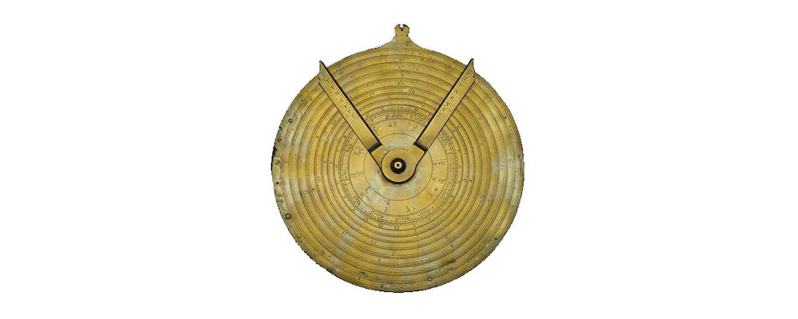

The earliest adopters of the slide rule were the 17th century astronomers, who used it to make fast calculations of arithmetic and trigonometric operations. But it was the 19th century engineers, the spearheads of the industrial revolution, who propelled the slide rule technology forward. For almost four centuries, the slide rule remained the preeminent calculating device. Buildings, bridges, machines—even computer system components—were designed by slide rule. Apollo astronauts carried the [Pickett N600-ES](https://americanhistory.si.edu/collections/search/object/nmah_694174) pocket slide rule for navigation and propulsion calculations. The [General Dynamics F-16](https://en.wikipedia.org/wiki/General_Dynamics_F-16_Fighting_Falcon), a present-day air-superiority fighter, was designed by slide rule. Well into the late 1970s, school children all over the world, including me, were taught to use the slide rule and the logarithm book, along with penmanship and grammar.

The largest and most enthusiastic group of slide rule users, naturally, were engineers. But slide rules were used in all areas of human endeavour that required calculation: business, construction, manufacturing, medicine, photography, and more. Obviously, bankers and accountants relied on the slide rule to perform sundry numerical gymnastics. Construction sites and factory floors, too, used specialised versions of slide rules for mixing concrete, computing volumes, etc. Surveyors used the [stadia slide rule](http://www.rechenschieber.org/stadia.pdf) made specifically for them. Doctors use special, [medical slide rules](https://www.rechenschieber-werbemittel.de/en/slide-charts/medical) for calculating all manner of things: body mass index, pregnancy terms, medicine dosage, and the like. Photographers used [photometric slide rules](https://en.wikipedia.org/wiki/Actinograph) for calculating film development times. Army officers used [artillery slide rules](https://www.springfieldarsenal.net/155MM-Howitzer-slide-rule-range-tables-for-M483-M16.htm). Pilots used [aviation slide rules](https://www.sliderulemuseum.com/Aerospace.htm). The list was long. This humble device powered the 19th century Industrial Revolution and seeded the 20th century Technological Revolution. Indeed, the slide rule perfectly expressed the engineering design philosophy: capability through simplicity.

But then, in 1972, HP released its first programmable scientific calculator, the inimitable [HP-35](https://hpmuseum.org/hp35.htm). The HP-35 rang loud the death knell of the slide rule. Although electronic pocket calculators were unaffordable in the early 1970s, they became ubiquitous within a decade thanks to [Moore's law](https://en.wikipedia.org/wiki/Moore%27s_law), and quickly displaced the slide rule. By the early 1980s, only a few people in the world were using the slide rule. I was one.

## *personal*

It was around this time that I arrived at the university—in [Burma](https://en.wikipedia.org/wiki/Myanmar). In those days, electronic pocket calculators were beyond the reach of most college students. To ensure fairness, [my engineering college](https://en.wikipedia.org/wiki/Yangon_Technological_University) insisted that all students used the government-issued slide rule, which was readily accessible to everyone. Many classrooms in my college had large, wall-mounted [demonstration slide rules](https://sliderulemuseum.com/DemoSR.htm) to teach first-year students how properly to use the slide rule like an engineer—that is, to eradicate the bad habits learned in high school.

I subsequently emigrated to the US. Arrival in the US ended my association with the slide rule because, by the 1980s, American engineers were already using [HP RPN pocket calculators](https://www.hpmuseum.org) and [MATLAB](https://www.mathworks.com/products/matlab.html) technical computing software on the [IBM PC](https://en.wikipedia.org/wiki/IBM_Personal_Computer). I soon became an HP calculator devotee. As such, I never got to use the slide rule extensively in a professional setting. But I hung on to my student slide rules: the government-issued Aristo 0968 Studio, a straight rule, and the handed-down Faber-Castell 8/10, a circular rule. To this day, I remain partial to the intimate, tactile nature of the slide rule, especially the demands it places upon the user's mind. Over the next four decades, I slowly collected many slide rules. The models in my collection are the ones I coveted as an engineering student in Burma, but were, then, well beyond my reach.

In its heyday, everyone uses the slide rule in every facet of life. As children, we saw it being used everywhere, so we were acquainted with it, even if we did not know how to use it. We were taught to use the slide rule's basic facilities in middle school. Our options were the abacus, the log books, or the slide rule. The choice was abundantly clear: we enthusiastically took up the slide rule; it was a rite of passage. Now, though, even the [brightest engineering students](https://youtu.be/CblhxhnSymg) in the world have never heard of a slide rule, let alone know what it is.

## *goal*

My main goal in writing this article is to preserve the knowledge about, and the memory of, this truly clever computing device: how it works and how it was used. The focus here is on the basic principles of operation and how the slide rule was used in engineering. This is a "how it works" explanation, and not a "how to use" manual. Those who are interested in the most efficient use of a slide rule may read the manuals listed in the resources section at the end of this article. Beyond history and reminiscence, I hope to highlight the wide-ranging utility of some of the most basic mathematical functions that are familiar to middle schoolers.

## *recommendations*

It is mighty difficult to discuss the slide rule without having the device in hand. For the presentations below, I chose the Keuffel & Esser (K&E) 4081-3 Log Log Duplex Decitrig. It was one of the most popular engineering slide rules for decades, especially in the US. As such, many engineering professors published good introductory books for it.

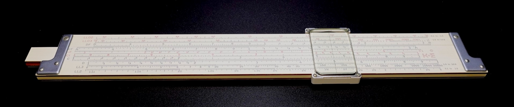

The term "log-log" refers to the $LL$ scale, which is used to compute exponentiation, as will be explained, later. The term "duplex" refers to the fact that both sides of the frame are engraved with scales. The duplex arrangement was invented by [William Cox](https://mccoys-kecatalogs.com/KECollection/1744/ke_1744family.htm) in 1895 for K&E. The term "decitrig" was K&E's trade name for its slide rules that used decimal degrees for trigonometric computations, instead of minutes and seconds. Engineers prefer using the more convenient decimal notation.

Another common model was the Post 1460 Versalog. Although less popular than the K&E 4081-3, the Post 1460 is cheaper and, in my opinion, is a better slide rule. It is made of bamboo, a more stable material than wood.

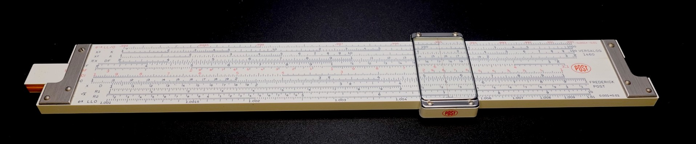

Go on eBay and buy a good, inexpensive slide rule, either the [K&E 4081-3](https://www.ebay.com/sch/i.html?_from=R40&_trksid=p2334524.m570.l1313&_nkw=k%26e+4081-3+slide+rule&_sacat=0&LH_TitleDesc=0&_odkw=k%26e+4081-3+log+log+duplex+decitrig&_osacat=0) or the [Post 1460](https://www.ebay.com/sch/i.html?_from=R40&_trksid=p2380057.m570.l1313&_nkw=post+1460+versalog+slide+rule&_sacat=0); you will need a slide rule to follow the discussions below. Alternatively, you could use a [slide rule simulator](https://www.sliderules.org/react/hemmi_versalog_ii.html). After having read this article, I recommend moving on to one or more of the books listed in the resources section at the end.

# PRINCIPLES

A slide rule comprises three components: the body, the slide, and the cursor, as shown below. The *body*, about 25 cm in length, consists of two pieces of wood, the upper and the lower frames, bound together with metal brackets at the ends. On older slide rules, the body is a single piece of wood with a trough in the middle separating the upper and the lower frames. The *slide* is a thin strip of wood that glides left and right between the upper and the lower frames. The *cursor* consists of two small plates of glass held by metal brackets and these brackets are anchored to the upper and the lower lintels. The cursor straddles the body and glides across its length. Hence, the three components of a slide rule move independently of, and with respect to, each other. The frames and the slide are engraved with various types of scales. These scales are set and read using the hairline inscribed on the cursor glass.

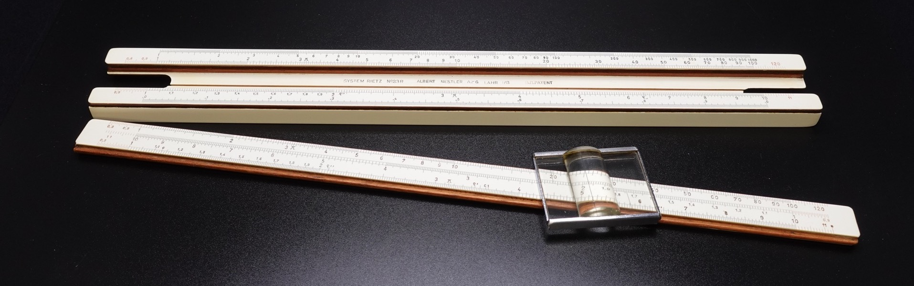

## *arithmetic operations*

***properties of logarithms***—The base-$10$ common logarithm function $log_{10}(x)$ and its inverse, the power-of-10 function $10^x$, give life to the slide rule. The two main properties of logarithms upon which the slide rule relies are these:

- $a × b = log^{-1}[log(a) + log(b)]$
- $a ÷ b = log^{-1}[log(a) - log(b)]$

That is, to compute $a × b$, we first compute the sum of $log(a)$ and $log(b)$, then compute the $log^{-1}$ of the sum. Likewise, $a ÷ b$ is computed as the $log^{-1}$ of the difference between $log(a)$ and $log(b)$.

***logarithmic scale***—The slide rule mechanises these calculations by using two identical logarithmic scales, commonly labelled $C$ (on the slide) and $D$ (on the frame). The logarithmic scale is derived from the arithmetic scale in the following manner. We begin with a 25-cm-long blank strip of wood and mark it up with $10$ equally spaced segments labelled $0, 1, 2, 3, ..., 1$, similar to an ordinary ruler, but labelling the ending $10$ as $1$, instead. This first piece of wood has now become the source arithmetic scale. We then line up the second 25-cm long blank strip of wood with the first one, and mark up that second piece of wood with $9$ unequally spaced segments labelled $1, 2, 3, ..., 1$, starting with $1$ and, again, ending with $1$. The division marks of the second piece of wood is placed non-linearly in accordance with their $log$ values and by reference to the linear arithmetic scale:

- $log(1) = 0.0$, so $1$ on the second scale is lined up with $0.0$ on the arithmetic scale
- $log(2) = 0.301$, so $2$ on the second scale is lined up with $0.301$ on the arithmetic scale
- $log(3) = 0.477$, so $3$ on the second scale is lined up with $0.477$ on the arithmetic scale
- $...$
- $log(10) = 1.0$, so $10$ (which is labelled $1$) on the second scale is lined up with $1.0$ on the arithmetic scale

The second scale thus obtained is the logarithmic scale. In the figure below, the upper one is the source arithmetic scale and the lower one is the derived logarithmic scale.

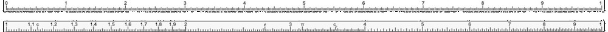

On the slide rule, we label the arithmetic scale as $L$, and the logarithmic scale as $D$. These scales are related by a bijective function $log$:

- $log: D \rightarrow L$
- $log^{-1}: L \rightarrow D$

In the plot below, the black curve is $log$ and the red is $log^{-1}$.

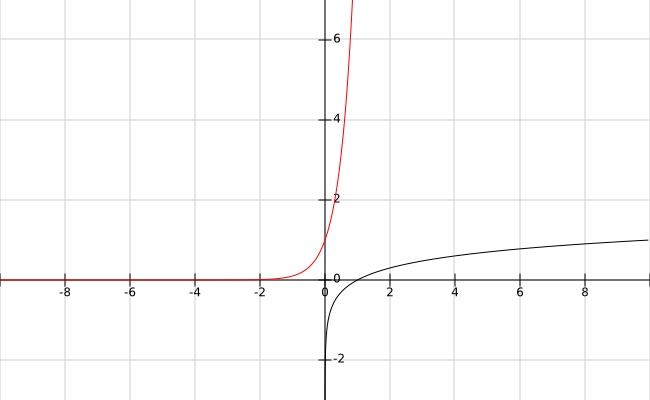

The special name for $log^{-1}$ is $10^x$. The $D$ and the $L$ scales form a transform pair that converts between the  logarithmic scale and the arithmetic scale. It turns out that the $log$ function transforms the arithmetic scale's $×$ and $÷$ operators into the logarithmic scale's $+$ and $-$ operators, and the $log^{-1}$ function performs the inverse transformation.

Plotting the $log$ function on a logarithmic scale produces a sequence of evenly spaced values. Hence, the $L$ scale appears linear, when laid out on the logarithmic slide rule. Note also that the mere act of reading $x$ on the logarithmic scale implicitly computes $log(x)$, and there is no need explicitly to compute $log^{-1}(x)$. Gunter's logarithmic scale, thus, was the groundbreaking idea that made the slide rule work so effectively, efficiently, effortlessly.

The logarithmic scale has many other uses in STEM beyond the slide rule: the [Richter scale](https://en.wikipedia.org/wiki/Richter_magnitude_scale) used to measure seismic events; the $dB$ [decibel scale](https://en.wikipedia.org/wiki/Decibel) used to measure sound pressure levels; the [spectrogram](https://en.wikipedia.org/wiki/Spectrogram) used to visualise frequency domain signals are just a few examples. These uses exploit the logarithmic scale's ability to compress a very large range, while preserving relevant details.

***computations using logarithmic scales***—To compute $log(2)$, we manipulate the slide rule as follows:

1. $D$—Place the cursor hairline on the *argument* $2$ on the $D$ scale.
2. $L$—Read under the hairline the *result* $0.301$ on the $L$ scale. This computes $log(2) = 0.301$.

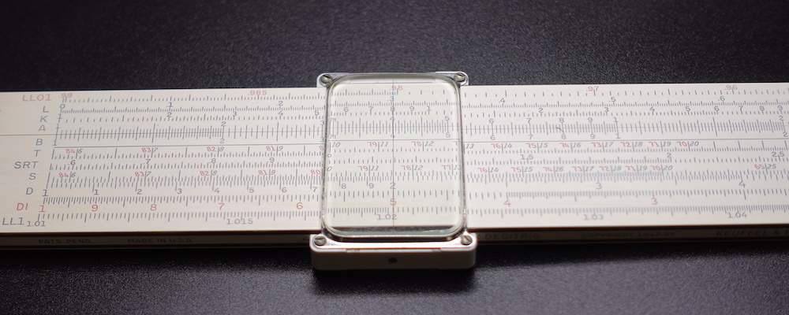

To compute $2 × 3$, we manipulate the slide rule as follows:

1. $D$—Place the hairline on the *multiplicand* $2$ on the $D$ scale.
2. $C$—Slide the left-hand $1$ on the $C$ scale under the hairline.
3. $C$—Place the hairline on the *multiplier* $3$ on the $C$ scale.
4. $D$—Read under the hairline the *product* $6$ on the $D$ scale. This computes $2 × 3 = 6$.

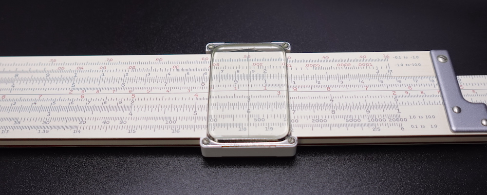

The above multiplication procedure computes $2 × 3 = 6$, like this:

- In step (1), we placed the hairline on $D$ scale's $2$. In this way, we mechanically marked out the length $[1, 2]$ along the logarithmic $D$ scale. Mathematically, this is equivalent to computing $log(2)$.
- In step (2), we lined up $C$ scale's left-hand $1$, the beginning of the scale, with $D$ scale's $2$, in preparation for the next step.
- In step (3), we placed the hairline on $C$ scale's $3$. This mechanically marked out the length sum $[1, 2]_D + [1, 3]_C$ on the logarithmic $D$ scale, which is mathematically equivalent to computing $log(2) + log(3)$.
- Then, in step (4), we read the result $6$ on the $D$ scale under the hairline. This is mathematically equivalent to computing $log^{-1}[log(2) + log(3)] = 2 × 3 = 6$. Recall that $log^{-1}$ operation is implicit in the mere reading of the $D$ logarithmic scale.

To put it plainly, adding $2$ units of length and $3$ units of length yields $2 + 3 = 5$ units of length on the arithmetic scale of an ordinary rule. But on the logarithmic scale of the slide rule, adding $2$ units of length and $3$ units of length yields $2 × 3 = 6$ units of length.

To compute $2 ÷ 3$, we manipulate the slide rule as follows:

1. $D$—Place the hairline on the *dividend* $2$ on the $D$ scale. This computes $log(2)$.
2. $C$—Slide under the hairline the *divisor* $3$ on the $C$ scale.
3. $C$—Place the hairline on the right-hand $1$ on the $C$ scale. This computes $log(2) - log(3)$.
4. $D$—Read under the hairline the *quotient* $667$ on the $D$ scale, which is interpreted to be $0.667$, as will be explained below. This computes $2 ÷ 3 = log^{-1}[log(2) - log(3)] = 0.667$.

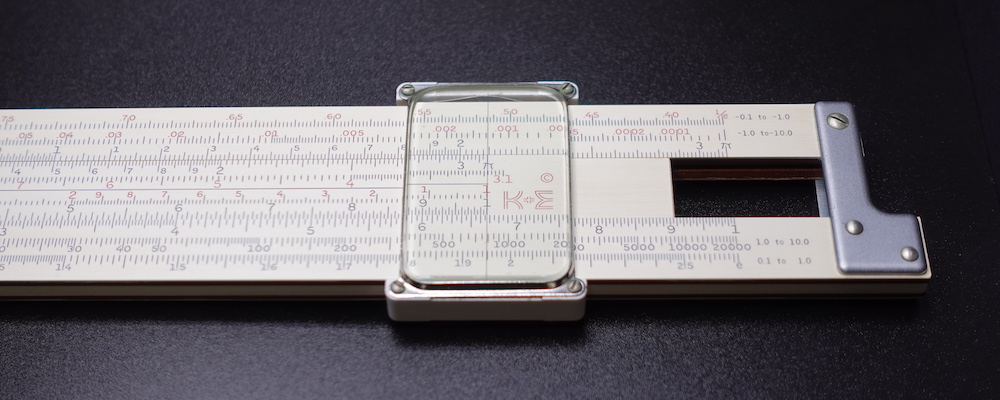

Multiplication and division operations start and end with the cursor hairline on the $D$ scale. Skilled users frequently skipped the initial cursor setting when multiplying and the final cursor setting when dividing, opting instead to use the either end of the $C$ scale as the substitute hairline.

Note that the slide rule is always operated using both hands, fingers of one hand pushing and those of the other gently opposing. The lower lintel of the cursor glides along the bottom of the lower frame. There is a tension spring between the upper lintel of the cursor and the top of the upper frame. This tension spring braces the lower lintel of the cursor against the bottom of the lower frame. To make fine adjustments of the cursor, one uses the thumbs of both hands against the lower lintel of the cursor. But when using the backside of a duplex straight rule, the lower lintel of the cursor has now flipped to the topside, so it had to be fine adjusted using the index fingers.

## *accuracy and precision*

In slide rule terminology, *accuracy* refers to how consistently the device operates—that is, how well it was manufactured and how finely it was calibrated. And *precision* means how many significant figures the user can reliably read off the scale.

Professional-grade slide rules were made exceedingly well, so they were very accurate. Yet, they all allowed the user to calibrate the device. Even a well-made slide rule, like the K&E 4081-3 can go out of alignment if mistreated, say by exposing it to sun, solvent, or shock (mechanical or thermal). And prolonged exposure to moisture can warp a wood slide rule, like the K&E 4081-3, thereby damaging it, permanently. I describe the recalibration procedure in the maintenance section, later in this article.

To analyse the precision of the slide rule, we must examine the logarithmic scale, first. The $C$ and $D$ scales are logarithmic, so they are nonlinear. The scales start on the left at $log(1) = 0$, which is marked as $1$, and end on the right at $log(10) = 1$, which is also marked as $1$. Indeed, these scales wrap around by multiples of $10$ and, hence, the $1$ mark at both ends.

As can be seen in the figure below, the distance between two adjacent major divisions on the scale shrinks logarithmically from left to right:

- $log(2) - log(1) = 0.301 \approx 30\%$
- $log(3) - log(2) = 0.176 \approx 18\%$
- $log(4) - log(3) = 0.125 \approx 12\%$
- $log(5) - log(4) = 0.097 \approx 10\%$
- $log(6) - log(5) = 0.079 \approx 8\%$
- $log(7) - log(6) = 0.067 \approx 7\%$
- $log(8) - log(7) = 0.058 \approx 6\%$
- $log(9) - log(8) = 0.051 \approx 5\%$
- $log(10) - log(9) = 0.046 \approx 4\%$

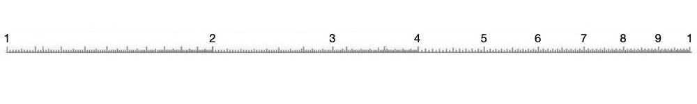

The figure above also shows the three distinct regions on the $D$ scale that have different resolutions:

- In the range $[1, 2]$, the scale is graduated into $10$ major divisions, and each major division is further graduated into $10$ minor divisions.
- In the rage $[2, 4]$, the scale is graduated into $10$ major divisions, and each major division is further graduated into $5$ minor divisions.
- In the range $[4, 1]$, the scale is graduated into $10$ major divisions, and each major division is further graduated into $2$ minor divisions.

At the left end of the $D$ scale, $1.11$, $1.12$, etc., can be read directly from the scale. With practice, one could visually subdivide each minor division into $10$ sub-subdivisions and discern $1.111$ from $1.112$. In the photograph below, the cursor hairline is placed on $1.115$.

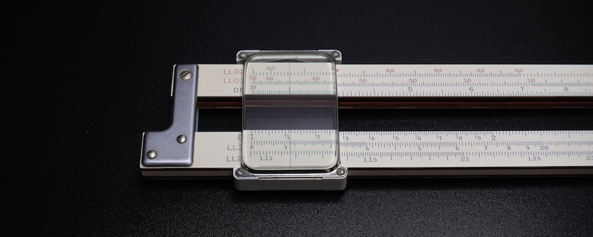

In the middle of the $D$ scale, $3.12$, $3.14$, etc., can be read directly from the scale. Indeed, $3.14$ is marked as $\pi$ on $C$ and $D$ scales of all slide rules. With a nominal eyesight, each minor division could be subdivided visually and easily read $3.13$, which is halfway between the $3.12$ and the $3.14$ graduations. The photograph below shows the hairline on $3.13$.

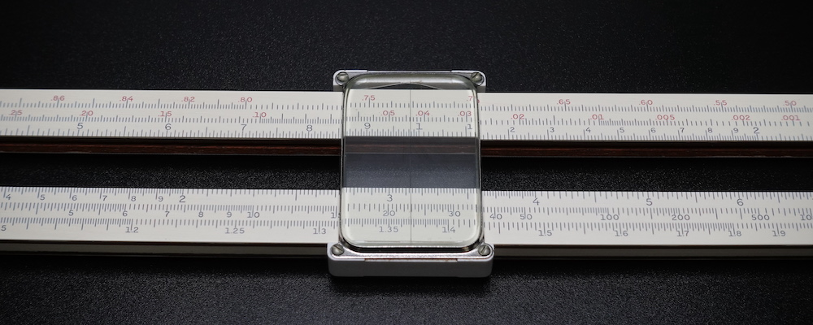

On the right end of $D$ scale, $9.8$, $8.85$, $9.9$, $9.95$, etc., can be read directly from the scale. With due care, each minor division could be subdivided into two sub-subdivisions and read without undue strain $9.975$, which is halfway between the $9.95$ and the $1$ graduations. See the photograph below. But for those of us with poor eyesights, it is rather difficult to discern $9.98$ from $9.99$.

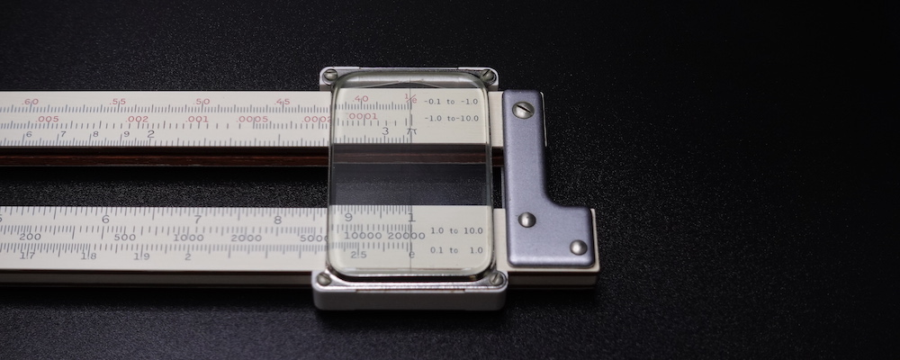

Under optimal conditions—calibrated slide rule, nominal eyesight, good lighting, and alert mind—the slide rule can attain four significant figures of precision on the lower end of the $D$ scale and three significant figures on the higher end of the scale.

It is important to note that the logarithmic scale cycles, repeatedly. Hence, the scale reading of $314$ can be valued as $0.0314, 0.314, 3.14, 31.4, 314.0, 3140.0,$ and so forth, depending on the context. The decimal point must be located using mental arithmetic. For example, $\pi/8 \approx 3/8 \approx 0.4$, so the result must necessarily be $0.3927$, not $0.03927, 3.927,$ nor any other alternative. To put it another way, mental arithmetic locates the decimal point thereby getting us within the zone of accuracy, and scale reading yields the constituent digits thus getting us the precision we desire.

Ordinarily, the slide rule was used to evaluate complicated expressions involving many chained calculations when they needed to be performed quickly but when precision was not a paramount concern. When precision is important, however, [logarithm tables](https://en.wikipedia.org/wiki/Mathematical_table) were used. These tables were laboriously hand-computed to several significant figures. If the desired value fell between two entries in the table, the user is obliged to interpolate the result, manually. While accountants may have demanded the high precision afforded by the logarithm table, engineers willingly accepted three or four significant figures offered by the slide rule, because the slide rule was accurate enough for engineering use and it was the fastest means then available to perform calculations. In due course, the slide rule became inextricably linked to engineers, like the stethoscope to doctors.

# VARIETIES

Slide rules came in straight, circular, and cylindrical varieties. Cylindrical rules consist of two concentric cylinders that slide and rotate relative to each other. The key innovation of cylindrical rules is the helical scale that wraps round the cylinder. The coiled scale stretches to an impressive length, despite the relatively small size of the cylinder. Of course, a longer scale yields a greater precision. The cylinder can be rotated to bring the back-facing numbers round to the front.

Circular rules are the first practical slide rules. Their main advantages are compactness and stoutness. A typical model is constructed like a pocket watch and operated like one too, using crowns. The glass-faced, sealed construction protects the device against dust. Some circular models sport a spiral scale, thereby extracting good precision from a compact real estate. But because the markings encircle the centre, the device needed to be rotated frequently to read the scale. Expert users of circular rules were good at reading the scales upside-down. On some very small models, the graduation marks get very tight near the centre. In other words, circular scales can be rather fiddly.

Of all the varieties, straight rules are the easiest and the most convenient to use, because they are relatively small and light, and because the whole scale is visible at once. However, their scale lengths are bounded by the length of the body. So, straight rules are less precise by comparison.

Most engineers preferred straight rules, because these devices were fast, accurate, and portable enough for daily use. Hence, this article focuses on straight rules. But a few engineers did use circular models, either because these devices were more precise or because they were more compact. No engineers used cylindrical ones on a routine basis; these devices were too unwieldy and they had only basic arithmetic scales. But accountants, financiers, actuaries, and others who require greater precision swore by cylindrical rules.

## *straight rules*

The most common kind of slide rule was the 25 cm desk model, called the straight rule. The cursor is made of clear plastic or glass, etched with a hairline. The frame and the slide are made of wood, bamboo, aluminium, or plastic. The name "slide rule" derives from the slippy-slidy bits and the ruler-like scales. Straight rules come in four types: Mannheim, Rietz, Darmstadt, and log-log duplex.

The less expensive Mannheim and Rietz models were used in high school, and the more sophisticated Darmstadt and log-log duplex models were used in college. There were longer straight rules used by those who require more precision. And there were shorter, pocket-sized straight rules, like the Pickett N600-ES carried by the Apollo astronauts. Although not very precise, pocket slide rules were good enough for quick, back-of-the-napkin calculations in the field. Engineers, however, were partial to the 25 cm desk straight rule. As such, the majority of the slide rules manufactured over the past two centuries were of this design.

***Mannheim type***—The most basic straight rule is the Mannheim type, the progenitor of the modern slide rule. Surely, applying the adjective "modern" to a device that had been deemed outmoded for over 40 years is doing gentle violence to the English language. But given that the slide rule is now over 400 years old, a 150-year-old model is comparatively "modern".

A Mannheim slide rule has $C$ and $D$ scales for arithmetic operations ($×$ and $÷$), $L$ scale for common logarithm ($log_{10}$), $A$ and $B$ scales for square and square root ($x^2$ and $\sqrt{x}$), $K$ scale for cubic and cube root ($x^3$ and $\sqrt[3]{x}$), and $S$ and $T$ scales for trigonometric functions ($sin$ and $tan$).

The following is the Post 1447 simplex slide rule, manufactured by the Japanese company Hemmi in the late 1950s. As is common with Japanese slide rules, this one is made of bamboo, which is a better material than wood, because bamboo is more resistant to warping and it slides more smoothly. In slide rule parlance, the term "simplex" refers to the models with scales on only one side of the frame.

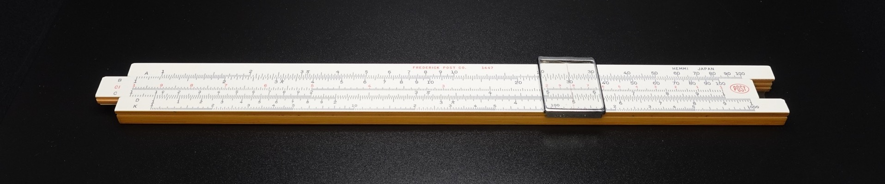

Unlike its simplex frame, the Mannheim slide has engraved on its backside the $S$, $L$, and $T$ scales, which are read through the cutouts at each end. Given that the Post 1447 is a modern Mannheim rule, it has clear-plastic windows over the cutouts. Engraved on these windows are fixed red hairlines for reading the scales.

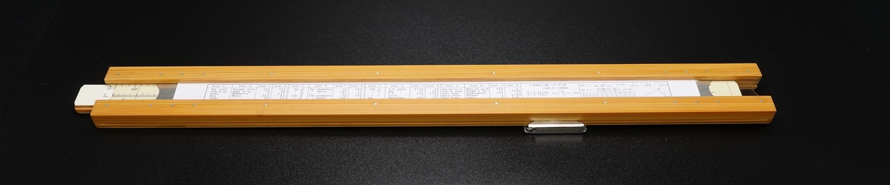

Classic Mannheim simplex slide rules do not have windows over the cutouts. Instead, their cutouts are cleverly placed in an offset: the right-hand cutout is aligned with the two upper scales on the backside of the slide (the $S$ and the $L$ scales) and the left-hand cutout is aligned with the two lower scales on the backside of the slide (the $L$ and the $T$ scales). It does get hairy when trying to read the left-edge of $S$ scale, for instance, but this compromise significantly reduces the need to flip the slide round to the front. If the predominant calculations are trigonometric, however, it is more convenient to just flip the slide to the front.

The original Mannheim slide rule was invented in 1859 by [Amédée Mannheim](https://en.wikipedia.org/wiki/Amédée_Mannheim), a French artillery officer, for quickly computing firing solutions in the field. It had only $C$, $D$, $A$, and $B$ scales, so it was capable of computing only $×$, $÷$, $x^2$, and $\sqrt{x}$. This suited its intended purpose.

***Rietz type***—A slight improvement upon the Mannheim slide rule was the German Rietz type. It added the $ST$ scale for small angles in the range $[0.573°, $ $5.73°] = [0.01, 0.1]\ rad$. In this angular range, $sin(\theta) \approx tan(\theta)$, so the combined $sin$-$tan$ scale suffices—for engineers, that is. The following is the Nestler 23 R Rietz, a famous German slide rule known to be a favourite of Albert Einstein. The 23 R dates to 1907, but the example below is from the 1930s. The frontside has $K$ and $A$ scales on the upper frame, $B$, $CI$ (reverse $C$), and $C$ scales on the slide, and $D$ and $L$ scales on the lower frame.

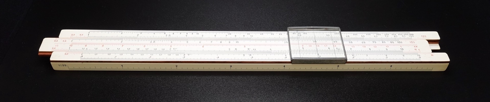

The backside of the Nestler 23 R is a classic Rietz design, with offset cutouts at each end and black index marks engraved into the wood frame. The backside of the slide holds the $S$, $ST$, and $T$ scales. The $S$ and $ST$ scales are read in the right-hand cutout, and the $ST$ and the $T$ scales are read in the left-hand cutout.

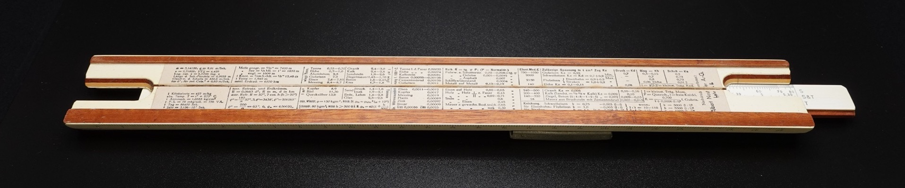

Some slide rules, like this older Nestler 23 R (probably from the 1920s) shown below, came with magnifying cursor glass to allow a more precise reading. But I find the distorted view at the edges of the magnifier rather vexing.

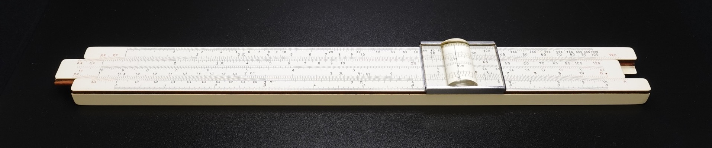

***Darmstadt type***—Another German innovation, the Darmstadt type, was the workhorse preferred by the early 20th century engineers. It has three $LL_n$ scales ($LL_1$, $LL_2$, and $LL_3$) used to compute general exponentiation of the form $x^{y/z} = \sqrt[z]{x^y}$, when $x > 1$. When $z = 1$, the general expression reduces to $x^y$. When $y = 1$, the general expression reduces to $x^{1/z} = \sqrt[z]{x}$. Newer, more advanced models sport the fourth $LL_0$ scale. The following is the Aristo 967 U Darmstadt from the mid 1970s.

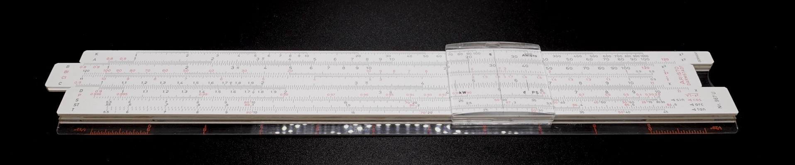

The backside of the slide of the Aristo 967 U has the $L$ and the three $LL_n$ scales. Being that it is a late model Darmstadt simplex rule with a clear plastic back, the entire lengths of these scales are visible at once, and these scales are read against the fixed red hairline at each end. This is a significant usability improvement over the classic wood rules.

***log-log duplex type***—Engineering slide rules generally are of the log-log duplex type. The models used by engineering students have three black $LL_n$ scales ($LL_1$, $LL_2$, and $LL_3$ running from left to right) for cases where $x > 1$ and three red $LL_{0n}$ scales ($LL_{01}$, $LL_{02}$, and $LL_{03}$ running from right to left) for cases where $x < 1$. More advanced models used by professional engineers have four black-red pairs of $LL$ scales.

The Faber-Castell (FC) 2/83 N Novo Duplex slide rule, shown below, was a common model used by many engineers in the mid to late 1970s. It was especially popular outside the US. It is a rather long and wide slide rule. And it was arguably one of the most aesthetically pleasing slid rules ever manufactured.

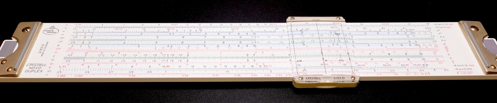

Aside from sporting four black-red pairs of $LL$ scales on the backside, the FC 2/83 N has $T_1$ and $T_2$ refined $tan$ scales and $W_1$ and $W_2$ specialised scale pairs for computing $\sqrt{x}$ with greater precision.

## *circular rules*

Circular slide rules can be categorised into three types: simplex, pocket watch, and duplex. Circular rules were popular with businessmen, and the most popular models were of the pocket watch type.

***simplex type***—The diameter of the FC 8/10 circular rule is only 12 cm, but in terms of capability, it is equivalent to a 25-cm Rietz straight rule. But the FC 8/10 is an atypical circular rule. Most circular rules used spiral scales, but the FC 8/10 used traditional Rietz scales in wrapped, circular form. The example shown below was made in the mid 1970s.

Since the FC 8/10 is a simplex circular rule, its backside has instructions on using the scales and some well-known constants.

***pocket watch type***—A more typical design for circular slide rules is the pocket watch variety, like the Fowler's Universal Calculator shown below. [William Fowler](https://www.nzeldes.com/HOC/Fowlers.htm) of Manchester, England, began manufacturing calculating devices in 1898. This particular model probably dates to the 1950s. Fowler slide rules were made to exacting standards, like an expensive pocket watch, and are operated like a watch, too, using the two crowns.

The backside of the Fowler's Universal Calculator is covered in black leather.

***duplex type***—It is no secret that most engineers frowned upon the circular slide rule. [Seymour Cray](https://en.wikipedia.org/wiki/Seymour_Cray), the designer of the [CRAY super computer](https://en.wikipedia.org/wiki/Cray), my favourite electrical engineer and my fellow circular slide rule fancier, [once quipped](https://youtu.be/8Z9VStbhplQ?t=713), "If you had a circular [slide rule], you had some social problems in college." But the Dempster RotaRule Model AA was the circular rule that temped even the most ardent straight rule enthusiast. The RotaRule is a duplex model, which is a bit of an uncommon trait among circular rules. And it is very well made. It is the brainchild of [John Dempster](http://oughtred.org/jos/Davis_DempsterRotaRule.pdf), an American mechanical engineer. The RotaRule Model AA shown below is probably from the late 1940s. Unconventionally, the trigonometric scales are on the frontside.

The backside of the RotaRule holds the four $LL_n$ scales and several others.

## *cylindrical rules*

All cylindrical rules emphasise precision, so they all have very long scales. Some cylindrical rules use the helical-scale design, while others use the stacked straight-scale design. Cylindrical rules come in two types: pocket type and desk type. The business community favoured the greater precision these devices afforded. As such, most cylindrical rules were very large; they were meant for the banker's ornate mahogany desk.

***pocket type***—The Otis King Model L, shown below, is a contradiction: it is a compact cylindrical rule that, when collapsed, is well shy of an open palm. Portability wise, this cylindrical rule could compete with larger pocket watch type circular rules. But because the Model L employs helical scales, its precision is far superior to that of straight and circular rules. This particular Model L is likely from the 1950s.

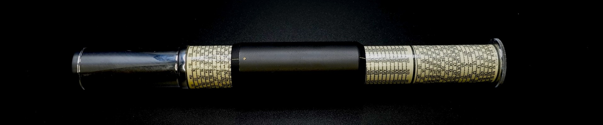

***desk type***—One of the giants of cylindrical rules was the [K&E 1740](https://www.si.edu/object/keuffel-esser-1740-thacher-cylindrical-slide-rule:nmah_1131289), designed in 1881 by [Edwin Thacher](https://www.si.edu/spotlight/slide-rules/cylindrical-slide-rules), an American engineer working for K&E. I have never seen this device in person, so I do not know the finer points of how it was used. The [general operating principles](https://youtu.be/EsDCXxn4Fpk?t=68) are similar to that of the Otis King Model K: the outer cylinder is mounted to the frame but it can spin in place. The inner cylinder shifts and spins independently of the outer cylinder. The inner cylinder's scale is read through the slits in the outer cylinder's scale. Thus, the outer cylinder is analogous to the straight rule's frame, and the inner cylinder is analogous to the straight rule's slide. There is, however, no cursor or pointer on this device. The first Thacher model dates to 1881. The one shown in the photograph blow, a museum piece, is probably a late model from the 1950s, by the look of it.

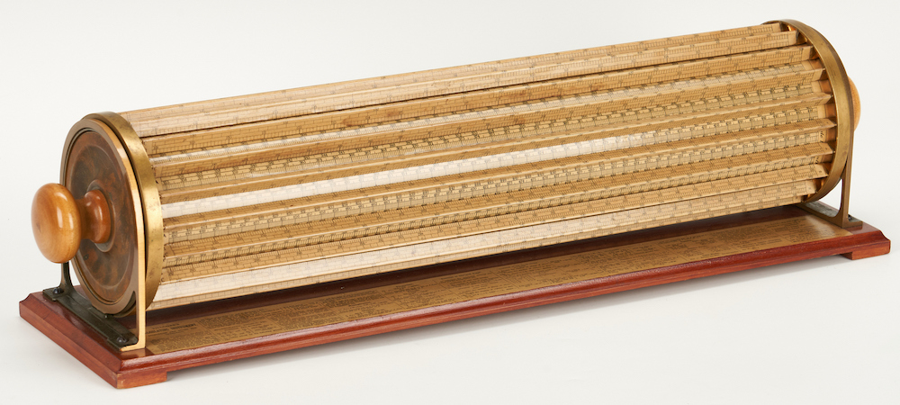

# OPERATIONS

Ordinary engineering slide rules provide arithmetic, logarithmic, exponential, and trigonometric functions. Some advanced models provide hyperbolic functions. More specialised models provide field-specific functions: electronic, electrical, mechanical, chemical, civil, and so forth. Here, I shall ignore the field-specific functions.

## *arithmetic*

The impetus for the slide rule's invention was to expedite $×$ and $÷$. These arithmetic operations were performed using the $C$ and the $D$ scales. Over time, slide rule designers had created numerous scales that augment the $C$ and $D$ scales: reciprocal $CI$ and $DI$; folded $CF$ and $DF$; and folded reciprocal $CIF$ and $DIF$. Together these scales expedite chained arithmetic operations.

In 1775, [Thomas Everard](https://www.si.edu/object/nmah_1127892), an English excise officer, inverted the logarithmic scale, thus paving the way for the reciprocal $CI$ and $DI$ scales that run from right to left. Using $D$ and $C$, $a ÷ b$ is computed as $a_D - b_C$. But using $D$ and $CI$, this expression is computed as $a_D + b_{CI}$:

- $a ÷ b = log(a) - log(b) = log(a) + log(\frac{1}{b})$

The $CF$, $DF$, $CIF$, and $DIF$ scales are called "folded", because they fold the $C$, $D$, $CI$, and $DI$ scales, respectively, at $\pi$, thereby shifting the $1$ mark to the middle of the scale. The following photograph shows these auxiliary arithmetic scales on the slide.

These auxiliary arithmetic scales often reduce the slide and cursor movement distances considerably, thereby speeding up computations. But I shall not present the detailed procedures on using these scales, because they are procedural optimisations not essential to understanding slide rule fundamentals. Interested readers may refer to the user's manuals, which are listed in the resource section at the end of the article.

## *logarithmic*

The logarithmic scale is the irony of the slide rule. The $log$ function is nonlinear. But since the slide rule is built upon this same nonlinear scale, the $L$ scale appears linear on the slide rule. To compute a logarithm, say $log(2)$, one simply places the hairline on the $2$ mark on the $D$ logarithmic scale, and read the result on the $L$ arithmetic scale. See the photograph below.

## *exponentiation*

***squaring on slide rule***—A typical engineering slide rule provides the $A$ scale on the frame and the $B$ scale on the slide for computing $x^2$, the $K$ scale on the frame for computing $x^3$, and the $LL_n$ scales and their reciprocals $LL_{0n}$ scales on the frame for computing $x^y$. The procedures for computing powers and roots always involve the $D$ scale on the frame.

To compute $3^2$, we manipulate the slide rule as follows:

- $D$—Place the hairline on the *argument* $3$ on the $D$ scale.
- $A$—Read under the hairline the *result* $9$ on the $A$ scale. This computes $3^2 = 9$.

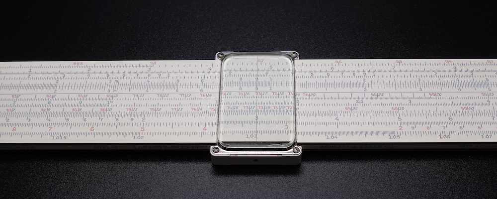

The $A$-$D$ scale pair computes $x^2$, because $A$ is a double-cycle logarithmic scale and $D$ is a single-cycle logarithmic scale. In the reverse direction, the $D$-$A$ scale pair computes $\sqrt{x}$.

To compute $\sqrt{9}$, we manipulate the slide rule as follows:

- $A$—Place the hairline on the *argument* $9$ in the first cycle of the $A$ scale.
- $D$—Read under the hairline the result $3$ on the $D$ scale. This computes $\sqrt{9} = 3$.

Placing the hairline on $9$ in the second cycle of the $A$ scale would compute $\sqrt{90} = 9.49$. 

***cubing on slide rule***—It is a little known fact that [Isaac Newton](https://en.wikipedia.org/wiki/Isaac_Newton) invented the cubic $K$ scale in 1675 by solving the cubic equations using logarithms. The $K$-$D$ scale pair computes $x^3$ because $K$ is a triple-cycle logarithmic scale. And the reverse $D$-$K$ scale pair computes $\sqrt[3]{x}$.

To compute $3^3$, we manipulate the slide rule as follows:

- $D$—Place the hairline on the *argument* $3$ on the $D$ scale.
- $K$—Read under the hairline the *result* $27$ on the second cycle of the $K$ scale. This computes $3^3 = 27$.

When computing $\sqrt[3]{x}$, the digits to the left of the decimal are grouped by threes, and if the left-most group has one digit (say $1,000$) then place the argument in $K$ scale's first cycle; if two digits (say $22,000$) then in the second cycle; and if three digits (say $333,000$) then in the third cycle.

To compute $\sqrt[3]{64000}$, we manipulate the slide rule as follows:

- $K$—Place the hairline on the *argument* $64$ in the second cycle of the $K$ scale.
- $D$—Read under the hairline the *result* $4$ on the $D$ scale. A quick mental calculation $\sqrt[3]{1000} = 10$ indicates that the result should be in the tens, so the actual result is $40$. This computes $\sqrt[3]{64000} = 40$. 

Placing the hairline on $6.4$ in the first cycle of the $K$ scale would compute $\sqrt[3]{6.4} = 1.857$, and placing the hairline on $640$ on the third cycle of the $K$ scale would compute $\sqrt[3]{640} = 8.62$.

***logarithmic exponentiation***—General exponentiation of the form $x^{y/z}$ can be reduced to arithmetic operations by applying the $log$ function:

- $log(x^{y/z}) = y ÷ z × log(x)$.

Then, $×$ and $÷$ can be further reduced to $+$ and $-$ by applying the $log$ function once more:

- log(y ÷ z × log(x)) = log(y) - log(z) + log(log(x))

It turns out that the slide rule performs this trick using the base-$e$ natural logarithm $ln$ as the inner logarithm and the base-$10$ common logarithm $log$ as the outer logarithm. That is, the function composition is actually $log \circ ln$, not $log \circ log$ as described above. The $ln$ is used instead of the $log$ for the inner logarithm, in order to compress the range of the $LL_n$ scale, thereby improving reading precision. Hence, computing $x^{y/z}$ on the slide rule is equivalent to performing these logarithmic operations:

- $x^{y/z} = \color{darkred}{ln^{-1}}[y ÷ z × \color{red}{ln}(x)]$
  - $= \color{darkred}{ln^{-1}}[\color{darkblue}{log^{-1}}[\color{blue}{log}[y ÷ z × \color{red}{ln}(x)]$
  - $= \color{darkred}{ln^{-1}}[\color{darkblue}{log^{-1}}[\color{blue}{log}(y) - \color{blue}{log}(z) + \color{blue}{log}(\color{red}{ln}(x))]]$

So, computing $2^4$ and $\sqrt[4]{16}$ on the slide rule proceed as follows:

- $2^4 = 2^{4/1} = ln^{-1}[4 ÷ 1 × ln(2)]$
  - $= ln^{-1}[log^{-1}\{log(4) - log(1) + log(ln(2))\}] = 16$

- $\sqrt[4]{16} = 16^{1/4} = ln^{-1}[1 ÷ 4 × ln(16)]$
  - $= ln^{-1}[log^{-1}\{log(1) - log(4) + log(ln(16))\}] = 2$

We now see that the "log-log" nomenclature of engineering slide rules is a not-so-subtle nod to the function composition $\color{blue}{log} \circ \color{red}{ln}$ that appears in the expressions computing $x^{y/z}$.

On the slide rule, the $LL$​ scales compute general exponentiation $x^{y/z}$​. It is, therefore, reasonable to ask, "If the $LL$​ scale pairs can compute arbitrary powers and roots, why waste precious real estate with the redundant $A$​, $B$​, and $K$​ scales?" The answer is convenience. Engineering calculations make frequent use of squares (for Pythagoreans and areas) and cubes (for volumes), and these scales provide quick calculations of those operations. And although the $LL$​ scales possess greater flexibility and precision, their procedures are commensurately more intricate and error prone.

***natural logarithmic scale***—The black $LL_n$ scale is derived from the base-$e$ ($e = 2.718$) natural logarithm $log_e$ or $ln$. The $LL_n$ and the $D$ scales are related by a bijective function $ln$:

- $ln : LL_n \rightarrow D$
- $ln^{-1} : D \rightarrow LL_n$

In the plot below, the black curve is $ln$ and the red is $ln^{-1}$.

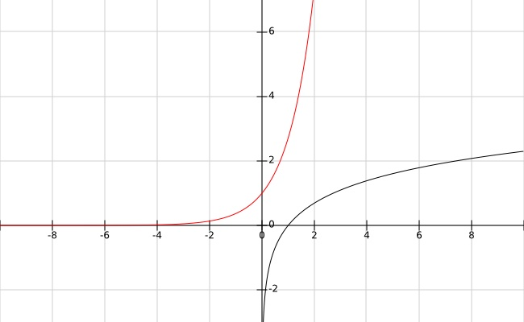

The special name for $ln^{-1}$ is $e^x$. The $LL_n$ and the $D$ scales form a transform pair that converts between the base-$e$ natural logarithmic scale and the base-$10$ common logarithmic scale.

Unlike other scales of the slide rule, the black $LL_n$ scale is not cyclic; it is one long scale. On the K&E 4081-3, the black $LL_n$ scale is divided into these three ranges:

- $LL_1$: $x ∈ [1.01 \rightarrow 1.105] \implies ln(x) ∈ [0.01, 0.1]$
- $LL_2$: $x ∈ [1.105 \rightarrow e] \implies ln(x) ∈ [0.1, 1.0]$
- $LL_3$: $x ∈ [e \rightarrow 22000] \implies ln(x) ∈ [1.0, 10.0]$
  - Note that $e = 2.718$ and $ln(e) = 1.0$

The function composition $log \circ ln$ used to construct the $LL_n$ scales makes the $LL_3$ scale line up perfectly with the $D$ scale: $log(ln(e)) = 0$ and $log(ln(22000)) = 1$. The $LL_n$ scales are a tangible example of "exponential growth".

But had the $log \circ log$ function composition been used to construct the $LL_n$ scales, the range of the $LL_3$ scale would be $[10^1, 10^{10}]$, instead. Shrinking this galactic scale down to a 25-cm length would make the scale resolution unusably coarse. The function $e^x$ is famous for its fast growth rate, but $10^x$ beats it, hands down.

The red $LL_{0n}$ scales are reciprocals of the black $LL_n$ scales. As such, the red scales run from right to left. On the K&E 4081-3, the red $LL_{0n}$ scale is divided into these ranges:

- $LL_{01}$: $x ∈ [0.9901 \leftarrow 0.905] \implies ln(x) ∈ [-0.01, -0.1]$
- $LL_{02}$: $x ∈ [0.905 \leftarrow 1/e] \implies ln(x) ∈ [-0.1, -1.0]$
- $LL_{03}$: $x ∈ [1/e \leftarrow 0.000045] \implies ln(x) ∈ [-1.0, -10.0]$
  - Note that $1/e = 0.368$ and $ln(1/e) = -1.0$

Because the $LL$ scales are intimately linked to $ln$, and by extension to $e^x$, many slide rules label the $LL_n$ scales as $e^x$ and the $LL_{0n}$ scales as $e^{-x}$.

To compute $ln(2)$, we manipulate the slide rule as follows:

- $LL_2$—Place the hairline on the *argument* $2$ on the $LL_2$ scale.
- $D$—Read under the hairline the *result* $693$ on the $D$ scale. As per the legend inscribed on the right side of the $LL_2$ scale, the value of $ln(2) ∈ [0.1, 1.0]$. Hence, we read $ln(2) = 0.693$.

To compute $ln(3)$, we manipulate the slide rule as follows:

- $LL_3$—Place the hairline on the *argument* $3$ on the $LL_3$ scale.
- $D$—Read under the hairline the *result* $1099$ on the $D$ scale. As per the legend inscribed on the right side of the $LL_3$ scale, the value of $ln(3) ∈ [1.0, 10.0]$. Hence, we read $ln(3) = 1.099$.

Computing $e^x$, however, is not the primary purpose of the $LL$ scale pairs; [Peter Roget](https://en.wikipedia.org/wiki/Peter_Mark_Roget), an English physician and the creator of the Roget Thesaurus, designed this scale to compute arbitrary powers and roots in the form of $x^{y/z}$. The black $LL_n$ scales are for computing powers and roots of $x > 1$, and the red $LL_{0n}$ for $x < 1$.

As we have seen earlier, multiplication and division start and end on the fixed $D$ scale and requires the use of the sliding the $C$ scale. Likewise, exponentiation starts and ends on the fixed $LL$ scales and requires the use of the sliding $C$ scale. At a glance, computing $x^y$ seems as straightforward as computing $x × y$. But in truth, the $LL$ scales are beguiling; using them correctly requires care, and using them quickly requires practice. A typical first-year engineering student takes a few months of regular use to become proficient with these scales. The procedures for computing $x^y$ using the $LL$ scales are complex enough that they warrant being split into two cases: when $x > 1$ and when $x < 1$.

***exponentiation for the $x > 1$ case***—If $x > 1$, we use the $LL_n$ scales and the $C$ scale to compute $x^y$ as follows:

- If $y ∈ [0.1, 1]$, the result is always less than the base, so read the result further down the scale, either to the left on the same scale or on the next lower scale.
- If $y ∈ [0.001, 0.1]$, reduce the problem to the $y ∈ [0.1, 1]$ case by mentally shifting the decimal point one or two places to the right.
- If $y ∈ [1, 10]$, the result is always greater than the base, so read the result further up the scale, either to the right on the same scale or on the next higher scale.
- If $y ∈ [10, 100]$, reduce the problem to the $y ∈ [1, 10]$ case by mentally shifting the decimal point one or two places to the left.
- If the result exceeds $22000$, factor out $10$ from the base (as in $23^8 = 2.3^8 × 10^8$) or factor out 10 from the exponent (as in $1.9^{23} = 1.9^{10} × 1.9^{13}$).

To compute $1.03^{2.4}$, we manipulate the slide rule as follows:

- $LL_1$—Place the hairline on the *base* $1.03$ on the $LL_1$ scale on the backside of the slide rule.
- $C$—Flip the slide rule to the frontside. Slide the left-hand $1$ on the $C$ scale under the hairline.
- $C$—Place the hairline on the *exponent* $2.4$ on the $C$ scale.
- $LL_1$—Flip the slide rule to the backside. Read under the hairline the *result* $1.0735$ on the $LL_1$ scale. This computes $1.03^{2.4} = 1.0735$.

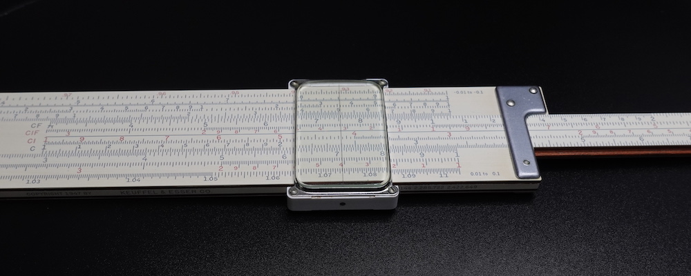

But sometimes, we get into a quandary. Say, we wish to compute $1.03^{9.2}$. So, we line up the $C$ scale's left-hand $1$ with the $LL_1$ scale's $1.03$. But now, the $C$ scale's $9.2$ has moved off the right edge of the slide rule. What this indicates is that we have exceeded the upper limit of the $LL_1$ scale from whence we began, and have ventured into the $LL_2$ scale. To avoid going off the edge, we use the folded $CF$ scale, instead. We line up the $CF$ scale's $1$, which is near the centre of that scale, and move the hairline to the exponent $9.2$, which is slightly to the left. We then read the result $1.03^{9.2} = 1.3125$ on the $LL_2$ scale.

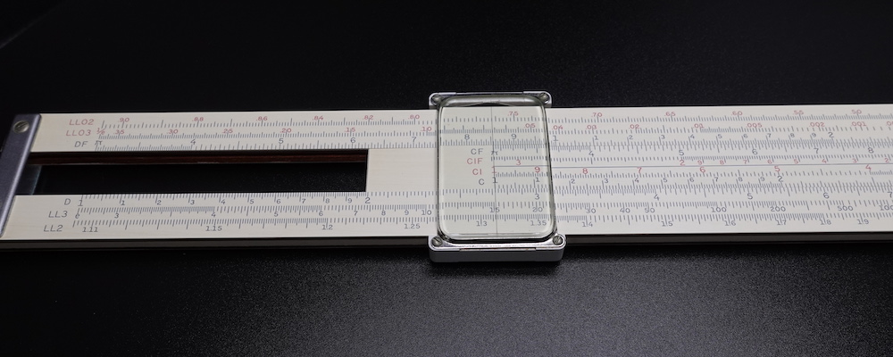

***exponentiation for the $x < 1$ case***—If $x < 1$, we use the $LL_{0n}$ scales and the $CI$ scale, instead. The procedures for the $LL_{0n}$ scales are similarly categorised into four ranges of the exponent. The $LL_{0n}$ scales are also useful when dealing with negative exponents. Because $x^{-y} = 1/x^y$ and $LL_n = 1/LL_{0n}$, computing $x^y$ on the $LL_n$ scale but reading the result on the $LL_{0n}$ scale yields $x^{-y}$.

To compute $2.22^{-1.11}$, we manipulate the slide rule as follows:

- $LL_2$—Place the hairline on the *base* $2.22$ on the $LL_2$ scale.
- $CI$—Slide the *exponent* $1.11$ on the $CI$ scale under the hairline.
- $CI$—Place the hairline on the right-hand $1$ of the $CI$ scale.
- $LL_{02}$—Read under the hairline the *result* $0.413$ on the $LL_{02}$ scale. This computes $2.22^{-1.11} = 0.413$.

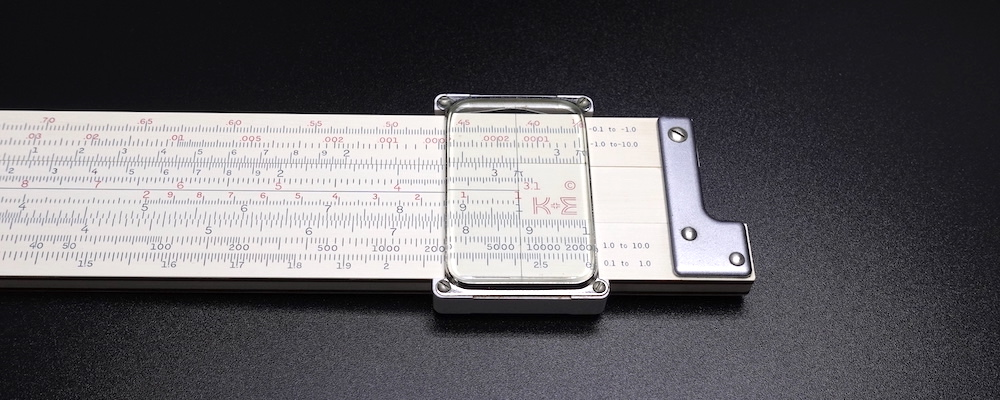

If we had read the result on the $LL_2$ scale, we would have computed $2.22^{1.11} = 2.434$. But by reading the result on the $LL_{02}$ scale, we compute the reciprocal $1/2.434 = 0.413$, as desired. The $LL$ scales are the most powerful scales on an ordinary engineering straight rule. But with that power comes numerous traps for the unweary. Interested readers may read the user's manuals listed in the resources section at the end of the article.

## *trigonometric*

Trigonometric functions are related to each other by these identities:

- $sin(\theta) = cos(90° - \theta)$
- $cos(\theta) = sin(90° - \theta)$
- $tan(\theta) = cot(90° - \theta) = \frac{sin(\theta)}{cos(\theta)} = \frac{1}{cot(\theta)}$
- $cot(\theta) = tan(90° - \theta) = \frac{cos(\theta)}{sin(\theta)} = \frac{1}{tan(\theta)}$
- $sec(\theta) = \frac{1}{cos(\theta)}$
- $csc(\theta) = \frac{1}{sin(\theta)}$

In the plot below, the blue curve is $sin$, the green is $cos$, and the red is $tan$.

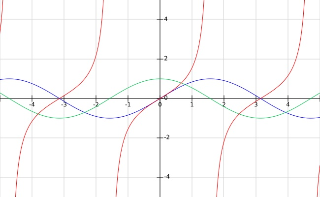

***black $S$ scale***—The $S$ scale on the slide rule is graduated in degrees from $5.73°$ to $90°$. When $\theta ∈ [5.73°, 90°]$ on the $S$ scale, $sin(\theta) ∈ [0.1, 1.0]$ on the $C$ scale. The $S$ and the $C$ scales are related by a bijective function $sin$:

- $sin: S \rightarrow C$
- $sin^{-1}: C \rightarrow S$

In the plot below, the black curve is $sin$ and the blue is $sin^{-1}$. Note that the inverse function (here $sin^{-1}$) is a reflection in the $y = x$ line of the original function (here $sin$). The $x$-axis is the angle $\theta$ in radians.

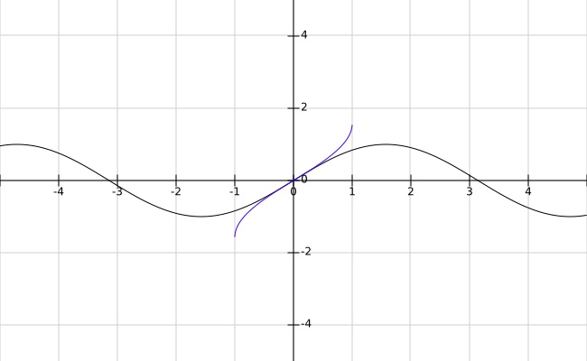

To compute $sin(30°)$, we manipulate the slide rule as follows:

- $S$—Place the hairline on the *argument* $30°$ on the black $S$ scale.
- $C$—Read under the hairline the *result* $0.5$ on the $C$ scale. This computes $sin(30°) = 0.5$.

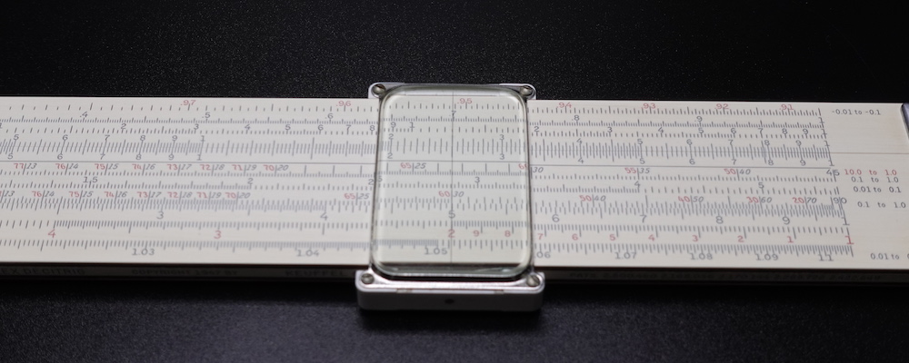

To compute $\theta$ in the expression $sin(\theta) = 0.866$, we do the opposite: set the argument $0.866$ on the $C$ scale and read the result $60°$ on the $S$ scale. This computes $\theta = sin^{-1}(0.866) = 60°$.

***red $S$ scale***—The $S$ scale is graduated from left to right, in black, for $sin$ between the angles $5.73°$ and $90°$. But since $cos(\theta) = sin(90° - \theta)$, the $cos$ scale is readily combined into the $S$ scale, but in the reverse direction and marked in red. Hence, $cos(\theta)$ is computed using the same procedure, but by reading the red $\color{red}{S}$ scale.

In the plot below, the red curve is $cos$ and the blue is $cos^{-1}$.

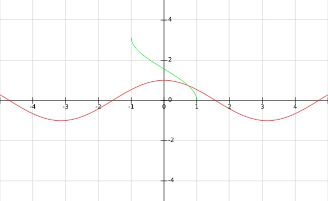

***black $T$ scale***—The $T$ scale is graduated in degrees from $5.73°$ to $45°$. When $\theta ∈ [5.73°, 45°]$ on the $T$ scale, $tan(\theta) ∈ [0.1, 1.0]$ on the $C$ scale. The $T$ and the $C$ scales are related by a bijective function $tan$:

- $tan: T \rightarrow C$
- $tan^{-1}: C \rightarrow S$

In the plot below, the black curve is $tan$ and the blue is $tan^{-1}$.

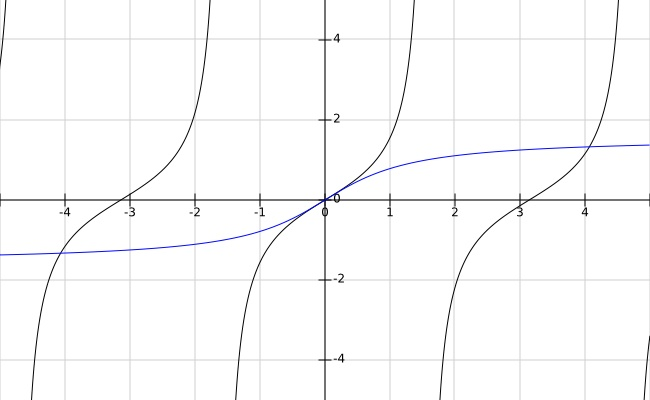

***red $T$ scale***—The $T$ scale, too, has red markings, running right to left, for $\theta ∈ [45°, 84.29°]$. The red $\color{red}{T}$ scale is used for $tan(\theta) ∈ [1 \rightarrow 10]$ and for $cot(\theta) ∈ [1.0 \leftarrow 0.1]$. The red $\color{red}{T}$ scale is used in conjunction with the reciprocal $CI$ scale.

To compute $tan(83°)$, we manipulate the slide rule as follows:

- $T$—Place the hairline on the *argument* $83°$ on the red $\color{red}{T}$ scale.
- $CI$—Read under the hairline the *result* 8.14 on the $CI$ scale. This computes $tan(83°) = 8.14$.

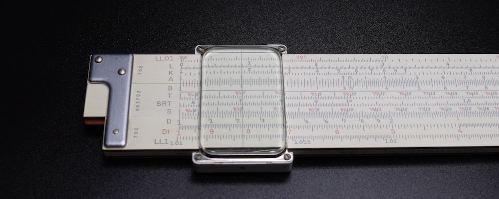

Since $cot(\theta) = tan(90° - \theta) = 1/tan(\theta)$, we may compute $cot(\theta)$ using the black and red $\color{red}{T}$ scales, using the procedure described above. So, to compute $cot(83°)$, we use the same procedure as $tan(83°)$ on the red $\color{red}{T}$ scale, but instead read the result $cot(83°) = 1/tan(83°) = 0.1228$ on the $C$ scale. Alternatively, we may compute $tan(90° - 83°)$ on the black $T$ scale, and read the result $cot(83°) = tan(7°) = 0.1228$ on the $C$ scale.

In the plot below, the red curve is $cot$​ and the green is $cot^{-1}$​.

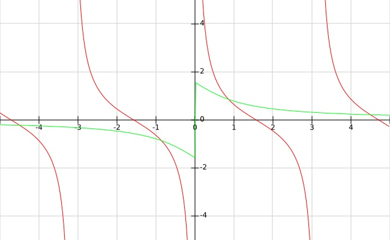

***$ST$ or $SRT$ scale***—The $ST$ scale is used to compute $sin$ and $tan$ for small angles in the range $[0.573°, 5.73°] = [0.01, 0.1]\ rad$, because $sin(\theta) \approx tan(\theta)$ for small angles. For such small angles, we may exploit another approximation: $sin(\theta) \approx tan(\theta) \approx \theta$, where the angle $\theta$ is measured in radians. For this reason, some manufacturers, like K&E, label the $ST$ scale as $SRT$ for $sin$-$rad$-$tan$.

In the plot below, the blue curve is $sin$ and the red is $tan$. These two curves are indistinguishable when $\theta ∈ [0.0, 0.1]\ rad$.

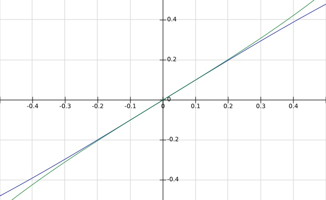

It is possible to chain trigonometric and arithmetic calculations on the slide rule. This is one of the reasons why calculating with the slide rule was much faster than using tables. Those who are interested in these details should read the user's manuals listed in the resources section at the end of the article.

# MAINTENANCE

***calibrating***—When an adjustable slide rule, like the K&E 4081-3, goes askew (but not warped), it can be recalibrated. The frame of this duplex slide rule consists of the fixed lower portion and the adjustable upper portion. The two faces of the cursor are independently adjustable, as well. We calibrate this slide rule as follows:

- ***align slide to lower frame***—Align the slide's $C$ scale with the lower frame's $D$ scale.
- ***align upper frame to slide***—Slightly loosen the screws that hold the upper frame. While keeping the slide aligned with the lower frame, adjust the upper frame so that its $DF$ scale lines up with the slide's $CF$ scale. Retighten the upper frame screws, but not so tight as to impede the movement of the slide.
- ***align front cursor to frame***—Move the cursor hairline on the left-hand $\pi$ of the upper frame's $DF$ scale and the left-hand $1$ of the lower frame's $D$ scale on the frontside of the slide rule. Slightly loosen the screws that hold the glass's metal bracket to the top and bottom lintels of the cursor. Nudge the glass until the hairline is aligned to both the $DF$ and the $D$ scales. Retighten the glass bracket's screws. Do not over tighten, lest the cursor is damaged.
- ***align back cursor to frame***—Flip the slide rule, and align the back cursor to the frame in the same manner.

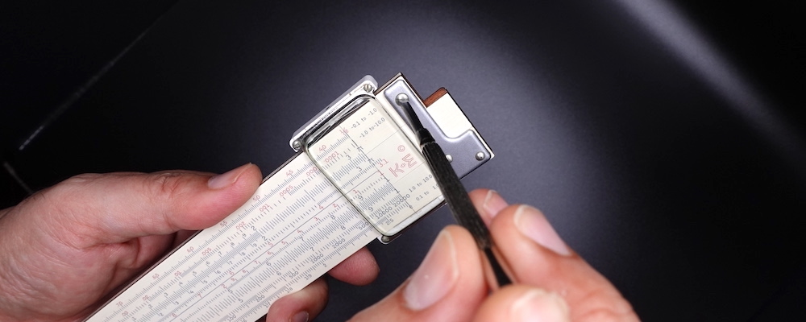

Frustrating though it can be to recalibrate the slide rule, that is the easy bit. Reading the scales with adequate precision, however, was tricky, especially for those of us with poor eyesights.

***cleaning***—I can say nothing about maintaining vintage Thacher-style large cylindrical rules, since I have never even seen one in person. But straight rules, circular rules, and Otis King-style cylindrical rules should be cleaned by gently wiping down with clean, moist (but not dripping wet) microfibre cloth or paper towel, then dry off the moisture, immediately. Although plastic and aluminium rules can withstand water, wood and bamboo rules cannot. Note that the black handle (the cursor) on the Otis King is actually black-painted brass cylinder. Aggressive rubbing will scrub off the black paint. And be forewarned: never use chemical solvents.

With use, the slide can get sticky, sometimes. This is caused by the grime—an amalgam of dust and skin oil—that collect in the crevices between the slide and the frame. This grime can be cleaned with a moist microfibre cloth or paper towel. Do not apply lemon oil, grease, powder, graphite, or any other foreign substance to the slide rule, and especially to the slide-frame contact areas. Not only does the slide rule not require lubricants, these substances could mar, or perhaps even damage, the device. Dust also tends to gather under the cursor glass. The easiest way to remove the dust is to blow it out using a compressed air canister. To remove stubborn stains under the glass, however, the cursor may need to be disassembled and cleaned.

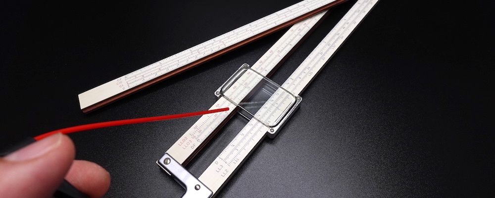

If you are reading this article, odds are that you have never used or owned a slide rule. It is my hope that you would acquire one, say from [eBay](https://www.ebay.com/sch/i.html?_from=R40&_trksid=p2380057.m570.l2632&_nkw=slide+rules&_sacat=412), and learn to use it. Your first slide rule should not be a rare collector's item; it should be something like the [K&E 4081-3 Log Log Duplex Decitrig](https://www.ebay.com/sch/i.html?_from=R40&_trksid=p2047675.m570.l1313&_nkw=K%26E+4081-3+Log+Log+Duplex+Decitrig&_sacat=0) or the [Post 1460 Versalog](https://www.ebay.com/sch/i.html?_from=R40&_trksid=p2334524.m570.l1313&_nkw=Post+1460+Versalog&_sacat=0&LH_TitleDesc=0&_odkw=K%26E+4081-3+Log+Log+Duplex+Decitrig&_osacat=0)—a decent, common, inexpensive model. If you do end up buying one, your slide rule will most likely be grimy and discoloured, for having been kept in a dusty storage bin for decades. Do not despair; most old slide rules can be renewed to a good extent. The grime and discolouration can be removed by gently—I mean gently—rubbing with the soft, foamy side of a moist (but not dropping wet) [kitchen sponge](https://www.amazon.com/dp/B007C5IH4C?tag=aboutcom02thespruce-20&linkCode=ogi&th=1&psc=1&ascsubtag=4164819%7Cnca170cbe1d384af0a2b09e62c4e4b9b020%7CB007C5IH4C) loaded with a spot of dish soap. If you do decide to attack a stain with the rough side of the sponge, use care and judgement, or you will scrub off the scale markings. And if yours is a wood slide rule, minimise its contact with water. Immediately dry off the slide rule after cleaning. Do not apply heat as a drying aid. And I strongly suggest that you clean in stages, removing the grime layer by layer.

# COLLECTING

This section is about collecting slide rules: what to look for, how to purchase, how to avoid pitfalls, etc. I collect slide rules; this should surprise no one reading this article. But I am an atypical collector. I buy but I do not sell, and I do not engage in bidding wars on eBay. And I collect only those slide rules that I coveted as a young engineering student in the early 1980s. More importantly, I buy slide rules that are not "collector-grade". That is, my slide rules have high accuracy, but they do not necessarily have high resale value: most are not rarities; some have former owners' names engraved upon them; many do not come with cases, manuals, wrappings, boxes, and other accoutrement of collecting. Moreover, whereas most collectors favour top-of-the-line, sophisticated, powerful slide rules, I am partial to humble Darmstadt rules, for they offered the best balance in terms of density, simplicity, and utility. And as much as I like Darmstadt rules, I dislike having to use pocket slide rules, mainly due to my poor eyesight. Nevertheless, pocket slide rules are perfectly serviceable; Apollo astronauts staked their lives on it, after all.

My main goal in collecting slide rules is to play, not to display. Although these simple instruments no longer hold practical value today, they were once instrumental in creating immense value for humanity. I acknowledge that fact by collecting them. And by using them, I am able to appreciate more deeply the ingenuity of my forebears, the 19th century engineers who propelled forward the slide rule design. To perpetuate this appreciation, I taught my son how to use slide rules, starting when he was a third-grader. I am motivated by knowledge and nostalgia, not by possessory pride or pecuniary purpose. So, when perusing my collection described herein, take my biases into account; a collection is a reflection of the collector's opinion.

I purchased all my slide rules on eBay, except these: the Aristo 0968, which was the required equipment at my engineering school in early 1980s Burma, and I was required to purchase it from the government store; the FC 8/10, which was a gift my engineer aunt when I entered the engineering school; the FC 67/64 R and the FC 2/83 N, which I purchased new from the Faber-Castell online store a couple of decades ago, when the company still had new, old-stock (NOS) slide rules; and the Concise Model 300, which I purchased new from Concise online store several years ago. By the way, Concise still makes slide rules today, by the way.

Below, I arranged my collection by slide rule *varieties* (straight, circular, and cylindrical), within each variety by *brandnames*, and under each brandname by *capabilities* (Mannheim, Darmstadt, log-log duplex, and vector). All the photographs are taken with a tripod-mounted camera so as to show the relative sizes of the slide rules. A typical straight rule is approximately 30 cm in overall length, so it should be easy to estimate the absolute sizes of these rules, as well.

Do note that sellers (brands) were not necessarily the same as manufacturers, in some cases. For example, Frederick Post (est. 1890), a well-known American company, sold under the Post brand topping bamboo slide rules designed and manufactured by Hemmi of Japan. And Keuffel & Esser (est. 1867), the leading American designer and manufacturer of high-quality slide rules, began life as importer of German slide rules. By the way, Hemmi (est. 1895) also sold their superb bamboo slide rules under their own brand. Also of note was that German manufacturers, Faber-Castell (est. 1761), Aristo (est. 1862), and Nestler (est. 1878), were in [West Germany](https://en.wikipedia.org/wiki/West_Germany) (FRD) during the [Cold War](https://en.wikipedia.org/wiki/Cold_War), but Reiss (est. 1882) was in [East Germany](https://en.wikipedia.org/wiki/East_Germany) (DDR). And Kontrolpribor (est. 1917), a Russian manufacturer, is more properly labelled a factory from the former [Soviet Union](https://en.wikipedia.org/wiki/Soviet_Union).

Before we proceed, here are some admonishments for those who are buying slide rules for using, not merely for possessing:

- Do not buy a slide rule with bents, dents, chips, or other deformities. This is the sign that the former owner did not take adequate care. And such extensive damage cannot be mended.
- Do not worry too much about dust, dirt, and stain; the grime can be cleaned. What is important is that the slide rule is in good nick, physically, and that the scale engravings are undamaged.
- Do not buy a wood slide rule that is showing gaps between the slide and the body. This is the sign warping. This slide rule cannot be mended, and it cannot be calibrated to restore its accuracy.
- Do not buy from a seller who does not post clear, high-resolution images. You cannot assess the condition of slide rule from blurry, low-resolution images.
- Do not buy a bundle of slide rules sold as a lot. The lot inevitably contains slide rules that you do not need, as well as multiple copies of the one you do need.
- Do not focus on one brand or one variety. This strategy will lead your collection askew, and will cause you to miss out on desirable slide rules with truly innovative designs.
- Do not buy slide rules that are specialised exclusively to a particular application domain: artillery, aviation, stadia, photography, stahlbeton, obstetric, and the like.
- Do not buy manuals. Every manual is now available online in PDF format.
- Do not chase collector-grade items with complete set of manuals, boxes, etc. Those are for traders.
- Do not chase rarities. Rarity is a quality treasured by traders, so such items tend to be expensive.
- Do not engage in a bidding war with traders.
- Do not rush in. Good slide rules always show up on eBay, sooner or later.

## *manufacturers*

***Aristo (DE)***—Aristo was the slide rule brandname of the German company [Dennert & Pape](http://waywiser.rc.fas.harvard.edu/people/7640/dennert--pape) (D&P), founded in 1872. But the name Aristo eventually subsumed D&P.

***Blundell-Harling (UK)***—[Blundell-Harling](https://www.blundellharling.com/) are an English stationary manufacturer that make technical drawing supplies, today. Back in the day, their BRL slide rules were highly regarded. During the nearly four-century reign of the slide rule, almost every industrialised nation had at least one slide rule manufacturer. But the English slide rules—straight, circular, cylindrical, the lot—were generally superior in terms of craftsmanship and materials. It makes sense in a way; the English invented the slide rule, after all.

***Breitling (CH)***—[Breitling](https://www.breitling.com/us-en/) are a famed Swiss watchmaker. They were founded in 1884. They have long been associated with aviation. Their [Navitimer](https://www.breitling.com/us-en/watches/navitimer/) line is the first wristwatch with an integrated slide rule. The Navitimer was introduced in 1952 for use by pilots. Instrument flying in those days required pilots to use the flight instruments in the cockpit together with an accurate chronometer (for flight time, destination time, etc.), a stopwatch (for timed turns, holding patterns, etc.), and a slide rule (for navigation, fuel burn calculations, etc.). The Navitimer fulfilled all three needs, because it was a chronometer-grade wristwatch that incorporated a chronograph and a slide rule.

***Concise (JP)***—[Concise](https://www.sliderule.tokyo/) are a Japanese maker of drawing and measuring tools. They made good, but low-cost, plastic, circular slide rules. Today, they are the only company still making slide rules in the 21st century.

***Dempster (US)***—Dempster were a boutique American manufacturer of top-quality circular slide rules. They were founded by [John Dempster](http://oughtred.org/jos/Davis_DempsterRotaRule.pdf), a Berkeley graduate mechanical engineer, who began manufacturing the Dempster RotaRule in 1928, in the basement of his home in Berkeley, California.

***Faber-Castell (DE)***—Founded in 1761, [Faber-Castell](https://en.wikipedia.org/wiki/Faber-Castell) (FC) began life as an office supply company. Today, they remain one of the oldest and largest company of its kind. They are now famous for their quality pens and pencils. But for about 100 years, until 1975, FC were a leading slide rule manufacturer.

***Fowler (UK)***—Fowler were an English maker of pocket watch slide rules. They were founded in 1853, and they held numerous British patents. Fowler calculators were of superlative quality, constructed like expensive pocket watches. And they came in high-quality wooden cases that resembled jewellery cases.

***Gilson (US)***—Gilson, established in the 1930s, were an American maker of cheap, but serviceable, aluminium circular rules with spiral scales. They made many models, both large (almost 22 cm diameter) and small (about 12 cm diameter), but all were of the same, three-cursor design. Strangely, they even made slide rules for computer scientists, which included $hex$-$oct$-$dec$ base conversion scales.

***Graphoplex (FR)***—Graphoplex were a French maker of splendid-looking slide rules, but with a horrid-looking logo. In terms of quality, French slide rules are on par with German ones. Graphoplex's [sector-dial watch face](https://revolutionwatch.com/the-watch-face-sector-dials/) style scales are quite pleasing to the eye. Although this visual design was common in the late 19th century, it disappeared during the early 20th century. Some early German wood rules used this visual design, but later wood rules abandoned it. Graphoplex, though, held onto this visual design. So, their modern slide rules have a rather unique, classic look.

***Hemmi (JP)***—Established in 1895, Hemmi designed and manufactured top-quality, innovative slide rules. They made accurate, elegant instruments using quality materials. Their signature material was bamboo. Bamboo is perhaps the best material with which to make slide rules. It is tough, stable, and naturally slippery. I adore Hemmi rules. Today, they make high-tech electronic devices. Yet, they continue to use the name [Hemmi Slide Rule Co., Ltd.](https://hemmi-inc.co.jp/english/company/), proudly displaying their illustrious heritage.

***Keuffel & Esser (US)***—Keuffel & Esser (K&E) were the most successful manufacturer of quality slide rules in America. They were founded in 1867 as an importer of German slide rules. But soon, they began designing and making their own slide rules. K&E were [quite innovative](https://www.mccoys-kecatalogs.com/KEPatents/KEPatents.htm). The duplex design was one of their inventions. Their signature material was mahogany. Mahogany is a good material for slide rule, but it is neither as robust nor as stable as bamboo. K&E also made several plastic rules, but their plastic is of a lower quality, compared to the European plastics.

***Kontrolpribor (RU)***—Kontrolpribor was a Soviet factory that made pocket watch slide rules. Like other Soviet products, Kontrolpribor devices feel cheap, but sturdy, nevertheless. Today, [Kontrolpribor](https://www.kontrolpribor.ru/en/) make high-tech scientific instruments.

***Loga (CH)***—Loga were a Swiss maker of superb technical instruments, including circular and cylindrical slide rules. They were founded in the early 20th century. Until about the late 19th century, Switzerland was the home of cheap, high-quality craftsmen. French, German, and English watchmakers relied extensively on the highly skilled Swiss labour force to hand-make their high-end watches. That was how the modern Swiss watch industry came about. So, it is no surprise that 20th century Swiss slide rules exhibit similar craftsmanship.

***Logarex (CZ)***—Logarax was a factory in Czechoslovakia, when the country was part of the old [Eastern Bloc](https://en.wikipedia.org/wiki/Eastern_Bloc). Like everything else manufactured in the Eastern Bloc countries during the Soviet Era, their slide rules feel cheap, but usable.

***Nestler (DE)***—Nestler were a German maker of high-quality slide rules. They were established in 1878. Their wood rules were the stuff of legend. Even the very old wood rules from the early 20th century have a modern, minimalist look-and-feel to them. Of all the German brands, Nestler is my favourite.

***Otis King (UK)***—Otis King was an English electrical engineer. His company made high-quality pocket cylindrical rules, starting around 1922. They made only two types, though—Model K and Model L—both of which are described, below. And despite being designed by an electrical engineer, these rules are not suitable for daily use in engineering, given their limited capabilities. The focus of these rules is on portability and precision, the two characteristics most engineers of the time did not care for.

***Pickett & Eckel (US)***—Pickett, established in 1943, were a newcomer to the American slide rule market. Their signature material was aluminium. And most of their rules wore their trade-dress, the Pickett Eye-Saver Yellow. To be honest, I detest the cold, sharp edges of the aluminium and the gaudy eye-slayer yellow. But loads of American engineers fancied Pickett rules. Not withstanding my opinion, this slide rule is a solid performer. Aluminium is thermally much more stable than wood. And it is well-neigh indestructible. Nevertheless, Pickett aluminium rules feel cheap to me. My apologies to NASA who, for their Apollo missions, chose the [Pickett N600-ES](https://americanhistory.si.edu/collections/search/object/nmah_694174), a pared-down, pocket version of the popular Pickett N3-ES.

***Frederick Post (US)***—Frederick Post were an American importer of top-quality Hemmi bamboo rules. These bamboo rules were sold under the Post brand in America. Frederick Post morphed into Teledyne Post in 1970, and continued making drafting supplies until 1992, when they were dissolved.

***Reiss (DE)***—Reiss were a German maker of slide rules, established in 1882. During the Cold War, it was but a Soviet-style factory in East Germany. But unlike their fellow Eastern Bloc countrymen, the East Germans staunchly clung on to their traditional German regard for superior craftsmanship. As such, Reiss rules are good quality instruments, comparable to Western European brands.

## *straight rules*

#### Aristo (DE)

***Aristo 967 U Darmstadt***—The Aristo 967 U is one of the most advanced Darmstadt slide rules ever made. Unlike the older Darmstadt rules, the backside of Aristo 967 U is clear plastic, which allows the user to see the entire backside of the slide. Like other Darmstadt rules, the Aristo 967 U's slide holds the $LL_1$, $LL_2$, and $LL_3$ scales on the backside. The $L$ scale is on the backside of the slide, as well. And in the tradition of Darmstadt, this slide rule is simplex. As such, the cursor does not reach the backside; the backside scales are read against the traditional red index marks at each end of the rule. Typical of all Aristo slide rules, the frame, the slide, and the cursor are made of a very high quality plastic. All these bits glide smoothly.

Many late-model, plastic Darmstadt rules, like the Aristo 967 U, have thin lips protruding from the frame. These portions are often marked with 25-cm and 10-in ruler scales. Unfortunately, the corners of these lips are rather fragile. If the slide rule was mistreated, the corners chip easily. Pay attention to this type of damage, when purchasing a plastic Darmstadt.

Frankly, I fail to see the value of the 25-cm and 10-in ruler scales. All engineers use the [triangular rule](https://americanhistory.si.edu/collections/search/object/nmah_692472) for measuring and drafting. This ruler is always on our desks. And on the very first day in engineering school, we were taught never to use the slide rule—a precision instrument—like a common ruler. So, putting ruler scales on a slide rule is simply wasting precious real estate.

***Aristo 0968 Studio***—The Aristo 0968 is an ordinary log-log duplex engineering straight rule, like the K&E 4081-3. But this slide rule is about half a centimetre wider than the K&E 4081-3, which affords a couple of extra scales and a more logical scale layout. The Aristo 0968 has the Pythagorean $P$ scale for computing $1 - x^2$ and two $tan$ scales $T_1 [5.5°, 45°]$ and $T_2 [45°, 84.5°]$, which the K&E 4081-3 does not. And all six $LL$ scales are placed on the backside, making it a much more convenient rule to use. Indeed, usability is the hallmark of European and Asian slide rules; this is the area in which American slide rules falter.

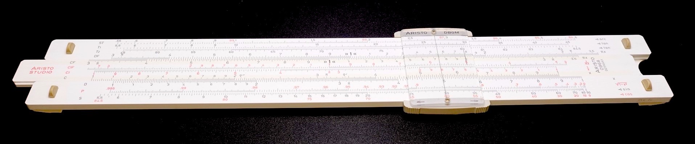

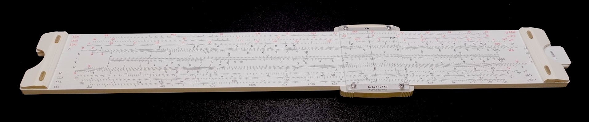

This Aristo 0968 was my first slide rule, purchased from the government store in Burma, circa 1982.

***Aristo 0969 StudioLog***—The Arist 0969 is a top-of-the-line engineering duplex slide rule, with four pairs of $LL$ scales, $P$ scale, etc. In terms of capabilities, it is identical to its more famous competitor, the FC 2/83 N. But being half centimetre or so wider, it is a monster of a straight rule. This extra real estate allows a bit of extra space between the scales, making them arguably easier to read. But the extra-wide frame is a bit awkward, when flipping.

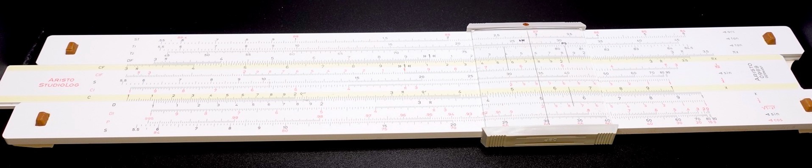

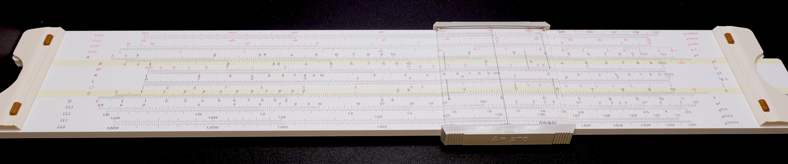

#### Blundell-Harling (UK)

***BRL D.26 Darmstadt***—The BRL D.26 is a late model Darmstadt. In terms of capabilities, the BRL D.26 is comparable to its contemporary, the Aristo 0967 U. But this English rule's build quality is obviously superior to that of its German competitor. The backside of the BRL D.26 sports the traditional cutout for reading the three $LL_n$ scales.

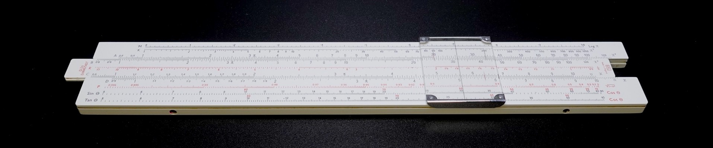

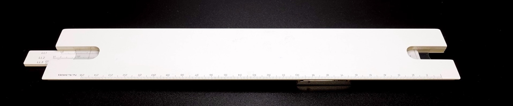

#### Faber-Castell (DE)

***FC 1/54 Darmstadt***—I rather like the sensible scale layout of the FC 1/54. The back of the slide has the usual three $LL_n$ scales, which are read through the traditional cutouts. Being of a classic German simplex design, this rule is narrow, but quite thick, compared to modern straight rules. This thickness gives enough space to the top and bottom edges of the frame for additional scales. The top edge has the 27-cm ruler scale and the $L$ scale, and the bottom edge has the $S$ and the $T$ trigonometric scales.

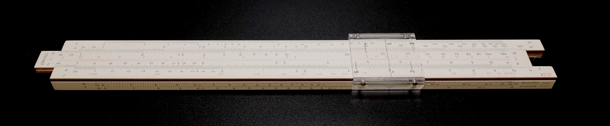

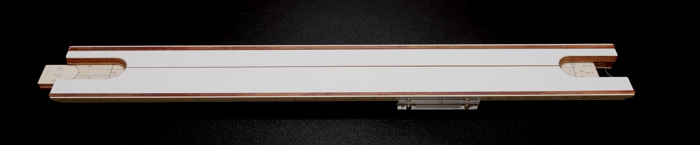

As I stated earlier, I adore Darmstadt rules. The FC 1/54 is one of my favourite Darmstadt rules. But it is not my absolute favourite Darmstadt rule. What is my absolute favourite? Read on.

***FC 67/64 R Pocket Darmstadt mit Addiator***—The FC 67/64 R is a Darmstadt pocket straight rule of about 15 cm in length. Being a Darmstadt rule, the backside of its slide has the usual three $LL_n$ scales. But instead of the traditional cutouts, the backside of the slide rule is occupied by a metal Addiator. As such, the only way to use the $LL_n$ scales is to flip the slide round to the front.

The [Addiator](https://en.wikipedia.org/wiki/Addiator) is a clever little contraption capable of performing addition and subtraction. The device must be reset before each operation by pulling out the bar at the top. The Addiator on the backside of this slide rule can handle operands up to six digits. The operand is entered by dragging a slot next to the desired digit in the appropriate column, using the provided stylus. When adding, both augend and addend are set in the upper register. When subtracting, the minuend is set in the upper register and the subtrahend in the lower register. Given that this is an article about slide rules, I shall go no further on using the Addiator. The curious may view the [YouTube videos](https://youtu.be/iz3ecu25gls) on the subject.

The mechanisms of the Addiator works on similar principles as the [mechanical calculator](https://en.wikipedia.org/wiki/Mechanical_calculator). But the Addiator is only 1 mm thick and fits neatly behind a pocket slide rule. I purchased this FC 67/64 R, new, straight from the Faber-Castell online store, many years ago.

***FC 1/98 Elektro***—The FC 1/98 is an advanced Darmstadt rule designed for electrical power engineers. It is of the classic German simplex design—narrow and thick. As such, it has specialised scales, like the $kW$ scale for computing electrical power, the $Dynamo$-$Motor$ scale for computing percent power efficiency ($η = P_{out} / P_{in}$) of generators and motors, and the $Volt$ scale for computing voltage drop along copper wires. Note that the term "dynamo" was an older name for generator, and motor is the dual of generator. The $Dynamo$-$Motor$ scale and the $Volt$ scale are engraved in the trough of the frame, under the slide. That is a clever use of space. The frame has the $LL_2$ and $LL_3$, but no $LL_1$. The bottom edge of the frame holds the $K$ scale. The backside of the slide has $S$, $L$, and $T$ more commonly found on Mannheim rules, which are read through the traditional cutouts. So, the FC 1/98 is a rather unique rule that combines Mannheim, Darmstadt, and electrical engineering scales.

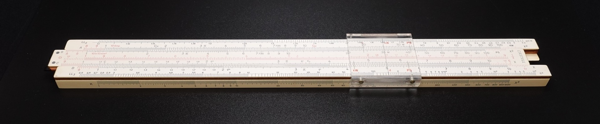

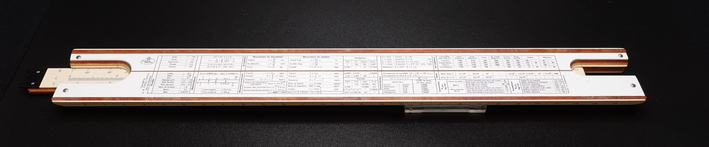

The FC 1/98 is, for sure, a specialty slide rule for electrical engineers. But it is general enough to qualify as a Darmstadt-ish engineering rule. And its clever scale layout deserves recognition. As such, I chose to include it in this article. But I did leave out other specialty engineering rules in my collection that are too far off the main aim of this article: transmission line Smith chart, electronic engineering rule, mechanical engineering rule, chemical engineering rule, and so forth.

***FC 2/83 N Novo-Duplex***—The FC 2/83 N is famous both for its evident usability as well as for its quiet beauty. Yes, contrary to the prevailing view, we engineers do appreciate aesthetics and subtlety. The FC 2/83 N uses pale green backgrounds for $C$ and $CF$ on the frontside and $C$ and $D$ on the backside. It uses pale blue backgrounds for $A$ and $B$ on the frontside. In my opinion—and this view sprang from my experience with human factors in user interface design—FC 2/83 N's understate, colour-coded scales are a better design choice than the Aristo 0969's spread-out scales. The FC 2/83 N has on the backside the $W_1$-$W^{'}_1$ and $W_2$-$W^{'}_2$ extended square root scales, which are lacking on the Aristo 0969. That is impressive, considering the Aristo 0969 is a good half-centimetre wider than the FC 2/83 N. Also, as can be seen in the photograph below, the FC 2/83 N's slide has black grooves at its tips. These striations make it easier to pull out from its stowed position. Little things like this make big differences in usability and convenience, especially when operating under time pressure—like in an examination.

I would like to draw attention to the fact that the 1970s were, how shall I say it tactfully, "unique" in terms of [design taste](https://flashbak.com/wp-content/uploads/2016/09/Vincent.jpg). All right, they were loud, they were excessive. In that era of paisleys and bell-bottoms, German slide rule design—typified by the Aristo 0969, the FC 2/83 N, and the Nestler 0292—managed to remain tastefully restrained. I purchased this FC 2/83 N, new, straight from the Faber-Castell online store, many years ago.

#### Graphoplex (FR)

***Graphoplex 643 Pocket Electric Log Log***—The Graphoplex 643 is an advanced pocket rule. Of all my pocket rules—which I have but a few, due to my poor eyesight—I find this one the easiest to read. This pocket rule is a miniature version of the Graphoplex 640. See the full description in the Graphoplex 640 subsection, below.

***Graphoplex 640 Electric Log Log***—The Graphoplex 640 is another topping Darmstadt rule, like the BRL D.26. But breaking from the Darmstadt tradition, the Graphoplex 640 places the three $LL_n$ scales on the lower frame on the front of the slide rule. And the backside of the slide sports $cos$, $sin$, $tan$, and $C$ scales. This scale layout of placing the $LL_n$ scales, together with the $D$, $C$, and trigonometric scales, significantly improves the usability by reducing the need frequently to flip the slide rule.

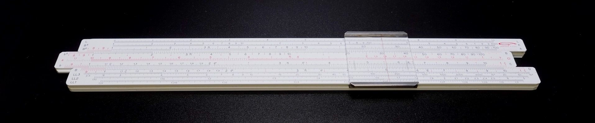

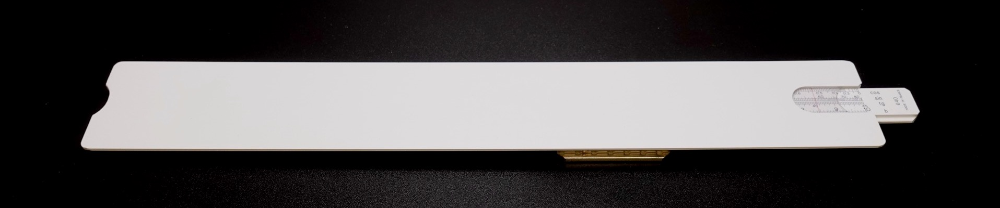

The Graphoplex 643 and the Graphoplex 640 were marketed as specialty electrical engineering slide rules. But I included them in this article, because they are excellent Darmstadt rules, too. I like them very much indeed. Yet, they are not my absolute favourite Darmstadt rules. Read on, to find out which one is my absolute favourite Darmstadt engineering slide rule.

#### Hemmi (JP)

***Hemmi 135 Pocket Advanced Darmstadt***—The Hemmi 135 pocket rule is a marvel: it is a miniature version of the Hemmi 130W, an advanced Darmstadt rule, except for the $LL_n$ scales on the backside of the slide. Whereas the Hemmi 130W has four $LL_n$ scales, the Hemmi 135 has only three, given its diminutive size. See the full description in the Hemmi 130W subsection, below.

***Hemmi 130W Advanced Darmstadt***—The Hemmi 130W is my absolute favourite Darmstadt rule. There, I said it. I would very much like to have owned this rule, when I was a young engineering student those many years ago. Like all Hemmi slide rules, it is made of bamboo, my favourite slide rule material. The $S$, $T$, and $P$ scales, along with the usual ones, are on the frontside. Traditional Darmstadt rules have only $LL_1$, $LL_2$, and $LL_3$ on the backside of the slide. But the Hemmi 130W has $LL_0$, $LL_1$, $LL_2$, and $LL_3$. This makes this slide rule one of the most powerful Darmstadt simplex rules, capabilities wise. The $L$ and the $LL_n$ scales are read through the cutouts at each end. The plastic cover of each cutout is inscribed with a thin red index line for reading the scales.

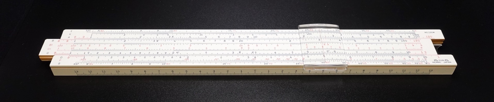

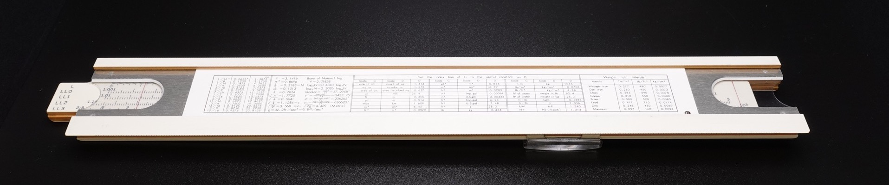

I adore Darmstadt rules. I said so, often. And the Hemmi 130W is my absolute favourite Darmstadt rule. Yet, I think Hemmi missed an opportunity with the way they used the real estate of the top and bottom edges of the frame. Typical of Hemmi simplex rules, this one is fairly thick. The top edge of the frame holds a vapid 27-cm ruler and the bottom edge holds an odd zero-centred 26-cm ruler with 13-cm linear scales sprinting out to each end. Hemmi should, instead, have inscribed more useful scales, like the $ST$ scale or the split $T_1$-$T_2$ scales, on the frame edges.

***Hemmi 153 Electrical Engineer***—The Hemmi 153 is a log-log vector duplex rule cherished by electrical power engineers. In terms of power, this slide rule is comparable to the more popular K&E 4083-3 described below in the K&E section. But the Hemmi 153 computes the hyperbolic functions in a rather unique and ingenious way, using the [Gudermannian function](https://en.wikipedia.org/wiki/Gudermannian_function): $gd(x) = sin^{-1}(tanh(x)) = tan^{-1}(sinh(x))$. The function $gd$ relates trigonometric functions with hyperbolic functions:

- $sin(gd(x)) = tanh(x)$
- $cos(gd(x)) = sech(x)$
- $tan(gd(x)) = sinh(x)$
- $cot(gd(x)) = csch(x)$
- $sec(gd(x)) = cosh(x)$
- $csc(gd(x)) = coth(x)$

The backside of the Hemmi 153 has the $\theta$ angle scale in the range $[0°, 90°]$, the $P$ scale for computing $sin$, and the $Q$ scale for computing $cos$. The frontside has the $T$ scale for computing $tan$ and the $G_\theta$ scale for computing $gd(x)$. Using the $G_\theta$ scale and the $P$, $Q$, and $T$ scales of the Hemmi 153, we can compute all the hyperbolic functions. The $G_\theta$ scale, thus, expands the power of the Hemmi 153 by using the real estate for just one extra scale. I am of the opinion that the Hemmi 153 is one of those rare inventions that attained the design ideal of pragmatic minimalism.

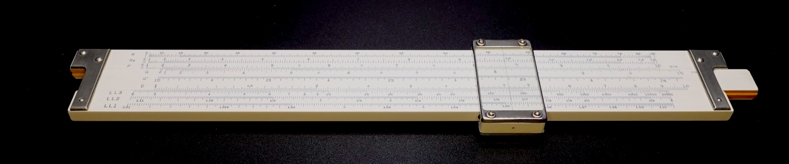

To compute $sin(30°)$, we manipulate the slide rule as follows:

- $\theta$—Place the hairline on the *argument* $30°$ on the $\theta$ scale.
- $P$—Read under the hairline the *result* $0.5$ on the $P$ scale. This computes $sin(30°) = 0.5$.

To compute $cos(60°)$, we manipulate the slide rule as follows:

- $\theta$—Place the hairline on the *argument* $60°$ on the $\theta$ scale.
- $Q$—Slide the left-hand $0$ on the $Q$ scale under the hairline.
- $P$—Place the hairline on the right-hand $1$ of the $P$ scale.
- $Q$—Read under the hairline the *result* $0.5$ on the $Q$ scale. This computes $cos(60°) = 0.5$.

Note the asymmetry between the $sin$ and $cos$ computation procedures, above. This is a consequence of the $P$ and $Q$ scales' dual-use design: they are used to compute Pythagorean, but they also double as the $sin$ and $cos$ scales.

Now, the cleverer bit: computing hyperbolic functions in the absence of hyperbolic scales. To compute $sinh(0.5)$ using the identity $tan(gd(x)) = sinh(x)$ mentioned above, we manipulate the slide rule as follows:

- $G_\theta$—Place the hairline on the *argument* $0.5$ on the $G_\theta$ scale. This computes $gd(0.5)$.
- $T$—Read under the hairline the *result* $0.521$ on the $T$ scale. This computes $sinh(0.5) = tan(gd(0.5)) = 0.521$.

To compute $tanh(0.5)$ using the identity $sin(gd(x)) = tanh(x)$ mentioned above, we manipulate the slide rule as follows:

- $G_\theta$—Place the hairline on the *argument* $0.5$ on the $G_\theta$ scale. This computes $gd(0.5)$.
- $P$—Read under the hairline the *result* $0.462$ on the $P$ scale. This computes $tanh(0.5) = sin(gd(0.5)) = 0.462$.

When using the $T$ scale on the Hemmi 153 where the angle $\theta$ scale goes all the way up to $90°$, it is important to recall that $tan(90°) = ∞$.

Like the FC 1/98, the Hemmi 153 is a specialty electrical engineering slide rule. But it would be a crime not to include the Hemmi 153 in this article, due to its innovative $G_\theta$ scale-based hyperbolic function computations.

***Hemmi 255D Expert Electrical Engineer***—As the name suggests the Hemmi 255D is a newer, more advanced electrical engineering log-log vector duplex rule than the Hemmi 153. But whereas the Hemmi 153 uses the ingenious, but unconventional, $G_\theta$ scale to compute the hyperbolic functions via the trigonometric functions, the Hemmi 255D employs the more conventional hyperbolic $Sh$ and $Th$ scales. In terms of power, the Hemmi 255D is comparable to the popular log-log vector rules, like K&E 4083-3 and Pickett N4-ES described below in their respective subsections.

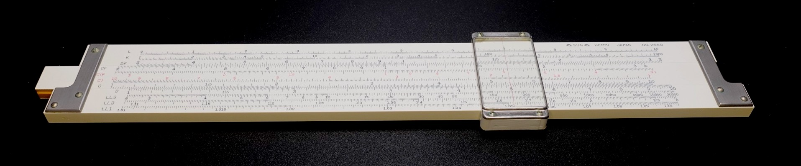

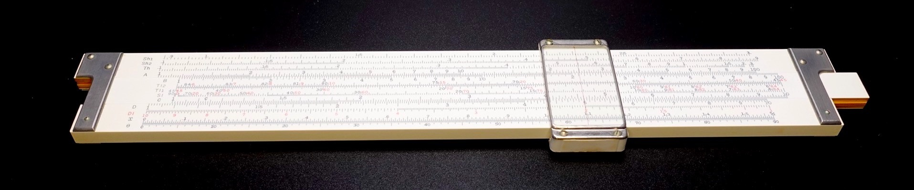

The Hemmi 255D is definitely a specialty electrical engineering rule. But it is also a general engineering vector slide rule, in the same category as the famous K&E 4083-3. So, I chose to include it in this article.

#### Keuffel & Esser (US)

***K&E 4181-1 Pocket Log Log Duplex Decitrig***—The K&E 4181-1 is a miniature version of the K&E 4081-3. But whereas the K&E 4081-3 is made of wood, the K&E 4181-1 is made of plastic. And unlike European plastics, the plastic of this slide rule feels cheap. See the full description in the K&E 4081-3 subsection, below.

***K&E 4081-3 Log Log Duplex Decitrig***—The K&E 4081-3 is the quintessential engineering slide rule. Its design is old and basic, but its implementation good and enduring. In a way, the K&E 4081-3 is the [Ford Model T](https://en.wikipedia.org/wiki/Ford_Model_T) of engineering slide rules. It does have a few usability quirks, such as the $LL_1$ and $LL_{01}$ being relegated to the backside. But such compromises are inevitable, given the compactness of this slide rule.

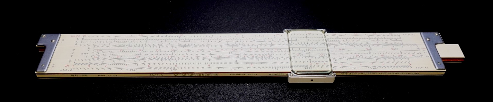

This slide rule was the most popular slide rule in America. Although it is a very good slide rule, the wood core is easily damaged, when mistreated. And because they were inexpensive, many owners abused them. As such, many K&E 4081-3 slide rules being sold on eBay are warped, and hence are useless. Good ones do pop up every so often; so, be patient. The same admonishment applies to all wood rules, especially the very old ones made in the early 20th century or before.

***K&E 68-1100 Deci-Lon 10***—The K&E 68-1100 is one of the last, and most refined, engineering slide rules from K&E, designed to compete with late model German slide rules: Aristo 0969, FC 2/83 N, and Nester 0292. And like other newer K&E rules, the K&E 68-1100 is made of plastic that is on the cheap side, compared to the European plastics. The odd feature of this slide rule is the asymmetric design: the lower frame is very narrow, the slide is quite wide, and the upper frame is unusually wide. The wide upper frame allows all four $LL_{0n}$ scales to fit on the frontside and on the backside all four $LL_n$ scales. This scale layout is much more convenient to use. But to those of us who are used to the common, symmetric design, the lopsided frame feels awkward when flipping. Many collectors admire this advanced engineering rule, but I am no fan of it.

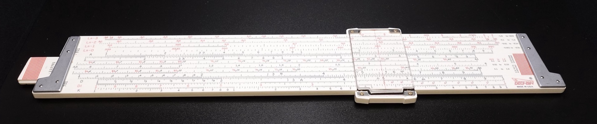

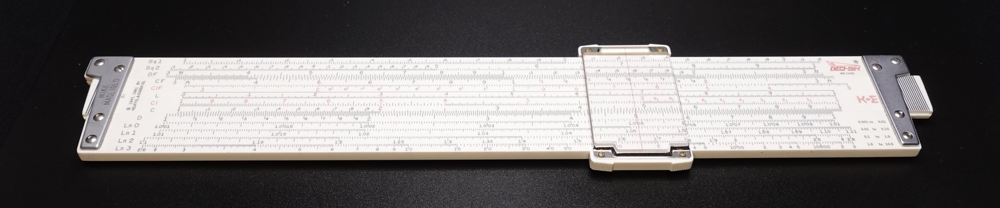

***K&E 4083-3 Log Log Duplex Vector***—The K&E 4083-3 was one of the earliest advanced engineering slide rules with hyperbolic sine $Sh$ and hyperbolic tangent $Th$ scales. These vector rules were popular with mechanical and civil engineers, who use it to compute the [catenary](https://en.wikipedia.org/wiki/Catenary) of chains (or, heavy-duty power transmission lines)—the sag that results when hanging a chain of a certain length from two equal-height posts.

The length and sag of a chain hung from two posts of equal height is expressed thus:

- $l = 2 \frac{H}{w} sinh(\frac{wb}{H})$
- $s = \frac{H}{w} [cosh(\frac{wb}{H}) - 1]$

Here, $l$ is the length of the chain, $s$ is the sag, $w$ is the weight per unit length, $H$ is the tension at the lowest point, and $2b$ is the distance between the two posts. By the way, the world-famous [Gateway Arch](https://en.wikipedia.org/wiki/Gateway_Arch) in St. Louis, MO, is a catenary arch, an inverted catenary curve.

Electrical power engineers (as opposed to electronic engineers) use hyperbolic functions to compute impedances (and hence, voltages and currents, by [Ohm's law](https://en.wikipedia.org/wiki/Ohm's_law)) on long-distant power transmission lines that stretch several hundred kilometres. Electrical engineers model the impedance of a long transmission line using the [$\pi$ model](http://www.egr.unlv.edu/~eebag/TRANSMISSION%20LINES.pdf), which represents the long cable as a series connection of short, individual segments, like a long chain made of small, individual links. Electrical power engineering deals with electric motors, transmission lines, etc., and much of the work in this discipline involves [vector calculus](https://en.wikipedia.org/wiki/Vector_calculus). The "vector" designation of the K&E 4083-3 might well trace its origin to electrical power engineers' obsession with vector calculus and hyperbolic slide rules.

Catenary of chain and impedance of power line can be computed using the $C$, $D$, $CI$, $DI$, and other arithmetic scales in combination with $Sh$ and $Th$ hyperbolic scales on a vector slide rule, like those on the backside of the K&E 4083-3.

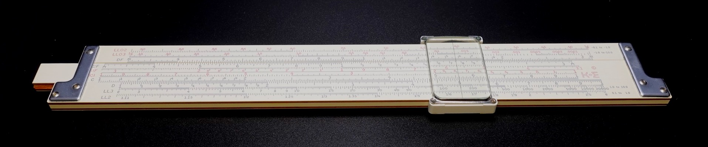

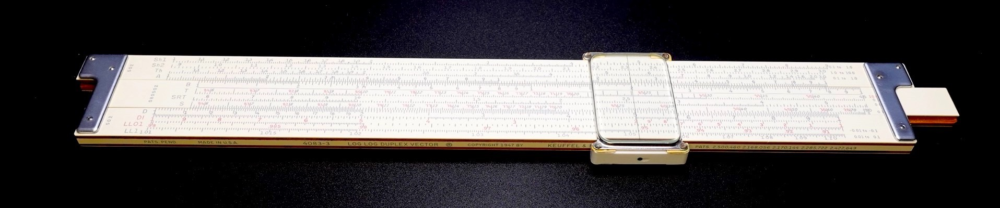

However, since [hyperbolic functions](https://en.wikipedia.org/wiki/Hyperbolic_functions) are related to exponential functions, an ordinary log-log duplex slide rule, like the K&E 4081-3, can compute hyperbolic functions using the following equations and the $LL$ scales, albeit rather tediously:

- $sinh(x) = \frac{e^x - e^{-x}}{2}$
- $cosh(x) = \frac{e^x + e^{-x}}{2}$
- $tanh(x) = \frac{sinh(x)}{cosh(x)} = \frac{e^{2x}-1}{e^{2x}+1}$
- $coth(x) = \frac{cosh(x)}{sinh(x)}$
- $sech(x) = \frac{1}{cosh(x)}$
- $csch(x) = \frac{1}{sinh(x)}$

In the plot below, the blue curve is $sinh$, the green is $cosh$, and the red is $tanh$.

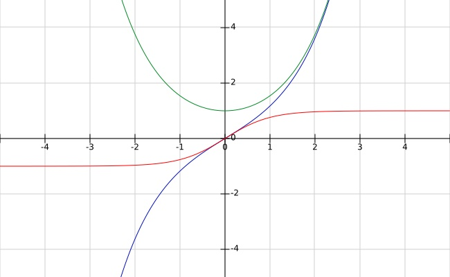

#### Logarex (CZ)

***Logarex 27403-X Darmstadt***—The Logarax 27403-X is a late model, simplex Darmstadt with traditional Darmstadt scales on the frontside, and three $LL_n$ scales on the backside of the slide. But whereas a traditional Darmstadt rule has a closed backside and cutouts at each end for reading the $LL_n$ scales, the backside of the Logarax 27403-X is open like a duplex rule and there are no cutouts with red indices. The black indices at each end of the frame permit reading only the $LL_1$ and $LL_3$ scales. But there is no way to read the $LL_2$ scale in the middle of the slide. The only way to use the $LL_n$ scales effectively is to flip the slide round to the front.

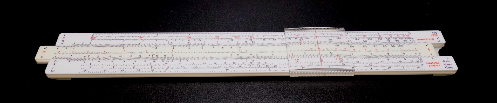

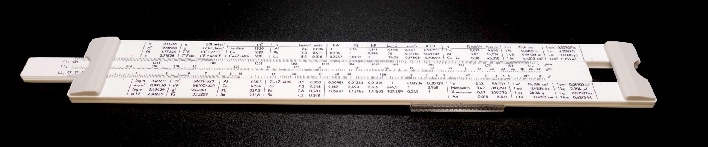

The need to flip the slide is a common trait of older Mannheim and Darmstadt rules. But it amounts to a design blunder on a modern duplex rule like the Logarex 27403-X.

#### Nestler (DE)

***Nestler 23 R/3 Rietz***—The Nestler 23 R was favoured by very illustrious scientists and engineers, including [Albert Einstein](https://en.wikipedia.org/wiki/Albert_Einstein), [Wernher von Braun](https://en.wikipedia.org/wiki/Wernher_von_Braun), and [Sergei Korolev](https://en.wikipedia.org/wiki/Sergei_Korolev). It is a typical Rietz rule, with a typical Rietz scale layout. Perhaps it was this simplicity that attracted these greatest scientific minds of the 20th century.

Despite the fact that the Nestler 23 R is well loved, there is something subversively quirky about this slide rule. Being of the classic German simplex design, this slide rule is thick enough to have space on the top and bottom edges of the frame for additional scales. The Nestler 23 R has a 27-cm ruler scale on the top edge of the frame and the bottom edge of the frame is either blank or has a $1:25$ scale. The $1:25$ scale is $27.2$ cm in length, and is divided linearly into $7$ major divisions. I do not know the purpose of this quirky scale.

***Nestler 0210 Darmstadt***—Of the Nestler slide rules I own, the Nestler 0210 is my favourite. This slide rule is minimalistic, but powerful. The backside of the slide has the $LL_n$ scale typical of Darmstadt rules. And given its classic German simplex proportions, the thick edges sport more useful rules. The top edge of the frame holds the 27-cm ruler scale and the $L$ scale. The bottom edge of the frame holds the $S$ and $T$ scales. This design is practical, logical, and compact.

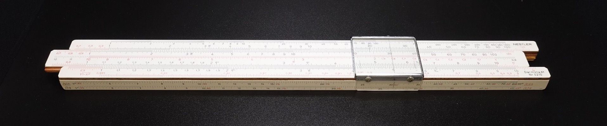

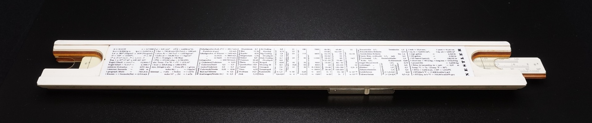

***Nestler 0292 Multimath-Duplex***—I like the appearance of Nestler slide rules for their understated elegance and subtle power. Being a late model advanced log-log duplex engineering rule, the Nestler 0292 possesses the same computing power as those top-of-the-line models from other manufacturers: Aristo 0969, FC 2/83 N, K&E 68-1100, Pickett N3-ES, et al. In my view, the Nester 0292 beats them all in both usability and beauty. No offence intended to those who admire the FC 2/83 N's looks; indeed, I like that slide rule very well, only not as much as I like the Nestler 0292. Whereas the FC 2/83 N shouts out its power, the Nestler 0292 expresses its power, quietly. It is appreciably slimmer than the FC 2/83 N, so it feels more comfortable in the hand, especially for those of us who grew up on smaller rules, like the Aristo 0968. And it employs only one colour, the pale green background, which covers both sides of the slide. I am of the opinion that the Nestler 0292 is an embodiment of engineering philosophy: elegant simplicity, effortless efficiency, quiet power.

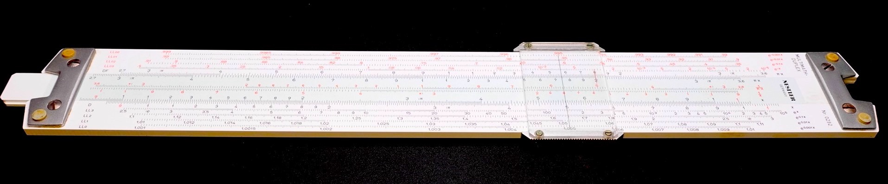

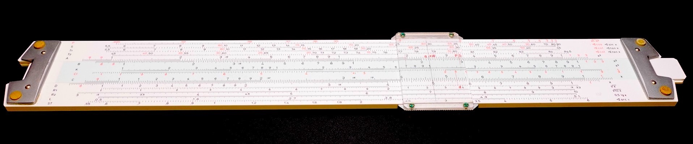

#### Pickett & Eckel (US)

***Pickett N3-ES Power Log Exponential***—The Pickett N3-ES is a late model log-log duplex engineering slide rule. Like its competitors, it has eight $LL$ scales. Pickett cleverly stacked the $LL_n$ and $LL_{0n}$ scales on the same line—$LL_0$ is paired with $LL_{00}$, $LL_1$ with $LL_{01}$, and so on—thus yielding a more logical, and space-saving, scale layout. But it could be argued that stacked scales are more difficult to read. To each his own.

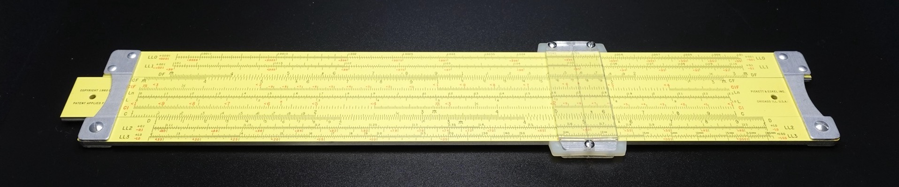

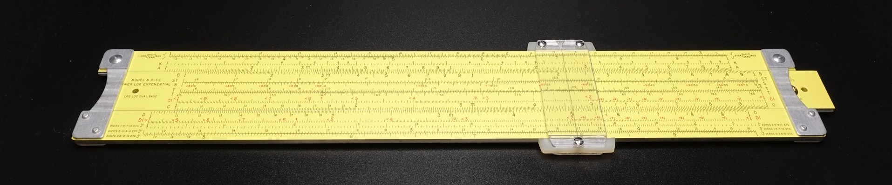

I quite like this stacked scale layout. But I cannot countenance the economy feel and the impertinent colour of this slide rule. And it is significantly wider and weightier, compared to the late model German log-log duplex rules. So, the Pickett N3-ES is cumbersome and cheap, but reliable and stout.

***Pickett N4-ES Vector Log Log Dual-Based Speed Rule***—The Pickett N4-ES is the vectorised version of the Pickett N3-ES. As such, the Pickett N4-ES adds the hyperbolic $Sh$ and $Th$ scales. It is peculiar, though, that this slide rule labels its $LL$ scales from $LL_1$-$LL_{01}$ to $LL_4$-$LL_{04}$, instead of employing the more conventional scheme, which goes from $LL_0$-$LL_{00}$ to $LL_3$-$LL_{03}$. I dislike this slide rule, too.

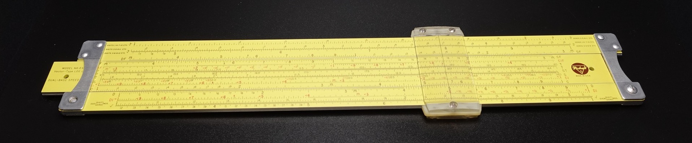

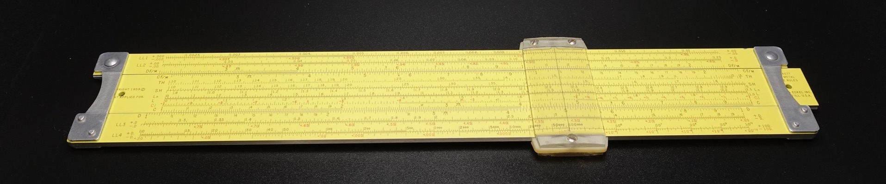

#### Frederick Post (US)

***Post 1447 Mannheim***—The Post 1447 was an honest slide rule fit for innocent high schoolers. It is of the traditional Mannheim simplex design. It has the usual $C$, $D$, $A$, $B$, $S$, $L$, and $T$ scales on the frontside. The $S$, $L$, and $T$ scales are on the backside of the slide, which are read through the cutouts on the backside of the frame.

In my youth, fortunate middle schoolers and high schoolers learned to use the slide rule on a superb Mannheim rule, like the Post 1447. The cursed, though, had to settle for something vapid, like the [Sterling Acumath 400](https://www.sliderulemuseum.com/Acumath/Acu-Math_No400_PlainEdgeStock_OneSidedCursor_GiftOfWilliamMulroy.jpg).

***Post 1461 Pocket Versalog II***—The Post 1461 is a miniature version of the Post 1460. See the full description in the Post 1460 subsection, below.

***Post 1460 Versalog II***—The Post 1460 is a direct competitor, albeit more refined, to the K&E 4081-3 standard log-log duplex engineering slide rule. But in my view, the Post 1460 is superior, in terms of appearance, feel, durability, and usability. The Versalog II has a green $cos$ scale, but the original Versalog has a dark blue $cos$ scale.

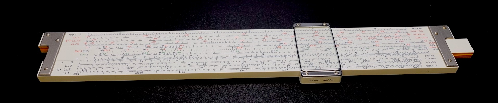

#### Reiss (DE)

***Reiss Darmstadt***—This slide rule is a traditional Darmstadt rule, but it is made of aluminium. In terms of quality, this slide rule is as good as any European model, and is much better made than the Pickett aluminium rules. Being much slimmer than Pickett N3-ES, the Reiss Darmstadt rule is easier to handle. Still, I dislike its cold, sharp construction.

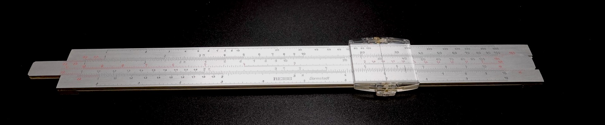

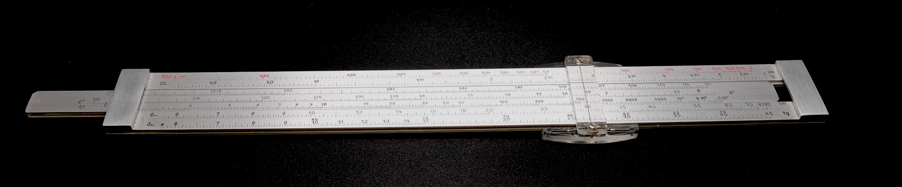

***Reiss 3214 Darmstadt Record***—The Reiss 3214 feels as solid and smooth as other European late model rules. It is a late model advanced Darmstadt rule. But its duplex design breaks with tradition. The backside of the Reiss 3214 has three $LL_n$ scales, but being a Darmstadt rule, it has no $LL_{0n}$ scales. And in keeping with the Darmstadt tradition, the frame is not adjustable.

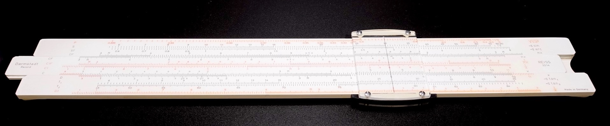

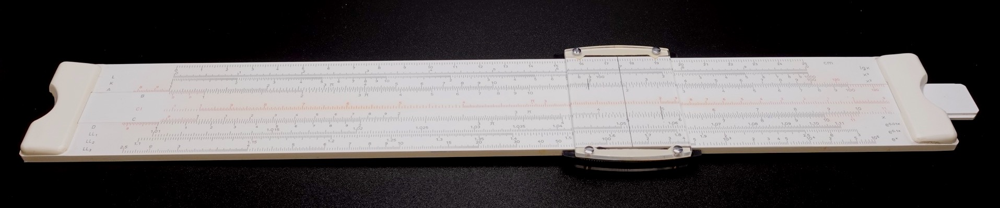

## *circular rules*

#### Breitling (CH)

***Breitling Montbrillant Datora***—The Breitling Montbrillant Datora is a member of the Navitimer family of pilots' watches. The $C$ scale is engraved on the rotating bezel and the $D$ scale on the watch face. The watch face also has indices for kph to mph conversion and nautical mile to statute mile conversion. In keeping with the Navitimer tradition, this watch incorporates the chronograph function. And it adds the 24-hour sub-dial, and a complete calendar with day, date, and month indicators. The label "Datora" refers to this complete-calendar feature. And the label "Montbrillant" was a [historical designation](https://www.breitling.com/gb-en/history/part-3) Breitling applied to some of their watch dials in the early 1920s.

#### Concise (JP)

***Concise Model 300***—The Concise 300 is a low-cost, compact, duplex circular rule. It uses pared-down Darmstadt scales, providing only $LL_2$ and $LL_3$. But it provides two $tan$ scales, $T_1$ and $T_2$. In terms of computing power, this slide rule is almost as capable as the Nestler 0210. The Concise 300 is held with the $1$ index mark pointing up, and is flipped left-to-right. For its price, this is a decent slide rule. But it does not stack up well against other Japanese-made slide rules, in terms of workmanship.

I purchased this Concise Model 300, new, straight from the Concise [online store](https://www.sliderule.tokyo/products/detail.php?product_id=8), several years ago. The quality of this new slide rule seems lower than the older ones I have seen, back in the day.

#### Dempster (US)

***Dempster RotaRule Model AA***—The Dempster RotaRule is undoubtedly the most desirable log-log duplex engineering circular rule. It was designed and manufactured by an engineer for use in engineering. The phrase "engineering circular rule" is an oxymoron, given that circular slide rules were a favourite of businessmen and most engineers disliked circular rules. But the Dempster RotaRule is a different kind of circular rule. In addition to the usual assortment of scales, it has the scales that engineers need: the trigonometric scales, the four $LL_n$ scales, and the Pythagorean $\sqrt{x^2 + y^2}$ scale. At about 13 cm in diameter, this slide rule is about the same size as the simplex FC 8/10. But unlike the FC 8/10's 25-cm circular scale, the RotaRule has a 127-cm spiral $C$ and $D$ scales plus a 254-cm quadruple-cycle $LL$ scale. And it even has a surveyor's $Stadia$ scale and a financier's $Monthly\ Interest$ scale, making it suitable to both technical and business uses. Because the outer portion of the disc (analogue of straight rule's frame) is fixed and the inner portion (analogue of straight rule's slide) rotates, the RotaRule needs only one cursor. And this cursor is well made to the point of being over engineered: it has a sturdy frame equipped with a friction lock, and its central hub has hole to plant a small, brass-framed magnifier that comes with the device. Somewhat unusually, the Dempster RotaRule places the trigonometric scales on the frontside. This slide rule is held with the $1$ index mark pointing down, and is flipped left-to-right. The all-important $LL_n$ scales are on the backside.

The Dempster RotaRule inspired the [Boykin RotaRule Model 510](https://www.sliderulemuseum.com/Circular/Boykin_RotaRule_Model510.jpg), which was a proper engineering slide rule, with three $LL_n$ scales and three $LL_{0n}$ scales, comparable in capabilities to a typical log-log duplex engineering straight rule, like the K&E 4081-3, only much smaller and with far greater precision . Incidentally, [Bernard Boykin](http://www.oughtred.org/memoriam/memoriam.shtml), the designer of the fabulous Boykin circular slide rule, was my fellow engineer and a fellow Marylander, to boot. Alas, I do not own a Boykin circular rule, given its rarity.

#### Faber-Castell (DE)

***FC 8/10***—As an engineering student in the early 1980s in Burma, I used the FC 8/10 circular slide rule, shown below, which was a hand-me-down from my engineer aunt. The FC 8/10 is a simplex circular rule. It uses aesthetically pleasing pale yellow and pale green backgrounds for some of the scales. I consider this slide rule one of the prettiest of all engineering tools. I liked the FC 8/10, not only for its beauty, but also because it was well made, accurate, inexpensive, unique, and compact. All the scales are engraved onto the exposed plastic face. The outer portion of the face is fixed to the body, and the rotatable inner portion of the face is operated using both thumbs, pushing against each other. And the cursor with the hairline rotates across the face over the scales.

As an engineering student, I used the FC 8/10 for ordinary, daily tasks. But when I needed the $LL$ scales, say for laboratory work and examinations, I used the Aristo 0968 log-log duplex. In general, hopping about the different slide rules is considered detrimental, since it robs one the opportunity to develop an intimate relation with a single device. But the FC 8/10 is a unique circular rule: it is just a straight rule in a circular guise. Despite being circular in shape, it operates on the same principles as the Rietz straight rule: the outer portion of the FC 8/10 is analogous to the frame of the straight rule, and the inner portion is analogous to the slide of the straight rule. And the circular shape of the device physically and visually highlights the wrap-around nature of the logarithmic scales. So, my flip-flopping between the FC 8/10 and the 0968 did not impact me, negatively.

#### Fowler (UK)

***Fowler's Universal Calculator***—At about 8.5 cm in diameter, the Fowler's Universal Calculator is perfectly sized for the hand. Etched into the glass cover is the fixed red hairline, aligned to the crown at 12 o'clock. Turning this crown clockwise rotates the face anticlockwise, and turning it anticlockwise rotates the face clockwise. That seems weird at first sight, but it becomes natural, with use. All the scales are etched onto this one-piece, rotating face. And turning the crown at 2 o'clock clockwise rotates the clear plastic cursor bearing the black hairline clockwise, and turning it anticlockwise rotates the cursor anticlockwise. The second crown behaves more naturally. But it is odd that this slide rule has no $x^2$ $A$ and $B$ scales, yet it has a very long, triple-cycle $\sqrt[3]{x}$ scale. Business logic, as they say.

#### Gilson (US)

***Gilson Binary***—The Gilson Binary is a cheaply-made, large, thin, aluminium disc of nearly 22 cm in diameter. Given its immense size, it is capable of very high precision calculations. And its two-arm cursor mechanism is quite clever. The frontside has $C$, $CI$, $A$, $K$, $L$, $LL_0$, $LL_1$, $LL_2$, $LL_3$, fraction multiplication and division scale, and millimetre to fractional inch conversion scale pair. Engineers round the world have always deemed fractions to be annoyances, like a piece of food stuck between the teeth. But to American engineers of yore, fractions were their bread-and-butter. Thankfully, fractions are no longer a thing in American engineering today, although they still dominate factory floors, as do the Imperial measurement system—depressing, really. The $C$ scale is over 60 cm in length. The range of the entire clockwise, quadruple-cycle $LL_n$ scale is an impressive $[1.0015, 10^6]$. The tan-colour face is punctuated with bright yellow scale background rings: the $LL_0$ has tan background, $LL_1$ has yellow background, etc. This somewhat eases the daunting task of chasing the mammoth $LL$ scale round the large face. The front face has two clear plastic cursors, one longer than the other. When the long cursor is moved, the short cursor also moves in lock step. But the short cursor can be moved independently of the long cursor. Suffice it to say the Gilson Binary's design is unique. Without the aid of a manual, even experienced straight rule users would be hard pressed to figure out how properly to use it. But once its quirks have been discovered, it is just as simple to use as a straight rule.

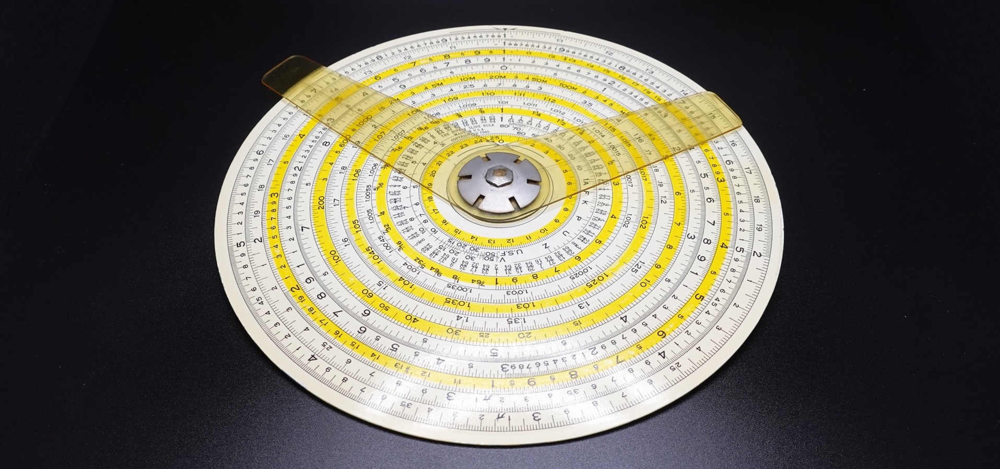

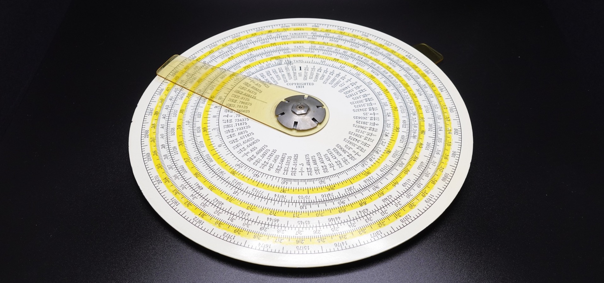

Ordinarily, computations begin with setting the long cursor hairline on the $1$ on the $C$ scale, and end with reading under the short cursor hairline on the appropriate scale. The short cursor is analogous to the slide of a straight rule. To compute $2 × 3$, we manipulate the slide rule as follows:

- $C$—Place the long cursor hairline on the $1$ on the $C$ scale. This reset the slide rule.
- $C$—Place the short cursor hairline on the *multiplicand* $2$ on the $C$ scale.
- $C$—Move the long cursor and place its hairline on the *multiplier* $3$ on the $C$ scale. This drags the short cursor along.
- $C$—Read under the short cursor hairline the *product* $6$ on the $C$ scale. This computes $2 × 3 = 6$.

To compute $1.03^{2.4}$, we manipulate the slide rule as follows:

- $C$—Place the long cursor hairline on the $1$ on the $C$ scale. This reset the slide rule.
- $LL_1$—Place the short cursor hairline on the *base* $1.03$ on the $LL_1$ scale.
- $C$—Move the long cursor and place its hairline on the *exponent* $2.4$ on the $C$ scale. This drags the short cursor along.
- $LL_1$—Read under the short hairline the *result* $1.0735$ on the $LL_1$ scale. This computes $1.03^{2.4} = 1.0735$.

The Gilson Binary is held with the $1$ index mark pointing up, and is flipped left-to-right. The unusual design elements continue on the back face. For instance, unlike a typical slide rule, the Gilson Binary has two opposing $Degree$ scales, one running clockwise and the other anticlockwise. The degree scales are split into three cycles, each 30° wide. Stacked atop the degree scales are the clockwise, triple-cycle $T$ scales. The $Degree$-$T$ scale pair is interlaced with the clockwise, triple-cycle $S$ scales. And note that since the $Degree$ scale's range is $[0°, 90°]$, one must use care to avoid reading a nonsensical value like $tan(90°)$.

American slide rule manufacturers, like most American engineers of that era, had a hostile attitude toward users in particular and usability in general, mistakenly believing that clever, trained persons—like they—should be able to cope with complexity. This attitude is prominently on display in the design of the Gilson Binary. This slide rule would be far more pleasant to use, had pale green and pale blue colours, like those on the FC 8/10 and the FC 2/83 N, been used, instead of the hypnotic yellow rings. Yes, it is unfair to compare the 1930s Gilson with the 1970s Faber-Castell. But it is eminently fair to compare the American Gilson to its German contemporaries, like the FC 1/54 and the Nestler 23 R. There, too, the Gilson design falls woefully short, in terms of aesthetics and usability.

#### Kontrolpribor (RU)

***Kontrolpribor Model KL-1***—The Kontrolpribor KL-1 is a pocket watch type duplex circular rule. It is about the size of a wristwatch. The faces are covered with cheap plastic. Because the plastic covers are domed, they are prone to scratching. The black-dotted crown at 12 o'clock rotates the face and the red-dotted one at 2 o'clock rotates the needle. The frontside has 15-cm long $C$ and $A$ scales. The backside has circular $C$ and $S$ scales and a spiral $T$ scale. This slide rule is comparable in computing power to a pocket Mannheim straight rule. The Kontrolpribor KL-1 is held with the black-dotted crown pointing up, and is flipped left-to-right. The backside has the $C$ scale, the circular $S [5.5°, 90°]$ scale, and the spiral $T [1°, 45°]$ scale. This scale layout is quite unique.

Compared to the Fowler's Universal Calculator, this slide rule is but a cheap toy. Yet, it is more powerful than the Breitling Navitimer.

#### Loga (CH)

***Loga 30 Tt***—The Swiss craftsmanship is apparent in the Loga 30 Tt: accurate, sturdy, beautiful. Being a Darmstadt-equivalent model, it is one of the more powerful circular rules. Like other high-end circular rules, the outer portion of the front face is fixed to the frame and the inner portion rotates. The frontside cursor bisects the front face that holds double-cycle, stacked $\sqrt{x}$ scale and the usual Darmstadt scales. The $\sqrt{x}$ scale is the inverse of the $x^2$ scales ordinarily labelled $A$ and $B$. On this slide rule, though, the $C$ and $D$ scales are confusingly labelled $A$ and $B$. Another quirk of the Loga 30 Tt is that it is intended to be flipped by holding it between right thumb and forefinger at 3 o'clock. If it were flipped left-to-right, the $1$ index mark would point to the right instead of straight up. The entire back face is fixed to the frame, and holds the $S$, $T$, $ST$, and the three $LL_n$ scales. The end of the backside cursor protrudes beyond the disc. The clever bit is that the back cursor is attached to the inner rotating portion on the front face, and the cursor's protruding end serves as the handle that rotates the inner front face. A small, rotatable, black disc is mounted to the backside hub. This disc is meant to be used as the handle, when computing with the frontside scales. In terms of capability and quality, the Loga 30 Tt is on par with high-end Darmstadt straight rules, like BRL D.26, FC 1/54, and Nestler 0210.

#### Pickett & Eckel (US)

***Pickett 101-C Dial Rule***—The Pickett 101-C is a low-end circular rule. The body is a cheap, thin aluminium disc. Being a rather small disc, there are only two $LL_n$ scales, but the ranges are unusual: $LL_1 ∈ [1.15, 4.0]$ and $LL_2 ∈ [4, 10^6]$. And like other low-end, American circular rules of that era, this slide rule has the fraction scale. Indeed, the Pickett 101-C is essentially a miniature version of the Gilson Binary, but with only two $LL_n$ scales. This slide rule is held with the $1$ index mark pointing up, and is flipped bottom-to-top, like a standard straight rule.

***Pickett 111-ES***—I am no fan of Pickett slide rules, but I like the Pickett 111-ES. Unlike other Pickett rules, which are made in America, the Pickett 111-ES is made in Japan. And although it has an aluminium core, the metal edges are rounded off and the faces are covered in high-quality Japanese plastic. It is a pleasant rule to use. The Pickett 111-ES is held with the $1$ index mark pointing down, and flipped left-to-right. This slide rule is a log-log duplex advanced engineering circular rule with eight $LL$ scales, a rarity among circular rules. It employs Pickett's stacked layout for the $LL$ scales. But whereas the Pickett N3-ES stacks $LL_n$ and $LL_{0n}$ on the same line, the Pickett 111-ES stacks $LL_0$-$LL_1$ and $LL_2$-$LL_3$ on the frontside, and $LL_{00}$-$LL_{01}$ and $LL_{02}$-$LL_{03}$ on the backside. The backside also holds a double-cycle $S$ scale, a triple-cycle $T$ scale, and a single-cycle $ST$ scale.

The capabilities of the Pickett 111-ES stack up well against top-of-the-line engineering straight rules, like Aristo 0969, FC 2/83 N, Nestler 0292, K&E 68-1100, Pickett N3-ES, etc. And similar to other high-end circular rules, like the Dempster RotaRule, the outer portion is fixed, the inner portion rotates, and the duplex cursor is firm but glides smoothly.

## *cylindrical rules*

#### Otis King (UK)

***Otis King Model K***—Otis King cylindrical slide rules use helical scales. The Model K is unusual in that it uses a double-cycle $C$ scale, thus, can perform chained calculations without the need to reset the cursor, as is necessary with the Model L, described below, which has a normal, single-cycle $C$ scale. But the Model K is limited, capability wise; it could compute only $×$ and $÷$.

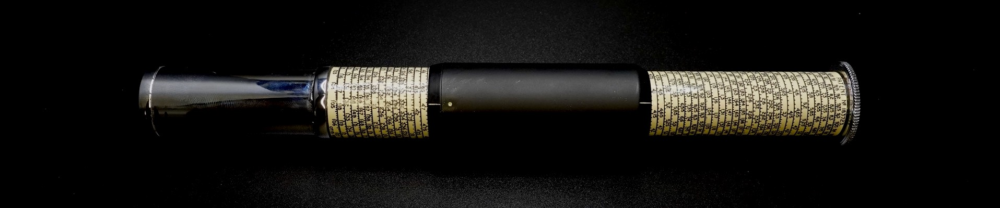

To use the Model K, one holds the chrome handle in one hand and with the free hand pulls out the top, thereby exposing the helical logarithmic scales. The black cylinder in the middle, which is operated with the free hand, is the equivalent of the straight rule's cursor. It is engraved with two white index marks that are aligned to each other. These indices are equivalent of the cursor's hairline. The upper cylinder, which holds the $C$ scale can shift up and down along the longitudinal axis, and it can also spin about that axis independently of the fixed $D$ scale on the lower cylinder. The back-facing numbers on the $D$ scale can be brought into view by spinning the chrome handle. And the black cylinder can shift and spin independently of both scales. So, the Model K's fixed lower cylinder is equivalent to the frame of the straight rule and the movable upper cylinder is equivalent to the slide of the straight rule.

***Otis King Model L***—The Model L is identical in construction and in operation to the Model K, and these two models have a $D$ scale that is almost the same length. But the Model L's upper cylinder is occupied by the single-cycle $C$ scale and the $L$ scale. As such, the Model L could compute $×$, $÷$, $log$, and $log^{-1}$.

# CONCLUSION

I have endeavoured to give a thorough enough explanation in this article on how the slide rule works, how it was used, and how it came to be. But this article will not make the reader an expert user of an advanced engineering slide rule; that is the domain of the user's manuals. I have also emphasised the necessity of engaging the mind, when using a slide rule. And I have demonstrated the extent to which some very simple mathematical functions, like $log$, $ln$, $sin$, $tan$, etc., were put to use to solve substantial problems in engineering.

Ingenuity is the ability to make useful things inexpensively on a massive scale by composing simple, but innovative, ideas in reliable, repeatable ways. And that is what engineering is. The slide rule, both as a tool for engineering and as a product of engineering, epitomised this philosophy in its day. The slide rule was born when necessity and ingenuity coincided at a crucial point in history, and it accelerated the technological development of humanity. Over its almost four-century reign, it enabled us to cross the oceans, it empowered us to span the continents, it took us to the Moon. The slide rules deserves remembrance, respect, reverence.

# RESOURCES

## *books*

- *[An Easy Introduction to the Slide Rule](https://archive.org/details/easyintroduction00isaa)*, Asimov
  - Everyone knows Isaac Asimov for his incisive science fiction novels, like *I, Robot*. But he also wrote numerous non-fiction works. This booklet is a concise, down-to-earth explanation of how the Mannheim slide rule works and how to use it well. It was written for high school students of the day.
- *[The Slide Rule](https://archive.org/details/sliderule00john)*, Johnson
  - To my knowledge, this book is the best slide rule instructional book for engineers. The explanations of the $LL$ scales given in this book are particularly lucid. The author was a well-known engineering professor. Although it applies to all engineering slide rules, the K&E 4081-3 is used for examples and photographs. I did the same in this article, so as to make it easy for the interested readers to progress to Johnson's book.
- *[K&E Log Log Duplex Decitrig Slide Rule No. 4081 Manual](http://sliderule.ozmanor.com/man/man024-ke4081-02.html)*, Kells
  - The author was mathematics professor, and he wrote this manual for K&E. It is a definitive manual for the K&E 4081-3. Although the K&E 4081-3 does not have hyperbolic scales, this manual shows how to use the $LL$ scales to compute $sinh$, $cosh$, and $tanh$.

## *sites*

- [The Oughtred Society](http://oughtred.org/)
  - This is the most comprehensive web site on slide rules. It was created by those who used the slide rule professionally, back in the day. They are an active, international lot. They have annual meetings. They publish detailed, insightful articles, both for beginners and for experts. They also have a [guide on collecting slide rules](http://www.oughtred.org/books/BeginnersGuideToCollectingSlideRules131022.pdf).
- [International Slide Rule Museum](https://sliderulemuseum.com/SRM_Home.htm)
  - This site is a virtual museum of slide rules. There are very few slide rules, if any at all, that are absent from its collection. Every slide rule in the collection has a set of high-resolution photographs and interesting details such as the donor's name, date of purchase, professional uses, etc.
- [SlideRules.org](https://www.sliderules.org)
  - This site has slide rule simulator web applications for many popular models. The feature of the simulators that is especially useful to novices is the cursor's ability to show the exact scale values under the hairline.
- [K&E Slide Rule Manuals](http://mccoys-kecatalogs.com/KEManuals/manuals.htm)
  - This site has a long list of K&E slide rule manuals in PDF format.
- [Eric's Slide Rule Site](https://www.sliderule.ca/)
  - This is the site run by an individual collector, so the collection is not as expansive as that of a museum. But it does have a decent background information on the slide rules that are in the collection.
- [Tina's Slide Rule Books and other Good Stuff](http://tinas-sliderules.me.uk/)
  - This is another collector's site. But this site covers other classic engineering tools, including drafting and scientific mechanical instruments. And it has a decent collection of manuals in PDF format.
- [eBay](https://www.ebay.com/sch/i.html?_from=R40&_trksid=p2380057.m570.l2632&_nkw=slide+rules&_sacat=412)
  - There are loads of sites that cater to slide rule collectors. But these services tend to trade in the high-priced, collectors' market. If you want to buy an affordable slide rule that you can play around with, explore the American, British, French, German, and Japanese eBay sites. Remember, do not chase rarities and do not engage in a bidding war with traders; that way lie headaches and heartbreaks.
