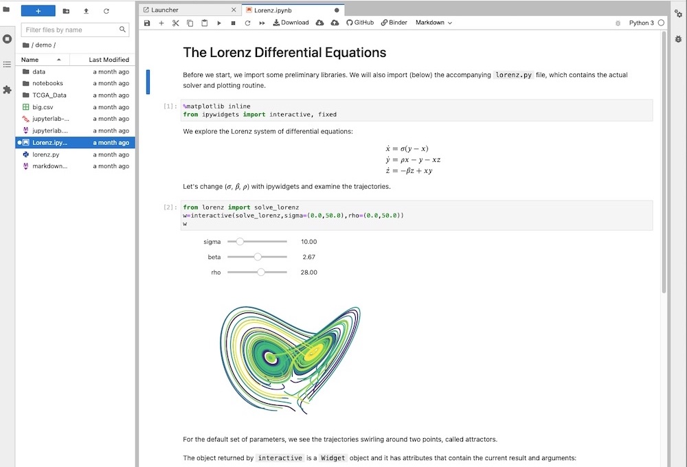

# INTRODUCTION

This is a guide to STEM writing for high school and undergraduate students. Writing anything longer than a few sentences requires planning and aforethought. Thinking requires knowledge, and this knowledge is acquired through reading—lots of it. Indeed, reading and writing cannot be separated: the more you read, the better will your foundational knowledge required for writing become and also the more refined will your writing style become. And the more you write, the more you will need to read and the deeper will your understanding of the subject become. So, reading-writing is a virtuous cycle—the more you do, the better you become. Read on.

# READING PROCESS

The process of reading in STEM is given a fancy name: research. Research does not mean searching again that which is already known. It means studying intensively the known material with an express purpose of exploring into the unknown beyond, thereby expanding the boundaries of knowledge in a particular field. To conduct research is to investigate a topic, systematically. The topic must have a clearly defined problem statement in the form of a question, and this question must be phrased in such as way as to be capable of being answered by experiment, observation, analysis, proof, or a combination thereof. All learned folk—historians, philosophers, doctors, lawyers, engineers, scientists—perform research daily in their work lives. That is, research is nothing extraordinary; it is but a workaday tool an intellectual uses. But it is an indispensable tool, nonetheless.

To be able to expand the boundaries of knowledge in a field, one must first discover where the boundaries lie. That means to study every major discovery made in that field, stretching back to the foundation of that field. That is a very tall order, indeed. So, most research is narrowly focus, by necessity. Scientific research methods are taught to all undergraduates. Upon graduation, some of them choose to further their studies in graduate schools. In the first year or two of schooling, the graduate student focuses on amassing as much background knowledge as possible in the chosen field. Typically, about half way through graduate school is when the real research work begins, guided by the graduate advisor. I cannot describe in a short article all the details of that which takes a person several years to accomplish—obtaining a PhD. So my goal here is necessarily modest: I wish only to explain the basic research tools and techniques that can profitably be used by high schoolers and undergraduate college students. At these levels, to conduct a research usually means to search and learn what has already been discovered, and write a brief term paper or repeat a well known experiment. It maybe mundane, but this process provides the fundamental skills to become a STEM researcher. So, treat it with due regard.

In my day, we always began a research project with a visit to the library. But today, the first thing a high schooler or an undergraduate would do is to visit Google and Wikipedia. If you do the same, that is all very well, so long as you recognise that not everything you find on the internet is free of errors. I am including my own articles in this category. I try my best to be accurate when I communicate, but I am not immune to errors. So, what is a poor student to do? Well, he should employ a *multi-pass reading* approach: scoping, skimming, and seeking.

## *high school and college*

If you are a high schooler or an undergraduate, the starting point for your research is your assigned textbook. For a class assignment, you ordinarily need not go further than a chapter in that textbook. So, this subsection is essentially a "how to read a textbook". And you should start exploring the textbook during the summer, before classes begin. Do not wait until classes begin to pick up the textbook. You apply the following scope-skim-seek cycle, when reading a textbook.

***scoping***—Every time you pick up a new textbook, you should scope it out. And you should scope out a new textbook long before the first class.

Start by reading the front and back covers. Just from the covers, you learn quite a bit about the author's background, his motivations, and what his peers think of him. Next, you read the forward, which is a glowing assessment of the textbook written by a luminary in the field, and the preface, which is the author's own overview of the textbook. Established textbooks that have been around for decades will have multiple prefaces, one per edition. By reading the forward and the preface, you get a better sense of this textbook's place in the pantheon of textbooks within the subject area.

Then, you look at the table of contents—look, not read. Your goal at this point is to pick up a few key terms and how they are structured: which terms are chapter-level, which are section-level, and which are sub-section-level. Next, you look at the appendices. There are two types of appendix: a review of assumed knowledge that the author deems to be crucial to the understanding of the textbook, and an exposition of useful details that are slightly outside of the scope of the textbook. So, make a mental note of both the assumed knowledge and the extra information. For a good measure, look at the index. The extent to which the index is prepared is a clear indicator of how well this textbook was written, edited, and published. Finally, quickly flip through the pages of the textbook, looking at its visual presentations, chapter and section titles, etc.

Most teachers publish the class's syllabus in advance, long before the first day of the class. Compare the syllabus to the textbook's table of contents, and note which chapters are excluded, either because they are too basic, too advanced, or too far afield from the theme of the class.

This is the scoping pass. It should take no more than 5 minutes. You will be pleasantly surprised how much information you can glean from just a few minutes of handling an unfamiliar book. If you are hunting for books at a bookstore, this is when you decide whether to buy this book or to slot it back on the shelf.

Once you have become an expert in your field, scoping out books become enjoyable, like a little game; the goal, then, is to see how much, or how little, you can learn from that particular book.

***skimming***—During the semester, you should always read ahead of the class. And since time pressure vary throughout the semester, you should preview as far as practicable for all your classes, whenever the workload is low.

At high school level, a chapter in a textbook may be covered in a few weeks. At college level, a chapter a week is nominal. So, get into the habit of skimming (previewing) a chapter per weekend per class. If you are taking 6 classes in the semester, you will be reading ahead 6 chapters, every weekend, in addition to completing the homework form the prior week. Reading ahead all those pages may sound daunting, but it actually is not.

To skim a chapter, you apply a mini scoping exercise, first: you review the table of contents for this chapter; you flip through the pages of the chapter, noting the organisation, formatting, visuals, sidebars, etc.; you read in detail the introduction section; and you read in detail the conclusion section. Then, you read each section. You read the introduction and conclusion paragraphs of each section in detail, but you only scan the subsection bodies. The goal at this point is to pick up more concepts and their interrelationships, but not their technical details. For instance, you will read a proof, but will not attempt to learn to do it yourself, while skimming.

This is the skimming pass. It should take less than 1 hour to complete. After having skimmed a chapter, you have a solid conceptual understanding of the material. But you have not grasped the fundamentals, yet.

At the high school or college level, this much understanding is sufficient to attend the next class, since the teacher will walk through the subject matter, point by point, in class.

***seeking***—Now, you are ready to seek the details, the fundamentals, the truth. Ideally, you should proceed to seeking immediately after skimming. But if you are reading for details a few days after having skimmed the chapter, you should quickly skim once more, first.

You begin a deep dive from the top of the chapter, as you did before. But this time, you are seeking a deep understanding of both the core and the ancillary materials, not merely the high-level concepts. You would do the proofs on your own; you would type in the example code and run it with your own data; you would read the footnotes; and in some cases, you would read the cited works for additional information. This is also the time you should do the assigned homework. If time permits, you should do a few unassigned exercises, too.

This is the seeking pass. The whole process should take about 3 hours or so, perhaps more, depending on the complexity of the material and the amount of homework assigned. Do not be alarmed, if you find that you still have not fully grasped the material. There is a simple solution to that problem: reread.

Also, do not overlook online resources such as [YouTube](https://www.youtube.com/) videos, [Wikipedia](https://www.wikipedia.org/) articles, [Khan Academy](https://www.khanacademy.org/) tutorials, etc. Just remember that online materials vary drastically in terms of quality, YouTube being the least trustworthy and Khan Academy the most trustworthy.

Eventually, you will have progressed in your chosen field of study to the point where some concepts are not only deep but also broad, connecting to topics well outside your own field. When you are grappling with such unfamiliar concepts, it is vital to be patient and humble, and study like a novice.

## *graduate school*

Although this article is aimed squarely at high schoolers and undergraduates, I shall describe the graduate-level research process. Learning advanced research skills now will not only help your early education, it will also ease your future academic activities as a graduate student.

In graduate school, you will encounter many unfamiliar concepts. After all, you entered graduate school for the express purpose of learning new, advanced subjects. Fortunately, as a young graduate student, you do not have to reach for Google or Wikipedia; you have an advisor, a bona fide professor. Your main resources will be the [Penn State CiteSeer](http://citeseerx.ist.psu.edu/index;jsessionid=0225598197331B1CEE587109D3AA2C9F) search engine, the [Google Scholar](https://scholar.google.com/) search engine, the [Wolfram Alpha](https://www.wolframalpha.com/) search engine and, most importantly, your college's librarian. Every university has the main library, and within that library system there are smaller, but much more focused, college-specific library: engineering library, computer science library, mathematics library, law library, and so on.

Early on in your graduate schooling, you will take plenty of seminar courses. In these seminars, you are assigned to read the seminal papers within your chosen speciality. You have now exceeded the scope of most textbooks, and are now delving deeper into the foundations of your field of study. It is during this phase that you do the bulk of your reading as a graduate student researcher. This is the large-scale graduate-level reading. It usually takes at least 1 year, maybe up to 2 years, to complete this phase.

At the end of this phase, you would have earned an MS degree and would have passed your comprehensive examinations (comps). That was the easy bit; the hard part is up, next—your PhD dissertation. Of course, you are inching slowly toward your dissertation during the early phase of graduate school, but it is after the comps that you focus exclusively on new research, your own.

A typical academic paper is less than 30 pages in length, often only about 10 pages. Indeed, as a graduate student, you already have amassed a tonne of background knowledge, and you are already an expert reader. So, you can absorb a run-of-the-mill paper in just a few minutes. But even at this level, you will sometimes come across a rather dense paper, short but stout, narrow but deep—something that pushes the conventions and boundaries. This is when you whip out the old, scope-skim-seek reading technique from your youth. This small-scale graduate-level reading is the topic of this subsection.

***scoping***—When reading a scientific paper, you start with the title—obviously. But paper titles are generally long and descriptive, so the title is often sufficient for you to decide whether to not read the paper. It is also important to look at the author, his affiliation, and the publication date of the paper. As you gain more foothold within the field, you start to get familiar with various institutions and their scholars. Familiarity with the author's prior work can often speed up the reading. And the date of publication, especially of an older paper, tells a chronological story of the paper, which seminal papers influenced it and which newer papers it influenced.

Next, you read the abstract, carefully. This is the author putting his best foot forward, a bit like the preface of a textbook. The abstract informs you of what the author's motivations are in penning this paper. Knowing that motivation will arm with with requisite scepticism that enables you objectively to assess the results and the conclusions. By now, you should be able to decide whether to read the paper or to discard it.

***skimming***—If you do decide to read the paper, the next step is to read the introduction and the conclusion sections in detail. The introduction states the purpose of the paper and makes claims about its unique contributions. The conclusion justifies why the paper was a worthy publication. Evaluation the claims and the conclusions with a critical eye.

Also, look at the cited references at the end of the paper. The quantity and the quality of the citations say much about the paper. Many authors tend to cite their own prior works or those of their collaborators. Such a paper is more likely than not a rehash or earlier works.

Now, you know quite a lot about the paper's background, its purpose, and its claims. Sometimes, you may wish to file the paper away for future reference, because its relation to your work is somewhat indirect.

***seeking***—If you proceed, you now dig for the details. You goal at this point is to understand each major claim, its consequence, and its justifications. Usually, this involves reading the maths. Armed with this information, you analyse the reported results with a critical eye, draw your own conclusions, and compare your conclusions with those made by the author.

When tackling a particularly difficult paper, you should employ multiple deep dives, instead of attempting to read the whole paper in one go. But every piece of writing includes some fluff: preliminary explanations, emphatic reiterations, stylistic digressions, and the like. You may safely skip those bits, sometimes whole paragraphs, without sacrificing comprehension. So, the first time you deep dive, you will be skipping over bits here and just skimming chunks there. You will certainly skip over things such as proof of theorems and blow-by-blow analysis of results. At the end of the first dive, you would have gained a sufficiently deep understanding of the claims made in the paper. You may, at this point, decide to wrap up, or make another dive, this time, carefully examining the theorem proofs and the result analyses. When you have completed multiple dives, you can proceed to evaluating the author's conclusions. STEMers are people. People have hidden motivations, and they sometimes commit logical mistakes. This is why academia long ago established the tradition of peer review. But some errors do penetrate through this careful, deliberate process. As a researcher, you must apply your own judgement, always.

During deep dives, be sure to mark up the paper with your own margin notes, circles, brackets, and underlines, and file away the annotated paper. These markings will allow you to refresh your memory, when you reread the paper. And believe me, you will be rereading some of the seminal papers of your chosen field—several times in fact—because they contain layers of meanings that can only be peeled by rereading, over a long stretch of time. As part of my graduate studies, I read many seminal papers. Decades later, rereading some of them give me a much deeper understanding of the subject. This happens, because one acquires multiple perspectives on a particular subject, over the course of a long career. So, reviewing an old favourite paper with these encrusted layers of additional insight yields a deeper level of appreciation that was unattainable, years earlier as a young graduate student.

Do note that peer-reviewed scientific papers must always have at least a cursory description of the context and the environment in which the work was performed, so that others may reproduce the experiment and verify its results, independently. But most papers are cagey about such details, preferring not to give away too much. So, you have to read between the lines to assess the validity of the experimental methods and assumptions.

In the early phase, research is mostly reading. Critical reading precedes thinking, and deep thinking comes before writing. Regardless of whether you are writing a term paper, a lab report, a PhD dissertation, or a multi-million-dollar proposal, you must first read and think carefully, deliberately. And scientific research is hard work. It is an ongoing process, something a scientist does throughout his career. If you start learning and internalising research techniques as a high schooler or an undergraduate, you will be far less stressed, later. And you reap immediate rewards, too: your term papers and lab reports will be far more polished than those produced by your classmates. So, learn to read efficiently, effectively. The best way I know how to read well is the multi-pass technique I described above. Learn this technique, alter it to suit your style, and make it your own.

# WRITING PROCESS

Every STEMer is obliged to write throughout the entire career, starting with term papers and lab reports, progressing to dissertations and peer-reviewed papers, thence to proposals and textbooks. Hence, it behooves you to hone your writing skills, as early as practicable. The best time for that is while you are in high school; college would be a late start.

The writing process comprises the following stages: selecting the topic; thinking about the topic; sketching out the outline of the text; filling in the draft pieces of text; reviewing, reorganising, and rephrasing the text multiple times; reviewing the text for the final time; and publishing the work. Most authors of scientific publications follow this sequence, more or less. This is so, because the skeletal structure of scientific papers is already defined, usually by the journals to which they will be submitted. In your case, your teacher will have predetermined the format of the term paper or the lab report, which you must follow, strictly. Despite this unity of form, there are significant variations among the authors, when it comes to the way they go about filling out the skeletal structure.

***selecting***—At high school and undergraduate levels, the writing topic is assigned to you. At graduate and practitioner levels, you choose your his own topic.

***thinking***—Every writing, no matter its length, must have a purpose: to memorialise, to inform, to persuade, to congratulate, to deride, to vex, whatever. Find within yourself the purpose for why you are penning a piece. Driven by this purpose and the context of the chosen topic, explore the scope of the piece, and the components that fall inside that scope.

***outlining***—Now, write down the purpose, the scope, and the individual components. Do not worry about organisation, style, grammar; just jot them down. Then, consider the relationships among the bits: which comes before which others; which overarches which others. This is how you grow the outline tree, branch by branch. Pay close attention to the ideas that permeate multiple branches—they are troubles. Sort them out early, or they will create presentation flow and sequencing issues, later on.

Above all, never start writing without at least structuring the introduction, the body, and the conclusion. This admonishment applies to a short email, as well as to a long dissertation. The longer the piece, the more internal structure the body will require, or it falls.

***drafting***—When writing, you spend most of your time drafting. Do not editing while drafting. That way lies pain and suffering. Put your thought into words, and keep going. You may choose to work on one branch of your outline tree, one leaf thereof, or hop from branch to branch. Different writers have different preferences. This is not the time to exercise discipline.

***editing***—Some writers edit after having completed the entire piece. Others edit after each section. A few edit after every paragraph. From the efficiency point of view, I suggest you edit after each section. A section in any substantial writing is a good size chunk of text that contains enough facts and arguments that is convenient to edit. A paragraph is much too small, and the whole project, especially if it is a dissertation-length or book-length, is much too big.

When editing, concentrate on argument sequencing first, before delving into the nitty-gritty, like spelling, grammar, formatting, etc. In other words, work outside-in: form the big picture, shape it into the desired shape, then worry about the little areas within. Invariably, you will move paragraphs, and sometimes whole sections, around the document, in order to improve the flow. If you glum onto the niggly details first, that effort will be lost, when you reorganise the text.

Recognise that much of editing is reading and rereading. When you reread your work while editing, read it like your an audience member would, not like an editor would. A rule of thumb is that for every hour of drafting, you may end up editing about three hours or so.

You will often get good ideas about wholly different section, while editing one section. This is normal; this is how your brain works. But you now have a quandary: do you suspend your current editing task and draft up that new idea, or do you ignore the new idea and complete the current editing task? The answer is neither: you should jot down its gist in a notepad or a in an empty text document and complete the current editing task, then immediately draft up the idea in its appropriate section including just enough details so that you can come back later to expand it and edit it. If you suspend editing and attend to the new idea, you will have to restart the editing task, thereby wasting time. If you ignore the new idea, it will surely evaporate before you get a chance to write it down.

The most important suggestion I can offer about writing is this. Just like reading consists of multiple passes, so too writing: think, outline, draft, edit, repeat. There are no shortcuts to good writing.

***publishing***—In academic writing, you usually do not have think hard about publishing. If you are writing a textbook, your publisher has already agreed to publish your work and you have already agreed to write in the format and style the publisher desires. If you are writing a journal article, you must adhere to the prescribed format, or your paper will be rejected, summarily. And if you are writing a term paper or a lab report, you must follow the teacher's instructions, closely.

One more thing. These days, many young people are eager to express themselves, online. If you publish posts, tweets, and the like, comport yourself to the long-established societal norms (not social-media norms), regardless of whether you are publishing personal posts or STEM-related ones. And be grammatical and logical, even when publishing short, informal posts. I strenuously suggest you avoid posting private matters and spewing public vitriols. Things published on the internet never disappear. Uncomely conduct online will inevitably harm your future and haunt your spawn.

## *writing approaches*

Some authors prefer to write in a linear order. Others spot fill the sections in no particular order, working on whatever section that suits their fancy. Still others write in layers, adding details to all the sections in each pass. You should try out all of these approaches, and use one or more of them. Do not be rigid; do what feels natural to you for each writing scenario. No matter the process you employ, however, you will be writing recursively: think, write, edit, and recur.

You may have heard of a condition called the "writer’s block". A novelist suffering from this condition finds it impossible to continue writing. He experiences a blockage of creativity, sometimes for years. I write a lot, but I have never suffered this debilitating condition, perhaps because all forms of writings I engage in—legal briefs, contracts, proposals, peer-reviewed scientific papers, technical books, users’ manuals, and software programmes—require careful analysis of the problem and planning of the solution, before setting off. In these forms of writing, a thesis is first established, then a sequence of arguments are structured so as to culminate in a logical, convincing conclusion. Moreover, in my line of work, I usually start writing because someone, somewhere is waiting my work product. Hard deadlines are harsh motivators. This is especially true in the legal profession: missing one too many deadlines may lead to the loss of a law practice license.

As a scientific writer, I doubt you will ever suffer from the writer’s block. But it is good to know that this condition does exist, and that the best way for you to avoid it is to plan before starting to write. Of course, you could suffer the "planner’s block", but that you must cope with, all your own. Only you know how to plan your work. And do not be reluctant to scrap your plan and start anew. Plan are made to be modified. The purpose of planning is not to control the project so rigidly, but to enable the planner to understand the issues better.

Be aware that all non-trivial writing will require days, weeks, months, or even years of sustained writing. So, establish a disciplined routine in which you write a fixed number of words daily, say somewhere between 500 and 1,000, depending on your daily schedule. Fret not the quality of the work; just write it now, and fix the errors later while editing. Then, when you edit the text, ruthlessly cut out that which does not fit. Do not develop an emotional attachment to a block of text, just because you worked so hard on it. What matters is not how hard you worked on a piece, but only how easy it is for your audience to read it. And if you follow the "write first, then fix problems later" approach, you may well end up tossing out as much as half of what you wrote. Save in a separate document some of the bits you cut out; you may find them reusable in a future writing.

Start each writing session by reviewing the work from the previous session. If you have no set rhythm, you will experience a motivational sag, which is just as debilitating as the writer’s block. And life’s little interruptions make it remarkably easy to slip out of rhythm. So, be always vigilant.

I would caution you not to form the opinion that scientific writing is formal, rigid, and stodgy. It is true that we do not write in the same way novelists do. But our writing process is no less creative. So, let it all hang out, let it gush, especially in the early stages of drafting a paper. Then, when reviewing and editing, attend to spelling, style, and structure. With experience, you will, eventually, develop your own writing process and presentation style. But in the meantime, steal from your favourite authors. By “steal,” I do not mean to plagiarise; I mean to model yourself after your favourite authors, in the early stage of your development as a writer. And what is plagiarising? It is quoting another’s work without attribution. It is a serious offence, punishable by the student being expelled or by the employee being sacked.

## *large-scale writing*

Book-length STEM writing process is mainly about keeping the [entropy](https://en.wikipedia.org/wiki/Entropy_(information_theory)) under control. The project kicked off well organised, with a thoughtfully structured outline. But as you add text, entropy grows. You rein in disorder by editing the text. And the cycle repeats.

The most effective way to maintain order is to break up the text into coherent units with minimum interdependencies. For a book, a chapter is just such a unit. Naturally, within a chapter, there are subunit, like sections, subsections, sub-subsections, and so on. It is important to maximise coherence within units at each level of organisation. There must necessarily be some interdependence among textual units, since each unit must hold a subtopic within a topic, and topics must have a meaningful flow. That is why you should always begin writing by developing the outline. But expect this outline to evolve and morph, as you progress.

Once you have a stable enough outline for the book, break it up into chapters, each chapter being allotted its own file. If your chapters are themselves very long, you could divide up the chapter into sections, give each section its own file, and keep the sections files in the section directory. Use a zero-padded numerical prefix with each directory and file name, so as to maintain the correct ordering of names. Stylistically, you should strive for chapter lengths to be about the same.

The whole book, thus, is organised into a tree of directories and files. Then, the entire project can be kept in a version-controlled project, as explained later. If multiple writers collaborate on the project, each writer can be assigned a chapter (or more). This clear separation of ownership minimise the possibility of multiple writers modifying the same file, which quickly leads to confusion amongst the collaborators.

When writing—especially when writing on a large scale—think constantly about your readers’ plight. Write to make their lives a little easier. Try not to ruin their day with convoluted arguments arranged in an ill-considered sequence. The larger your writing, the more you must be concerned about your readers. And be humble. Writing is a craft you can never completely master, but must continually work to improve. Your best teachers are those readers who provide you thoughtful critiques.

# TOOLS AND TECHNIQUES

High school and college students today are required to use the computer for studying, research, writing, laboratory work, and loads more. Many students use Microsoft Office, Google Docs, or other similar business applications for the work. These applications are just what the liberal arts and business school students need. But they are less than ideal for STEM students.

Traditionally, STEMers used [$\TeX$](https://en.wikipedia.org/wiki/TeX) typesetting system written by [Donald Knuth](https://en.wikipedia.org/wiki/Donald_Knuth), the world famous American computer scientist. Most computer science, engineering, and mathematics textbooks are prepared using $\TeX$. However, $\TeX$ was designed not for word processing but for typesetting, specifically for typesetting mathematics: every sentence and equation must, therefore, be laboriously annotated with formatting command codes. Once printed, the document looks like it was typeset by a textbook publisher. But in the source form, it resembles the HTML code of a web page. Most writers naturally consider the $\TeX$ source document unreadable, and instead adopt run-of-the-mill word processors. The biggest problem with word processors, though, is that while their text formatting capabilities are acceptable for business use, their mathematical typesetting capabilities are woefully inadequate for STEM use.

But fortunately, we now have [Jupyter](https://jupyter.org/), a literate programming environment for technical computing. Its open architecture supports many programming languages, but [Python](https://www.python.org/) is the most commonly used language. The [literate programming](https://www.cs.tufts.edu/~nr/cs257/archive/literate-programming/01-knuth-lp.pdf) concept dates back to Knuth's original work in 1984. The motivation was to make code and its descriptive text fully integrated. And the UI that supports the literate programming style is known as the [computational notebook](https://en.wikipedia.org/wiki/Notebook_interface), a live document that allows the user to manipulate both code and text. Jupyter's notebook user interface is web application. In the days of the [VT100](https://en.wikipedia.org/wiki/VT100) terminal and [Emacs](https://en.wikipedia.org/wiki/Emacs) text editor, a live document was a revolutionary idea. Today, though, every web page is a live document that contains text, user interface components, and JavaScript code that animate those elements. However, despite the impressive utility of web pages, the immense capabilities of IDEs, and a quarter-century of experience, web application development today remains tedious, heavyweight, and unproductive. That is, web development is still an illiterate programming environment. So, for literate programming style of coding and writing, Jupyter is far and away the best tool.

Indeed, you can use Jupyter for all your data experiments and report writing, because it supports Markdown with text and maths typesetting. In this section, I shall describe how effectively to use Jupyter for STEM-related reading and writing. These tools are free, but they are professional-grade software. You can use them in your daily work as a STEM practitioner. So, learn them well.

## *reading tools*

Academia is about knowledge accumulation. But unless the accumulated knowledge is organised systematically, it will be useless to future generations. As a member of the academic community, you too should organise your knowledge acquisition process as well as your amassed knowledge. Sort paper-based textbooks, journals, and articles by subject and by time on bookshelves. Organise PDF documents in folders on your computer's disc.

There are many ways to organise knowledge. Indeed, there is an entire field of study devoted to that: [ontology](https://en.wikipedia.org/wiki/Ontology_(information_science)). Philosophers and librarians spend whole careers studying and refining this subject. In computer science (CS), for example, we use the [Association for Computing Machinery](https://www.acm.org/) (ACM) [Computing Classification System](https://dl.acm.org/ccs) (CCS). All computer science textbooks are organised in accordance with this ontology. Let us drill down one branch of CS knowledge: from the top-level of CCS, we follow the **Theory of computation** branch, the **Computational complexity and cryptography** branch, and finally arrive at the **Complexity classes** leaf. On the CS ontological tree, the [complexity class](https://en.wikipedia.org/wiki/Complexity_class) leaf itself is a massive area of specialisation with its own open (unsolved) problems welcoming future generations of researchers.

Your chosen STEM field, too, is organised by the prior generations of scholars. You should follow that established ontology when organising your own notes and thoughts. Start structuring your knowledge as early as you can. This mental map of your field will not only help in your daily studies but also guide your graduate research activities.

***ereader***—Pen and paper were the traditional tools of choice for readers. But today, it is more convenient for you to read PDF documents. And PDF helps save trees. While reading a PDF document on a laptop screen is fine for a casual reader, a researcher needs a good, large ereader with annotation and note-taking capabilities, like those made by [Boox](https://shop.boox.com/collections/eink-tablet). If you prefer PDF over paper, choose a large ereader that can display an A4 paper without shrinking. All peer-reviewed scientific papers are formatted in the "A4" or the "letter" size. Smaller ereaders can display PDF, but you will need to scroll the page, constantly. A good, large ereader reduces eyestrain and frustration. The eye and the mind are the two most important tools of reading. When you read 10 to 12 hours a day regularly—and you will, as a graduate student researcher—you must take care of them both. Be sure to annotate the PDF documents as you read, and keep those annotated documents. When you review them, those annotations will jog your memory, thereby saving you time.

***notes***—In addition to marking up the PDF in your own handwriting in an ereader like the Boox, you should maintain a separate Jupyter notebook to keep your notes and ideas. And develop a habit to regularly review these notes and to reorganise them, as your knowledge of the field deepens. These well-sorted notes will dramatically reduce your pre-exam stress. One more thing: as you progress along your field of study, you will start to develop original thoughts, usually while lying in bed, taking a shower, or riding a train. Memorialise those thoughts on your mobile phone using [Google Drive](https://www.google.com/drive/).

***experiments***—All STEM fields use experimental evidence. Evidence comes in the form of observation data. Data must be collected, cleansed, organised, visualised, analysed. [Jupyter](https://jupyter.org/) is the ideal tool for organising and analysing data during research. So, Jupyter is good for reading activities, such as note-taking, algorithmic exploration, and data visualisation.

## *writing tools*

[Hard sciences](https://en.wikipedia.org/wiki/Natural_science) require experimental observations, data collection, rigorous analyses, and logical arguments. The established form of STEM knowledge dissemination is writing, and STEM writing involves mathematics, computation, and visuals.

***writing***—[Jupyter](https://jupyter.org/) is an open-source interactive, technical computing software. Its frontend is called the computational notebook UI. Its high-performance computing backend supports many programming languages. In open-source technical computing today, we use Julia, Python, and R programming languages. Incidentally, the name "Jupyter" is a portmanteau of Julia, Python, and R, the three original languages supported by the system. The most commonly used language in the Jupyter community is Python, given its prominence in data science. So, learn [Python](https://www.python.org/) well—Python 3 that is, not Python 2.

The Jupyter notebook UI is designed for literate programming. In the notebook, you enter your programme code interspersed with its textual description. The text may include textual markups like titles, subtitles, and so on, as well as mathematical markups like summations, integrals, and the like. Moreover, you execute the code, in place. The output of you code, tables, plot, etc., appear embedded in the notebook. Study the Jupyter [online manual](https://jupyterlab.readthedocs.io/en/latest/index.html); it will serve you well. You can use Jupyter directly from its [hosting service](https://mybinder.org/v2/gh/jupyterlab/jupyterlab-demo/HEAD?urlpath=lab/tree/demo), or you can install it locally by following the [online instructions](https://jupyterlab.readthedocs.io/en/latest/getting_started/installation.html).

The screenshot below is of the sample notebook `Lorenz.ipynb` that came with Jupyter, which presents the Lorenz dynamical equations in mathematics, explains them in text, and shows their visual representation. This visual representation is the output from the embedded Python code that was executed in place.



The text is written using [Markdown](https://www.markdownguide.org/), which is a simple markup language. The Markdown site has a brief introduction to the [syntax](https://www.markdownguide.org/basic-syntax/). The title and the first paragraph of the Lorenz notebook above is marked up as follows:

```Markdown
# The Lorenz Differential Equations
Before we start, we import some preliminary libraries. We will also import (below) the accompanying `lorenz.py` file, which contains the actual solver and plotting routine.
```

Equations and other mathematical contents are written using [$\TeX$](https://tug.org/index.html) mathematical typesetting language. There are many online [tutorials](https://sodocumentation.net/latex/topic/5950/typesetting-mathematics) for typesetting in $\TeX$. Find one that suits your needs. You can typeset text, tables, figures, and equations in $\TeX$. Just learn to typeset maths. Jupyter can handle the rest. The Fourier transform $F(\omega) = \frac{1}{2\pi} \int_{-\infty}^{+\infty}{f(t) e^{-i \omega t}} dt$, for example, is typeset as follows:

```TeX
F(\omega) = \frac{1}{2\pi}
  \int_{-\infty}^{+\infty}{f(t) e^{-i \omega t}} dt
```

Printout from a well-crafted Jupyter notebook is more than adequate for term papers and lab reports at the high school and college levels. The biggest advantage is that the Python code within the Jupyter notebook can consume CSV, JSON, and other commonly used data formats. The observation data from your experiment can thus be analysed in your report notebook, and the output embedded therein. This workflow is far superior to using word processor and spreadsheet.

***collaboration***—

folder organisation AND progress log AND Git

# CONCLUSION
