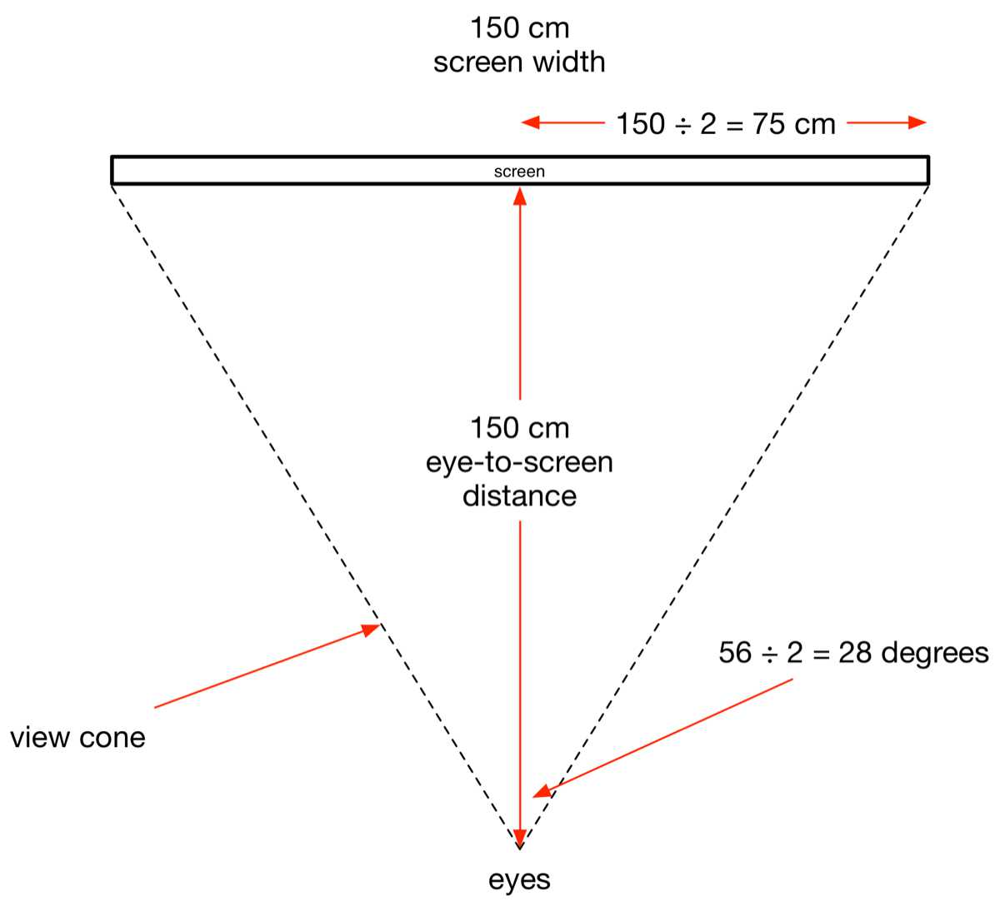
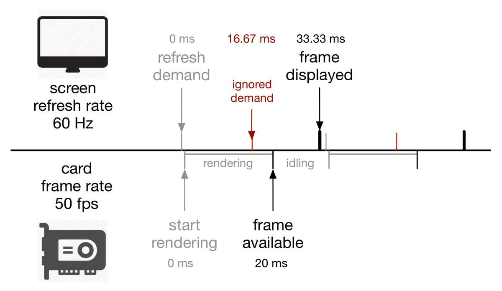

# INTRODUCTION

This article is an extract from my book, *[Going Nowhere Fast In Assetto Corsa: Race Driving On A Simulator](https://www.amazon.com/Going-Nowhere-Assetto-Corsa-2018-01-20-ebook/dp/B00NS918M4/ref=sr_1_4?keywords=amen+zwa&qid=1637678617&qsid=139-4891948-0624130&sr=8-4&sres=B00WNBY3AW%2CB00FRJRAWA%2CB00RJL1GUQ%2CB00NS918M4%2CB007O48QTC%2CB0085P197A%2CB078MFL33P%2CB009Z2H91W%2CB08Q77JRMC%2CB00OFWFV12%2CB075T4VS5F%2CB075T7HYR5%2CB00DJUK8HS%2CB07XYHLQ9C%2CB086PHR52V%2CB075T6BVGZ)*. Assetto Corsa (AC) is not a game; it is a simulator. And with well over 100,000 words of boffinry, my book is not a gaming guide. I wrote it for the serious simulator drivers interested in learning about motorsport and race driving. What you will find in this book are technical topics covering graphics card tweaking, simulator configuration, race car dynamics, racing components, car set- up, driving techniques, racing rules, race strategies, and race tactics. I also present the cornering lines for all the tracks supported in the current (mid 2014) version, which are laser scans of the real racing circuits. I describe each track, corner-by- corner and bump-by-bump, with the cockpit view screenshots.

# HARDWARE SET-UP

Although AC can run happily on a mid-range PC, you should opt for a good gaming PC like the Alienware Aurora with an Intel Core i7 Extreme, 16 GB of RAM, at least 256 GB of flash storage, and an nVIDIA GeForce GTX 7*nn*. There are much more expensive systems, but you do not need a beast of a machine for AC.

By the way, I test ran AC on a MacBook Pro 15” with 2.6 GHz Core i7 with 16 GB of RAM, 512 GB of PCIe flash storage, running 64-bit Windows 7 under Boot Camp. Its nVIDIA GeForce GT 750M mobile graphics card was mated to a $150\ cm$ ($60\ in$) Samsung HD tele via an HDMI connection. This laptop is an average, business computer, not a gaming machine by any stretch of the imagination. Yet, after a bit of tweaking, AC runs in the $1920 × 1080p$ resolution at $60$ frames per second, consistently. Marks for AC there.

For an enhanced realism, you should buy a racing seat like the Playseat Evolution. Be sure to get the Gearshift Holder accessory. Mount it on the right side of the seat if you are used to driving left-hand-drive cars, and on the left side if you prefer right- hand-drive cars. The photograph⁠ below shows a G27 mounted on a Playseat.

Place your tele on a low stand, so that your eye level is about one-half from the bottom edge of the display. Then, place the racing seat as close to the base of the stand as practicable. This arrangement, shown above, complements the cockpit view. An inexpensive but high-quality immersive sound can be obtained using a professional-grade stereo headphone and a digital-to-analogue converter (DAC) headphone amplifier. The Sennheiser HD 600 headphone driven by the FiiO Alpen E17 USB DAC amplifier offers decent sound at an affordable price. You will also need a force feedback USB steering wheel like the Logitech G27 or the older G25.

# SOFTWARE SET-UP

Download the Steam client from SteamPowered.com, register with the service, purchase AC, and install it. Once AC has been steamed and thoroughly cooked, run it under the control of the Steam client. Then, and in the **Controls** settings panel, select the **Logitech G27 900 + Shifter H** controller preset. Reduce the **Gear Shift Debouncing** value to 0 ms, if you have a properly functioning controller. On older, worn-out controllers, the flappy paddles can activate multiple times, even though you pressed them only once. This is referred to as bouncing shifts. In that case, you may need to set this value to 50 ms or so.

AC’s road-going cars have proper seat heights, so you may use the default value for these cars. But the open-wheel models have disconcertingly high seats. So, we need to lower the seat for an open-wheeler, but by how much? Let us have a look at the Lotus Type 125 Exos. It is an F1-like race car that Lotus sells to its elite customers. So, it should have a similar cockpit view as the Lotus F1 car. See the true driver’s eyes view video made by Lucas di Grassi, a Pirelli test driver putting a set of full-wet rain tyres through their paces in a Lotus F1 car on Circuit Paul Ricard in France. Unlike other in-cockpit videos that were shot though helmet-top cameras, di Grassi wore the camera directly in front of his eyes, partially obscuring his vision as a consequence. Also, note how shaky his head got at various parts on the track. And most of the time, di Grassi cannot see the track ahead over the top of his steering wheel, given how low he sits in the cockpit. This is as realistic a view as we mortals can get of an F1 cockpit. The following screenshot⁠ was captured from di Grassi’s video, in order to provide you a baseline against which to compare your seat height in AC.

The default seat height for Exos in AC, however, is much too high, as can be seen below.

Since the Exos is derived from the Lotus F1 car, you should reproduce the F1 driver’s cockpit view. But there is a catch. In real life, the driver can raise his head slightly to see what is ahead, if necessary. You, however, cannot raise your head in AC as readily. So, as a compromise, I recommend that you lower the seat until the two little humps on the side of the nose are barely visible over the top of the steering wheel, as shown below. This position offers the best realism-usability balance.

# GRAPHICS SET-UP

## *eye-to-screen distance*

The above screenshot of the Lotus Exos cockpit uses AC’s default field of view of $54\degree$. A spot of trigonometry tells us how far the screen should be from the eyes at a given view angle and screen size. Let us say that a large tele has a usable screen width of about $150\ cm$ (approximately $60\ in$), and you have kept AC’s field of view at the default $54\degree$. Then, the proper eye-to-screen distance is $(150 ÷ 2) / tan(54 ÷ 2) \approx 150\ cm$. The diagram below shows the top view of the tele, the eyes, and the view cone.

And instead, if you are using a small monitor with a $50\ cm$ (approximately $20\ in$) screen width, it should be placed $25 / tan(27) \approx 50\ cm$ in front of your eyes. That means the monitor should be located just beyond your G25’s wheel, and the centre of the screen should be lined up with your eyes.

## *frame rate and refresh rate*

In computer games, frame rate (fps) is the number of frames rendered per second. A sufficiently high frame rate on a racing simulator is essential for a smooth, life-like driving experience. A low frame rate interferes with your ability smoothly to control the car, and hence robs your sense of immersion. Whereas frame rate refers to how fast the simulator software can render the frames, refresh rate (Hz) refers to how fast the display can show the rendered frames on the screen. Both affect simulator performance. And more importantly, they interact with one another in confusing ways, sometimes.

An average gaming PC cannot spit out frames at a rate far in excess of the display’s refresh rate. But even if you manage to squeeze high frame rates out of the graphics card, you should lower the frame rate to a value just above the display’s refresh rate, because all those extra frames are left to rot in the frame buffer anyway, and they only contribute to image tearing.

Instead of wasting frames, the graphics card should be put to a more profitable use by rendering higher quality images. Higher image quality lowers the graphics card’s rendering speed. So, if we increase the quality settings by the right amount, we can lower the frame rate to match the refresh rate. In this way, we cure tearing and we gained image quality.

Another way to mitigate tearing is to set a frame rate limit in the simulator’s graphics settings. This approach forces the simulator and the graphics card to generate only up to the specified number of frames each second, and once this limit has been reached, the pair sits idle in between consecutive frames. But there is a better way to match up the frame rate and the refresh rate, and it is called vertical synchronisation.

Yet another cure for tearing is to turn on vertical synchronisation, which forces the simulator and the graphics card to generate a new frame, only when the display demands it. When the graphics card can render faster than the display can draw, all is well, because the card simply waits for the display to make a demand for a new frame. The screen shows frames at the maximum rate the display is capable of. But when the graphics card’s frame rate dips just below the display’s refresh rate, which happens from time to time, vertical synchronisation can cause the frame rate to drop to half the refresh rate. This sudden drop from $60\ fps$ to $30\ fps$ is jarring, to say the least. It is referred to as stuttering. Here is how stuttering occurs.

When the graphics card is operating in vertical synchronisation mode, it renders a new frame, only when the display demands for one. If the card is labouring at a low frame rate, say $50\ fps$, it takes $20\ ms$ ($1 / 50\ s$) for it to render a frame. But a display operating at $60\ Hz$ demands a new frame once every $16.67\ ms$ ($1 / 60\ s$). As can be seen in the timing diagram below, every other call for refresh (thin red vertical bar) falls on the deaf ears of an overworked card. Consequently, a new image can only be displayed once every $33.33\ ms$ (thick black vertical bar). The effective frame rate thus drops to $30\ fps$ ($1 / 33.33 ÷ 1000\ s$), despite the fact that the card is capable of running at $50\ fps$. The $20\ fps$ loss is caused by the card having to idle after each rendering, waiting for the next frame demand from the display.

We may remedy the stutter problem by setting the graphics card to adaptive vertical synchronisation, and by setting the simulator to respect vertical synchronisation. When the graphics card is configured to operate in the adaptive vertical synchronisation mode, the graphics card works in normal vertical synchronisation as long as its frame rate is higher than the display’s refresh rate. But the instant the frame rate dips below the refresh rate, the card abandons vertical synchronisation, and operates at the maximum frame rate it can muster. The result is a tear-free, stutter-free, high-quality imagery, with the graphics card that is performing at its peak. The book also covers image-quality-related graphics card configuration parameters such as anti-aliasing, anisotropic texture filtering, shadows, etc.

# CONCLUSION

As I stated above, this book not meant for the gamers, but for the serious simulator users. These excerpts from GNF should give you a better sense of whether this book is right for you.
