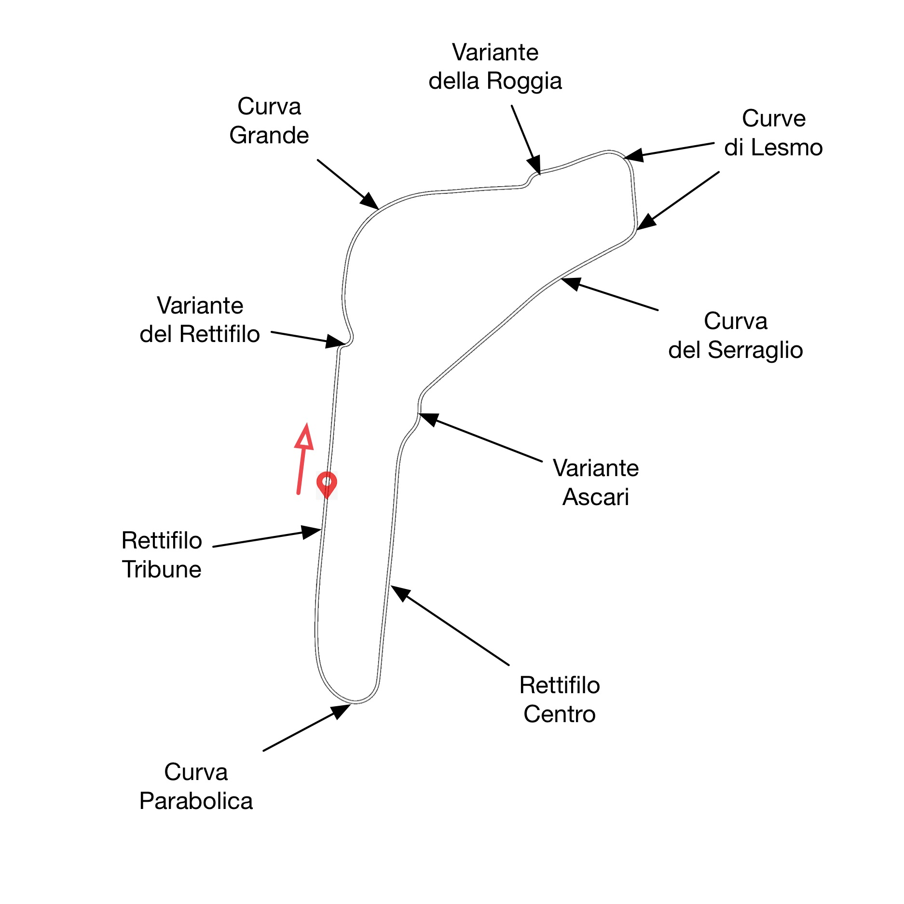
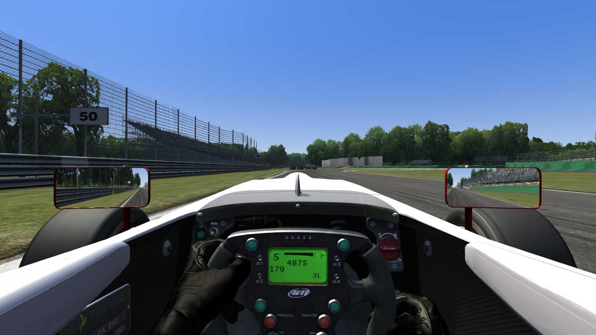
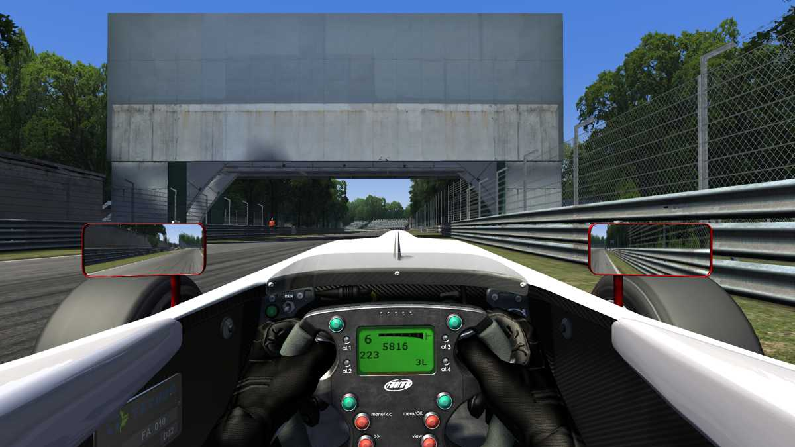
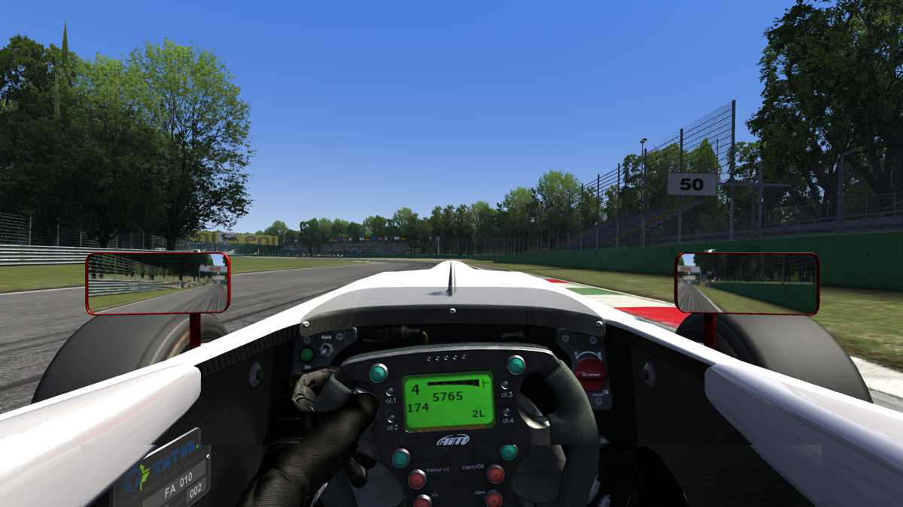

# INTRODUCTION

My book, *[Going Nowhere Fast](https://www.amazon.com/Going-Nowhere-Assetto-Corsa-2018-01-20-ebook/dp/B00NS918M4/ref=sr_1_4?keywords=amen+zwa&qid=1637678617&qsid=139-4891948-0624130&sr=8-4&sres=B00WNBY3AW%2CB00FRJRAWA%2CB00RJL1GUQ%2CB00NS918M4%2CB007O48QTC%2CB0085P197A%2CB078MFL33P%2CB009Z2H91W%2CB08Q77JRMC%2CB00OFWFV12%2CB075T4VS5F%2CB075T7HYR5%2CB00DJUK8HS%2CB07XYHLQ9C%2CB086PHR52V%2CB075T6BVGZ)*, provides detailed guides for all laser-scanned tracks that came with *[Assetto Corsa](https://www.assettocorsa.it/home-ac/)* racing simulator. Here in this article, I have excerpted one of them: from-the-cockpit description of Autodromo Nazionale Monza, a revered, old track located near Milan, Italy. The original, 10 km track comprises the flat track and the banked oval superimposed atop it. Monza was built in the early 1920s, and annual Grand Prix races are held there to this day. The banked oval fell into disuse in the late 1960s. After having excised the oval section, and the flat section had been decimated with chicanes. Yet, this eviscerated, 5.77 km configuration, as it was modified last in 1995, still stands today as one of the fastest tracks on the series calendar. The track map below shows modern Monza, without the Sopraelevata oval.

# RACING LINE

Modern Monza is nothing like the old Monza. In fact, those chicanes are rather pesky. Some of them are very sharp and tight. But one characteristic remains the same—the track is still as flat as a plate glass. Because this track is so flat, the lines through tight chicanes can be difficult to sight from a low cockpit. And the approaches into a couple of the chicanes are hidden by overpasses. All of these characteristics make Monza a fairly technical track.

## *Rettifilo Tribune*

As you come out of Curva Parabolica in G4, swing wide and shift up to G5. Let the car drift out close to the red-white-and-green (tricolori, the Italian flag colours) painted exit kerb on the left edge of the track. Use every centimetre of the track, so as to straighten the exit line. Soon, you will be up in G6 (top gear), and will be passing the start-finish line. The pits are on the right, the same place they have always been.

## *Variante del Rettifilo*

In the mid 1970s, this chicane was inserted just before the entry of Curva Grande, in order to slow down the cars to a safe speed through Curva Grande. It has gone through several layout changes. In its present form, it is a vexingly sharp and tight right-left chicane. Get on the brake hard just after passing the 50 m board, as shown below. Remember that the front tyres may have cooled down quite a bit, while travelling along the long pits straight. Delay the entry into the right-hander, so as to position yourself to straighten the line through the subsequent left-hander. You need to make a good exit, so as to carry as much speed into Curva Grande as possible. Mount the flat, tricolori apex kerbs, but do not mount or nudge the tall, red-painted hump behind the kerbs. It is there to prevent the cars from cutting the corner—apex guard, if you will. If you hit this hump, you can launch the car high in the air, and damage the suspension. Even if you suffered no damage, your lap would be in tatters.

If you overcooked the chicane, you may avoid locking up the wheels by taking the escape road—the straight bit of road that shunts the chicane. There are foam blocks that chop up this escape road, so it will take longer for you to thread through it than to take the chicane. If you find yourself on this patch of the track occasionally, do not feel bad; even the top drivers make the same mistake, here. The pits straight is the fastest part of the track, and this chicane is the slowest. So, overshoots are inevitable.

## *Curva Grande*

Accelerate smoothly but quickly out of the chicane, and take Curva Grande in G5 or G6, depending on your gear ratio. Even with 0- degree wings, the car can go through Curva Grande at full throttle.

## *Variante della Roggia*

This chicane cuts down the old Curva della Roggia. Like Variante del Rettifilo, it is sharp and tight, has tall apex guards, and leads onto a straight. But this chicane goes in the opposite direction: left, then right. Stay on the right edge of the track, and brake hard at the 100 m board, which can be seen in the screenshot below at the right edge of the track, just beyond the grey footbridge. Once again, sacrifice the first part, the left-hander, in order to straighten out the exit line.

## *Curve di Lesmo 1*

If you are smooth with the throttle application and if you mount the apex kerb precisely, you can shorten Lesmo 1’s neutral throttle phase, appreciably. The might of aerodynamics, you see. Just past the 100 m board off to the left in the shade, brake and click down into G4, and maintain a partial throttle. Settle the car, turn-in late, and return to throttle as quickly as you can manage. Mount deep onto the scalloped, apex kerb on the right. There is plenty of grip there. You can also mount the tricolori exit kerb on the left, but do not go beyond onto the green-painted area behind that kerb. That bit is slippery, so it will delay your return to throttle on the short straight that connects the two Lesmos.

## *Curve di Lesmo 2*

Depending on your gearing, you may need to shift up to G5 on the short straight. You could lengthen G4, instead. But if you do, be aware that this may lower the rear drivewheels’ traction through the entire Lesmos pair. If you had traversed the short straight in G5, downshift just after the 50 m board. Take Lesmo 2 in G4. You can mount the apex kerb here too. Just avoid the green patch behind; it is quite high, and will upset the car, which will hurt you on the long straight that follows.

## *Curva del Serraglio*

Despite all the changes to Monza, Curva del Serraglio managed to remain the same in its essentials. Take the line that hugs the left edge of the track in full throttle, as you continue to shift up through the gears.

## *Variante Ascari*

This chicane chops up the old Curva del Vialone. It is named after the fast, fat, and famous Italian driver Alberto Ascari, who lost his life at Curva del Vialone in 1955. Befitting the name, this chicane is very fast. It is oxymoronic to say that a chicane is fast, but this chicane is truly fast. It consists of a left flick, a right sweep, then a left flick. Take it in G4, but do not slow down too much, and do not let the car skate about. Thread the car neatly through this complex with a light touch on the steering wheel and a fine sense of timing. Clip the apex kerbs, but do not go too deeply onto the ribs behind the kerbs. They may look small, but they are sharp enough to upset the car, and rob you of the speed you desperately need to carry onto the upcoming straight. In the image below, the driver has just downshifted into G4, and he will soon take the left-hander, after passing the 50 m board that hangs from a fence off to the right. He will then sweep right, flick left, and accelerate onto the straight.

## *Rettifilo Centro*

Rettifilo Centro back straight, too, has changed very little, over the years. As you exit Variante Ascari, let the car drift wide onto the tricolori-painted kerb on the right. But avoid going beyond the painted portion. You will already be in G5, by the time you mount this exit kerb.

## *Curva Parabolica*

You would still be in G6, even as you approach the 50 m marker board. Brake hard as close to this marker board as you dare. Take Curva Parabolica in G4, and follow the dark consensus line that widens at the exit. No worries; there is plenty of room, and even more grip, here.

# CONCLUSION

Monza is lightning fast. So, when I drive the Tatuus Abarth on this track, I lowered the car's ride height by a few millimetres, and I zero out both the front and the rear wings. However, zeroing out the wings does not mean there are no wings at all; the wings are still attached to the car, but their main planes are at their minimum angles of attack. The wings are still capable of generating appreciable amounts of downforce, especially when they are being assisted by the Tatuus's aerodynamic body shape and the contoured under tray. You should also move the brake bias to somewhere around 55:45. These set-up changes should make the car much more drivable.