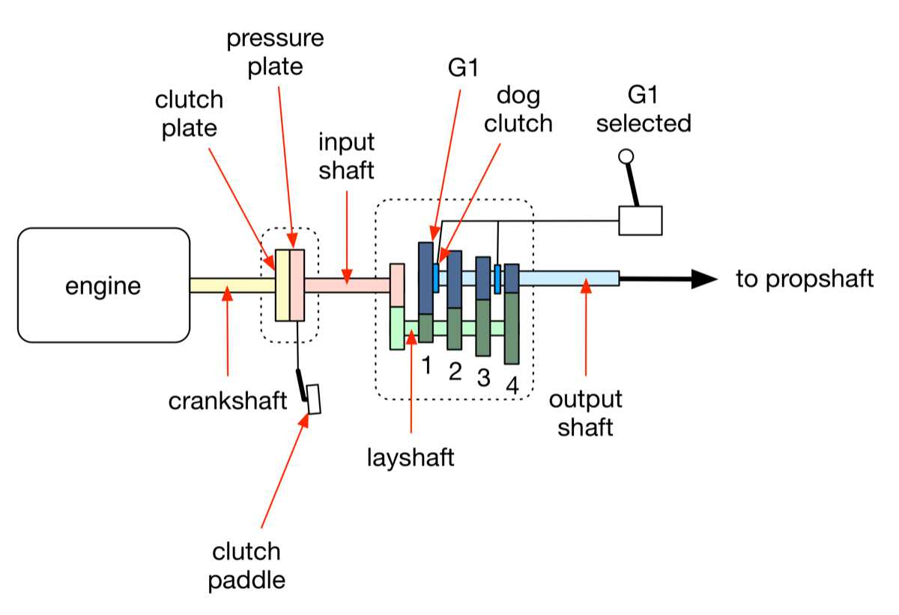

## *double-declutch downshifting*

One of the more difficult driving techniques to learn is the heel-and-toe double-declutch downshifting, or simply heel-and-toe. The purpose of the heel-and-toe technique is to enable smooth downshifts by matching the speeds of the gearbox’s input and output shafts. Heel-and-toe also matches the speeds of the engine and the drivewheels, so we minimise upsetting the car while cornering. Despite the fact that it is an essential technique for driving a three-pedal race car, there is much confusion about this technique among the novice. So, I shall try to demystify this important technique, here. But first, we must take a close look at the clutch and the gearbox.

The gearbox (or transmission in the US), fits between the clutch and the propshaft. It reduces the higher rotational speed of the engine to a lower speed suitable to turn the drivewheels. Different gears in the gearbox allows the driver to run the engine at a constant, optimum rpm, even as the rpm of the drivewheels vary according to the vehicle speed. Let us see how the gearbox operates.

The clutch, a friction device, acts as the buffer between the engine and the gearbox. It comprises the clutch plate and the pressure plate. The clutch plate is fixed to the engine’s crankshaft, and the pressure plate to the gearbox input shaft. When the clutch pedal is left untouched (clutched), the pressure plate is pressed tight against the clutch plate, so the gearbox’s input shaft is engaged to the engine’s crankshaft by the friction between the two plates. The gearbox input shaft thus rotates at the same speed as the crankshaft. But when the clutch pedal is fully depressed (declutched), the two plates separate, and the gearbox input shaft becomes disengaged from the crankshaft. Without the power from the crankshaft, the gearbox input shaft spins down.

The gearbox input shaft is not directly connected to the output shaft. Instead, the two shafts are connected via a layshaft. When the input shaft rotates, the layshaft does, too. The layshaft’s gears are permanently meshed to their counterparts on the output shaft, so when the layshaft rotates, the gears on the output shaft do, too. However, whereas the layshaft gears are splined onto the layshaft, the output shaft gears are mounted on bearings, so they rotate independently of the output shaft. In the diagram below, the layshaft gears are the dark-green rectangles, and the output shaft gears are the dark-blue rectangles. For simplicity, the reverse gear is not shown.

When the gearbox is in neutral, with the clutch fully engaged and the engine idling, the gears on the output shaft are freely rotating alongside the layshaft, the input shaft, and the crankshaft. But because the output shaft gears are not locked to the output shaft, the output shaft itself is not rotating. When a gear is selected using the shifter, the corresponding [dog clutch](http://en.wikipedia.org/wiki/Dog_clutch), which is splined onto the output shaft, meshes with the selected gear on the output shaft. Previously free spinning output shaft gear is now locked to the output shaft via the dog clutch, so the output shaft now rotates along with the layshaft. The speed of the output shaft is determined by the ratio of the selected gear.

The diagram above shows the clutch in its engaged state, and the gearbox with its first gear (G1) selected. G1 is the gear pair with the smallest dark-green layshaft gear meshed to the largest dark-blue output shaft gear. G1’s gear ratio is the tooth ratio of these two, meshed gears. Technically, the driver uses the shifter to select a gear pair, but from his perspective, the pair is just a single “gear.” There are several YouTube videos explaining [how a manual gearbox works](http://www.youtube.com/watch?v=QPaUJfA1KsY).

On a proper race car, the ratio of each gear in the gearbox is independently adjustable to suit the speeds of various corners on the track. The gear ratio is the number by which the gear multiplies or divides the crankshaft rpm to derive the propshaft rpm. A 2.2:1 ratioed gear, for example, rotates the propshaft (output from the gearbox) 1 turn for every 2.2 turns of the crankshaft (input to the gearbox). Hence, when the engine is cranking at 8,000 rpm, the propshaft (and the drivewheels) rotate at only 3,636 rpm.

Typically, lower gears—G3 and below—are reduction gears. They lean more toward acceleration than velocity, so they are used to accelerate out of corners. The G4 is the direct drive with a 1:1 ratio. Higher gears—G5 and up—are overdrives, turning the propshaft more than once for every turn of the crankshaft. They lean more toward velocity than acceleration, so they are used to attain top speed along straights.

Now, I shall give a two-pass description of the heel-and-toe downshifting technique. In the first pass, I describe how to perform the steps. In the second pass, I explain why the steps are necessary.

Here is *how* you heel-and-toe downshift from G4 into G3, while approaching a corner. Below, the letters “CBT” refer to the states of the clutch, brake, and throttle pedals. Upper case means the pedal is up, and lower case means the pedal is down.

- **CbT**—Lift your right foot off the throttle pedal, and press it down on the brake pedal. Modulate the brake pedal pressure, throughout this entire sequence.
- **cbT**—Depress the clutch pedal (declutch) with the left foot, take the gearbox out of G4, shift into neutral.
- **CbT**—Release the clutch pedal, but keep your left foot on the clutch pedal.
- **Cbt**—While continuing to modulate the brake pedal with the ball of your right foot, simultaneously pump the throttle pedal with the side of your right foot.
- **cbT**—Depress the clutch pedal (declutch) again, and snick the shifter into G3.
- **CbT**—Release the clutch pedal, but keep your left foot on the clutch pedal.
- **CBt**—Proceed down through the gears in like manner, until you reach the cornering gear. Finally, upon reaching the cornering gear, lift your right foot off the brake smoothly, and roll it back down on the throttle, as you simultaneously lift your left foot off the clutch.

In the sequence above, the clutch pedal is depressed twice. Hence the name “double-declutching.” And although the ball of the right foot and its side are the ones actually used, and not the heel and the toes, the technique is called “heel-and-toe,” nonetheless. Now, let us examine *why* you need to perform these steps:

- When you declutched the first time, the clutch decouples the gearbox’s input shaft from the engine’s crankshaft. The engine no longer supplies power to the drivetrain, at this point. The output shaft is now being rotated by the drivewheels via the differential and the propshaft. The output shaft speed is, therefore, determined by the speed of the drivewheels, which are in turn determined by the speed of the car. Since the dog clutch is still meshed to G4, the output shaft, the output shaft gears, the layshaft gears, the layshaft, and the input shaft are still rotating together.
- Now, you are able to slip out of G4 and into neutral with ease, because the throttle is closed, so the drivetrain is not under load. Once you have put the gearbox into neutral, the dog clutch is no longer meshed to G4 on the output shaft. Although the output shaft continues to rotate at the speed of the drivewheels, the output shaft gears are now rotating independently of the output shaft. And because the clutch pedal is still depressed at this point, the input shaft, the layshaft, the layshaft gears, and the output shaft gears are not connected to any external drive. These bits are, therefore, rotating under their own rotational inertia. Racing gearbox components possess very low mass, so they have low rotational inertia. Consequently, they slow down very quickly, in the absence of extern drive.
- When you release the clutch pedal, the clutch recouples the crankshaft to the input shaft. Now, the input shaft, the layshaft, the layshaft gears, and the output shaft gears are rotating at the engine’s current speed. The output shaft, however, continues to rotate at the speed of the drivewheels.
- Because the throttle is still closed, the engine speed has now dropped well below that of the drivewheels. Racing engine components, too, possess low rotational inertia, so they shed their revs in a hurry. If you try to shift into G3 at this point, you will crunch off its teeth, because the dog clutch is rotating at the speed of the output shaft, but G3 is rotating at the speed equal to the engine speed reduced by the gear ratio of G3. In other words, G3 is rotating much more slowly than the dog clutch. So, to avoid crunching G3, you speed it up with a quick pump on the throttle pedal. Releasing the clutch before pumping the throttle reengages crankshaft to the input shaft, thereby enabling you to use the engine to speed up G3.
- With G3 and the dog clutch speeds momentarily matched, you declutch the second time, and easily glide down into G3. To avoid speed desynchronisation, you must declutch and shift very quickly.

When heel-and-toe double-declutch downshifting, all four limbs are moving independently and fluidly. And these steps must be executed quickly, and each must be timed precisely. For that, you need to develop four-way independence in your limbs. It takes but a moment to execute this sequence, but it may take a considerable amount of practice time to master it. Because heel-and-toe is used multiple times during each lap, being able to perform it accurately and precisely can improve lap times, significantly. So, practice it, and master it.

And I advise you to develop light touch on the controls. Do not grasp the gearshift lever with a death grip or slam it into a gate with excessive force. Brute force will not make you go faster; it will only break your equipment. Similarly, do not mash the brake pedal; instead, quickly, smoothly, and firmly apply pressure on the brake pedal with the ball of the foot. Modern brakes shed speed efficiently, so be alert to modulate the brake pressure to avoid locking up the wheels. Learn to sense the steering wheel going light at the onset of front wheels lockup. The importance of proper brake pressure modulation cannot be overstated. Be sympathetic to your car, and it will take you far.

There are a couple of lazy shortcuts to this rather complicated technique of heel-and-toe double-declutch downshifting. The first one is the *single-declutch downshift*. This shortcut is commonly employed with [synchromesh gearboxes](http://en.wikipedia.org/wiki/Manual_transmission). In this technique, you declutch, and immediately shift into the lower gear, while simultaneously pumping the throttle. The throttle blip matches the engine and the drivewheel speeds, so you avoid unsettling the car, just as you did with the double-declutch technique.

However, because the input shaft, the layshaft, the layshaft gears, and the output shaft gears are decoupled from the engine and the output shaft, these components are slowing down very quickly. Hence, there is a large speed mismatch between the output shaft gear and the corresponding dog clutch, when you try to shift into that lower gear. The task of speeding up all of those slow-rotating components falls to the tiny synchroniser, which sits between the shift collar and the output shaft gear. Over reliance on the synchronisers will wear them out and will eventually damage them. Hence, even on synchromesh-equipped cars, I favour the old, double-declutch technique. If you want more details on how the synchroniser aids gear selection, see WeberAuto’s YouTube video explaining the [operation of a synchromesh gearbox](http://www.youtube.com/watch?v=vOo3TLgL0kM) at timestamp 4:30.

By the way, the gearbox shown in the diagram above is called a crash gearbox, because the dog clutch crashes into the corresponding output shaft gear, without the aid of the speed synchroniser.

Another shortcut is to stay on the brake until you have slowed to the cornering speed, then heel-and-toe *downshift directly into the cornering gear*. But there is a substantial risk of over revving the engine, when using this technique. If you shift into a low gear while the car is still going too fast, the speed of the drivewheels, multiplied by the gear ratio, can over rev the engine beyond its rpm limit. The engine is now a ramekin of crème brûlée.

In the days of yore when drum brakes were in vogue, stepping down through the gears in sequence was just the thing to do, because the feeble drum brakes needed the engine braking assistance to slow down a fast race car. Engine braking, also known as coasting, occurs when you lift off the throttle while the gearbox is still in gear. The engine’s internal friction slows down the rotation of the rear drivewheels, so coasting aids the brakes in decelerating the car. The highly efficient modern disc brakes, made of exotic materials, obviate the need to employ engine braking. However, I still favour stepping down through the gears, because it reduces the likelihood of accidental engine over revving.

There is a catch with heel-and-toe, though. You cannot simply blip up to a random engine rpm. You must rev the engine to match the speed of the drivetrain. So, how do you know what rpm to rev up to, when you downshift?

When you heel-and-toe downshift, you must blip the engine rpm up to what it needs to be in the intended lower gear, so that the drivetrain speed remains about the same, when you engage that lower gear. In a living room simulator like AC, we need not be so precise. But if you want the exact numbers, try this.

Start down a long straight, say at Monza historic, in the BMW E30 M3 road car in its factory set-up. Accelerate in G1 up to the redline at 7,000 rpm. The car’s forward speed will be 72 km h-1. Now, shift up to G2, and maintain the speed. You will notice that the engine revs drop from redline to 4,500. If you climb up the gears, you will see that in G3, the engine revs at 3,400; in G4 at 2,500; and, in G5 at 1,900. We now have the rpm deltas between the gears:

- Downshift to G4 from G5: 2,500 - 1,900 = 600 rpm increase
- Downshift to G3 from G4: 3,400 - 2,500 = 900 rpm increase
- Downshift to G2 from G3: 4,500 - 3,400 = 1,100 rpm increase
- Downshift to G1 from G2: 7,000 - 4,5000 = 2,500 rpm increase

Hence, if you enter a corner and heel-and-toe down from G4 to G3, you must blip the engine to rev up by 900 rpm above its present G4 rpm. But since you need to account for the engine slowing down in that fraction-of-a-second that it takes you to shift into G3, you should rev up slightly more than 900 rpm above the current rpm. And these rpm deltas will change, if the gear ratios change. Suffice it to say, this is much too fussy. In practice, we just blip the throttle by feel, based on experience. Pedantry looks good on paper, but touch is more important on track.

And there are real-world racers who use the clutch pedal very infrequently, perhaps only to launch off the line. Instead of using the clutch for every shift, an experienced driver shifts by matching the revs. To upshift, he lifts up the throttle partway to unload the drivetrain slightly, slip out of the current gear, immediately snick up into the next higher gear, and return to the throttle. The engine will rev at a lower rpm in the higher gear, and lifting the throttle drops the engine rpm. So, all that he needs to do is to shift up, when the engine revs have dropped by a sufficient amount. To downshift, the driver lifts up the throttle a bit, disengages the gear into neutral, blip the throttle, and snick down to the next gear, all the while modulating the brake pedal pressure. Try it in the M3 road car. You may grind the gears, initially. But with a little practice, you can shift without the clutch. I use the clutch, though, because I enjoy the full experience of a well executed heel-and-toe double-declutch downshifting.

Watch the YouTube video of the [manual gearbox operation](http://www.youtube.com/watch?v=QPaUJfA1KsY) by Automotive Basics and the [Monaco clip from the 1966 film Grand Prix](http://www.tcm.com/mediaroom/video/313245/Grand-Prix-Movie-Clip-Superstitious.html) at timestamp 3:05. And if you are interested in learning more about clutch, gearbox, and gear ratios, read Carroll Smith’s book [*Drive to Win*](http://www.amazon.com/Drive-Win-Essential-Guide-Driving/dp/0615592570). Yes, this is all a bit too stodgy. But this knowledge will not only make you a better driver, it will also give you a greater enjoyment, when you have learnt to do things right.