# INTRODUCTION

This article is an extract from my book [*Round The Ring: Driving The Nordschleife On A Simulator*](http://www.amazon.com/Round-The-Ring-Nordschleife-ebook/dp/B0085P197A/ref=sr_1_2?ie=UTF8&qid=1338250215&sr=8-2). The book covers simulator set-up, car set-up, race component functions, race car dynamics (load transfer, tyre traction circle, tyre slip angle, etc.), and driving techniques (cornering lines, heel-and-toe downshifting, Scandinavian flick, etc.), in addition to learning how to drive on the Nordschleife. The bonus chapter in the book talks about the Nürburgring Formula 1 Grand Prix track and the ADAC 24h Rennen Nürburgring endurance race configuration. In this article, however, we shall focus only on the racing line round The Ring.

Before you can drive at race speed, you must first learn the track. A good way to get to know the track is to take in a bit of its history, and to make it your friend. The original Nürburgring comprised of the Nordschleife (northern loop) and the Südschleife (southern loop), as shown in the left side map below. The entire track was referred to as the Gesamtstrecke (combined track).

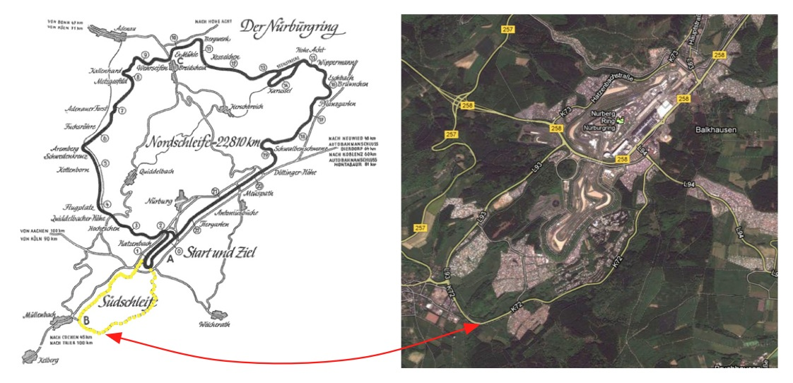

Construction of the Nürburgring began in 1925 and was completed in 1927. The Südschleife fell into disuse after the Second World War, and is now used as public motorway. It is still possible to trace out its remnants on the Google Maps [satellite image](http://maps.google.com/maps?hl=en&rlz=&q=Nurburg,+Germany&um=1&ie=UTF-8&hq=&hnear=0x47bfad2e783c730d:0x422d4d510dae2f0,Nürburg,+Germany&gl=us&ei=TVhzT6mnH8P3ggfbmplG&sa=X&oi=geocode_result&ct=title&resnum=3&ved=0CGUQ8gEwAg), in the form of the local roads K72 and L93. It encircles the modern F1 circuit. Of course, you can still [drive the Südschleife on a simulator](http://www.rfactorcentral.com/detail.cfm?ID=Sudschleife).

The Nordschleife, which remains largely unchanged, surrounds the medieval village of Nürburg where a twelfth century castle still stands. The original layout had a long tail called the [Südkehre](http://www.rfactorcentral.com/detail.cfm?ID=70 Nordschleife) (southern turn), along which the original pits were located. The modern F1 circuit, called the Grand-Prix-Strecke, was built over the Südkehre in 1982, so this bit of the old track is no longer visible in the satellite image.

Today, the Nürburgring comprises the Nordschleife plus the Grand-Prix-Strecke along with their myriad configurations. To most people, the name “Nordschleife” now means the Touristenfahrten (tourist rides) configuration, shown in the map below, which is the 20.832 km track that traces the original Nordschleife, excluding the Südkehre. The late [Stefan Bellof](http://en.wikipedia.org/wiki/Stefan_Bellof), driving his Porsche 956, set the current fastest lap time of 6:11.13, in 1983.

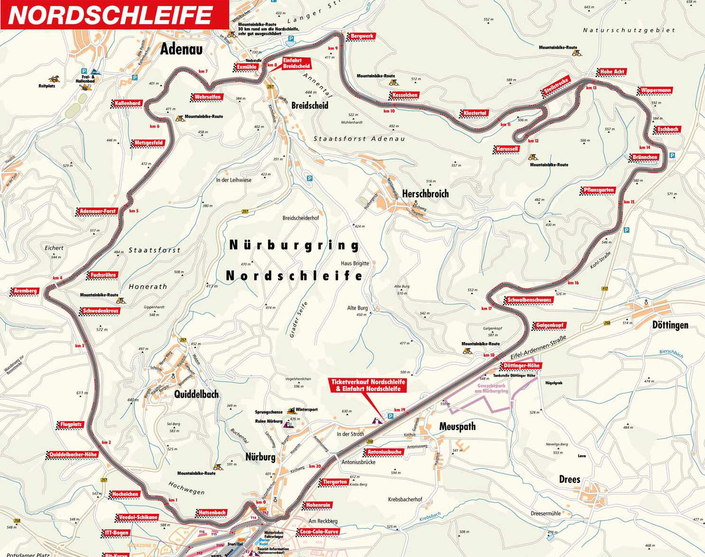

# LEARNING AIDS

The Nordschleife is frightfully long. The number of corners is maddening, and many of which have blind apexes. The elevation changes are extreme. The scenery is beautiful, yet disquieting at the same time. The level of concentration required to drive just one lap is unrivalled by any modern track. Over its 80-year history, many racers have made regular pilgrimage to this track, yet only a few have risen to the rank of Ring Meister. There is a long list of Dead Ringers, who have paid for the privilege of driving on it with their lives. And, there are scores of enthusiasts like me, who scurry about in the safety and comfort of living room simulators. This article, I hope, will cast a spell upon you and transfigure you into one of us—a Ring Worm.

To drive The Ring at speed, you need to know just about every centimetre in intimate detail—the sequence of corners and straights between them, the layout of each corner, the line, the bumps, as well as the trackside references. Not only must you know each corner by sight from the cockpit, you must also recognise it on a map or in a satellite image, so that you can maintain a mental map of where you are on the track. And, you should be able to recall the details of all the corners in your mind’s eye, in their proper sequence.  The task is made more challenging by the fact that each simulator models The Ring slightly differently, visually and physically. The good news though is that once you have learnt the track on one simulator, this knowledge translates to another simulator.

Note that there is much confusion as to the precise number of corners on the Nordschleife, because some bends are rather slight and a number of them merge to form larger sections. The count depends on whether the counter considers a slight bend a corner. The matter is further muddied by the numerous configurations, bygone and current, all bearing the designation “Nürburgring”. In this book, we are concerned only with the 20.832 km Touristenfahrten configuration, which is generally accepted as having [154 corners](http://en.wikipedia.org/wiki/Nürburgring).

Start by learning the corner names in German, and simultaneously associate the name with the satellite view, as well as the cockpit view. I suggest the following learning aids for this:

- **Porsche 997 GT3 RS video**—Watch the Vimeo on-board video of a [Porsche 997 GT3 RS](http://vimeo.com/9328637) on the VLN configuration—the one that combines a truncated Grand-Prix-Strecke and the Nordschleife. In the video, the Porsche starts on the Grand-Prix-Strecke, and gets onto the Nordschleife at the minute mark 01:48. It gets off the Nordschleife and returns to the Grand-Prix-Strecke at 10:10. So, watch the bit between these two timestamps. You get to see how the corners look from the cockpit. The best part is the corner name labels appear as overlays. Pause the video from time to time, type in the corner names on [Google Translate](http://translate.google.com/?hl=en&tab=wT#de|en|tiergarten ), play the audio to learn the German pronunciations, and see the English meanings. Also see Ben Lovejoy’s [Nurburging Nordschleife bend names](http://www.nurburgring.org.uk/bendnames/index.php) web page for history behind the corners, the pronunciations of their proper German names, and their English translations.
- **Corvette ZR1 video**—Watch the YouTube on-board video of a [Corvette ZR1](http://www.youtube.com/watch?v=7nzfHPATRrU&feature=results_main&playnext=1&list=PL06DB3A5FDC929575) on the Nordschleife configuration. This video shows the speed, the lap time, and the RPM across the top, but the most useful information for us is the moving map display and the accelerometer shown on the lower-right corner. Pause the video occasionally, and see the satellite image of the corners on [Google Maps](http://maps.google.com/maps/ms?ie=UTF8&oe=UTF8&msa=0&msid=108216332574243007428.00043496bf01b7be201c3).
- **BMW E30 M3 video**—Watch on YouTube my replay video of a [BMW E30 M3 Sport Evolution](http://youtu.be/n15v54rwnWE) captured from Need For Speed Shift 2: Unleashed on PlayStation 3. Observe S2U's implementation of helmet view, complete with head shaking, apex look-ahead, and bug splatter. I also annotated the corner names in this video, so as to serve as a companion video to [my book](http://www.amazon.com/Round-The-Ring-Nordschleife-ebook/dp/B0085P197A/ref=sr_1_2?ie=UTF8&qid=1338250215&sr=8-2).
- **Lotus Exos video**—Watch on YouTube my replay video of a [Lotus Exos](http://youtu.be/yvfsgTy_nLo) race car captured from Assetto Corsa. [Assetto Corsa](http://www.assettocorsa.net/en/) is a new title from the Italian simulator maker Kunos Simulazioni. My book [*Going Nowhere Fast In Assetto Corsa*](http://www.amazon.com/Going-Nowhere-Assetto-Corsa-2014-11-04-ebook/dp/B00NS918M4/ref=asap_B00J4J33KC_1_1?s=books&ie=UTF8&qid=1418029465&sr=1-1) is a detailed guide to simulator racing based on Assetto Corsa. At over 105,000 words (over 400 pages), it is a book meant for the serious racers.
- **Brabham BT20 video**—Watch on YouTube my replay video of a [Brabham BT20](http://youtu.be/6PrXBnJLILA) Formula 1 car captured from rFactor 2. rFactor 2 is a significant improvement over version 1, but because it is very new, it does not have as many add-on cars and tracks.
- **Alfa Romeo 12C-37 video**—Watch on YouTube my replay video of a [Alfa Romeo 12C-37](http://youtu.be/nyYlx6uyGtg) Grand Prix car captured from rFactor 1. The track is the 28.265 km Nürburgring Gesamtstrecke, which comprises the Nordschleife and the now-defunct Südschleife.
- My [YouTube channel](http://www.youtube.com/my_videos?o=U) also has replays of me driving several other famous, simulated cars round the Nordschleife. Do have a look.

# RACING LINE

Unlike on a modern F1 track where a name refers to the actual corner, a name on the Nordschleife refers to a section that comprises a series of corners and the short stretches of track that string them together. I provide in this blog a pared down description of the racing line. Please see [my book](http://www.amazon.com/Round-The-Ring-Nordschleife-ebook/dp/B0085P197A/ref=sr_1_2?ie=UTF8&qid=1338237659&sr=8-2) for a more detailed version that gives for each corner a suggested gear, throttle input level, trackside reference markers, and surface irregularities. By the way, the kilometre distance marks mentioned here refer to the Touristenfahrten configuration shown in the above track map. These marks do not match up with the kilometre marker boards erected on the real track.

## *T13 / Start-Ziel (0 km)*

The T13 complex includes a right- and a left-hander. The right-hander is the final corner of the lap. I chose to start with the last corner, because I wish to provide continuity through the start-finish line, as though you are completing a lap and starting a new one.

Initiate an early turn in for the right-hander, just as you pass the grey concrete patch off to the left shown in the image below.  The concrete patch and the curb on the left are slippery, so do not slide onto them.  When you take the corner, valiantly aim for the Armco barrier on the right, because the apex is at the base of this barrier. Imagine that you are scraping the Armco with your right wing mirror.

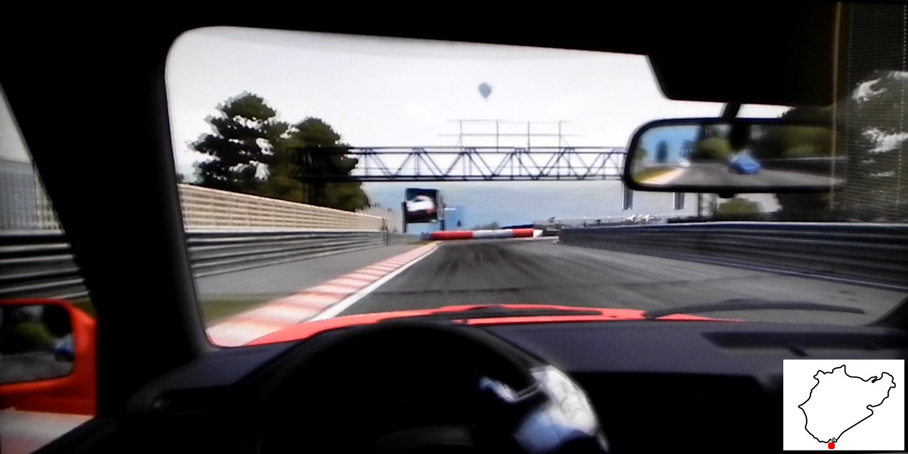

As you accelerate out of the right-hander, swing toward the blue barrier on the right side of the track.  The start-finish line is just ahead, at the top of the rise. This is the 0 km mark for the Nordschleife configuration.

Get on the brake just before you reach the top of the rise, so that the car stays on the track as it rolls down the other side.  Otherwise, the hill will lob the car up, and you will have a tough time trying to get it settled for the left-hander that follows immediately.  Note that the downhill slop will make the rear end skittish under braking. And, that little patch of tarmac on the right just past the Armco may seem inviting, but avoid it because it is quite slippery. If you run wide at the apex of this left-hander, you will miss the inside of the crown and will be at the mercy of the adverse camber created by the downhill slope. The ensuing mid corner understeer pushes the right side of the car onto the high curb at the exit, and will likely yield a snap oversteer.

As you accelerate out of T13 left-hander, the track bends slightly to the right. This bend has no name, but in the Porsche 997 GT3 RS VLN video mentioned above, this bend is labeled The Bogen. Stay in full throttle through this bend, and swing to the left side of the track.

## *Hatzenbach (1 km)*

Hatzenbach is a long series of left and right flicks that demands precision and rhythm.  The entry to the complex is a deceptively fast right-hander. This corner is the southernmost point of the track. Turn in early, and stay inside the crown.  In the image below, you can see the line through Hatzenbach 1[[5\]](http://www.blogger.com/blogger.g?blogID=5422081649031375821#_ftn5) as a dark streak curving to the right.

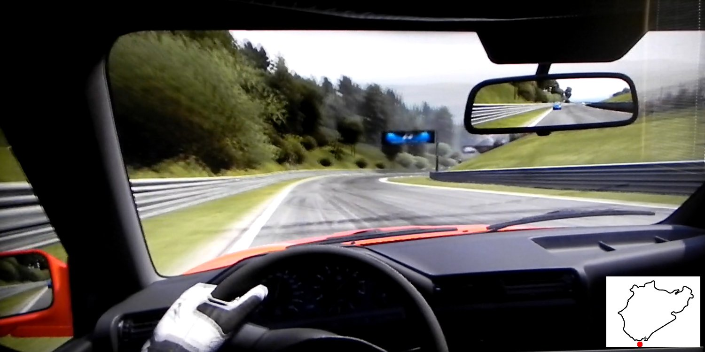

Hatzenbach 2 is a fast left-hander.  You may forego clipping the apex, and drift to the right instead, because a sharp left flick is coming up ahead.

As you approach Hatzenbach 3, get on the brake hard and heel-and-toe down to the appropriate cornering gear, as soon as the red-and-white plush, crash barrier peeps through the gap between the Armco barriers.

Hatzenbach 3 comprises a sharp left, immediately followed by a right. Sacrifice the left flick by mounting the curb, so as to straighten the right flick. The apex curb of the right flick is high. Mounting it will upset the car, which will create trouble for you at the next corner.

Hatzenbach 4 is a right-left flick. Its entry actually blends in with the exit of the previous corner. So, it is more efficient to take this pair of right flicks as a double-apex right-hander. Coupled with the fact that Hatzenbach 3’s left flick is rather sharp, it makes sense to sacrifice it, as we did. Remain on the left side of the track after exiting.

Hatzenbach 5 is a right-left flick.  It is the last corner of the complex. Stay on the left side of the track as late as possible, and delay turn in for the right flick. Then, place the car on the inside of the crown of the left flick.  If you miss the apex, you will drift off onto the exit curb. If you accelerate hard while the right rear wheel is still on the curb, the car will snap into oversteer. You are now at the 1 km mark.

## *Hocheichen*

Hocheichen is tricky. It looks like a sharp right-hander from the approach, but the crest at the apex of the right-hander hides a rather pronounced left kink that protrudes onto the track. Turn into the right-hander a bit sharper than you think is necessary.  To make matters worse, the entry of the right-hander is adversely cambered, so it is easy to overcook the turn and slide off to the left, thereby missing the apex and getting you into trouble at the left kink that suddenly appears behind the crest.

In the image below, the car has just clipped the apex of the right-hander, and is at the top of the crest. The white curb of the left kink protrusion is barely visible. Insert the car onto the inside of the crown of the left kink. You are now heading north. And, note how the track drops away sharply to the left. A little extra speed at the exit of the corner is amplified by this steep slope, and at the end of the following long straight, the speed difference becomes appreciable. So, do not make a cock-up of Hocheichen. Indeed, be neat and tidy like a nice little schoolboy scribing in his copybook, all the way from the entry of Hatzenbach to the exit of Hocheichen. You will reap the rewards in just a few seconds hence.

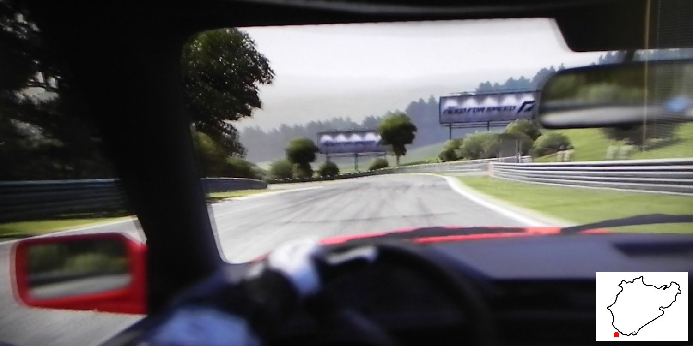

## *Quiddelbacher Höhe (2 km)*

As you roll downhill out of Hocheichen, the track bends slightly to the right, just as it crests a hill. There is a bridge where the track passes over motorway 257. Right after the bridge, the track climbs back up a steep hill. This is Quiddelbacher Höhe, which is 2 km from the start line. Charge up the hill on the left side of the track at full throttle, but lift the throttle just a bit before you reach the crest. If you do not lift, the car will go airborne. And, if you attack the hill at full tilt on the right side of the track, the car will fly even higher. You will then arrive at the next corner, a fast double-apex right-hander, in a quivering car that landed back on terra firma just moment prior. In a fast car, you will have to jab the brake paddle upon landing, in order to settle the car before taking the double-apex right-hander.

The crown of the track between the two right-handers is rather pronounced. So, if you slide to the opposite side of the crown after clipping the first apex, the outside of the crown will push you to the outside edge of the track, and you will miss the second apex.  Remain on the inside of the crown mid corner. To add to the challenge, there is a slight crest in the middle between the two apexes.

## *Flugplatz*

As soon as you exit Quiddelbacher Höhe, you are placed at the entry of Flugplatz. This section includes a series of three slight left kinks. The apex of the first of these left kinks, Flugplatz 1, is on a crest, as shown in the image below.

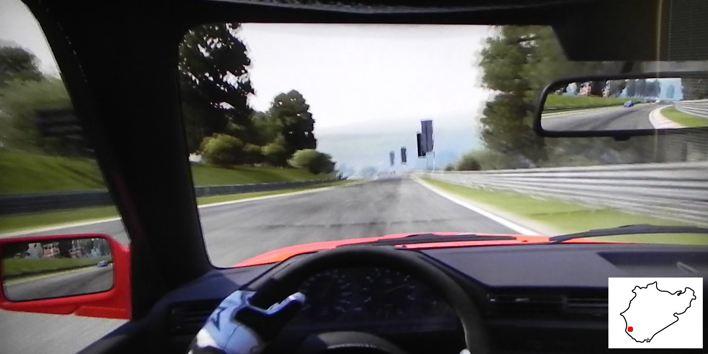

Flugplatz 2 and Flugplatz 3 are both left kinks, and are on progressively higher crests.  The track rises higher at the exit of Flugplatz 3.

## *Schwedenkreuz (3 km)*

After you crested the hill at the exit of Flugplatz 3, the track flattens out and curves to the left. This very fast left-hander is Schwedenkreuz. Clip the apex and stay on the inside of the crown, but avoid mounting the high curb.  The image below shows the entry of Schwedenkreuz, moment before executing the heel-and-toe downshift. The car is now at the 3 km mark.

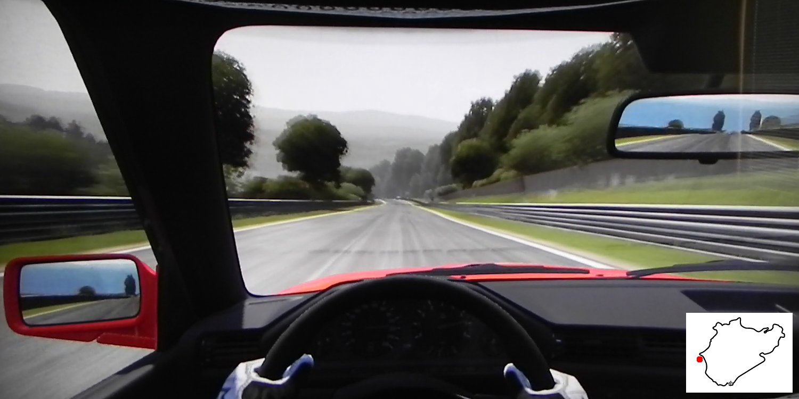

## *Aremberg (4 km)*

As you approach Aremberg, heel-and-toe downshift while staying on the left side of the track. Turn in early as and hug the curb shown in the image below, because the corner is adversely cambered and there are marbles off the line on the outside of the corner. After turn in, get back on the throttle well before you reach the apex.  Let the car drift out to the edge as you pass under the Yokohama bridge. Aremberg is the westernmost point on the track. The 4 km mark is just past the bridge. Getting on the throttle early is key, because a long downhill stretch follows this corner.

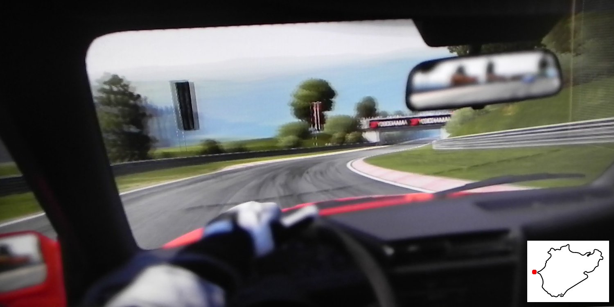

## *Fuchsröhre*

As you pass under the Yokohama bridge, the track drops away in a stretch that is almost straight save for the slight right-left-right kinks.  Do not mount the curbs at the kinks. After the final right kink on the downhill slope, the track bends slightly to the left and climbs sharply up a hill. In the image below, the car is about to take the second-to-last left-hander. You can see the steep hill, and the final left-hander of Fuchsröhre is barely visible at the top of that hill.

The second-to-last left-hander at the base of the steep hill is perhaps the trickiest bit of the entire Fuchsröhre section. Its curvature is gradual, so you can take it at full throttle. But, the track abruptly transitions from a steep downhill slope to a steep uphill slope right at the apex of this corner.  As the car comes down the hill at a high speed and hits the sharp uphill slope, the front suspension suddenly compresses.  Do not slam on the brake while the front suspension is compressed near its limit, or the front suspension will seize up and you will lose control. Go wide at the apex, a bit toward the middle of the track where the surface is smoother. If your car has good brakes and if you have the iron constitution, remain in full throttle through the slope inflection at the base of the hill, and stand on the brake and heel-and-toe downshift, only after you have climbed up the hill and the suspension has unloaded somewhat. If you prefer a more sedate course of action instead, lift off the throttle before you reach the base of the hill, and coast up the hill with your foot off the throttle.

The final left-hander on top of the hill is fast and blind. Settle the car while climbing up the hill, and initiate turn in early. Clip the high curb at the apex, but do not mount it. Remain on the left side of the track in preparation for the next corner, and heel-and toe down for that corner.

## *Adenauer Forst (5 km)*

The next right-hander, shown below, is the entry into Adenauer Forst. Take it at a speed a little faster than your instinct may command, and be sure to stay on the inside of the crown.

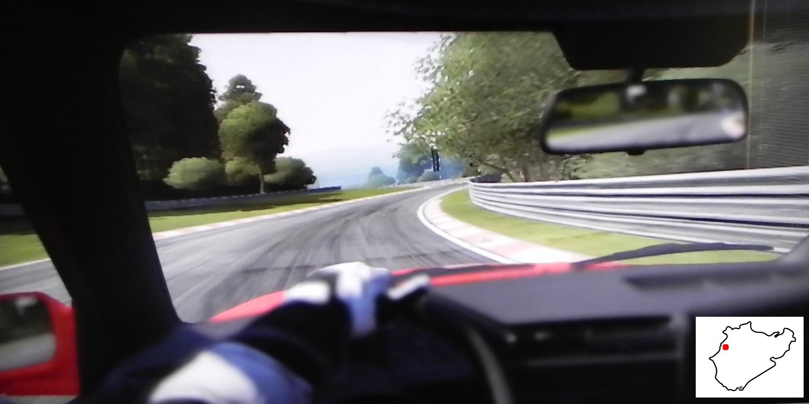

After clipping the apex of the right-hander at the entry, get as close to the right-side curb as you can, but do not mount it. As you slow down, turn in sharply for the left flick, remain in neutral throttle, and mount the curb on the left, in order to widen the line for the next corner. You are now at the 5 km mark.

The last right-hander is adversely cambered, so the car tends to slide off to the outside of the corner. To remedy this, turn in earlier, and nudge the right front wheel against the side of the high curb, which can be seen in the image below. The resulting drag at the right front wheel rotates the car, and cures the understeer. Take care not to mount the exit curb; it is high.

## *Metzgesfeld*

As you exit Adenauer, the track bends slightly to the left, and rises up a bit.  Point the car to the right edge at the top of this crest. A left kink hides behind the Armco, as shown in the image below.  Initiate an early turn in. Clip the apex at full throttle.

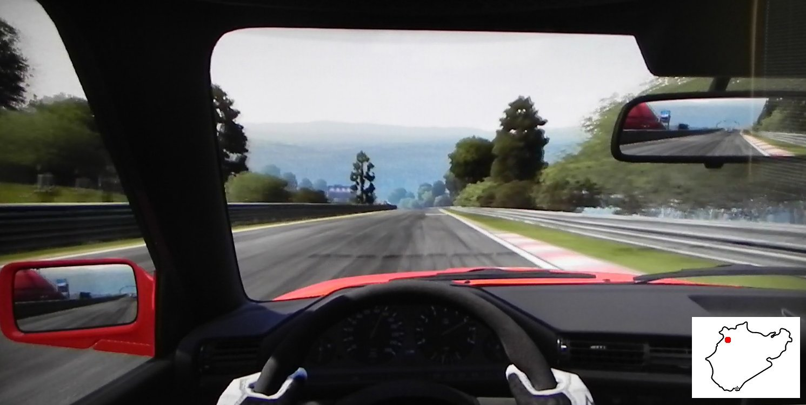

After clipping the apex, the track immediately drops away to the left. This fast left-hander is the entry into Metzgesfeld. Let us call it Metzgesfeld 1. Point the car to the right edge as you left-foot brake and turn in. Be sure to place the car on the inside of the crown, or you will drift out onto the patch of grass on the right.  The aerial tower in the distant marks Metzgesfeld 2, another left-hander. As you exit Metzgesfeld 1, drift out to the right side of the track and heel-and-toe down to the cornering gear.

The left-hander at Metzgesfeld 2 is tricky for a number of reasons: it is a slow corner, but the approach speed is rather high; there is a protrusion on the right at the exit, which is hidden from view by the Armco at the apex, so you need to turn in sharper than you think you may need; there are marbles off the line on the right, which stand ready to catch you out; and, the track rises briefly then drops precipitously at the exit, so the car gets light at the slope inflection point. The proper line through this corner is to turn in early to avoid the marbles at the entry, and tighten the turn so as to straighten the line between the left-hander and the subsequent right flick.

## *Kallenhardt (6 km)*

The track plunges abruptly, as can be seen in the image below, after exiting Metzgesfeld.  This is where the 6 km mark is. Because you are braking hard downhill as you approach Kallenhardt, the rear gets very light. Do not be aggressive with the brake paddle, or you will lock the rear wheels and will tumble down the hill, facing the wrong way. Heel-and-toe downshift, just before you initiate the right turn. Rotate an understeering car by nuzzling the right front wheel against the high curb at the apex. Do take care not to mount the curb.  Accelerate out of the exit, and continue the downhill plunge. Drift over to the right side of the track.

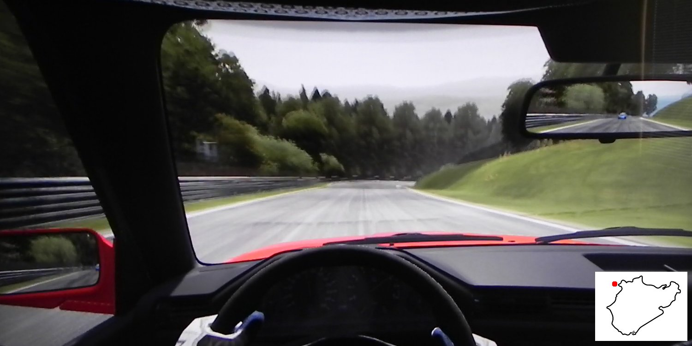

## *Spiegelkurve*

As you continue the descent, creep over to the right edge of the track, gently lift the throttle to transfer a bit of weight onto the front tyres for more bite, and turn in. Neatly straight-line the left-right flick, and drift out to the left side of the track. In the image below, the car is at the entry of Spiegelkurve, having just initiated the turn in.

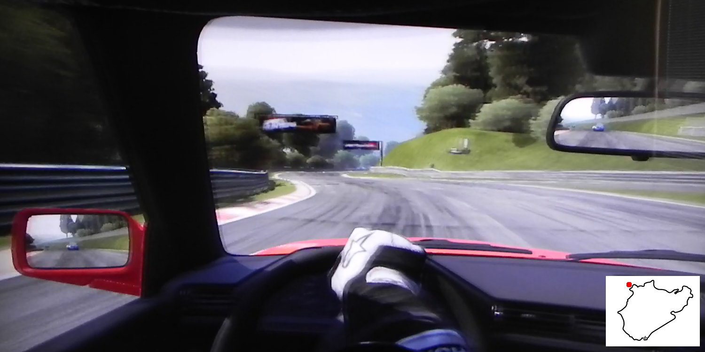

## *Miss-Hit-Miss (7 km)*

Next comes a long right-hander known as Miss-Hit-Miss, named after the proper line through this section: miss the apex of the first right-hander, clip the second, and miss the last. Technically this corner is not a triple-apex right-hander, since you clip only the middle apex. Since all three bends have red-and-white curbing, you must resist the urge to clip the first and the third curbs.

In the image below, the car is about to turn in for the first right-hander. Use a touch of left-foot braking to help the turn in. Go wide to miss the curb on the right. Because the apexes are hidden behind the steep hill off to the right side of the track, you will have to practice this corner a few times at slower speeds, before you acquire the muscle memory to execute it properly.

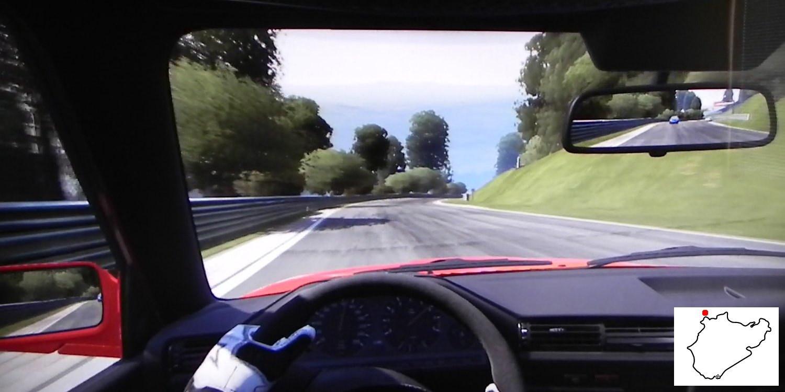

Swing to the right side of the track at the exit of Miss-Hit-Miss. You are now at the 7 km mark.

## *Wehrseifen*

Wehrseifen is actually a very tight and shallow U (right-left-right), so it is the closest thing to a hairpin turn The Ring has to offer. Heel-and-toe down and clip the right apex shown in the image below, as you enter Wehrseifen. The first half of the U starts at the apex the car is presently clipping, and ends at the red-and-white barrier that marks the bottom of the U.

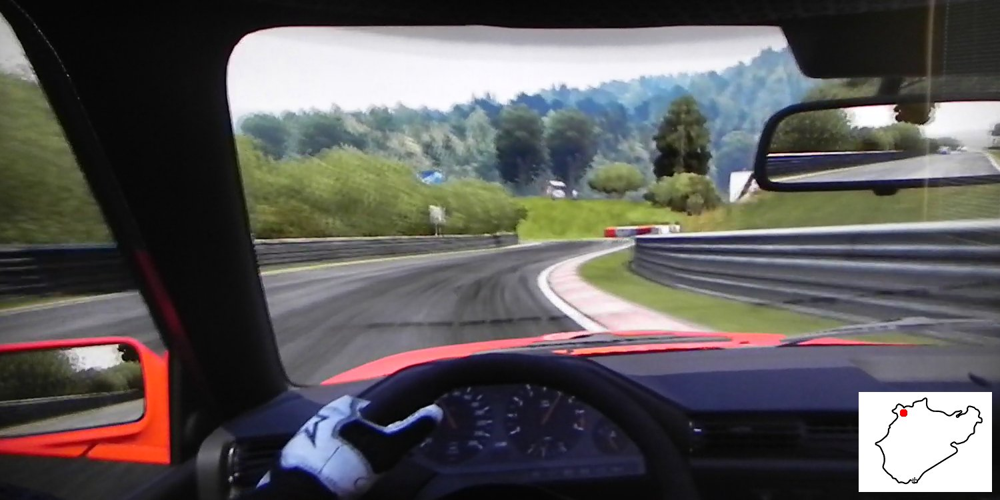

Wehrseifen is tough to get it right. It is very tight like a proper hairpin. And, a steep downhill braking makes for an excitable rear end. Its main (left) apex is hidden behind the Armco, and is nib sharp. There is a big dip just before this apex on the inside line. The outside line is slippery with marbles. The only help to be found is the rather pronounced crown. Place the car inside the crown, but not too close to the bumpy apex. Accelerate and clip the right apex at the exit.

## *Breidscheid*

Continue downhill and clip the apex of the right kink at the entry of this corner. Just as you reach the little access road on the right, shown in the image below, heel-and-toe downshift, and simultaneously manhandle the car sharply into the corner. Stay on the inside of the crown through the apex, and remain on the left side at the exit. If you go over the crown, you will understeer onto the high curb on the right. And, if you accelerate hard while on this curb, you will snap oversteer headlong into the Armco on the left.

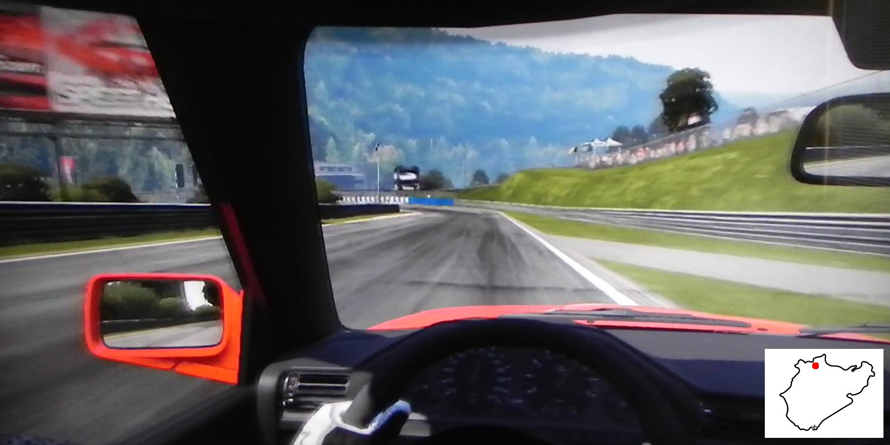

The dip just past Breidscheid bridge is at 332 m above sea level elevation, and is the lowest point on The Ring. The track begins to climb up to the highlands from here. Now would be a good time to don your oxygen mask. The climb begins with an ominously sloped right-hander.

## *Ex-Mühle (8 km)*

Turn smartly into this uphill right-hander. Accelerate early, clip the apex, drift out to the left edge, and go up through the gears. This corner is bumpy, the camber is markedly adverse, the uphill slope is steep especially at the apex, and you are accelerating hard not just to gain speed but also to claw up the hill. This combination is ticklish, so mistakes are possible. You can oversteer on the crest at the apex, if you are injudicious with the throttle. And, if you misjudge the speed and the line, the adverse camber will push you off onto the grass. The concomitant loss of traction on such a steep incline can be disastrous. Moreover, if you enter the corner in too low a gear the engine may redline halfway up the incline, and in too high a gear the engine may bog down. In either case, you lose momentum at an inopportune time. Set the gear ratio so that you can traverse Ex-Mühle in one gear, without stressing the engine. Lastly, ill-tuned suspension may succumb to the abuse here, and leave the car unsettled at the exit. You will then need to delay getting back on power, until the car has settled sufficiently. In the image below, the car is at the 8 km mark, and is about to clip the apex as it climbs the hill.

## *Lauda-Linksknick*

At full throttle, neatly clip a late apex into Lauda-Linksknick, as shown in the image below. Remain on the left side of the track, thereafter.  The apex speed of this left kink is frightfully high. It is named after Niki Lauda, an F1 triple champion, who nearly lost his life in a fiery crash at this corner, during the [1976 German Grand Prix](http://en.wikipedia.org/wiki/1976_German_Grand_Prix). By the way, this storied Formula 1 season is the subject of director Ron Howard's 2013 film [*Rush*](http://en.wikipedia.org/wiki/Rush_(2013_film)).

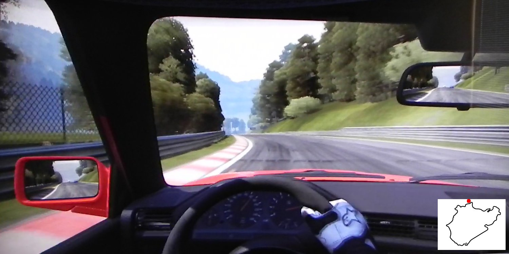

## *Bergwerk (9 km)*

Bergwerk is not too complicated, but it does have a few secrets of its own. The inside line is very bumpy. The camber is adverse. The slope is still uphill, albeit a gradual one.  And, what appears to be the apex as you approach the corner is actually not; the real apex is hidden behind the hill on the right.  So, turn in late into this corner. It is vital that you get this corner right, because it is followed by a long, fast stretch of track.  Begwerk is the northernmost point on the track, and the 9 km mark is at its exit.

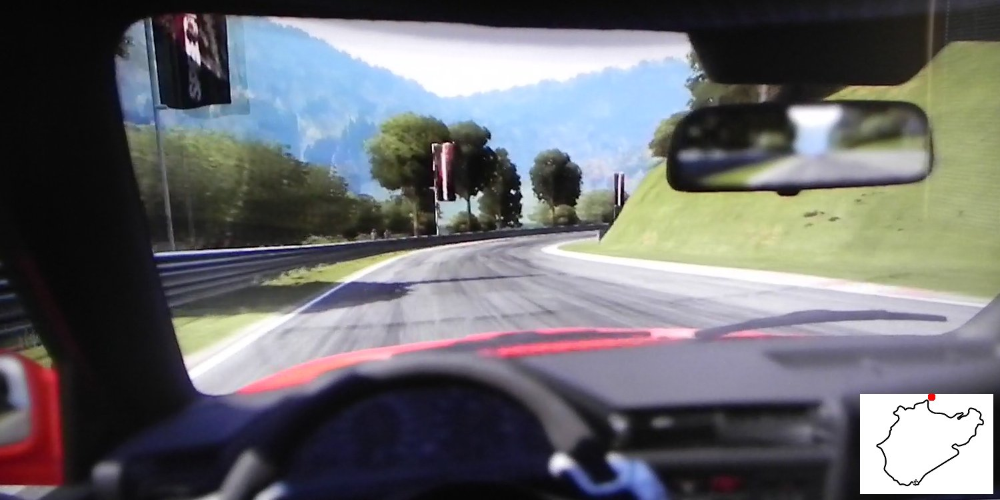

## *Kesselchen (10 km)*

Kesselchen is a long, uphill section that strings together four hidden left kinks, three hidden right kinks, and one more left kink. Pour on the coal.

Initiate turn in for Kesselchen 1 as you approach the 10 km sign posted behind the Armco on the right, as can be seen in the image below. You will not be able to see the apex until you are well past the kilometre marker. Hug the apexes of Kesselchen 1 and Kesselchen 2.

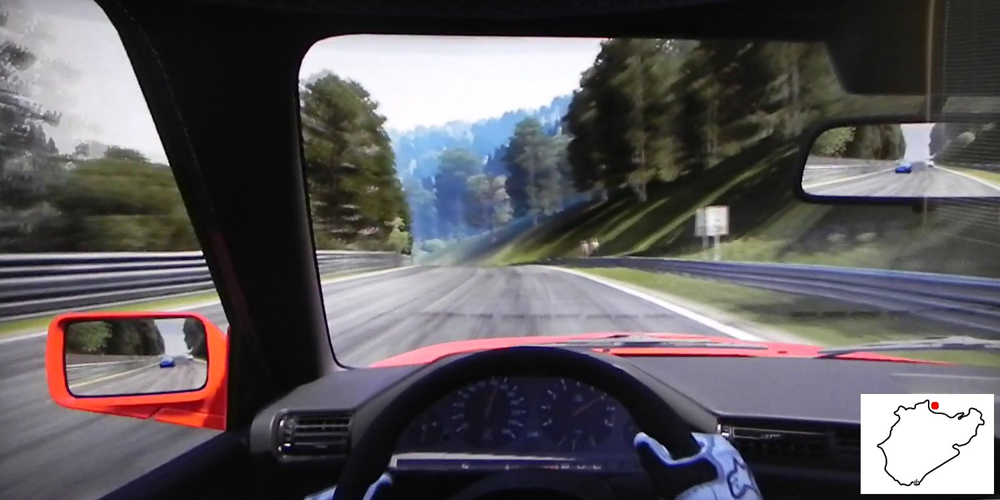

Out of Kesselchen 2, continue a gradual left turn, and begin creeping toward the right.  Take Kesselchen 3 somewhere in the middle of the track. As you approach Kesselchen 4, you should be on the right edge of the track. Because you are travelling at a pretty good clip by now, you should initiate turn in earlier than your eyes tell you, in order to account for the power drift.

As you continue up the hill, the next two corners, Kesselchen 5 and Kesselchen 6, are quite uneventful. Both are right flicks. Drift to the left side of the track after you pass the apex of Kesselchen 6. Turn in early to clip the right apex of Kesselchen 7. Then, immediately flick left in order to clip Kesselchen 8’s apex. Drift to the right edge of the track, as you exit the section.

## *Mutkurve (11 km)*

Left-foot brake a little to turn into Mutkurve, which is a fast left-hander. At the exit, there is a low curb on the right. Mount this curb, if you must. This is the 11 km mark.  In the image below, the car is about to turn sharply into Mutkurve.

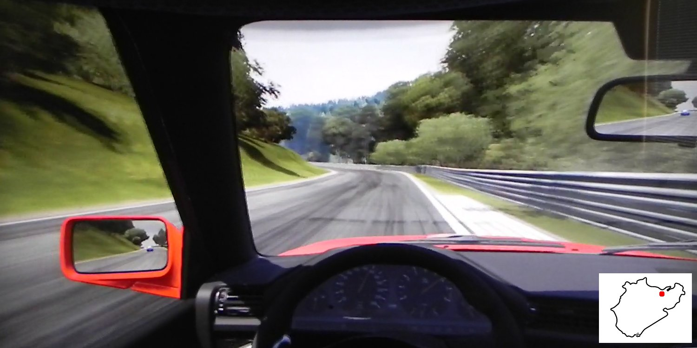

## *Klostertal*

Approach Klostertal from the far left.  This is a very fast right flick, so take it at full throttle. You will not be able to see the apex, until after you have passed the crest at the entry. Turn in early to account for the excess speed, and insert the car onto the inside of the crown. In the image below, the car is about to crest the little rise at the entry of Klostertal. The apex is still hidden behind the Armco, at this point. Stay to the right side of the track after exiting.

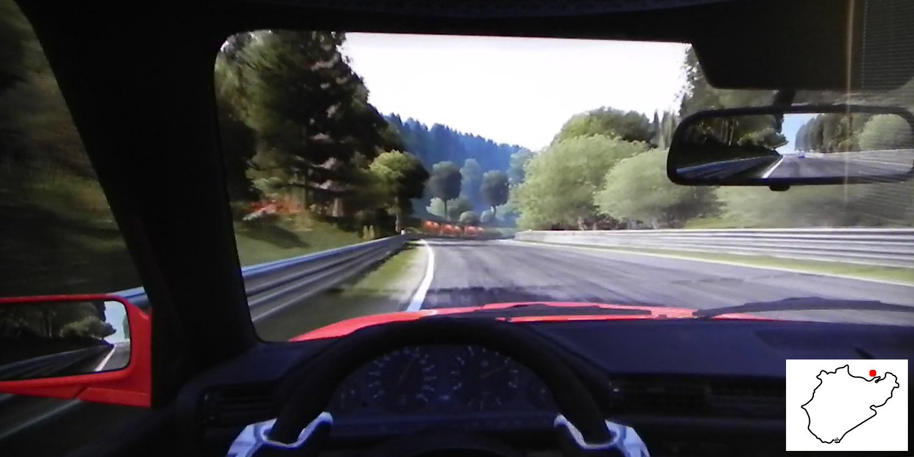

## *Steilstrecke*

As you climb up the hill toward Steilstrecke, heel-and-toe downshift just about where the car is in the image below. This is a U-shape turn, but it is not too sharp, and the track is very wide at the apex. It is actually an expanding radius corner. You can four-wheel drift through it in relative comfort.  Because it is gradual and fast, it does not qualify as a hairpin. Accelerate early and hard, and gently clip the left apex as you shoot out of the corner and climb up the hill. Go over to the right side of the track.

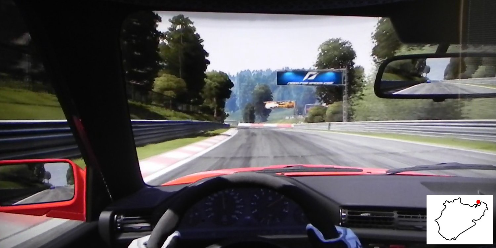

## *Caracciola Karussell (12 km)*

To many, the name “Nordschleife” evokes the vision of this iconic, oddly banked, lumpy corner. It is named after Rudolf Caracciola, a great 1930s German racer, who pioneered the use of the steep concrete banking, shown in the image below. The concrete banking was originally constructed to help drain the water off the track. But, Caracciola discovered that cornering speed is higher on the banking than on the flat bit. Although this corner has a U-shape layout, its curvature is gradual and is overtly banked, so it is not really a hairpin turn.

Heel-and-toe downshift at the entry, and insert the car onto the banking. Use care; the flat-to-banked transition is rather abrupt, and can unsettle the car. Remain on the banking at neutral throttle, mid corner.  If you are heavy-footed on the throttle here, you will exceed the tyres’ traction limit and will slide off the banking onto the flat part, thus losing speed. Use a touch of left-foot braking, if you find yourself sliding off the banking. No matter what, do not mount the inside curb.

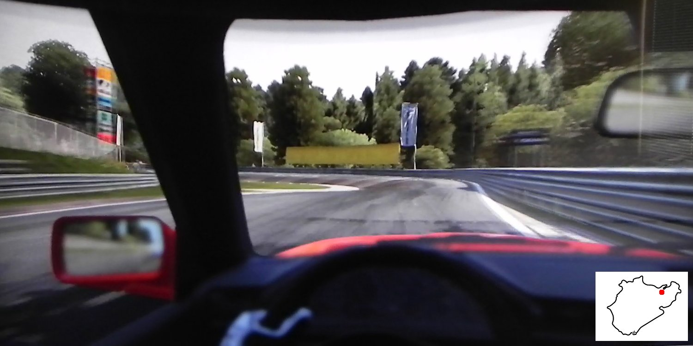

Do not look at the banking in front of your nose; look as far down the track as you can. As soon as the exit point becomes visible through the left window, begin accelerating smoothly. Time the acceleration so that you are at full throttle as you cross the banked-to-flat transition, with your nose pointed at the Armco on the right. Again, take care not to upset the car too much at the transition.  You are now at the 12 km mark.

## *Hohe Acht*

Between Caracciola Karussell and Hohe Acht, there is a kilometre-long, unnamed stretch of track that includes a few fast and interesting corners. I shall describe this bit as part of Hohe Acht.

Immediately after emerging from Caracciola Karussell’s banking, there appears a pair of right flicks in quick succession. Clip the apexes, and accelerate onto a short straight that follows. At the end of this straight, there is a fast, rising right-left flick, which we will call Hohe Acht 1. Take this corner at full throttle. Briskly flick the steering wheel to the left just before you reach the left apex. This sudden weight transfer jacks up the left side, so you may safely mount the left apex without unsettling the car. In the image below, the car has just mounted the left apex of Hohe Acht 1. Another short straight that follows can be seen ahead.

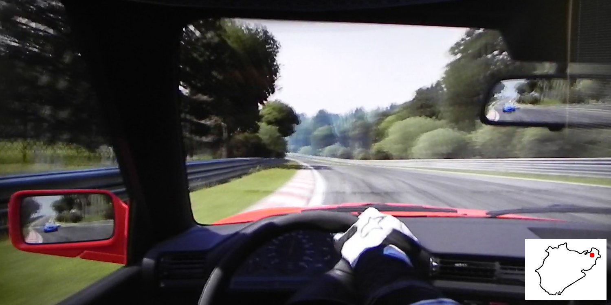

Drift over to the right side of the track on the short straight, and heel-and toe downshift. Hohe Acht 2 is a left-right combination. You may straight-line this blind, uphill corner, if you time your turn in right.  Clip both the apexes neatly, and climb up the hill. Note that if you delay the turn in until you see the alignment of the two apexes, you will be too late. Both the apexes have large bumps that unsettle the car, so mind the entry speed.

As you crest the hill, there is a tricky right-hander just ahead, which is the actual Hohe Acht corner, but we will refer to it as Hohe Acht 3 in keeping with our unofficial numbering scheme.  The apex of this corner is hidden behind the Armco, and it is adversely cambered. And, there are marbles off the line.  Turn in early here.

## *Hedwigshöhe (13 km)*

Continue climbing the hill after you exit Hohe Acht. At the crest of this hill is a barely perceptible left kink called Hedwigshöhe. It is named after the track designer Dr. Otto Creutz’s wife, Hedwig. At the elevation of 625 m above sea level, it is the highest point on The Ring. It is 293 m above Breidscheid, the lowest point. In the image below, you can see the apex of Hedwigshöhe left kink. Clip this apex. You are now at the 13 km mark, and are staring your descent back to the lowlands.

## *Wippermann*

The next fast right-hander begins a twisty, bumpy bit called Wippermann. A right, a left, and another right closely follow one another. From the far left, turn in with gusto to clip Wippermann 1’s apex. If you do not manhandle the car, the downhill slope and the fast speed conspire to cause a frightful understeer. The image below shows the downhill entry into Wippermann 1.

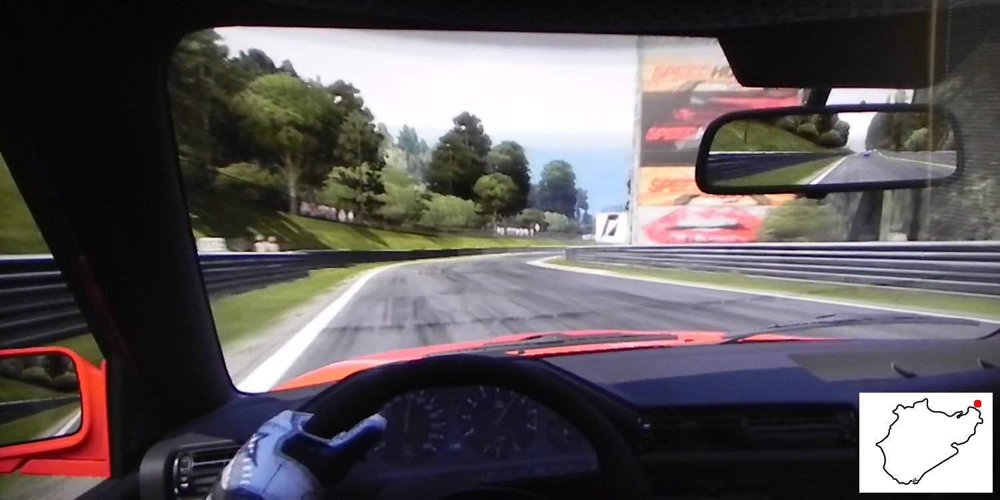

Wippermann 2 is an adversely cambered left-hander. Take a late apex, and stay on the left side of the track thereafter.

Use a dab of left-foot brake to turn into Wippermann 3, a right-hander with an adverse camber.  Sweep down the hill that comes after the apex, and glide over to the left edge on the short straight that follows. This downhill is quite steep.

## *Eschbach (14 km)*

Eschbach consists of a right and a left. Both their entries are on a downhill slope, and are adversely cambered. Eschbach 1’s apex is at the crest of a sharp rise. Turn in early and give a little more throttle about halfway up the incline. This will shake loose the rear, thereby mitigating the understeer brought on by the adverse camber. At the exit, accelerate and let the car drift to the left side. Then, swing back to the right side to prepare for the next corner.

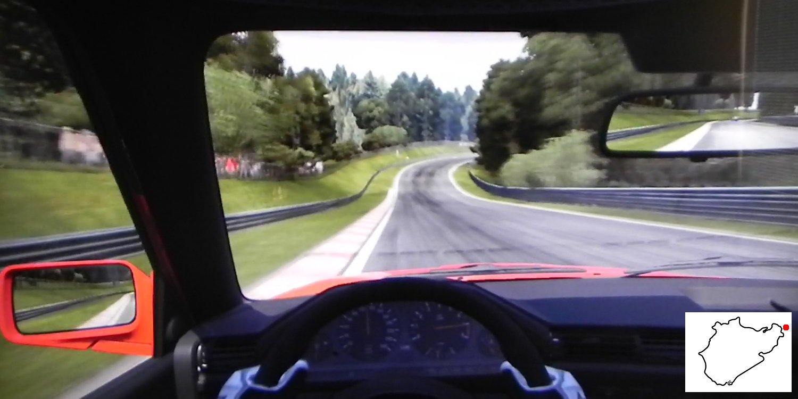

Eschbach 2 is actually an increasing radius, double-apex left-hander. Clip the apex of Eschbach 2A, then immediately clip Eschbach 2B’s apex, and remain on the left side of the track. You may mount the low curb at the apex without ill effects. The 14 km mark is at the apex of Eschbach 2B.

## *Brünnchen*

Brünnchen is a pair of tricky right-handers. Brünnchen 1 is a particularly illusive corner. If you do not hug close to the apex, the car will massively understeer at the exit and slide onto the left-side low curb that runs the length of the downhill, short straight that connects the two Brünnchen corners. Going too far onto this curb will drain speed. With a little excess speed through Brünnchen 1, you might even slide off onto the grass. So, left-foot brake, take an early apex, and stay close to the apex as long as necessary to prevent sliding off the track.

Brünnchen 2 is the easternmost point on the track.  Brünnchen 2 appears quite similar to Eschbach 1, both the entry and the exit. But in truth, Brünnchen 2 is slightly sharper than Eschbach 1. Do not mistake one corner for the other. If you were momentarily inattentive and mistook one corner for the other, you will lose your location awareness and confusion will follow, directly. Gently dab the brake paddle with your left foot at the turn in to slow the car to an appropriate speed and to help rotate it into the corner.

## *Eiskurve*

Eiskurve is so named because in winter it is usually covered in thin, black ice, due to it being perpetually shaded by the tall trees, as can be seen in the image below. Approach Eiskurve from the right side of the track, turn in hard, and place the car on the inside of the crown.

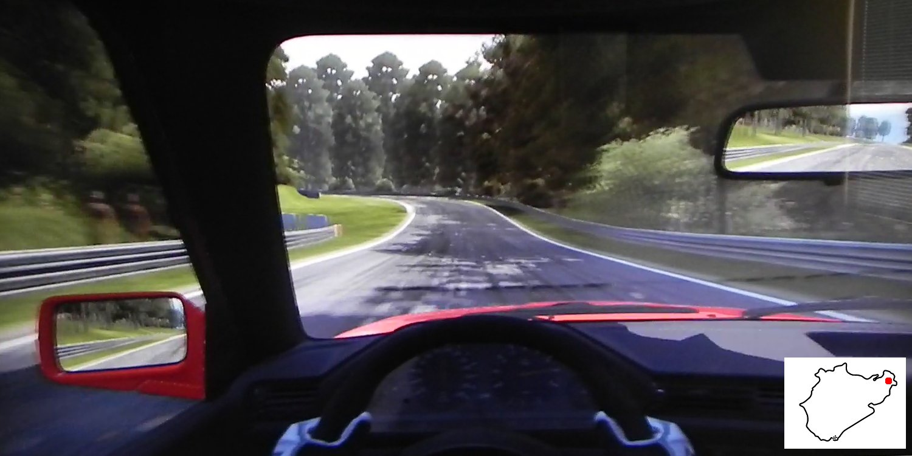

Although the bit between Wippermann and Eiskurve is undulating, twisty, and bumpy, it is certainly possible to traverse the entire stretch in one gear, if the proper ratio is selected. To accomplish this, you must know the proper lines through all these twists and turns, and must be able to carry speed through them by constantly dancing on the throttle and brake paddles.

## *Pflanzgarten (15 km, 16 km)*

Pflanzgarten is a rather long section that includes two steep, high-speed drops where you can get airborne, if overenthusiastic. Both drops are situated on a downhill slope, and both turn into sharp right-handers. So, it is possible for a novice to confuse these two drops. Be forewarned.

The approach into the first drop at Pflanzgarten 1 is long and sinuous, but not complicated. Settle the car on the left edge of the track, and plunge down the drop. In the image below, the car is on the ledge of the drop. You are now at the 15 km mark.

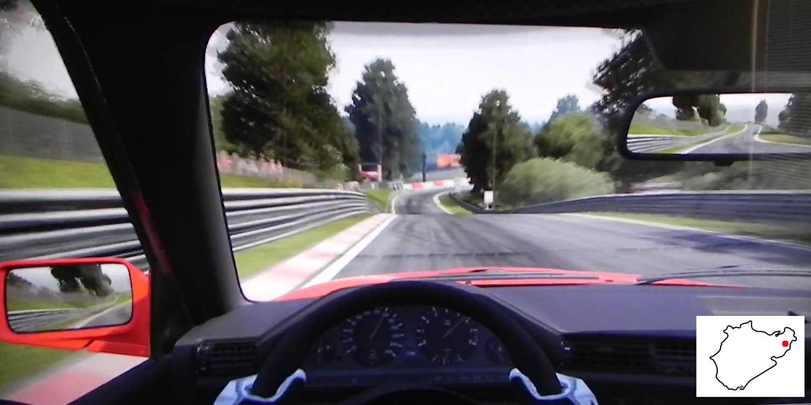

Quickly heel-and-toe downshift at the base of Pflanzgarten 1 drop, settle the car, and briskly turn in for the double-apex right-hander that follows. If necessary, use mid-corner left-foot braking or steering rocking to prevent understeering off into the gravel trap.

Float over to the left edge of the track as you exit, settle the car with a dab of left-foot braking, and take the plunge down Pflanzgarten 2. As can be seen in the image below, this drop is even steeper than the one at Pflanzgarten 1. You must slow down at the approach and inject the car precisely onto the narrow racing line. Otherwise, you may understeer toward the middle of the track, and will be lobbed high in the air by the big ledge that looms over the drop. You will then lose a lot of time trying to wrestle a mad, bucking bronco. This is bad, because a long, fast stretch is just ahead.

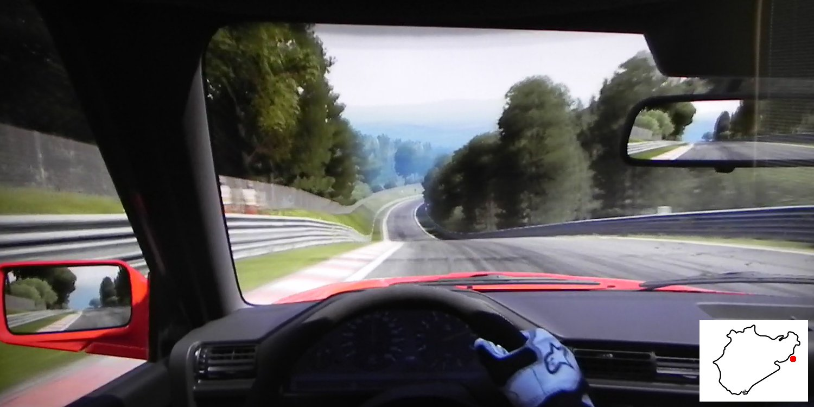

Coming out of Pflanzgarten 2, you come upon a stretch that includes two pairs of right-left kinks. This is Pflanzgarten 3.  It is long, fast, twisty, bumpy, and slippery, so it can be a challenge to keep the car on the track. The apex curbs are high; do not mount them, especially at this speed. Pflanzgarten 3 is rhythmic in that it demands a keen sense of timing and a deft touch.  The 16 km marker is located between the first and the second pair of right-left kinks. Remain on the left side of the track at the exit.

## *Schwalbenschwanz*

Schwalbenschwanz comprises of a right- and a left-hander. Approach Schwalbenschwanz 1 from the left side at full throttle. Heel-and-toe downshift and turn in sharply, just as the left-hander at the top of the hill becomes visible. In the image below, the car is initiating the turn in for Schwalbenschwanz 1, and Schwalbenschwanz 2 is barely visible off to the right beneath the rear view mirror. Hug the inside curb at Schwalbenschwanz 1, and remain on the right side of the track. Schwalbenschwanz 1 is faster than it appears. Carry a bit more speed through it than your instincts dictate.

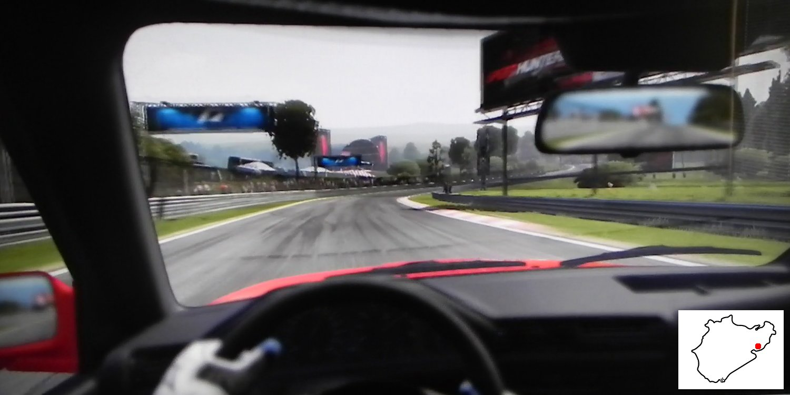

Make an early turn in for Schwalbenschwanz 2. Do not slide up onto the high curb on the right at the exit. Accelerate out of the exit and drift over to the right side of the track.

## *Kleines Karussell (17 km)*

This corner is called Kleines Karussell, the mini-carrousel, because it is shallower and shorter than Caracciola Karussell. Despite its shabby appearance, this corner is quite fast. Remaining in the same gear, left-foot brake into the corner and power through it, using the banking for support. It is more important to stay on the banking than to clip the apex. Be smooth over the surface transitions as before, and do not slide out of the banking. Enter this corner as shown in the image below. The 17 km mark is at the end of the banking. Accelerate out of Kleines Karussell, and remain on the left side of the track.

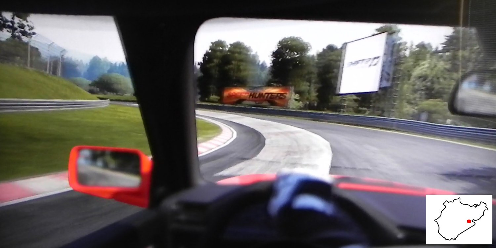

## *Galgenkopf*

Galgenkopf is a long, double-apex right-hander, with the slope inflection from up to down located at the midpoint between the two apexes. Left-foot brake, and turn sharply into the first right-hander, as shown in the image below. If necessary, nudge the right front wheel against the curb to ameliorate understeer.

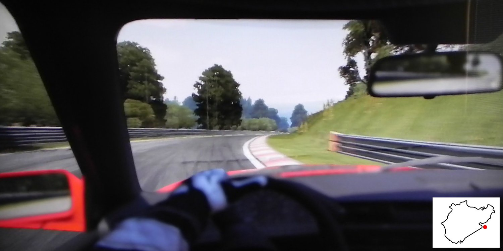

Drift over to the left edge at the top of the crest, and begin turning into the second right-hander. Get back on the throttle as soon as maybe, so as to take advantage of the long, long straight that follows.

## *Döttinger Höhe (18 km, 19 km)*

Döttinger Höhe is not at all a corner. Indeed, it is one of the longest straights on any racing circuit. If we do not consider the fast kinks at Antoniusbuche and Tiergarten as corner, this section was even more awe-inspiring on the pre-1967 track, when there was no Hohenrain-Schikane and the old pit straight extended the reach of Döttinger Höhe an extra kilometre, all the way down to the Südkehre, thus making it about 5 km long.

In its present form, Döttinger Höhe starts at the Audi gantry, and ends at the Bilstein bridge just before Antoniusbuche. The Audi gantry marks the 18 km mark. The 19 km mark is where the Touristenfahrten car park is located off to the right side of the track, somewhere around the middle of the straight.

Beyond the Audi gantry, the track drops in elevation noticeably, as can be seen in the image below. Stay in top gear at full throttle until you pass the left-hander at the entry of Tiergarten.

## *Antoniusbuche*

Antoniusbuche is perhaps the fastest bend on The Ring, because it is so gradual that it may be taken in top gear at full throttle. The apex of this corner is just beyond the Bilstein bridge. The track rolls gently downhill starting at the bridge, so you cannot see the apex until you pass under the bridge. So, use the bridge as the reference point, and initiate turn in just before you reach the bridge, as shown in the image below. Clip the apex at full throttle without mounting the curb, because upsetting the car at this speed could be harmful to your health. At the exit, drift out to the right side of the track.

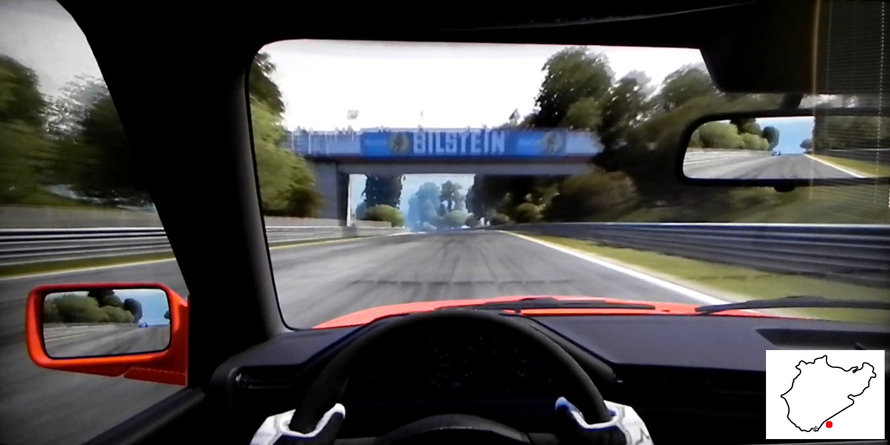

## *Tiergarten (20 km)*

As you crest the hill at the apex of Antoniusbuche, you will see Tiergarten ahead. The 20 km mark is along this downhill short straight. The line through Tiergarten can be seen in the image below as a dark streak veering to the left. Stay on the right side of this short straight as you approach Tiergarten.

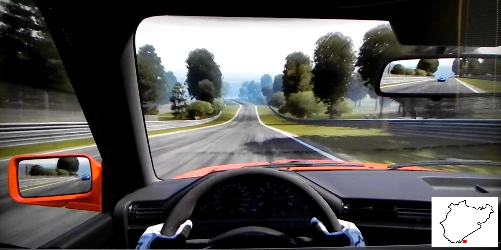

Tiergarten is a quick, left-right kink. Stay at full throttle through the left (first) kink. You may clip the curb as shown in the image below, but do not mount it. Upon reaching the right (second) kink, stand on the brake paddle, and begin descending down the gears using the heel-and-toe technique.

## *Hohenrain-Schikane*

You will be entering Hohenrain-Schikane almost immediately after you exit Tiergarten. Continue stepping down the gears until you reach the cornering gear for the chicane. There is a road that enters the chicane from the left. You can go beyond the white line that marks the left edge of the track, steal that little patch of tarmac at the entry, and straighten the right-left exit portion of the chicane.

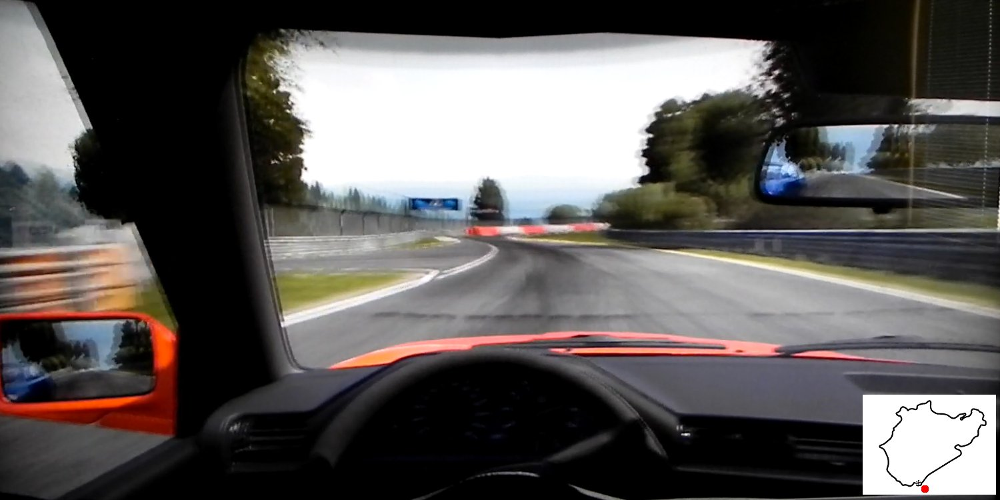

At the exit, stay to the left side of the track. You are now entering T13, the section in which the start-finish line is located. Congratulations; you survived a lap round the Nordschleife.

# CONCLUSION

Learning to drive The Ring is not easy. Indeed, just remembering the corner names is daunting enough. But, keep accumulating seat time, and I assure you that you will learn to enjoy the Nordschleife. By seat time, I mean putting in a few laps, striving to improve your time, and evaluating your mistakes.  Every driver makes mistakes once in a while, even the professionals. So, do not be disheartened.  And, sight and muscle memories take time to develop, and are easily perishable. Patiently develop the memory, and maintain it through regular use. Lastly, analyse each lap.  Calm your nerves. Develop patience. Never give up. And, good luck.