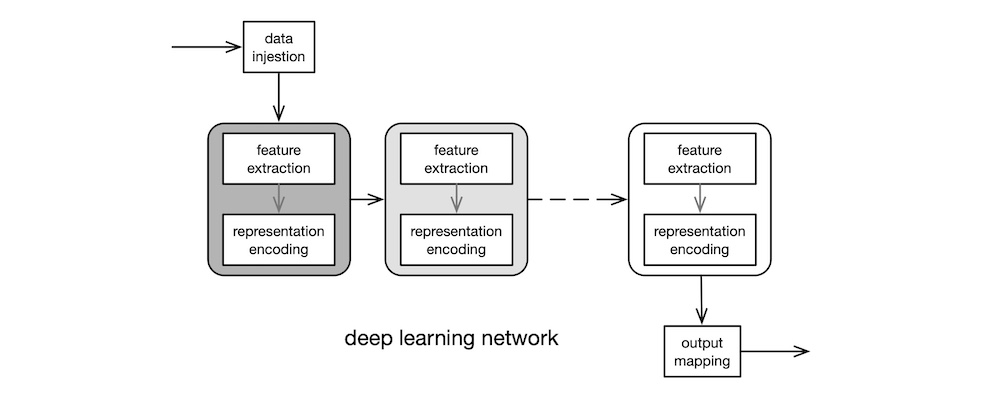
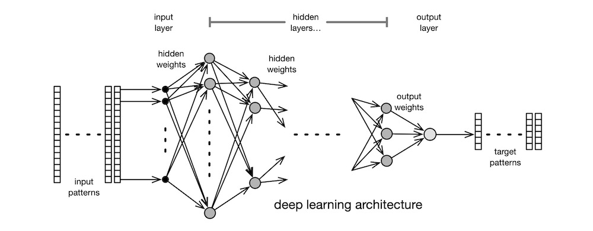

# INTRODUCTION

In this article, I present a high-level overview of artificial intelligence (AI). I describe what AI is, its inner workings, its uses, and its social and ethical implications. All technical writings fall in the spectrum between scientific textbooks and newspaper reports. Textbooks are accurate, precise, and concise, but dense. Reports are vague and fluffy, but accessible. Because I wrote this article for anyone who is curious about how AI works, it is nearer to the report end of the spectrum than to the textbook end. But I tried to be as accurate as possible, without diminishing accessibility. Where appropriate, I traded precision and concision for readability. More importantly, this is a "how it works" article for the general public, not a "how to work with it" guide for the practitioners. The discussions, therefore, centre round the simpler, classical algorithms, and not so much on the sophisticated, cutting-edge techniques.

# APPROACHES

There are tonnes of approaches used in AI: genetic algorithms, support vector machines, Bayesian networks, decision trees, stochastic methods, deterministic rules—the list is long. It is also important to realise that there are many classical approaches, such as signal processing, principal components analysis, and so on, that are capable of solving many of the same set of problems that AI can solve.

In this article, we concentrate on the two historically significant AI traditions: connectionist and rule-based. *Connectionist* AI is commonly known as neural networks. *Rule-based* AI is traditionally associated with the LISP programming language. The most prevalent approaches currently in use are of the connectionist variety, which shall be our primary focus, here.

## *connectionist*

The myriad AI techniques that are in popular use today, different as they may appear, all share a common foundation: they all come under the umbrella term *artificial neural network* (NN). NN is a computational approach inspired by the quintessential biological neural network—the [brain](https://en.wikipedia.org/wiki/Brain). The most basic processing unit in the brain is the [neuron](https://en.wikipedia.org/wiki/Neuron). See the figure below. The [dendrites](https://en.wikipedia.org/wiki/Dendrite) of the neuron receive electrochemical signal inputs as weighted outputs from the upstream neurons. The weight can be negative, zero, or positive. The [soma](https://en.wikipedia.org/wiki/Soma_(biology)), the cell body, sums up the weighted input signals. The neuron also receives activation signals via the dendrites. Inhibitory (negative) activation signal keeps the neuron inactive. Excitatory (positive) activation signal causes the neuron to fire its output, which is derived from the weighted sum of its inputs. The [axon](https://en.wikipedia.org/wiki/Axon) trunk carries the output signal to the [synapses](https://en.wikipedia.org/wiki/Synapse), which make electrochemical connections to the input dendrites of downstream neurons. Learning involves establishing, strengthening, weakening, and removing signal pathways among the neurons. Although the structure and functions of the brain are far more intricate and complex, the simply-butchered description above suffices for our purposes, here.

The earliest, practical NN model was invented in 1943 by neuroscientist [McCulloch](https://en.wikipedia.org/wiki/Warren_Sturgis_McCulloch) and logician [Pitts](https://en.wikipedia.org/wiki/Walter_Pitts) at University of Chicago. The diagram below shows the [McCulloch-Pitts](https://en.wikipedia.org/wiki/Artificial_neuron) artificial neuron. The neuron $n_j$ computes its output $o_j = f_j(i_j)$ where its transfer function is $f_j$ and its net input $i_j = \sum_i w_{ji} o_i$. The McCulloch-Pitts neuron uses the threshold function as its transfer function. This is the simplest model of the biological neuron's activation behaviour.

The convention in NN literature is to label input signals $i$, output signals $o$, and weights $w$. And the neurons in the adjacent upstream layer are indexed with $i$, the neurons in the current layer with $j$, and the neurons in the adjacent downstream layer with $k$. So, the labels can get a bit knotty at times—$i_i$, $o_i$, $i_j$, $o_j$, etc. Also, since a weight is associated with the connection between two neurons in adjacent layers, the input connection weights of the neuron $n_j$ are labelled $w_{ji}$ and its output connection weights are labelled $w_{jk}$. Programmers, beware!

So, by convention, the $o_i$ is an upstream neuron $n_i$'s output signal that arrives at the neuron $n_j$ via its input connection that has the multiplier weight $w_{ji}$. The neuron $n_j$ then sums all its weighted inputs $w_{ji} o_i$, and passes this net input value through its transfer function $f_j$ to compute its output $o_j$. The output $o_j$ is then sent to downstream neurons.

To form a neural network, artificial neurons are assembled into a processing layer, as shown below. Learning involves presenting a set of input patterns to the network and then incrementally modifying its connection weights in accordance with how well the network responds to each pattern. A weight adjustment method is referred as a *learning algorithm*. There are many such algorithms. After having learned the input data set repeatedly in this manner, the final weight values produced by the algorithm encode the salient features present in the data set.

The two main types of learning algorithms are the supervised and the unsupervised varieties. A *supervised* learning algorithm requires the user to create a set of target (desired output) patterns, one for each input pattern, whereas an *unsupervised* learning algorithm does not require target patterns.

There have been many classic NN learning algorithms. The first was the unsupervised [self-organising](https://ieeexplore.ieee.org/document/1057468) learning algorithm invented by Farley and [Clark](https://en.wikipedia.org/wiki/Wesley_A._Clark) in 1954. Although unsupervised learning algorithms are less frequently used today, the [self-organising map](https://en.wikipedia.org/wiki/Self-organizing_map) (SOM) algorithm is well known. The algorithm was published in 1982 in the paper *[Self-organized formation of topologically correct feature maps](https://link.springer.com/article/10.1007/BF00337288)* by Finnish engineering professor [Kohonen](https://en.wikipedia.org/wiki/Teuvo_Kohonen), who was inspired by the human perceptual systems, specifically the visual and the aural. Most learning algorithms in use today, however, are of the supervised variety. They trace their origins to the [Perceptron](https://en.wikipedia.org/wiki/Perceptron), a supervised learning algorithm for linear classifiers. It was invented by American psychologist [Rosenblatt](https://en.wikipedia.org/wiki/Frank_Rosenblatt) in 1957. He first implemented the algorithm on Cornell's IBM 704 mainframe. Subsequently, he built a custom, electromechanical [analogue computer](https://en.wikipedia.org/wiki/Analog_computer), called the Mark I Perceptron, which used motorised [potentiometers](https://en.wikipedia.org/wiki/Potentiometer) to represent trainable (adjustable) weights. Perceptron was capable of recognising letters. The eye of the Perceptron was a $20 × 20$ grid of photocells that produced a [greyscale](https://en.wikipedia.org/wiki/Grayscale) image. This resolution, though very coarse, was adequate to encode letters presented to the sensor.

Many in IT today are of the opinion that AI is a simple matter of programming to an API published by an Internet Giant. In truth, psychologists, neuroscientists, mathematicians, electrical engineers, computer scientists, and STEMers of all stripes participated in establishing and advancing the NN subfield of AI: psychologists brought forth the concept of connectionism; mathematicians provided the theoretical foundation; electrical engineers built the first neuro computers; computer scientists implemented the early simulations. Hence, AI is definitively a multi-disciplinary field of study.

## *rule-based*

The main weakness of the Perceptron was its dogged linearity: it can only learn to discern patterns if they are linearly separable—that is, their classifier boundary is a straight line. The Perceptron's inability to learn even the simplest of non-linear classifiers, like the one required to implement the [exclusive or](https://en.wikipedia.org/wiki/Exclusive_or) (XOR) function shown in the figure below as a dotted curve, led to its eventual downfall.

In 1969, [Minsky](https://en.wikipedia.org/wiki/Marvin_Minsky) and [Papert](https://en.wikipedia.org/wiki/Seymour_Papert) of MIT AI Lab published their book, [*Perceptrons*](https://en.wikipedia.org/wiki/Perceptrons_(book)). This book contains mathematical proofs of why the Perceptron algorithm is incapable of solving non-linear problems. Minsky and Rosenblatt were childhood friends. Minsky dedicated his book to Rosenblatt—cheeky.

Minsky was motivated, at least in part, to show the limitations of the connectionist approach, because his AI Lab at MIT was wholly dedicated to rule-based approach. In 1958, [McCarthy](https://en.wikipedia.org/wiki/John_McCarthy_(computer_scientist)) created the [LISP](https://en.wikipedia.org/wiki/Lisp_(programming_language)) programming language at MIT. Coincidentally, the first implementation of LISP was for the IBM 704. LISP was a machine implementation of [𝜆-calculus](https://en.wikipedia.org/wiki/Lambda_calculus), a mathematical model of computation created by [Church](https://en.wikipedia.org/wiki/Alonzo_Church) in 1936. LISP was also the second high-level programming language (after FORTRAN) and the first [functional](https://en.wikipedia.org/wiki/Functional_programming) programming language. The mathematical heritage and the [symbolic processing](https://en.wikipedia.org/wiki/Computer_algebra) abilities of LISP were well suited to implementing rule-based AI programmes, and it quickly became the favourite among the rule-based crowd, [especially at MIT](https://en.wikipedia.org/wiki/Lisp_machine). Suffice it to say, Minsky's *Perceptrons* killed off Rosenblatt's Perceptron and other NNs. By the early 1970s, rule-based expert systems dominated AI.

An [expert system](https://en.wikipedia.org/wiki/Expert_system) is an AI application modelled upon the way human experts make technical decisions in the course of performing their daily duties. Early automated theorem proving systems, chess playing systems, and decision support systems were, in essence, expert systems. Such a system is preconfigured with a set of rules for making decisions—selecting a `yes` or a `no` at each step. When the user provides an input, the system applies the rules against the input and, step by step, arrives at a decision. When the set of rules is comprehended and comprehensive, expert systems work exceedingly well. Another major advantage of expert systems is that the results can always be explained fully by simply tracing the algorithm's path down the decision tree.

But few things in nature exhibit such orderly behaviour. Moreover, humans understand even fewer things in nature at such a level of detail. Even if we manage to grasp the dynamics of a large problem, the rules and their interactions would be intractable. Unfortunately, the purveyors of expert systems over promised and the media over reported the hype. By the early 1980s, the users and the public had lost interest in expert systems, and the funding spigot was shut. This period is now known as [AI Winter](https://en.wikipedia.org/wiki/AI_winter).

## *backpropagation*

A few researchers who saw the true strengths of AI continued working in the field—underground. Then, in 1986, [Rumelhart](https://en.wikipedia.org/wiki/David_Rumelhart), [Hinton](https://en.wikipedia.org/wiki/Geoffrey_Hinton), and [Williams](https://en.wikipedia.org/wiki/Ronald_J._Williams) published their seminal paper, *[Learning representations by back-propagating errors](https://www.nature.com/articles/323533a0)*. Their learning algorithm became known as *backpropagation* (BP). BP is a supervised learning algorithm that modifies the network's weights in proportion to the amount of representation error the network commits in each training pass through the data set. In that respect, BP's learning process is no different in kind than that of the Perceptron: find the optimal set of weights that minimise representation errors. But BP's main advantage over the Perceptron is its ability to learn non-linear classifiers. Indeed, non-linearity was why BP works and Perceptron did not.

Because the Perceptron uses a linear transfer function, assembling such linear neurons into multiple layers is mathematically equivalent to creating just one layer, due to the [superposition principle](https://en.wikipedia.org/wiki/Superposition_principle) of linear systems. Hence, a Perceptron network can have only one layer of weights to represent the data set. On the contrary, since BP uses neurons with non-linear transfer functions, multiple hidden layers can be used to create a stack of increasingly abstract internal representations of the input data. A typical BP network is shown in the figure below.

Mathematically, the BP learning algorithm is a simple, [gradient descent](https://en.wikipedia.org/wiki/Gradient_descent) optimisation scheme known to mathematicians since [Cauchy](https://en.wikipedia.org/wiki/Augustin-Louis_Cauchy) introduced it in 1847. But practically, it was capable of solving substantive problems which, until then, were deemed too difficult for machines.

In the 1980s, a room-sized minicomputer, like the [DEC VAX-11/780](https://en.wikipedia.org/wiki/VAX-11), had 1 MB of RAM, usually much less. So, the simulated networks of the time were very small, a typical model having just two layers and a handful of neurons in each layer, as shown in the figure above. Despite such restrictions, BP-based networks were able to solve efficiently a number of complex, non-linear problems, like speech recognition, image classification, robotics control, etc. Within a couple of years, BP single-handedly resuscitated the dying AI field. Many variants and improvements soon followed, further improving network performance. Understandably, the AI community was cautiously optimistic, this time round.

Most users of NNs simulate on the then-high-end, mainstream computing hardware, like the VAX-11 or RISC workstations. Those machines, though powerful for their day, are severely limited in both CPU power and RAM capacity. In response, a number of groups developed custom hardware for neurocomputing. Some built machines out of common digital hardware but optimised for neurocomputing, but others designed custom analogue VLSI chips. The Stanford group led by [Mead](https://en.wikipedia.org/wiki/Carver_Mead) was especially productive in this area. His PhD student, [Mahowald](https://en.wikipedia.org/wiki/Misha_Mahowald), developed the [silicon retina](https://en.wikipedia.org/wiki/Event_camera), which is an image sensor technology that out performs the human eye and the best DSLRs by several orders of magnitude. This technology was further developed by Mead's company, [Foveon](https://en.wikipedia.org/wiki/Foveon), which is now part of [SIGMA](https://www.sigma-global.com/en/).

Most folks today are unaware that there was an AI Mini Ice Age during the late 1990s. Although the processing capabilities had increased leaps and bounds by then, the storage technology was still limited. Disc sizes were still measured in MB, albeit in hundreds thereof. Most data sets used in AI were only a few MBs in size. The lack of storage capacity necessarily constrained the completeness of data sets. So, neither humans nor networks could analyse the true nature of massive, complex, dynamical systems. The lack of data, thus, stunted the growth of AI. To get around some of the limitations, many experimented melding rule-based and connectionist techniques. But for the most part, NNs were confined to academic research and to small-scale commercial use during this period. The [dot-com collapse](https://en.wikipedia.org/wiki/Dot-com_bubble) at the end of the 1990s and the subsequent economic stagnation did no favours to AI research.

## ***deep learning***

Then came the age of Internet Giants—around mid 2000s. Massive, simultaneous advances in computing capability, storage capacity, network connectivity, graphics coprocessors, and parallel-processing software techniques gelled together to fuel what turned out to be the fastest growth in the history of human inventions. The Web came of age. Online shopping and social media became the norm. Billion-user platforms became commonplace. The Internet Giants saw gold to be mined in the private data that the users willingly exchanged for free access to frivolous social media services. [Big data](https://en.wikipedia.org/wiki/Big_data) was thus born. By 2010s, everything had converged: massive amounts of collected data, advances in NN algorithms, huge rise in computing power. It was in this Era of Data that people began recognising the true potential of BP, or rather its descendant—[deep learning](https://en.wikipedia.org/wiki/Deep_learning) (DL).

There is no one individual or team whom we can attribute (or blame, depending on one's perspective) as the inventor of DL. But many in the field point to the arrival of Hinton (of the BP fame) at Google in 2013 as the birth of modern DL. The basic ideas of DL have been [around since the mid 1980s](https://en.wikipedia.org/wiki/Rina_Dechter), and over the decades many researchers have contributed to the development of DL. It was not until the mid 2000s, however, that those disparate ideas coalesced into a usable form. This coincided with the sudden rise in hardware capability, software techniques, and data availability. Indeed, it could be argued that DL was inseminated, incubated, and raised by the Internet Giants, driven by their desire to exploit the obscene amounts of behavioural data they were amassing about the whole human population. In stark contrast, all classic NN techniques were hatched in academia.

Whereas the classic BPs of the 1990s could only use two or three layers of neurons due to hardware limitations, the DLs of the 2010s routinely employed many layers, each containing different types of neurons. Today, home users of DLs train their massive networks on powerful, but inexpensive, graphics cards, like the [nVIDIA RTX](https://www.nvidia.com/en-us/design-visualization/desktop-graphics/) so as to exploit the GPU's built-in support for parallel matrix operations across tens of thousands of cores. The "deep" in deep learning refers to the many hidden layers of neurons, as shown below in grey boxes.

Another substantial advantage of modern DLs over classic BPs is feature extraction. Feature extraction required the use of sophisticated, mathematical techniques such as [digital signal processing](https://en.wikipedia.org/wiki/Digital_signal_processing) (DSP), [digital image processing](https://en.wikipedia.org/wiki/Digital_image_processing) (DIP), [natural language processing](https://en.wikipedia.org/wiki/Natural_language_processing) (NLP), etc. Each such technique constitutes a highly specialised, not to mention expansive, subfield within mathematics or engineering. So, competent practitioners were relatively few in numbers in the early days, which constrained the potential of BPs. But DLs subsume feature extraction into the front-end layers of the network. That is, a properly designed DL network automatically extracts salient features from the data, and learns to represent those features in its connection weights, with little or no guidance from human experts. Hence, DL networks can be used profitably, even by non-experts.

Paradoxically, this characteristic of DLs is also a disadvantage of sort: if a complex AI problem can be solved merely by clicking a button on a GUI, there is no need for the user to perform any analysis of the problem domain and of the massive amounts of data accumulated, so he gains no insight into the problem and he cannot explain the reasons why the solution appears to work. Regardless, DLs are here to stay; now is their day.

Over the past quarter century, our shopping habits, social media propensities, blogging activities, email exchanges, cloud-borne personal information—just about every aspect of our lives, both personal and professional—have been collected, analysed, categorised, tracked, and predicted by Internet Giants' DLs. Despite their prominence in modern life, however, DLs are but a small part of a much broader category of powerful modern methods known collectively as [machine learning](https://en.wikipedia.org/wiki/Machine_learning) (ML) algorithms, which in turn are a subfield within AI. Suffice it to say, AI is an expansive field of study.

# APPLICATIONS

There are three broad categories of AI applications: approximating, classifying, and forecasting. Each category has multiple subcategories, which we shall examine, now.

AI applications exist because there are users. Note that by "user", I mean those who use the AI technology: researchers, designers, coders, and companies. Researchers use the existing knowledge to invent new AI algorithms. AI software designers use those algorithms to design large, industrial systems. Coders use published APIs to implement small software components that are composed into large systems. Companies employ researchers, designers, and coders to exploit AI for profit.

I use the narrower term "practitioner" to refer to researchers and designers. Some practitioners are coders as well, but not all coders are practitioners. In terms of skills, it does not take much to start out in AI as a practitioner: calculus, linear algebra, probability, statistics—run-of-the-mill undergraduate subjects in STEM. But an AI practitioner earns his keep by analysing the massive amounts of collected raw data so as to understand the complex, dynamic behaviours of large systems. That bit is hard, even for the skilled and the experienced.

## *approximating*

*Approximating* means the AI algorithm learns to emulate the behaviour of a real-world, dynamical system well enough that the algorithm's behaviour is essentially indistinguishable from that of the real thing. There is a set of important, optimisation problems that have been proven to be difficult for computers to solve. They are known as $NP$ ([non-deterministic polynomial time](https://en.wikipedia.org/wiki/NP_(complexity))) problems. That is a fancy way of saying computer scientists do not know how to create efficient, exact solutions to these problems because such problems are much too complicated and, hence, the computer scientists must resort to creating approximate solutions. The [vehicle routing problem](https://en.wikipedia.org/wiki/Vehicle_routing_problem) is a famous real-world scenario that is computationally difficult. The goal is to find an optimal set of routes for a fleet of delivery vans to deliver parcels to a set of customers. The difficulty of this problem grows exponentially with the number of vans, the delivery area, and the number of customers. This is what transportation service companies face, daily.

NNs can efficiently solve such difficult problems by producing approximate solutions. Both conventional algorithms and NNs yield approximate solutions that are acceptable, though not necessarily optimal. But NNs are computationally more efficient by orders of magnitude.

## *classifying*

*Classifying* means the AI algorithm organises its input patterns into predefined output classes. An instance of classification problem is sorting bananas into A, B, or C grades, in accordance with their taste, freshness, origin, cultivar, shape, size, weight, and other factors. A conventional system might cast this as a multi-dimensional constraint problem, a difficult problem to solve. An NN-based system can solve this problem with ease and speed.

A variant of classifying is *clustering*, where we do not know the output classes, a priori. Clustering can be used as a preprocessing stage: a representative subset of the unknown data set can be clustered to discover the number of classes present in the data, for example. Traditional, $k$-means clustering technique can solve this problem, but it requires the user to select the total number of classes as a limit and it falters when there are many input samples. An unsupervised NN algorithm, like Kohonen's SOM, can solve this problem much more efficiently, and without any user intervention. The output of SOM is a 2D projection of a high-dimensional input data set. A twist on clustering is *segmenting* certain portions of the image, say, highlighting all the forest areas in a satellite image.

Another variant of classifying is *identifying*, for example, to identify a person by his biometrics: voice, fingerprint, hand shape, iris, face, etc. Rosenblatt's Perceptron was perhaps the first practical system capable of identifying individual English letters from images. And, of course, all modern mobile phones now have fingerprint and face biometric authentication capabilities. A similar problem is *detecting* the presence of objects of some kind in an image, for example, tumours in an x-ray.

Yet another variant of classifying is *recognising*: text recognition, speech recognition, and so on. Recognition is much more difficult than mere detection or identification. Whereas a computer can identify the letter "a" in an image or a phoneme "a" in an audio clip relatively easily, recognising the word that comprises several letters or an utterance containing multiple phonemes is orders of magnitude harder for the computer. This difficulty is due to context dependency. To recognise a word, the computer must not only identify the constituent letters, it must also recognise their relationships within the word. In the 1980s, several researchers, Kohonen, Grossberg, LeCun, and others, invented NNs capable of simple speech recognition. Those systems required lots of manual preprocessing of audio. Today, however, DL networks can perform sophisticated speech recognition, with little or no preprocessing.

Note that NNs, despite their powers, are incapable of explaining how and why they produced the results. There are applications where that information is necessary. For example, if the bank denies a loan, the bank must justify its actions and explain to the applicant that the actions comply with the law. The intractability of large NNs precludes detailed analyses required for such a justification.

## *forecasting*

*Forecasting* means the AI algorithm, having learned the relevant trends from historical data, can predict a future outcome, given a new input stimulus. A large, national retail store must stock the shelves in all its stores for the holiday shopping season is obvious; that decision requires no forecasting. But in today's tight-knit global economy, the supply chain is affected by many unforeseen events that crop up halfway round the world. Forecasting is necessary to cope with such volatility. Indeed, forecasting is used today by all large entities, public and private.

The massive amounts of data now available makes forecasting possible, even if it is still not an easy problem. If forecasting were easy, we would not suffer from hurricanes, tsunamis, earthquakes, volcano eruptions, and other "unforeseen" natural disasters. Such problems are difficult, even for AI, because they are chaotic. A chaotic system, like a storm, is not random. A storm's present behaviour can be analysed using deterministic physical laws, without resort to randomness or guessing. But its behaviour is so sensitive to the initial conditions that it is impossible to predict the exact path of the storm with certainty. This is why weather forecasting is as much an art as it is a science. NNs are no better at solving chaotic problems than conventional simulation and human judgement.

But NNs can indeed be used to make reliable predictions in deterministic *control* systems, such as those that operate robots and autonomous vehicles. Control systems are used to govern the dynamic behaviour of mechanical systems: from a two-limb, laboratory robot arm to a large, automated factory; from a self-driving car to a spacecraft reentry guidance system. In large, complex applications, the control system cannot simply react to the current conditions as they emerge; it must be capable of learning from past events, predicting possible future events and planning for them, and reacting to novel events that it has never seen before. For example, the passenger lift control system in a hundred-story, high-rise office building must strategically pre-position the cars at various floors in anticipation of demand based on past usage pattern, and it must also be able to respond quickly to an unexpected event such as an emergency evacuation. The system cannot simply wait for the call button to be pressed. It is well-neigh impossible to build conventional systems with that level of flexibility and responsiveness. NN-based systems, though, are capable of adapting, quickly.

An aspect of forecasting is *generating*. It is now possible to train an NN on the works of a dead, famous author, and have the network generate new text in his writing style. Similarly, [musical compositions](https://youtu.be/R69JYEfCSeI) and [paintings](https://www.deviantart.com/ai-painter/art/Tommy-Lee-Jones-667965487) can be generated by NNs. There are even Michelin Star chefs who are [using NN to create new flavours](https://www.bbc.com/news/business-59651077). And, of course, the perennial darlings of social media, [deepfakes](https://youtu.be/T76bK2t2r8g), are another example of generative NNs. Though still in its infancy, this technology has already demonstrated its ability to fool the gullible.

# ALGORITHMS

There are many variants of NN architectures and algorithms, and there are endless varieties of non-NN AI techniques. But as I mentioned above, this article is not a survey of the state-of-the-art; it focuses on the fundamental NN concepts that will enable you to comprehend how modern AI work. To achieve that end, I present in this section two classic network architectures, one unsupervised and the other supervised, and a couple of commonly used DL architectures. I also describe a few important feature extraction techniques.

To varying degrees, all NN algorithms are susceptible to *over specialisation*, where the trained network is adapt at solving the problem on which it has been trained but is unable to solve similar, but different, problems that are in the same class of problems. One who learned calculus in high school is expected to be able to solve general, rate-related problems that he will encounter in his future STEM career. Likewise, a network that learned a data set drawn from a problem domain is expected to solve general problems in that domain. The over-specialisation problem was particularly acute in the old days, when data sets were small and networks smaller. Numerous techniques were developed to tackle this problem, but the biggest hurdle was the unavailability of a representative data set that covered the sample space adequately. This problem has largely been eliminated in today's Era of Data. And modern DL algorithms have sophisticated ways to avoid over specialisation. So, this topic is no longer as important as it once was.

## *vectors, matrices, and tensors*

Before we delve into the algorithms, I would like to digress into the matter of implementation. Modern implementations of NN algorithms use zero-order tensors (scalars), first-order tensors (vectors), second-order tensors (matrices), and higher-order tensors. Conventionally, 1D data (audio signal, EKG record, etc.) are represented with column vectors, 2D data (photographs, spectrograms, etc.) are represented with matrices, and 3D data (CFD simulation, CT scan, etc.) are represented with tensors. A collection of 1D vectors forms a 2D matrix, a collection of 2D matrices forms a 3D tensor, a collection of 3D tensors form a 4D tensor, and so on. Furthermore, all the weights of all the neurons in the layer $j$ are represented with a matrix $w_j$, so the collection of all weight layers in the network forms a 3D tensor.

Say, we have the layer $j$ of neurons, whose weights are held in the matrix $W$. The row vector $W_j$ represents the weights associated with the connections coming from all the neurons in the upstream layer $i$ into the single neuron $n_j$ in the current layer. The scalar $W_{ji}$ is the weight value associated with a single connection from the neuron $n_i$ in the upstream layer to the neuron $n_j$ in the current layer. So, we may compute the net inputs of all the neurons in the current layer with a single matrix multiplication: $i = W\, o$, where the vector $o$ holds the outputs of all the neurons in the upstream layer, and the vector $i$ holds the net inputs of all the neurons in the current layer.

Let us make this example a bit more concrete. If the upstream layer has 3 neurons and the current layer has 2 neurons, as shown in the figure below, then the outputs of the neurons in the upstream layer are represented with a $3 × 1$ vector $o$, the weights between the two layers are represented with a $2 × 3$ matrix $W$, and the net inputs of the neurons in the current layer are represented with a $2 × 1$ vector $i$. More succinctly, $i_{2×1} = W_{2×3}\, o_{3×1}$.

Tensor notation is efficient on paper because it is clear and compact, and tensor implementation is efficient on computer because a modern GPU contains dedicated hardware that performs tensor operations in parallel. But since this article is not concerned with implementation details, I do not use the tensor notation in the discussions that follow. Instead, I use the indexed variable notation prevalent in classic papers on NNs. In this notation, $w_{j}$ means the weight matrix $W_j$ of the layer $j$, and $w_{ji}$ means the weight value $W_{ji}$ associated with the connection from the neuron $n_i$ in the upstream layer $i$ to the neuron $n_j$ in the current layer $j$.

***cautionary tale***—I would like to share an anecdote about implementation. When NNs emerged from their long, AI-Winter hibernation in the late 1980s, C++ was setting the IT industry ablaze, bringing object-oriented (OO) software technology to cheap IBM PCs running DOS. Windows 3.x, the first practical GUI for the PC was looming just beyond the horizon. There was much pent-up desire among the PC programmers to bring Mac-like fancy GUI applications to PC and to exploit the power of OO using the new-fangled language C++. This [irrational exuberance](https://en.wikipedia.org/wiki/Irrational_exuberance) led astray many PC-based NN software designers: they modelled the individual neurons as objects and constructed GUIs that forced the users to hand draw network architectures with a mouse. Such implementations were cumbersome to configure and slow to simulate, especially on anaemic 8086-based PCs running DOS.

A lesson we can draw from that episode is this: when engineering a product, do not be seduced by the newest trends; instead, follow the engineering principle which dictates that features, techniques, technologies, and processes fit the needs. Trends are ephemeral, but principles perennial.

## *feature extraction*

Classic networks that preceded DLs were shallow (a few layers) and narrow (a few neurons per layer). This size limit constrained their representational capacities, and they required tonnes of manual preprocessing by the user. In particular, classic NNs were unable to handle raw data, like audio and image. The user must first transform the raw data into a form that the network can accept.

Many NN algorithms expect input values to be normalised to fall within the open range $(0.0, 1.0)$. Merely normalising the inputs is insufficient, however; distinctive features in the raw data must be extracted by preprocessing the data. A *feature* is an entity's distinctive attribute that can be represented compactly. It could be size, weight, curvature, edge, texture, colour, opacity, brightness, timbre, position, orientation, anything.

A face identification network, for example, cannot be fed the raw image. Various digital image processing (DIP) techniques must be used to highlight the salient facial features, like forehead, eyes, nose, lips, ears, and so on, then distances must be measured between key points, such as inter-pupillary distance, nose ridge length, mouth width, etc. And only after these feature values have been normalised, can the network learn from the data. Similarly, for a speech recognition application, speech samples must first be preprocessed using digital signal processing (DSP) to segment and extract the phonemes, prosody, pitch, and several other speech characteristics, then normalise those values, before feeding them to the network. In fact, since speech comprehension is context sensitive, time dependance of the individual sounds must also be part of the feature set. Such language-related computation is called natural language processing (NLP).

In general, data preprocessing is a necessary step in all classic NN applications, and each technique involves highly specialised mathematical tools. Indeed, NLP, DSP, DIP, and other similar techniques, in those days, were deemed too advanced to be taught to undergraduate electrical engineering (EE) and computer science (CS) students. Suffice it to say, the most difficult thing about using classic NNs was not the learning, but the preprocessing.

Today, DLs have all but eliminated this hurdle. Many powerful feature extraction techniques have been developed over the past two decades. Typically, the first several layers of a DL are devoted to automatic feature extraction. Hence, DLs can now be implemented and trained by coders using a popular API, even without a background in AI theories and techniques. Just being able to use an API, however, does not make one an AI practitioner.

## *unsupervised learning*

Unsupervised learning is called as such, because it does not require the user to include in the training data the desired targets. Perhaps the best known unsupervised learning algorithm is Kohonen's self-organising map (SOM). In simple terms, SOM is an automatic clustering algorithm. Its neurons are organised as an $m × n$ matrix, as shown below. The input data set whose elements $p$ are normalised pattern vectors. A pattern vector $p$'s elements are the individual features extracted during an earlier manual preprocessing phase. A pattern with $D$ elements is a vector in a $D$-dimensional vector space: $p \in R^D$. Every element of the input pattern vector is connected to every neuron via a weighted connection. Hence, a neuron $n_j$'s input weights form a vector $w_j$. Given this network's fully-connected architecture, the lengths of vectors $p$ and $w_j$ are identical: $size(p) = size(w_j) = D$.

All weight values in the network are initialised to small random values. During the learning phase, the network computes the distance $dist(p, w_j)$ between an input pattern vector $p$ and the weight vector $w_j$ of all neurons. There are many distance measures to choose from, but a common choice is the [Euclidean distance](https://en.wikipedia.org/wiki/Euclidean_distance): $dist(p, w_j) = \sqrt{(p - w_j)^2}$. The network then chooses the neuron $n_c$, the winner, whose weights are the closest to the input pattern, and updates the weights $w_c$ by a tiny amount proportional to the distance $dist(p, w_c)$, so as to nudge $w_c$ a little closer to $p$, but all other neurons' weights are left untouched. When this select-and-update process is completed for all patterns in the input data set, the network is said to have completed one *cycle* of learning. As learning progresses cycle by cycle, the pattern-neuron associations become stronger and more stable. A typical SOM requires tens of thousands of cycles to learn a sizeable data set.

When learning has completed, we obtain a 2D projection of the $D$-dimensional input data set. Input pattern vectors that are neighbours in the $R^D$ vector space are clustered closer on this 2D map. In other words, SOM is a clustering algorithm that preserves local structures while simultaneously performing a [dimensional reduction](https://en.wikipedia.org/wiki/Dimensional_reduction) $R^D → R^2$ where $D \gg 2$. If we linearly project down $R^D$ to $R^2$, say by shining a light through the $D$-dimensional data points cloud, many data points will be absent from the 2D shadow, due to occlusion. SOM preserves higher-dimensional local structures by non-linearly projecting the $D$-dimensional data points down to a 2D map, without information loss. This property makes SOM useful for visualising high-dimensional structures embedded in large data sets. It can also be used as a feature extractor preprocessing stage for other learning algorithms.

As a graduate student in the 1960s, Kohonen studied human visual perception process that maps 3D input visual information down to the 2D [visual cortex](https://en.wikipedia.org/wiki/Visual_cortex) on the posterior surface of the brain. Later, he invented SOM to model the behaviour of the visual system.

Like other classic NNs, SOM cannot handle raw input data. The user is thus required externally to preprocess the raw data, extract relevant features, and normalise the input patterns. There are a number of conventional, statistical techniques that perform dimensional reduction, just like SOM—principal components analysis, for instance. But unlike those techniques, SOM is inherently non-linear and is computationally more an efficient. And its inner processes are inspired by biology.

In its day, SOM's powerful clustering abilities were used to analyse the local structures embedded in large, high-dimensional data sets. Today, this dimensional reduction step has been subsumed into the front-end of a DL network. Even so, SOM remains popular as a powerful visualisation tool.

## *supervised learning*

Rumelhart's BP is, without doubt, the best known supervised learning algorithm. BP extends Rosenblatt's Perceptron by employing non-linear neurons in multiple layers. A typical classic BP network comprises three layers—input layer, hidden layer, and output layer—as shown below. For this reason, BP is sometimes referred to as a multi-layer Perceptron network. The input-layer comprises dummy neurons; they are there only to accept input vectors. The weights of the hidden-layer neurons collectively, and cumulatively, form internal representations of the input vectors. The weights of the output-layer neurons map internal representations to output values.

In keeping with the supervised learning tradition, BP's data set contains the input vectors and the associated desired outputs, the target vectors. Initially, all the weight are set to small, random values. Training comprises two distinct phases: forward pass and backward pass.

In the *forward pass*, each input pattern vector $p$ is fed to the network, and the network propagates the input through to the output layer. Each neuron computes its output value excited by this input pattern vector: $o_{pj} = f_j(\sum_i w_{ji} o_{pi})$, where the transfer function $f_j$ of the neuron is defined as $f_j(x) = 1 / (1 + e^{-x})$, called the sigmoid function.

When an input pattern vector $p$—or rather, the neuron responses excited by $p$—arrive at the output layer, the *backward pass* commences. The error due to this input pattern vector is $E_p = \sum_j [t_{pj} - o_{pj}]^2$, where the $t_{pj} - o_{pj}$ term measures how far off the output $o_{pj}$ of neuron $n_j$ is from the target $t_{pj}$. So, the total error across all the input patterns in the data set is $E = \sum_p E_p$. The algorithm minimises $E$ by adjusting the individual weights, and it does this by adjusting each weight by the amount $\Delta_p w_{ji} ∝ -\frac{\partial E_p}{\partial w_{ji}}$.

An incremental learning occurs, when the errors $𝛿_{pj} = t_{pj} - o_{pj}$ of the output neurons are propagated backward through to the input layer and the weights $w_{ji}$ in each layer are adjusted in proportion to $\delta_{pj}$ so as to minimise the total error $E$. For every input pattern $p$, the weight $w_{ji}$ of the neuron $n_j$ is changed by a small increment $\Delta_p w_{ji} = \eta\, \delta_{pj}\, o_{pi}$. Here, $\eta$ is a small proportional constant, called the *learning rate*, that determines the magnitude of the weight adjustment; $\delta_{pj}$ is the error contributed by the neuron $n_j$; and $o_{pi}$ is the output of the upstream neuron $n_i$.

If $n_j$ is an output-layer neuron, its actual error is the difference between its desired output (target) $t_{pj}$ and its output $o_{pj}$. From the neuron's actual error, its back-propagated error is computed as $\delta_{pj} = f_{j}^{\prime}(i_{pj})\,[t_{pj} - o_{pj}]$. Here, $f_{j}^{\prime}$ is the derivative of the neuron's transfer function $f_j$ with respect to its input $i_{pj} = \sum_i w_{ji} o_i$. Since $o_{pj} = f_j(i_{pj})$, we have $\frac{d o_{pj}}{d i_{pj}} = o_{pj}\,(1 - o_{pj})$. Hence, if we use the transfer function $f_j(x) = 1/(1 + e^{-x})$ for the neuron $n_j$, then the derivative of this function is $f_{j}^{\prime}(x) = x\,(1-x)$.

If $n_j$ is a hidden-layer neuron, its back-propagated error is computed as $\delta_{pj} = f_{j}^{\prime}(i_{pj})\,\sum_k 𝛿_{pk}\,w_{kj}$, where the $\sum_k \delta_{pk}\,w_{kj}$ term is the weighted sum of the errors occurring at downstream neurons $n_k$. Those downstream errors, of course, were at least in part caused by the neuron $n_j$'s own error, which was forward-propagated earlier in the cycle.

The above error back-propagation procedure for computing the individual weight changes $\Delta_p w_{ji}$ for all the layers is the essence of the BP learning algorithm. In simplest terms, this learning procedure minimises the network's total error $E$ across the entire input data set by tweaking the weights $w_{ji}$. The error function $E$ is a surface in the $W$-dimensional vector space, where $W$ is the number of weights in the network. At the start of the learning process, this surface is like a massive, wrinkly tent draped haphazardly atop the many poles, each pole being an individual weight. During learning, the network incrementally pulls the tent taut by nudging the poles into appropriate positions, one at a time, a little bit at a time. When the tent has become acceptably smooth, the network is deemed to have completed learning. As with all analogies, this one, too, is full of holes. But it does provide a relatable visual of the seething, dynamic processes occurring within a hyper-dimensional vector space.

No one actually uses the classic BP, but everyone uses a modified version thereof. DLs are much larger (in both breadth and depth) and much more powerful variants of BP.

## *deep learning*

DL is the latest in the long line of supervised learning approaches that began with Rosenblatt's Perceptron. DL's direct ancestor is Rumelhart's BP. DL is not an algorithm per se; rather, it is a method of combining the techniques from four decades of academic research in such a way as to exploit the recent emergence of powerful hardware platforms, parallel processing software techniques, and plenty of real-life data. Like BP, DL uses the error back-propagation learning algorithm, but it differs from BP in the following ways: rectified linear transfer function; many layers, each containing many neurons; layers are organised into stages specialising in separate tasks; special stages replace manual feature extraction; customised learning approaches in different stages; massive amounts of processing power, memory, and data. A DL network looks like a broader, deeper BP network, as shown below. But this resemblance is only skin-deep.

There are two main types of DL architectures in common use today: [convolutional neural network](https://en.wikipedia.org/wiki/Convolutional_neural_network) (CNN) for processing spatial data and [recurrent neural network](https://en.wikipedia.org/wiki/Recurrent_neural_network) (RNN) for processing temporal data.

***convolutional neural network***—CNNs are [digital image processing](https://en.wikipedia.org/wiki/Digital_image_processing) (DIP) specialists: they process spatially-related 2D images such as photographs, sensor maps, etc. CNNs originated in 1979 with [Neocognitron](https://en.wikipedia.org/wiki/Neocognitron), a multi-layer network designed by [Fukushima](https://en.wikipedia.org/wiki/Kunihiko_Fukushima). A modern CNN, as it is employed in DL, comprises a set of layers for extracting local features from raw images, another set of layers for detecting global features, followed by a rectification layer, and finally the layer that maps the internal representation to output values.

Layers that extract local features from the input image are called *convolutional layers*. [Convolution](https://en.wikipedia.org/wiki/Convolution) is a mathematical operator $f \ast g$ that computes $(f \ast g)(x) = \int_{-\infty}^{\infty} f(\tau)\, g(x - \tau)\, d\tau$, where $(f \ast g)(x)$ is the convolution of two spatial functions $f(x)$ and $g(x)$. Convolution can be understood more easily, if viewed from the implementation perspective. Say, $f$ and $g$ are two signal vectors. Convolving them yields a scalar value: $s = f \ast g = \sum_{x=1}^{N} f_x\, g_{N - x}$. In plain English, we multiply, element by element, the vector $f$ with the flipped version of the vector $g$, and sum up those values to obtain the scalar value $s$.

We can readily extend the 1D implementation of convolution to higher dimensions, 2D, 3D, and beyond. In DIP, we use 2D convolution to filter images: blurring, sharpening, edge detection, etc. When filtering an image, we convolve the original image with a small, filter kernel. The kernel is flipped in both the $x$ and the $y$ directions and is convolved with the image, one pixel location at a time. When the convolution operation completes, we have a filtered image. Suffice it to say, convolution is computationally demanding. For this reason, modern GPUs have specialised hardware for executing the multiply-and-accumulate (`mac`) instruction, in parallel.

In like manner, a convolution layer of a CNN filters out small, local features from the image. Local features include edges, corners, and small patches of similar colour or texture. Typically, several feature extraction layers are used, each layer collapsing small disjoint features extracted by the upstream layer into more visually meaningful combined shapes. So, each downstream convolutional layer is smaller than its upstream neighbour.

The local feature extraction stage is immediately followed by the stage that detect features, globally. Since local features are extracted from the raw image, they tend to be location specific. But we wish to analyse features across the entire image, without regard to individual locations. A CNN employs a set of *pooling layers* to suppress location sensitivity of features. In essence, a pooling layer merges similar features situated at various locations in the upstream layer. So, each downstream pooling layer is smaller than its upstream neighbour. The last layer of the pooling stage is, therefore, much smaller than the raw input image. Despite its small size, the last pooling layer contains all the essential information contained in the raw image. So, the information density of this feature map is much higher than that of the raw image.

The next stage is the *rectification layer*. It uses rectified linear unit (ReLU) type of neuron, whose transfer function is unipolar and is linear in its input: $f_j(x) = max(0, x)$. Although this transfer function is linear, its clamping of negative input values to $0$ introduces the non-linearity necessary for learning complicated decision boundaries. Modern DLs use the ReLU transfer function with an abrupt transition, instead of the smooth sigmoid transfer function. The sigmoid function was once thought essential to learning, because its continuity property was required by the partial differential operations used to derive the BP learning rule. Later experiments showed conclusively that the use of the ReLU transfer function results in much faster learning.

Finally, the *output mapping layer* maps the network's internal representations of the input data set to the desired outputs. A DL network is trained using BP's learning rule that back-propagates output errors. Hence, the data set must include matching target patterns for input patterns.

***recurrent neural network***—RNNs are [digital signal processing](https://en.wikipedia.org/wiki/Digital_signal_processing) (DSP) specialists: they process temporally-related 1D signals such as speech recordings, seismic data, etc. RNN trace their origins to the networks that implement content-addressable memory as a model of the human memory, which were designed by [Hopfield](https://en.wikipedia.org/wiki/John_Hopfield) in 1982. RNNs, by design, are history sensitive. This makes RNNs well suited to processing time dependent signals. It was Rumelhart who popularised RNNs. In his 1986 paper on BP, he demonstrated how to train RNNs using BP to implement shift registers and to solve sequence completion problems.

A problem with classic RNNs was that as the network grows deeper, the back-propagated errors either vanish to $0$ or they explode to $∞$, thus stalling the learning process. [Long short-term memory](https://en.wikipedia.org/wiki/Long_short-term_memory) (LSTM) networks solve this vanishing gradient problem. This oxymoronic name is actually meaningful: this network possesses a "short-term" memory in that its memory is not permanent, and the network can control the duration of this memory so it can be considered longish.

In practical terms, an LSTM network has time-delayed, feedback stages—memory cells, if you will. Specialised neurons, called gates, control the storing, retrieving, and clearing of memory cells. These gated memory cells give LSTM networks the ability to process time series data and to make predictions based on what it remembers about the past. LSTMs are now the most commonly used RNNs in speech recognition and machine translation.

Ongoing research aims to go beyond simple memorisation and to augment RNNs with symbolic reasoning powers. A new hot topic in computer vision is [image understanding](https://en.wikipedia.org/wiki/Computer_vision#Image-understanding_systems), where upon seeing an image, the CNN-RNN hybrid network is able to extract features from the image, assemble meaningful global contents therefrom, and compose a succinct textual describing the contents of the image. This capability will revolutionise the search engine technology.

# ALERTNESS

Life is full of dangers, and every new and useful invention comes complete with its own set of attendant dangers. Knives and scissors and hammers are dangerous. So are [trains and boats and planes](https://www.youtube.com/watch?v=BlbS0JNFMIM). But they are all essential to modern life. AI is no different; it is a sharp tool that, if mishandled, will gouge the user's hand.

AI as a research discipline has been around for nearly a century. But as a practical tool, AI is only about a decade old. Despite its youth, however, AI already controls many key aspects of our lives. But the fact that the most successful uses of AI have been privacy invasion, [election influencing](https://en.wikipedia.org/wiki/Foreign_electoral_intervention), and deepfaking—not tackling homelessness, global pandemics, or climate change—speaks volumes about us humans.

Researchers (inventors) and users (exploiters) alike must be cognisant of the fact that AI is nothing miraculous, but that it is a human invention susceptible to human frailties: overenthusiasm, overconfidence, oversight, and all manner of overages. Being just a tool, AI can be used and misused with equal dexterity. But whereas the misuse of a pair of scissors harms only the user, the [misuse of AI has the power to dismantle democracy](https://www.independent.co.uk/news/long_reads/artificial-intelligence-democracy-elections-trump-brexit-clinton-a7883911.html).

The secret algorithms currently being used by the social media platforms are AI, specifically the potent DL strain. These algorithms are very good at showing the user what he wants to see, but not what he ought to see—truth does not sell. Social media platforms profit by exploiting the billions of users' wants, but in so doing they distort and destroy truth. Access to reliable facts is a fundamental right of a free, democratic society. It is not that the truth is a rare commodity today, but that the truth is now very difficult to discern from the much more abundant falsehoods. This erodes the public's trust in authorities, and this lack of faith in the institutions forms a feedback loop: the uncontrolled spread of feel-good falsehoods on social media, promoted and accelerated by the unseen, uncontrolled AI.

Then, there are [deepfakes](https://en.wikipedia.org/wiki/Deepfake). They are an interesting challenge, perhaps even an artistic expression, for the creators. But in nefarious hands, this technology can precipitate ethnic cleansing and other [crimes against humanity](https://en.wikipedia.org/wiki/Crimes_against_humanity). Granted, there exist a few sophisticated forensic techniques that can detect deepfakes, but these tools are not perfect and they are available only to a handful of specialists. Hence, bad actors have plenty of time and opportunities to achieve their ill goals by exploiting the rampant irrationality of the unsophisticated, but well-networked, masses.

Today, we conduct our lives online: finance, commerce, and even voting. Everything we do online is traced and trended by entities large and small, and those pieces of data are traded openly and surreptitiously. It is now remarkably simple to use the readily available data and AI software to [gerrymander](https://en.wikipedia.org/wiki/Gerrymandering) our electoral boundaries, thereby favouring a fringe political group or perhaps even a foreign adversary. Currently, there are governments who [employ AI to oppress minorities and dissidents](https://www.pbs.org/wgbh/frontline/article/how-chinas-government-is-using-ai-on-its-uighur-muslim-population/). Researchers from free, democratic countries supplied the enabling technologies to those oppressors.

In the Era of Data, AI has "learned to seize" an immense amount of power for itself, but it possess not a tincture of morals. And the entities exploiting AI, likewise, have powers but no morals. The Internet Giants who exploit AI technologies frequently puff that the true beneficiaries of AI are the members of the public. A closer look, however, reveals that the public is their victim. As such, [We the People](https://en.wikipedia.org/wiki/Preamble_to_the_United_States_Constitution) must exercise our duty to study, monitor, and regulate the conduct of those who wield the powers of AI to exercise control our lives. And as still-free folk, we have the moral duty not only to preserve our own freedoms but also to protect the basic human rights of others. Woe be upon those who spell "freedom" as "free-dumb".

# CONCLUSION

There are three types of people interested in AI: the curious public, the incurious users, and the eager researchers. The curious public are those who do not work with AI but wish to understand how AI works at a high level. The incurious users are coders in the IT industry who could care not about how AI works but just want to slap together some AI programmes for profit. The eager researchers are the ones who have their skins in the game. Although this article is aimed at the curious public, the other two groups may benefit from it, as well: coders and their managers may benefit from understanding better what their AI code is actually doing; aspiring researchers and beginning graduate students may benefit from knowing the historical background of their chosen speciality.

All AI researchers should be familiar with the classic works by the likes of McCulloch, Pitts, Rosenblatt, Widrow, Kohonen, Hopfield, Grossberg, Rumenhart, Hinton, LeCun, and many others, in addition to the mastery of modern techniques. Such a survey of the classics may seem a daunting task, but this is what every AI graduate student does during their first year of schooling, under guidance from their professors. And a practitioner, whatever his speciality, whatever his experience, never stops learning—he must not; he cannot.

I offer this warning: they who admire only the newest and the most fashionable learn nothing from history, and they lack the requisite background in the field of their choosing. It is also important to realise that knowing how to code an AI application using API calls is not the same as understanding what that application is really doing. Those who use AI without comprehending its strengths, weaknesses, and ethical implications bring no long-term benefits to society. Indeed, they maybe doing more harm than good to humanity.

Lastly, the public must recognise that the founders and directors of the Internet Giants do not necessarily understand the AI technologies their companies are exploiting. Under corporate law, the chief executive of a corporation is responsible for maximising the shareholders' return on investment. This legal mandate often conflicts with moral and social concerns of the public. The IT executives should exercise their powers, by all means; but they ought to act in a socially responsible manner. When these large, powerful international conglomerates wilfully breach the public's trust, the only recourse for the public is the law. In a democracy, the law derives its powers from the public. As such, the public must exercise its duty to study the impacts and trends of AI technologies and to monitor the activities of the AI users.

## *resources*

The resources listed here are for current and aspiring practitioners. To become a proficient and conscientious practitioner, one must first study the fundamental concepts from theory books, and thereafter progress to practice-oriented books. The books below are listed in that pedagogical order: classic works first, modern texts next, and practice guides thereafter.

### CLASSIC TEXTS

- *[Neurocomputing Foundations of Research](https://www.amazon.com/Neurocomputing-Foundations-Research-v-1/dp/0262010976/ref=sr_1_1?crid=XVY9I1QLVB8Q&keywords=Neurocomputing+Foundations+of+Research&qid=1643658723&s=books&sprefix=neurocomputing+foundations+of+research%2Cstripbooks%2C28&sr=1-1)*, Anderson
  - This is the definitive compendium of neurocomputing, circa 1988. In the late 1980s, there were many interesting ideas floating about in academia. This collection of papers paints a vivid picture of that fertile era, and for that reason it should be read by a serious practitioner. Depressingly, every modern text on neurocomputing is just a creative rephrasing of deep learning.
- *[Introduction to Artificial Neural Systems](https://www.amazon.com/Introduction-to-Artificial-Neural-Systems/dp/B01N5OC7NB/ref=sr_1_1?crid=29P7Q4KXDLQPE&keywords=zurada+Artificial+Neural+Systems&qid=1643658667&s=books&sprefix=zurada+artificial+neural+systems%2Cstripbooks%2C34&sr=1-1)*, Zurada
  - Written by an electrical engineering professor, this text presents neurocomputing from the perspective of circuits. There is no clearer, simpler, better text on neurocomputing for engineers. Its matrix-oriented presentation is the precursor to the modern tensor notation.

### MODERN TEXTS

- *[The Deep Learning Revolution](https://www.amazon.com/Deep-Learning-Revolution-audiobook/dp/B07MM8F42R/ref=sr_1_1?crid=1QVLDREHD0F5Z&keywords=The+Deep+Learning+Revolution&qid=1643658890&s=audible&sprefix=the+deep+learning+revolution%2Caudible%2C34&sr=1-1)*, Sejnowski
  - Neurocomputing researchers can be ordered into three generations: 1950s to 1970s; 1980s to 2000s; and 2010s to present. Rosenblatt is from the first generation, Rumelhart from the second, and all modern practitioners are from the third. Sejnowski, a contemporary of Rumelhart, is from the second generation—one of the pioneers who brought back neurocomputing from the verge of death. His presentation of deep learning is full of historical details, and it is one of the very few books on the subject that can be read by non-STEMers.
- *[Deep Learning](https://www.amazon.com/Deep-Learning-Adaptive-Computation-Machine/dp/0262035618/ref=sr_1_1?keywords=deep+learning+goodfellow&qid=1643659040&sprefix=Deep+Learning+goodfe%2Caps%2C32&sr=8-1)*, Goodfellow
  - This is a comprehensive, modern text on neurocomputing. It is suited to undergraduate and graduate students starting out in the speciality.

### FEATURE EXTRACTION

- *[Digital Signal Processing](https://www.amazon.com/Digital-Signal-Processing-Alan-Oppenheim/dp/0132146355/ref=sr_1_3?crid=1AZ3QBW3H6U64&keywords=oppenheim+Digital+Signal+Processing&qid=1643661034&sprefix=oppenheim+digital+signal+processing%2Caps%2C38&sr=8-3)*, Oppenheim
  - There are loads of DSP books, given that the subject has been around since the 1950s. But this is the definitive text on DSP, a genuine classic.
- *[Digital Image Processing](https://www.amazon.com/Digital-Image-Processing-Rafael-Gonzalez/dp/9353062985/ref=sr_1_2?crid=1A9S47RTQNB7K&keywords=gonzalez+Digital+Image+Processing&qid=1643661144&sprefix=gonzalez+digital+image+processing%2Caps%2C63&sr=8-2)*, Gonzalez
  - Gonzalez's book is to DIP what Oppenheim's is to DSP. This is a must-read book for aspiring DIP practitioner.
- *[Speech and Language Processing](https://www.amazon.com/gp/product/B00XIGSJQK/ref=dbs_a_def_rwt_hsch_vapi_tkin_p1_i0)*, Jurafsky
  - Many consider this book a fine introduction to NLP. It is written by a linguistics professor from Stanford.

### IMPLEMENTATION GUIDES

- *[Deep Learning with Python](https://www.amazon.com/Deep-Learning-with-Python-audiobook/dp/B07H5RKKB6/ref=sr_1_1?crid=1H0J6SFUSZV2U&keywords=Chollet+-+Deep+Learning+with+Python&qid=1643658906&s=audible&sprefix=chollet+-+deep+learning+with+python%2Caudible%2C26&sr=1-1)*, Chollet
  - Today, there are two popular Python APIs for neurocomputing: Keras and PyTorch. Python is popular with data scientists and neurocomputing researchers, because it is a simple language, it is fast enough for experimental and exploratory work, and it has libraries for just about every application domain. This book covers [Keras](https://keras.io/), but it also presents the fundamentals in clear, concise way.
- *[Deep Learning with PyTorch](https://www.amazon.com/Deep-Learning-PyTorch-Neural-Networks/dp/B097R3TBLR/ref=sr_1_6?crid=3VBA7IM1HHWM9&keywords=Deep+Learning&qid=1643658959&s=audible&sprefix=deep+learning+%2Caudible%2C30&sr=1-6)*, Stevens
  - This book covers [PyTorch](https://pytorch.org/), which is a lower level Python API compared to Keras. Lower level means the user has greater control over the architecture and the behaviour of the network. Those who seek full control over the behaviour of their networks should forego PyTorch, and instead adopt [TensorFlow](https://www.tensorflow.org/) or write their own custom implementations.
- *[TinyML](https://www.amazon.com/TinyML-Learning-TensorFlow-Ultra-Low-Power-Microcontrollers/dp/1492052043/ref=sr_1_3?crid=1BV2TXBE1PMYG&keywords=Machine+Learning+on+Microcontrollers&qid=1643661999&s=books&sprefix=machine+learning+on+microcontrollers%2Cstripbooks%2C30&sr=1-3)*, Warden
  - This book explores machine learning implementations on microcontrollers. [Microcontrollers](https://en.wikipedia.org/wiki/Microcontroller) are small, low-power processors commonly used on household appliances, automobiles, and IoT devices. Being able to bring the power of neurocomputing to this class of devices opens up countless opportunities for AI software designers.
