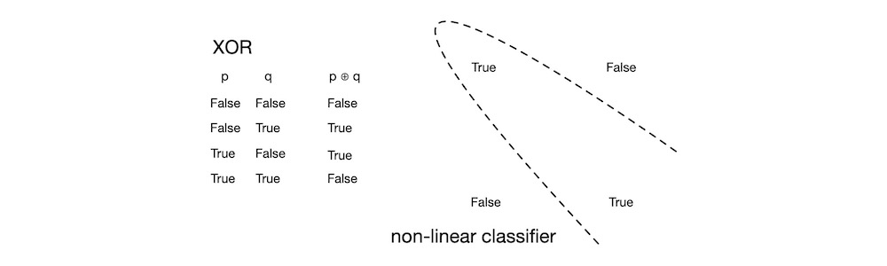
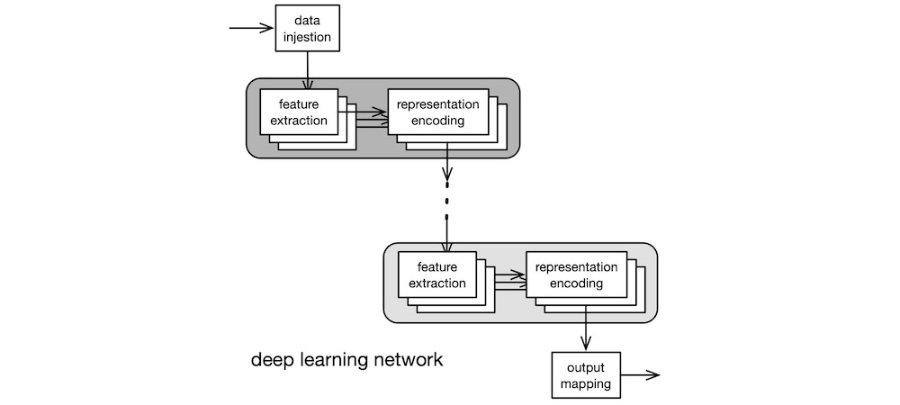
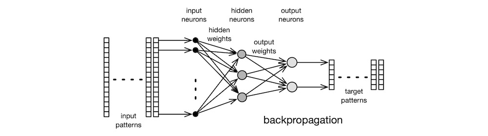

# INTRODUCTION

In this article, I present a high-level overview of artificial intelligence (AI). I describe what AI is, its inner workings, its uses, and its social and ethical implications. All technical writings fall in the spectrum between scientific textbooks and newspaper reports. Textbooks are accurate, precise, and concise, but dense. Reports are vague and fluffy, but accessible. Because I wrote this article for anyone who is curious about how AI works, it is nearer to the report end of the spectrum than to the textbook end. But I tried to be as accurate as possible, without diminishing accessibility. Where appropriate, I sacrificed precision and concision for readability. More importantly, this is a "how it works" article for the general public, not a "how to work with it" guide for the practitioners. The focus, therefore, is on the simpler, classical algorithms, and not on the sophisticated, cutting-edge techniques.

# APPROACHES

There are tonnes of approaches used in AI: genetic algorithms, support vector machines, Bayesian networks, decision trees, stochastic methods, deterministic methods—the list is long. It is also important to realise that there are many equivalent classical approaches, such as signal processing, principal components analysis, and so on, that are capable of solving the same set of problems that AI can solve.

In this article, we concentrate on the two historically significant AI traditions: connectionist and rule-based. *Connectionist* AI is commonly known as neural networks. *Rule-based* AI is traditionally associated with the LISP programming language. The most prevalent approaches currently in use are of the connectionist variety, which shall be our primary focus, here.

## *connectionist*

The myriad AI techniques that are in popular use today, different as they may appear, all share a common foundation: they all come under the umbrella term *artificial neural network* (NN). NN is a computational approach inspired by the quintessential biological neural network—the [brain](https://en.wikipedia.org/wiki/Brain). The most basic processing unit in the brain is the [neuron](https://en.wikipedia.org/wiki/Neuron). See the figure below. The [dendrites](https://en.wikipedia.org/wiki/Dendrite) of the neuron receive electrochemical signal inputs as weighted outputs from the upstream neurons. The weight can be negative, zero, or positive. The [soma](https://en.wikipedia.org/wiki/Soma_(biology)), the cell body, sums up the weighted input signals. The neuron also receives activation signals via the dendrites. Inhibitory (negative) activation signal keeps the neuron inactive. Excitatory (positive) activation signal causes the neuron to fire its output, which is derived from the weighted sum of its inputs. The [axon](https://en.wikipedia.org/wiki/Axon) trunk carries the output signal to the [synapses](https://en.wikipedia.org/wiki/Synapse), which make electrochemical connections to the input dendrites of downstream neurons. Learning involves establishing, strengthening, weakening, and removing signal pathways among the neurons. Although the structure and functions of the brain are far more intricate and complex, the simply-butchered description above suffices for our purposes, here.

The earliest, practical NN model was invented in 1943 by neuroscientist [McCulloch](https://en.wikipedia.org/wiki/Warren_Sturgis_McCulloch) and logician [Pitts](https://en.wikipedia.org/wiki/Walter_Pitts). The diagram below shows the [McCulloch-Pitts](https://en.wikipedia.org/wiki/Artificial_neuron) artificial neuron. The neuron $n_j$ computes its output $o_j = f_j(i_j)$ where its transfer function is $f_j$ and its net input $i_j = ∑_i w_{ji} o_i$. The McCulloch-Pitts neuron uses the threshold function as its transfer function. This is the simplest model of the biological neuron's activation behaviour.

The convention in NN literature is to label input signals $i$, output signals $o$, and weights $w$. And the neurons in the adjacent upstream layer are indexed with $i$, the neurons in the current layer with $j$, and the neurons in the adjacent downstream layer with $k$. So, the labels can get a bit knotty at times—$i_i$, $o_i$, $i_j$, $o_j$, etc. Also, since a weight is associated with the connection between two neurons in adjacent layers, the input connection weights of the neuron $n_j$ are labelled $w_{ji}$ and its output connection weights are labelled $w_{jk}$. Programmers, beware!

So, by convention, the $o_i$ is an upstream neuron $n_i$'s output signal that arrives at the neuron $n_j$ via its input connection that has the multiplier weight $w_{ji}$. The neuron $n_j$ then sums all its weighted inputs $w_{ji} o_i$, and passes this net input value through its transfer function $f_j$ to compute its output $o_j$. The output $o_j$ is then sent to downstream neurons.

Neurons are assembled into a neural network by arranging them in layers. Classic NNs typically used one or two layers of neurons, along with their weighted connections, as shown below. Learning involves presenting a list of input pattern vectors to the network and then modifying its connection weights in accordance with how well the network recognises each pattern. This weight adjustment method is referred as the *learning algorithm*. The final weight values produced by the algorithm encode the salient features present in the training patterns.

The two main types of learning algorithms are the supervised and the unsupervised varieties. A *supervised* learning algorithm requires the user to create a set of target (desired output) patterns, one for each input pattern, whereas an *unsupervised* learning algorithm does not require target patterns.

There have been many classic NN learning algorithms. The first was the unsupervised [self-organising](https://ieeexplore.ieee.org/document/1057468) learning algorithm invented by Farley and [Clark](https://en.wikipedia.org/wiki/Wesley_A._Clark) in 1954. Although unsupervised learning algorithms are less frequently used today, the [self-organising map](https://en.wikipedia.org/wiki/Self-organizing_map) (SOM) algorithm is well known. The algorithm was published in 1982 in the paper *[Self-organized formation of topologically correct feature maps](https://link.springer.com/article/10.1007/BF00337288)* by Finnish engineering professor [Kohonen](https://en.wikipedia.org/wiki/Teuvo_Kohonen), who was inspired by the human perceptual systems, specifically the visual and the aural. Most learning algorithms in use today, however, are of the supervised variety. They trace their origins to the [Perceptron](https://en.wikipedia.org/wiki/Perceptron), a supervised learning algorithm for linear classifiers. It was invented by American psychologist [Rosenblatt](https://en.wikipedia.org/wiki/Frank_Rosenblatt) in 1957. He first implemented the algorithm on Cornell's IBM 704 mainframe. Subsequently, he built a custom, electromechanical [analogue computer](https://en.wikipedia.org/wiki/Analog_computer), called the Mark I Perceptron, which used motorised [potentiometers](https://en.wikipedia.org/wiki/Potentiometer) to represent trainable (adjustable) weights. Perceptron was capable of recognising letters. The eye of the Perceptron was a $20 × 20$ grid of photocells that produced a [greyscale](https://en.wikipedia.org/wiki/Grayscale) image. This resolution, though very coarse, was adequate to encode letters presented to the sensor.

Many in IT today are of the opinion that AI is a simple matter of programming to an API published by an Internet Giant. In truth, psychologists, neuroscientists, mathematicians, electrical engineers, computer scientists, and STEMers of all stripes participated in establishing and advancing the NN subfield of AI: psychologists brought forth the concept of connectionism; mathematicians provided the theoretical foundation; electrical engineers built the first neuro computers; computer scientists implemented the early simulations. Hence, AI is definitively a multi-disciplinary field of study.

## *rule-based*

The main weakness of Perceptron was its linearity: it can only learn to discern patterns if they are linearly separable, that is their classifier boundary is a straight line. The Perceptron's inability to learn even the simplest of non-linear classifiers, like the one required to implement the [exclusive or](https://en.wikipedia.org/wiki/Exclusive_or) (XOR) function shown below, led to its eventual downfall.

In 1969, [Minsky](https://en.wikipedia.org/wiki/Marvin_Minsky) and [Papert](https://en.wikipedia.org/wiki/Seymour_Papert) of MIT AI Lab published their book, [*Perceptrons*](https://en.wikipedia.org/wiki/Perceptrons_(book)). This book contains mathematical proofs of why the Perceptron algorithm is incapable of solving non-linear problems. Minsky and Rosenblatt were childhood friends. Minsky dedicated his book to Rosenblatt—cheeky.

Minsky was motivated, at least in part, to show the limitations of the connectionist approach, because his AI Lab at MIT was wholly dedicated to rule-based approach. In 1958, [McCarthy](https://en.wikipedia.org/wiki/John_McCarthy_(computer_scientist)) created the [LISP](https://en.wikipedia.org/wiki/Lisp_(programming_language)) programming language at MIT. Coincidentally, the first implementation of LISP was for the IBM 704. LISP was a machine implementation of [𝜆-calculus](https://en.wikipedia.org/wiki/Lambda_calculus), a mathematical model of computation created by [Church](https://en.wikipedia.org/wiki/Alonzo_Church) in 1936. LISP was also the second high-level programming language (after FORTRAN) and the first [functional](https://en.wikipedia.org/wiki/Functional_programming) programming language. The mathematical heritage and the [symbolic processing](https://en.wikipedia.org/wiki/Computer_algebra) abilities of LISP were well suited to implementing rule-based AI programmes, and it quickly became the favourite among the rule-based crowd, [especially at MIT](https://en.wikipedia.org/wiki/Lisp_machine). Suffice it to say, Minsky's *Perceptrons* killed off Rosenblatt's Perceptron and other NNs and, by the early 1970s, expert systems dominated AI.

An [expert system](https://en.wikipedia.org/wiki/Expert_system) is an AI application modelled upon the way human experts make technical decisions in the course of performing their daily duties. Early automated theorem proving systems, chess playing systems, and decision support systems were, in essence, expert systems. Such a system is preconfigured with a set of rules for making decisions—selecting a `yes` or a `no` at each step. When the user provides an input, the system applies the rules against the input and, step by step, arrives at a decision. When the set of rules is comprehended and comprehensive, expert systems work exceedingly well. Another major advantage of expert systems is that the results can always be explained fully by simply tracing the algorithm's path down the decision tree.

But few things in nature exhibit such orderly behaviour. Moreover, humans understand even fewer things in nature at such a level of detail. Even if we manage to grasp the dynamics of a large problem, the rules and their interactions would be intractable. Unfortunately, the purveyors of expert systems over promised and the media over reported the hype. By the early 1980s, the users and the public had lost interest in expert systems, and the funding spigot was shut. This period is now known as [AI Winter](https://en.wikipedia.org/wiki/AI_winter).

## *backpropagation*

A few researchers who saw the true strengths of AI continued working in the field—underground. Then, in 1986, [Rumelhart](https://en.wikipedia.org/wiki/David_Rumelhart), [Hinton](https://en.wikipedia.org/wiki/Geoffrey_Hinton), and [Williams](https://en.wikipedia.org/wiki/Ronald_J._Williams) published their seminal paper, *[Learning representations by back-propagating errors](https://www.nature.com/articles/323533a0)*. Their learning algorithm became known as *backpropagation* (BP). BP is a supervised learning algorithm that modifies the network's weights in proportion to the amount of representation error the network commits in each training pass through the data set. In that respect, BP's learning process is no different in kind than that of the Perceptron: find the optimal set of weights that minimise representation errors. But BP's main advantage over the Perceptron is its ability to learn non-linear classifiers. Indeed, non-linearity was why BP works and Perceptron did not. Mathematically, the BP learning algorithm is a simple, [gradient descent](https://en.wikipedia.org/wiki/Gradient_descent) optimisation scheme known to mathematicians since [Cauchy](https://en.wikipedia.org/wiki/Augustin-Louis_Cauchy) introduced it in 1847. But practically, it was capable of solving substantive problems which, until then, were deemed too difficult for machines.

In the 1980s, a room-sized minicomputer, like the [DEC VAX-11/780](https://en.wikipedia.org/wiki/VAX-11), had 1 MB of RAM, usually much less. So, networks were very small, a typical model having just two layers and a handful of neurons in each layer. Despite such restrictions, BP-based networks were able to solve efficiently a number of complex, non-linear problems, like speech recognition, image classification, robotics control, etc. Within a couple of years, BP single-handedly resuscitated the dying AI field. Many variants and improvements soon followed, further improving network performance. Understandably, the AI community was cautiously optimistic, this time round.

Most users of NNs simulate on high-end, mainstream computing hardware, like the VAX-11 or RISC workstations. But these machines, though powerful for their day, are severely limited in both CPU power and RAM capacity. In response, a number of groups developed custom hardware for neural computing. Some built machines out of common digital hardware but optimised for neural computing, but others designed custom analogue VLSI chips. The Stanford group led by [Mead](https://en.wikipedia.org/wiki/Carver_Mead) was especially productive in this area. His PhD student, [Mahowald](https://en.wikipedia.org/wiki/Misha_Mahowald), developed the [silicon retina](https://en.wikipedia.org/wiki/Event_camera), which is an image sensor technology that out performs the human eye and the best DSLRs by several orders of magnitude. This technology was further developed by Mead's company, [Foveon](https://en.wikipedia.org/wiki/Foveon), which is now part of [SIGMA](https://www.sigma-global.com/en/).

Most folks today are unaware that there was a AI Mini Ice Age during the mid 1990s. Although the hardware capabilities had increased leaps and bounds, the storage technology was still somewhat limited. Disc sizes were still measured in MB, albeit in hundreds thereof. Most data sets used in AI were only a few MBs in size. The lack of storage capacity necessarily constrained the completeness of data sets. So, neither humans nor networks could see the true nature of massive, complex, dynamical systems. The lack of data, thus, stunted the growth of AI. To get around some of the limitations, many experimented melding rule-based and connectionist techniques. But for the most part, NNs were confined to academic research and to small-scale commercial use to the end of the 1990s. The [dot-com collapse](https://en.wikipedia.org/wiki/Dot-com_bubble) at the end of the 1990s and the subsequent economic stagnation did no favours to AI.

## ***deep learning***

Then came the age of Internet Giants—the early 2000s. Massive, simultaneous advances in computing power, storage capacity, network connectivity, graphics technology, and software techniques conspired to create the fastest growth in the history of human invention. The Web came of age. Online shopping and social media became the norm. Billion-user platforms became commonplace. The Internet Giants saw gold to be mined in the private data that the users willingly exchanged for free access to frivolous social media services. [Big data](https://en.wikipedia.org/wiki/Big_data) was thus born. By 2010s, everything converged: massive amounts of collected data, advances in NN algorithms, huge rise in processing power. It was in this Era of Data that people began recognising the true potential of BP, or rather its descendant—[deep learning](https://en.wikipedia.org/wiki/Deep_learning) (DL).

Whereas the classic BPs of the 1990s could only use two or three layers of neurons due to hardware limitations, the DLs of the 2010s routinely employ many layers and many different types of neurons. Today, home users of DLs train their networks on powerful, but inexpensive, graphics cards, like the [nVIDIA RTX](https://www.nvidia.com/en-us/design-visualization/desktop-graphics/) so as to exploit the GPU's built-in support for parallel matrix operations across tens of thousands of cores. The "deep" in deep learning refers to the many layers of neurons, as shown below in grey boxes.

Another substantial advantage of modern DLs over classic BPs is feature extraction. Feature extraction required the use of sophisticated, mathematical techniques such as [digital signal processing](https://en.wikipedia.org/wiki/Digital_signal_processing) (DSP), [digital image processing](https://en.wikipedia.org/wiki/Digital_image_processing) (DIP), [natural language processing](https://en.wikipedia.org/wiki/Natural_language_processing) (NLP), etc. Each such technique constitutes a highly specialised, not to mention expansive, subfield within mathematics or engineering. So, competent practitioners were relatively few in numbers in the early days of BPs, which limited their usefulness. But DLs subsume feature extraction into the front-end layers of the network. That is, a DL network automatically extracts salient features from the data, and learns to represent those features in its connection weights, with little or no guidance from human experts. Hence, DL networks can be used effectively even by non-experts. Paradoxically, this characteristic of DLs is also a disadvantage, of sort: if a complex AI problem can be solved merely by clicking a button on a GUI, there is no need for the user to perform any analysis of the problem domain and of the massive amounts of data accumulated, so he gains no insight into the problem and he cannot explain the reasons why the solution appears to work. Regardless, DLs are here to stay; now is their day.

Over the past quarter century, our shopping habits, social media propensities, blogging activities, email exchanges, cloud-borne personal information—just about every aspect of our lives, both personal and professional—have been collected, analysed, categorised, tracked, and predicted by Internet Giants' DLs. Despite their prominence in modern life, however, DLs are but a small part of a much broader category of powerful modern methods known collectively as [machine learning](https://en.wikipedia.org/wiki/Machine_learning) (ML) algorithms, which in turn are a subfield within AI. Suffice it to say, AI is an expansive field of study.

# APPLICATIONS

There are three broad categories of AI applications: approximating, classifying, and forecasting. Each category has multiple subcategories, which we shall examine, below.

AI applications exists because there are users. Note that by "user", I mean those who use the AI technology: researchers, designers, and coders. Researchers invent AI algorithms. AI software designers use those algorithms to design large, industrial systems. Coders use published libraries to implement small software components that are composed into large systems. Companies employ researchers, designers, and coders to exploit AI for profit.

I use the term "practitioner" to refer to researchers and designers. Some practitioners are coders as well, but not all coders are practitioners. In terms of skills, it does not take much to start out in AI as a practitioner: calculus, linear algebra, probability, statistics—run-of-the-mill undergraduate subjects in STEM. But an AI practitioner earns his keep by analysing the massive amounts of collected raw data so as to understand the complex, dynamic behaviours of large systems. That bit is hard, even for the skilled and the experienced.

The Internet Giants who exploit AI technologies often puff that the true beneficiaries of AI are the members of the public. A closer look, however, reveals that the public is their victim.

## *approximating*

*Approximating* means the AI algorithm learns to emulate the behaviour of a real-world system well enough that its behaviour is indistinguishable from the real thing in most cases. There is a set of important, optimisation problems that have been proven to be exceedingly difficult for computers to solve. They are known as $NP$ ([non-deterministic polynomial time](https://en.wikipedia.org/wiki/NP_(complexity))) problems. That is a fancy way of saying computer scientists do not know how to create efficient, exact solutions to these problems because they are much too complicated, and they must resort to approximate solutions. The [vehicle routing problem](https://en.wikipedia.org/wiki/Vehicle_routing_problem) is a famous real-world scenario that is computationally difficult. The goal is to find an optimal set of routes for a fleet of delivery vans to deliver parcels to a set of customers. The larger the network, the more difficult the problem. This is what transportation service companies face, daily.

In such situations, NNs can efficiently learn to approximate the complex behaviour of difficult problems. Both conventional algorithms and NNs yield approximate solutions that are acceptable, but not necessarily optimal. But NNs are computationally more efficient.

## ***classifying***

*Classifying* means the AI algorithm organises its input patterns into predefined classes. An instance of classification problem is sorting bananas into A, B, or C grades, in accordance with their cultivar, grower, shape, size, weight, colour, and ripeness. A conventional system might cast this as a multi-dimensional constraint satisfaction problem, a rather hard problem to solve. An NN-based system can solve this problem with ease and speed.

A variant of classifying is *clustering*, where we do not know the input classes, a priori. Clustering can be used as a preprocessing stage: a representative subset of the unknown data set can clustered to discover the number of classes present in the data, for example. Traditional, $k$-means clustering technique can solve this problem, but it requires the user to select the total number of classes as a limit and it falters when the number of input samples are extremely large. An unsupervised NN algorithm, like Kohonen's SOM, can solve this problem much more efficiently, and without any user intervention. The output of SOM is a 2D projection of the $n$-dimensional input data set.

Another variant of classifying is *identifying*, for example, to identify a person by his fingerprint or his face. Rosenblatt's Perceptron was perhaps the first practical system capable of identifying individual English letters from images. And, of course, all modern mobile phones now have fingerprint and face biometric authentication capabilities.

Yet another variant of classifying is *recognising*: text recognition, speech recognition, face recognition, and so on. Recognition is much more difficult than identification. Whereas a computer can identify the letter "a" in an image or a phoneme "a" in an audio clip relatively easily, but recognising the word that comprises several letters or an utterance containing multiple phonemes is orders of magnitude harder for the computer. This difficulty is due to context dependency. To recognise a word, the computer must not only identify the constituent letters, it must also recognise their relationships within the word. In the 1980s, several researchers, Kohonen, Grossberg, LeCun, and others, invented NNs capable of simple speech recognition. Those systems required lots of manual preprocessing of audio. Today, however, DL networks can perform sophisticated speech recognition, with little or no preprocessing.

Note that NNs, despite their powers, are incapable of explaining how and why they produced the results. There are applications where that information is necessary. For example, if the bank denies a loan, the bank must justify its actions and explain to the applicant that the actions comply with the law. The intractability of large NNs precludes detailed analyses.

## *forecasting*

*Forecasting* means the AI algorithm, having learned the relevant trends from historical data, can predict a future outcome, given a particular input. That a large, national retail store must stock the shelves in all its stores for the holiday shopping season is obvious; that requires no AI. But in today's global economy, the supply chain is affected by many unforeseen events occurring all across the world. This is where forecasting is necessary. Indeed, forecasting is used today by all large entities, public and private.

The massive amounts of data now available makes forecasting possible, even if it is still not an easy problem. If forecasting were easy, we would not suffer from hurricanes, tsunamis, earthquakes, volcano eruptions, and other "unforeseen" natural disasters. Such problems are difficult, even for NNs, because they are chaotic. A chaotic system, like a storm, is not random. A storm's present behaviour can be analysed using deterministic physical laws, without resort to randomness. But its behaviour is so sensitive to the initial conditions that it is impossible to predict the exact path of the storm. This is why weather forecasting is as much an art as it is a science. NNs are no panacea to solving chaotic problems.

But NNs can indeed be used to make reliable predictions in deterministic *control* systems, such as those that operate robots and autonomous vehicles. Control systems are used to govern the dynamic behaviour of mechanical systems: from a two-limb, laboratory robot arm to a large, automated factory; from a self-driving car to a spacecraft reentry guidance system. In large, complex applications, the control system cannot simply react to the current conditions as they emerge; it must be capable of learning from past events, predicting possible future events and planning for them, and reacting to novel events that it has never seen before. It is well-neigh impossible to built conventional systems with that level of flexibility. NN-based systems, though, are capable of adapting to such eventualities.

A more recent use of NNs is in *composition*. It is now possible to train an NN on the works of a dead, famous author, and have the network generate new text in his writing style. Similarly, new musical compositions and new paintings can be generated by NNs. [Deepfakes](https://youtu.be/T76bK2t2r8g) that permeate social media today are another example. Though still in its infancy, this technology has already demonstrated its ability to fool the gullible.

# ALGORITHMS

There are many variants of NN architectures and algorithms, and there are endless varieties of non-NN AI techniques. But as I mentioned above, this article is not a survey of the state-of-the-art; it focuses on the fundamental NN concepts that will enable you to comprehend how modern AI work. To that end, I describe in this section two classic networks, one unsupervised and the other supervised, and a handful of commonly used DL architectures. I also explain below a few important feature extraction techniques.

## *feature extraction*

Classic networks that preceded DLs were shallow (a few layers) and narrow (a few neurons per layer). The limited size constrained their computational abilities, and they loads of manual assistance from the user. In particular, classic NNs were unable to handle raw data, like audio and image. The user must preprocess and transform the raw data into a form that the network can accept.

Many NN algorithms expect input values to be normalised to fall within the open range $(0.0, 1.0)$. Merely normalising the inputs is insufficient; distinctive features in the raw data must first be extracted by preprocessing the data. A *feature* is an entity's distinctive attribute that can be represented compactly. It could be size, weight, curvature, edge, texture, colour, opacity, brightness, timbre, position, orientation, anything.

A face identification network, for example, cannot be fed the raw image. Various digital image processing (DIP) techniques must be used to highlight the salient facial features, like forehead, eyes, nose, lips, ears, and so on, then distances must be measured between key points, such as inter-pupillary distance, nose ridge length, mouth width, etc. Then, only after these feature values have been normalised, can the network learn from the data. Similarly, for a speech recognition application, speech samples must first be preprocessed using digital signal processing (DSP) to segment and extract the phonemes, prosody, pitch, and myriad speech patterns, and normalise those values, before feeding them to the network. In fact, since speech comprehension is context sensitive, time dependance of the individual sounds must also be part of the feature set. Such speech-related processing is called natural language processing (NLP).

In general, data preprocessing is a necessary step in all applications using classic NNs, and each technique involves highly specialised advanced techniques. For example, NLP, DSP, DIP, and other similar techniques, in those days, were deemed too advanced to be taught to undergraduate electrical engineering (EE) and computer science (CS) students. Suffice it to say, the biggest hurdle in using classic NNs were not the training algorithms, but the preprocessing techniques.

Today, DLs have all but eliminated this hurdle. Many powerful feature extraction techniques have been developed over the past two decades. Typically, the first several layers of a DL are devoted to automatic feature extraction. Hence, DLs can now be implemented and trained by coders using a popular API, even without a background in AI theories and techniques. Just being able to use an API, however, does not make one an AI practitioner.

## *unsupervised learning*

Unsupervised learning is called as such, because it does not require the user to include in the training data the desired targets. Perhaps the best known unsupervised learning algorithm is Kohonen's self-organising map (SOM). In simple terms, SOM is an unsupervised clustering algorithm. Its neurons are organised in an $m × n$ grid, as shown below. The input is a set of normalised pattern vectors: $I = \{i\ |\ i\ \text{is a feature vector}\}$. A pattern vector's elements are the features extracted during the earlier preprocessing phase. A pattern with $D$ elements is, thus, a vector in a $D$-dimensional vector space: $i \in R^D$. Every element of the input pattern vector is connected to every neuron via a weighted connection. Hence, a neuron $n_j$'s input weights form a vector $w_j$. Obviously, the lengths of the vectors $i$ and $w_j$ are the same: $|i| = |w_j| = D$.

All weight values in the network are initialised to small random values. During the learning phase, the network computes the distance $dist(i_p, w_{j})$ between an input pattern $i_p$ and the weight vector $w_j$ of all neurons. There are many distance measures, but a common choice is the [Euclidean distance](https://en.wikipedia.org/wiki/Euclidean_distance): $dist(i_p, w_j) = \sqrt{(i_p - w_j)^2}$. The network then chooses the neuron $n_c$, the winner, whose weights are the closest to the input pattern, and updates the weights $w_c$ with a tiny value that is proportional to the distance $d_c$, so as to nudge $w_c$ a little closer to $i$, but all other neurons' weights are left untouched. When this select-and-update process is completed for all patterns in the input data set, the network is said to have completed one *cycle* of learning. As learning progresses cycle by cycle, the pattern-neuron associations become stronger and more stable. A typical SOM requires tens of thousands of cycles to learn a sizeable data set.

When learning has completed, we obtain a 2D projection of the $D$-dimensional patterns in the input data set. Input patterns that are similar in the $R^D$ vector space are clustered closer on this 2D map. In other words, SOM is a clustering algorithm that performs a [dimensional reduction](https://en.wikipedia.org/wiki/Dimensional_reduction) $R^D → R^2$ that preserves local structures. Local structures can be visualised using a simple GUI that shows the labels of the input vectors at their mapped locations on the SOM.

As a graduate student in the 1960s, Kohonen studied human visual perception process that maps 3D input visual information to the 2D [visual cortex](https://en.wikipedia.org/wiki/Visual_cortex) on the posterior surface of the brain. Later, he invented SOM as a model of the way the visual information is projected onto the visual cortex.

Like other classic NNs, SOM cannot handle raw input data. The user is thus required externally to preprocess the raw data, extract relevant features, and normalise the input patterns. There are a number of conventional, statistical techniques that perform dimensional reduction, just like SOM—principal components analysis, for instance. But SOM is computationally more an efficient, and its inner workings can be explained by analogy to biology.

In its day, SOM's powerful clustering abilities were used to analyse the local structures embedded in large, high-dimensional data sets. Today, this dimensional reduction step has been subsumed into the front-end of a DL network. But even today, SOM is still a powerful visualisation tool.

## *supervised learning*

Rumelhart's Backpropagation (BP) is, without doubt, the best known supervised learning algorithm. BP extends Rosenblatt's Perceptron by employing non-linear neurons in multiple layers. A classic BP network comprises three layers—input layer, hidden layer, and output layer—as shown below. For this reason, BP is sometimes referred to as a multi-layer Perceptron network. The input-layer comprises dummy neurons; they are there only to accept input vectors. The weights of the hidden-layer neurons collectively, and cumulatively, form internal representations of the input vectors. The weights of the output-layer neurons map internal representations to output values.

In keeping with the supervised learning tradition, BP's training data contains the input vectors and the associated desired outputs, the target vectors. Initially, all the weight are set to small, random values. Training comprises two distinct phases: forward pass and backward pass.

In the *forward pass*, each input pattern vector $p$ is fed to the network, and the network propagates the input toward the output layer. Each neuron computes its output value excited by this input pattern vector: $o_{pj} = f_j(∑_i w_{ji} o_{pi})$, where the transfer function $f_j$ of the neuron is defined as $f_j(x) = 1 / (1 + e^{-x})$.

When an input pattern vector $p$ reaches the output layer, the *backward pass* commences. The error contributed by this input pattern vector is $E_p = ∑_j [t_{pj} - o_{pj}]^2$, where the $t_{pj} - o_{pj}$ term measures how far off the output of neuron $n_j$ is from the target. So, the total error across all the input patterns in the data set is $E = ∑_p E_p$. The algorithm minimises $E$ by adjusting the individual weights, because $\frac{\part E}{\part w_{ji}} = ∑_p \frac{\part E_p}{\part w_ji}$.

Learning occurs when the output errors $𝛿_{pj}$ are propagated backward from the output layer toward the input layer, and the weights $w_{ji}$ in each layer are adjusted in such a way as to minimise the total error $E$. For every input pattern $p$, the weight $w_{ji}$ of the neuron $n_j$ is changed by a small increment $\Delta_p w_{ji} = 𝜂\, \delta_{pj}\, o_{pi}$. Here, $𝜂$ is a small proportional constant, called the *learning rate*, that determines the adjustment magnitude; $ 𝛿_{pj}$ is the error contributed by the neuron $n_j$; and $o_{pi}$ is the output of the upstream neuron $n_i$.

If $n_j$ is an output-layer neuron, its true error is the difference between its desired output (target) $t_{pj}$ and its actual output $o_{pj}$. From the true error, the neuron's back-propagated error is computed as $𝛿_{pj} = f^{'}_j(i_{pj}) \cdot [t_{pj} - o_{pj}]$. Here, $f^{'}_j$ is the derivative of the neuron's transfer function $f_j$ with respect to its input $i_{pj} = ∑_i w_{ji} o_i$. Since $o_{pj} = f_j(i_{pj})$, we have $\frac{d o_{pj}}{d i_{pj}} = o_{pj}(1 - o_{pj})$. So, if we use the transfer function $f_j(x) = 1/(1 + e^{-x})$ for the neuron $n_j$, then the derivative of this function can be obtained by evaluating $f^{'}_j(x) = x(1-x)$.

On the other hand, if $n_j$ is a hidden-layer neuron, its back-propagated error is computed as $𝛿_{pj} = f^{'}_j(i_{pj}) \cdot ∑_k 𝛿_{pk} w_{kj}$, where the $∑_k 𝛿_{pk} w_{kj}$ term is the sum of the errors occurring at downstream neurons $n_k$, which were due to the neuron $n_j$'s error that was forward-propagated during the previous learning cycle.

The above error back-propagating rule for computing the individual weight changes $\Delta_p w_{ji}$ is the essence of the BP learning algorithm. In simplest terms, this learning procedure minimises the network's total error $E$ across the entire input data set by tweaking the weights $w_{ji}$. This optimisation technique is called *gradient descent*, because the error $E$ is a $W$-dimensional surface with peaks and valleys, and the network, by incrementally adjusting its weights, creeps down this error surface to reach a minimum. The $W$ here represents the very large number of weights in the network.

No one uses the classic BP, but everyone uses a modified version thereof. Indeed, DLs are much larger (in both breadth and depth) and much more powerful variants of BP.

## *deep learning*

DL, CNN, RNN

# ALERTNESS

Life is full of dangers, and every new and useful invention adds a set of unique dangers thereto. Knives and scissors and hammers are dangerous. So are [trains and boats and planes](https://www.youtube.com/watch?v=BlbS0JNFMIM). But they are all essential to modern life. AI is no different; it is a sharp tool that, if mishandled, will gouge the user's hand.

AI as a research discipline has been around for nearly a century. But as a practical tool, AI is only about a decade old. Despite its youth, AI already controls many important aspects of our lives. But the fact that the most successful uses of AI have been invading privacy, deep faking, and e-commerce profiteering—not tackling homelessness, global pandemics, or climate change—speaks volumes about us humans.

Researchers (inventors) and users (exploiters) alike must be cognisant of the fact that AI is nothing miraculous, but that it is a human invention susceptible to myriad human frailties: overenthusiasm, overconfidence, oversight, and all manner of overages. Being just a tool, AI can be used and misused with equal dexterity. But whereas the misuse of a pair of scissors harms only the user, the [misuse of AI has the power to dismantle democracy](https://www.independent.co.uk/news/long_reads/artificial-intelligence-democracy-elections-trump-brexit-clinton-a7883911.html).

The secret algorithms currently being used by the social media platforms are AI, specifically the DL variety. These algorithms are very good at showing the user what he wants to see. But these algorithms are not trained to show the user what he ought to see, because there is no money in that. Social media platforms profit by exploiting the billions of users' wants, but they effectively distort the truth. Access to reliable facts is the fundamental building block of a free, democratic society. It is not that the truth is a rare commodity today, but that the truth is now very difficult to discern from the much more abundant falsehoods. This erodes the public's trust in authorities, and this lack of faith in the institutions results in a feedback: the uncontrolled spread of feel-good falsehoods on social media.

Then, there are [deepfakes](https://en.wikipedia.org/wiki/Deepfake). They are an interesting challenge, perhaps even an artistic expression, for the creators. But in nefarious hands, this technology can precipitate ethnic cleansing and other [crimes against humanity](https://en.wikipedia.org/wiki/Crimes_against_humanity). Granted, there exist a few sophisticated forensic techniques that can detect deepfakes, but these tools are not perfect and they are available only to a handful of specialists. Hence, bad actors have plenty of time and opportunities to achieve their ill goals by exploiting the rampant irrationality of the unsophisticated, but well connected, masses.

Today, we conduct our lives online: finances, commerce, and even voting. Everything we do online is traced and trended by entities large and small, and those pieces of data are traded openly and surreptitiously. It is now remarkably simple to use the already-available data and AI software to devise a [gerrymander](https://en.wikipedia.org/wiki/Gerrymandering) our electoral boundaries, thereby favouring a fringe political group or perhaps even a foreign enemy. Currently, there are governments who [employ AI to oppress minorities and dissidents](https://www.pbs.org/wgbh/frontline/article/how-chinas-government-is-using-ai-on-its-uighur-muslim-population/). Researchers from Western, democratic countries supply the technologies to those oppressors.

In the Age of Data, AI has "learned to seize" an immense amount of power for itself, but it possess not a tincture of morals. And the entities exploiting AI, likewise, have powers but no morals. As such, [We the People](https://en.wikipedia.org/wiki/Preamble_to_the_United_States_Constitution) must exercise our duty to study, monitor, and regulate the conduct of those who wield the powers of AI. As a still-free folk, we have the moral duty not only to preserve our own freedoms but also to protect the human rights of others. Woe be upon those who spell "freedom" as "free-dumb".

# CONCLUSION

There are three types of people interested in AI: the curious public, the incurious users, and the eager researchers. The curious public are those who do not work with AI but just want to understand how AI works at a basic level. The incurious users are coders in the IT industry who could care less about how AI works and they just want to slap together some AI programme. The eager researchers are the ones who have their skins in the game. Although this article is aimed at the curious public, the other two groups may benefit from it, as well: coders and their managers may benefit from understanding better what the code is doing; aspiring researchers and beginning graduate students may benefit from knowing the historical background of their field of interest.

All AI researchers should be familiar with the classic works by the likes of McCulloch, Pitts, Rosenblatt, Widrow, Kohonen, Hopfield, Grossberg, Rumenhart, Hinton, LeCun, and many others, in addition to the mastery of modern techniques. Such a survey of the classics may seem daunting, but this is what every AI graduate student does during their first year of schooling, under guidance from their professors. And a practitioner, whatever his field, whatever his experience, never stops learning.

I offer this warning: they who admire only the newest and the most fashionable learn nothing from history, and they lack the requisite background in the field. It is also important to realise that knowing how to code an AI application using API calls is not the same as understanding what that application is actually doing. Those who use AI without comprehending its strengths, weaknesses, and ethical implications bring no long-term benefits to society. Indeed, they maybe doing more harm than good to humanity.

Lastly, the public must recognise that the founders and directors of Internet Giants do not necessarily understand the AI technologies their companies are using. Under corporate law, the chief executive of a corporation is responsible for maximising the shareholders' return on investment. This legal mandate often conflicts with moral and social concerns of the public. The IT executives should wield their powers, by all means; but they ought to act in a socially responsible manner. When these large, powerful international conglomerates wilfully breach the public's trust, the only recourse is the law. In a democracy, the law derives its powers from the public. As such, the public must exercise its duty to study the impacts and trends of AI technologies and to monitor the activities of AI users.
