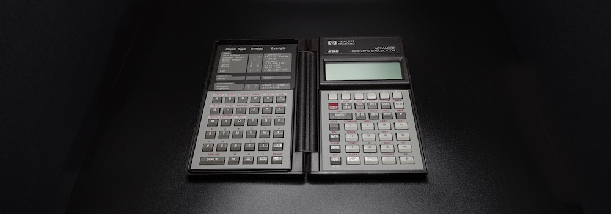

# INTRODUCTION

In the annals of computing, calculators reigned supreme in a period, between early 1970s and early 2000s. The first electronic pocket scientific calculator, the HP-35, came out in 1972, and it displaced the [slide rule](./HowSlideRulesWork.md) in just a few years. The slide rule stood as the predominant calculating device for almost 400 years, since its invention by [William Oughtred](https://en.wikipedia.org/wiki/William_Oughtred) in 1622. But in 30 short years, the calculator itself was outmoded by the touchscreen mobile phone. [Just deserts](https://legal-dictionary.thefreedictionary.com/Just+Desserts), I suppose. Brief though their reign was, scientific calculators left an indelible mark on engineering, physics, and other hard sciences of the 20th century.

In this article, I mean by "calculator" a commonly available electronic pocket calculator powered by a microprocessor. I am excluding from this definition mechanical calculators, valve (vacuum tube) calculators, transistor calculators, and desk calculators. In fact, it is evident from the title of this article that I am focusing narrowly on [Hewlett-Packard](https://en.wikipedia.org/wiki/Hewlett-Packard) (HP) calculators with reverse Polish notation (RPN) input method, in particular the programmable scientific models made during, and after, the 1980s. To an electrical engineer like me, anything less than RPN is insupportable.

The [microprocessor](https://en.wikipedia.org/wiki/Microprocessor) powers the world, today. As I write this article in 2021, children play games on powerful CPUs, like the 64-bit AMD Ryzen. But the first microprocessor, the humble 4-bit [Intel 4004](https://en.wikipedia.org/wiki/Intel_4004), emerged only five decades earlier in 1971. In its day, the 4004, which integrated 2,300 transistors on a single chip, was a massive leap forward in technology. The 4004 came about because [Busicom](https://en.wikipedia.org/wiki/Busicom), a Japanese electronic company, asked Intel in 1969 to develop a microprocessor for use in their calculators. Naturally, Busicom calculators, like the [141-PF](http://www.vintagecalculators.com/html/busicom_141-pf.html), were the first production electronic devices to be powered by a microprocessor. Although the 141-PF holds the distinction of being the first microprocessor-based calculator, its design was unremarkable; it was a mundane, four-function desk calculator with a few business-friendly features, like memory, percentage, and thermal printer.

Then only a year later in 1972, HP introduced their game-changing device, the [HP-35](https://www.hpmuseum.org/hp35.htm), the world's first pocket scientific calculator. This device was very small for its day, even though it is massive by modern standards. Indeed, the adjective "pocket" referred to the large pocket of a lab coat. Contrary to the prevailing conventions, but in keeping with the HP tradition, the HP-35 employed the RPN input method. At 395 USD introductory price (almost 2,700 USD in 2021), the HP-35 was initially a rich man's toy; most engineers just kept using their slide rules, at least for a few more years, until electronic calculators became more affordable. Incidentally, the "35" in the name is a nod to the 35 keys, which were rather a lot and something to be proud of in the days of four-function calculators.

Only 10 years later in 1982, the [HP-15C](https://www.hpmuseum.org/hp15.htm) shown below, was introduced. It was the engineers' all-time favourite advanced, programmable, scientific pocket calculator. It was an impressive achievement by HP to have crammed so many capabilities into a device the size of a wallet. The HP-15C was priced only 135 USD (about 400 USD in 2021). But even that price was too steep for most engineering students of the era, because it would have required a month's fasting.


HP's latest and most advanced scientific calculator, the [HP Prime](https://en.wikipedia.org/wiki/HP_Prime), which was introduced in 2013, is no calculator; it is a screaming computer. The G2 version has a 500 MHz 32-bit ARM Cortex-A7 CPU, 256 MB of SDRAM, 512 MB of flash memory, and a 16-bit colour touchscreen. But it is about the same size as the 2021 iPhone 13. Being almost a decade older, the HP Prime is nowhere near as capable as the iPhone 13, but it can be had for a mere 100 USD in 2021. And it has tonnes of scientific and mathematical software and it has hardware interfacing capabilities—things the iPhone cannot do.

Despite the immense capabilities of the latest generation of scientific calculators, their market has largely been eroded by mobile phones, tablets, and laptops. I expect that calculators will completely disappear from common use, soon. But I am certain that there will always be enthusiasts of calculators, especially for the RPN variety, among STEM practitioners. I dedicate this article to my fellow RPN fanciers in STEM. And I hope that the information provided here will ignite in future generations of STEMers a spark of appreciation for these fascinating little devices.

Below, I explain how to use the RPN input method and provide a high-level overview of programming HP calculators in three ways: RPN keystrokes, reverse Polish LISP (RPL), and Prime Programming Language (PPL). It is impossible to follow the discussions without an RPN calculator in hand. If yo do not own one, either use a [web-based emulator](https://stendec.io/ctb/hp15c.html) or buy on eBay a [new, inexpensive model](https://www.ebay.com/sch/i.html?_from=R40&_trksid=p2380057.m570.l1313&_nkw=hp+35s&_sacat=0).

# RPN

In mathematics, the application of a generic binary function $f$ to arguments $a$ and $b$ is written as $f(a, b)$, and the operation of a generic binary operator $\bigotimes$ to arguments $a$ and $b$ is written as $a \bigotimes b$. In prefix notation, these expressions are written as `f a b` and `⨂ a b`. In postfix notation, they are written as `a b f` and `a b ⨂`.

In mathematics, notations evolve organically through the centuries. On the other hand, the prefix notation was invented by the Polish logician [Jan Łukasiewicz](https://en.wikipedia.org/wiki/Jan_%C5%81ukasiewicz) in 1924. Therefore, it is called the Polish notation, in his honour. The prefix [s-expression](https://en.wikipedia.org/wiki/S-expression) syntax `(f a b)` in LISP programming language is a slightly modified Polish notation where the expression is delimited with parentheses, which simplifies parsing. The postfix [reverse Polish notation](https://en.wikipedia.org/wiki/Reverse_Polish_notation) (RPN) input method is the opposite of the prefix notation, hence, the "reverse". Both the prefix and the postfix notations are reviled by the uninitiated, but revered by the cognoscenti for their innate efficiency.

Because mathematical notation is meant for the human eye, the syntax is often fussy and irregular. So, it is quite a chore for a computer to interpret written mathematics. For instance, the expression $2 - (\frac{5}{4 -2} + 8) = -8.5$ is parsed by storing in memory a symbol tree consisting of nine nodes (one node per symbol) during the first pass, and by reducing the tree to the result $-8.5$ during the second pass:

- $-$
  - $2$
  - $+$
    - $÷$
      - $5$
      - $-$
        - $4$
        - $2$
    - $8$

Building the symbol tree requires processor cycles and quite a lot of memory: symbol values, pointers, housekeeping information, etc. Evaluating the symbol tree to obtain the result requires additional processor cycles. However, if this mathematical expression is rewritten in the postfix notation, we get $2↵\ 5↵\ 4↵\ 2\ -\ ÷\ 8\ +\ -$. The symbol $↵$ is the operand delimiter, which is represented by the `[ENTER]` key on HP RPN calculators. Using an RPN calculator, we can simultaneously parse and evaluate this postfix expression in one pass, using only four temporary storage locations `x`, `y`, `z`, and `t`:

```text
[2][ENTER]
[5][ENTER]
[4][ENTER]
[2][-]
[÷]
[8][+]
[-]
```

The above keystroke sequence means the following. Let us assume that all four registers on the stack are initialised to `0`.

- `[2][ENTER]` → Press the `[2]` key, followed by the `[ENTER]` key.
  - `x←2.0000 | y←2.0000 | z←0.0000 | t←0.0000`
  - Pressing the `[2]` key places the value $2$ in the register `x`, and pushes its old value $0$ up into the register `y`. In a way, the register `x` is like the data-entry scratchpad.
  - Pressing the `[ENTER]` key copies the value $2$ in the register `x` up into the register `y`, moving its old value $0$ up further onto the stack.
  - Now, the registers `x` and `y` each holds the value $2$.
- `[5][ENTER]` → Press the `[5]` key, followed by the `[ENTER]` key.
  - `x←5.0000 | y←5.0000 | z←2.0000 | t←0.0000`
  - Pressing the `[5]` key places the value $5$ in the register `x`, rippling the old values further up onto the stack.
  - Pressing the `[ENTER]` key populates both the registers `x` and `y` with the value $5$.
  - The old value $2$ in the register `y` is pushed up further into the register `z`.
- `[4][ENTER]` → Press the `[4]` key, followed by the `[ENTER]` key.
  -  `x←4.0000 | y←4.0000 | z←5.0000 | t←2.0000`
  -  The old values are pushed up further onto the stack.
  -  The registers `x` and `y` both hold the new value $4$.
  -  At this point, the stack is full, since all four of its registers hold values involved in the computation.
- `[2][-]` → Press the `[2]` key followed by the `[-]` key.
  -  `x←4-2=2.0000 | y←5.0000 | z←2.0000 | t←2.0000`
  -  Pressing the `[2]` key places the value $2$ in the register `x`, and pushes its old value $4$ up into the register `y`.
  -  Pressing the `[-]` key performs the subtraction operation using the values in the registers `x` and `y`, subtracting the value $2$ in the register `x` from the value $4$ in the register `y`, and accumulating the result $2$ in the register `x`.
  -  The subtraction operation cleared the register `y`, which has the ripple effect of copying down the value $5$ from the register `z` down into the register `y` and the value $2$ from the top register `t` down into the register `z`.
  -  The top register `t` is special: as the operations consume the operands and the operands are popped off the stack, the value in the register `t` is kept the same and is copied down into the lower registers.
- `[÷]` → Press the `[÷]` key.
  - `x←5÷2=2.5000 | y←2.0000 | z←2.0000 | t←2.0000`
  - The operation divides the value $5$ in the register `y` by the value $2$ in the register `x`, and accumulates the result $2.5$ in the register `x`.
  - Since the value in the register `y` was consumed, the value $2$ in the register `z` is copied down into the newly cleared register `y`, and the register `z` in turn is filled by the replicated value $2$ in the top register `t`.
- `[8][+]` → Press the `[8]` key followed by the `[+]` key.
  - `x←2.5+8=10.5000 | y←2.0000 | z←2.0000 | t←2.0000`
  - Pressing the `[8]` key places the value $8$ in the register `x`, and pushes its old value $2.5$ up into the register `y`.
  - Pressing the `[+]` key performs the addition operation using the values in the register `x` and `y`, adding the value $8$ in the register `x` to the value $2.5$ in the register `y`, and accumulating the result $10.5$ in the register `x`.
  - The same ripple effect copies the value $2$ into the upper registers.
- `[-]` → Press the `[-]` key.
  - `x←2-10.5=-8.5000 | y←2.0000 | z←2.0000 | t←2.0000`
  - The operation subtracts the value $10.5$ in the register `x` from the value $2$ in the register `y`, and accumulates the final result $-8.5$ in the register `x`.
  - The same ripple effect copies the value $2$ into the upper registers. The values in these upper registers are irrelevant, since the computation is now complete.

As another example, we may compute the exponentiation $2^3 = 8$ by punching in the keystrokes `[2][ENTER] [3][`$\color{red}{y^x}$`]`. That is, we first enter the operands separated by `[ENTER]`, then we press the operator key to obtain the result. A binary operator, like $y^x$, uses the `y` register as the first operand and the `x` register as the second operand, and accumulates the result in the `x` register, clearing the `y` register in the process. A unary operator, like $x^2$, uses the `x` register both as the input and as the output.

The stack registers eliminate the need to use parentheses, and the self-actuating operators eliminate the need to use a distinguished key to initiate computations. Therefore, the `(`, `)`, and `[=]` keys are not needed on an RPN calculator.

The elimination of these separators are partly the reason why the RPN is more efficient than the conventional infix notation. The RPN input method is appreciably more efficient when the expressions are lengthy and contain many parentheses, such as those that appear in engineering calculations. The RPN input method, however, obliges us to rearrange the expression mentally, before we can evaluate it on the calculator. Hence, we are purchasing mechanical efficiency with a small amount of mental effort. But this mental parsing becomes second nature, after a day of use.

Computers in the late 1950s had very little processing power and memory storage, parsing mathematical expressions was a very difficult task. To simply parsing, [John McCarthy](https://en.wikipedia.org/wiki/John_McCarthy_(computer_scientist)) adopted the much simpler s-expression as the syntax for his LISP programming language. The [IBM 704](http://www.columbia.edu/cu/computinghistory/704.html) on which the first LISP implementation ran occupied a large, climate-controlled room. A little over a decade later in the early 1970s, the HP-35 was the most powerful scientific calculator and the first one designed to fit an engineer's shirt pocket. But the HP-35 had a miserly 1-bit serial processor and a meagre 4-register (`x`, `y`, `z`, and `t`) memory. So, the time- and space-efficient RPN input method was not merely a nicety, but a clear necessity. A *register* is a fast, on-chip, temporary storage used by the CPU while performing operations. An assemblage of registers is called a register *file*. You can read a detailed explanation of how the CPU uses registers in my article *[How Computers Work](HowComputersWork.md)*.

Technically speaking, the HP-35 (1972) is a [stack architecture](https://en.wikipedia.org/wiki/Stack_machine) computer, albeit a wee one. The Burroughs [B5000](http://www.retrocomputingtasmania.com/home/projects/burroughs-b5500/b5000_b5500_gallery) (1961) and the Hewlett-Packard [HP 3000](http://www.hpmuseum.net/display_item.php?hw=100) (1972) are stack machines, too, though slightly bigger, each being about the size of a room. But all stack machines operate on the same principle: they all use a stack register file to store temporary values during computations. A *stack* is a data structure that holds values in a last-in, first-out (LIFO) fashion. If we push `[1][ENTER] [2][ENTER] [3][ENTER] [4][ENTER]` onto the stack of the HP-35, its registers would contain the following values: `x=4 | y=3 | z=2 | t=1`. Then, when we operate on those values, the operator consumes the values, starting with the last value, namely `x=4`. But had we pushed one more operand `[5][ENTER]` without performing operations, the stack would become `x=5 | y=4 | z=3 | t=2`, and the oldest value $1$ would have fallen off the top of the stack and would have been lost forever. As the newer values are consumed off the top of the stack by the operations, the oldest value in the top register `t` is replicated down into the lower registers.

RPN is essentially about user interface design and usability. Most people loathed RPN, but engineers back in the day adored it. While we are on the topic of usability, I should mention how we engineers used calculators: we placed on the desk our RPN calculator and our notebook, side by side, writing in the notebook with our dominant hand and operating the calculator with our non-dominant hand. This made the workflow efficient and kept the desk neat.

# PROGRAMMING

Let us be honest. Calculators are no longer a thing today, programmable calculators less so, programmable RPN calculator much less. Although writing programmes using tiny keys and a cramped display is not worth the trouble now, programming was a big part of using HP calculators, back then. In this section, I shall describe programming these calculators at a high level. If you are interested in the details, read the user's manual for the appropriate calculator, which are available online in PDF format.

HP RPN scientific calculators can be programmed in one of three ways: RPN keystroke, reverse Polish LISP (RPL), and Prime Programming Language (PPL). Keystroke programming simply records the RPN key input sequences. An RPN keystroke programme reads like an assembly programme. RPL is a LISP programming language with postfix instead of prefix functions. Because RPL uses the reverse Polish syntax, it does not need parentheses like LISP does. As such, calculator users find RPL far less intimidating than LISP. PPL is a BASIC programming language with added Pascal-like constructs. Because BASIC was the first programming language designed expressly for novices, programmes written in PPL are easily comprehensible to any calculator user.

On an RPN calculator, we use programmes to minimise repetitive tasks. Programmes also reduce the potential for human errors. A *programme* is typically a short procedure that accepts input values via the stack registers, and returns the output either in the stack registers or in named memory locations. A more sophisticated programmes use internal variables and labels. Some programmes, though, are a bit more elaborate, consisting of multiple procedures, each specialising in one small task.

The HP-65 from the early 1970s was HP's first programmable pocket calculator. It used magnetic strips to store small keystroke programmes. This storage technology was used into the late 1970s on advanced programmable models, like the HP-41C. The more advanced Voyager Series from the early 1980s, like the HP-11C and the HP-15C, used an internal, battery-backed programme memory. The HP-15C's programme memory is less than 500 bytes in capacity, and is capable of storing up to a couple of hundred steps. The HP-28S from the late 1980s had 32 KB of programme memory and a LISP-like RPL high-level programming language. Because it has a builtin LISP, the HP-28S is capable of performing symbolic computations, the first pocket calculator with such a powerful capability. HP's latest flagship pocket calculator, the HP Prime G2, has 512 MB of flash programme memory, 256 MB of SDRAM, and a 500 MHz 32-bit ARM Cortex-A7 CPU. It supports a BASIC-like PPL high-level programming language. Frankly, the HP Prime is not a mere pocket calculator; it is a 3D-capable, touchscreen-equipped, full-fledged computer with built-in computer algebra system (CAS) that happens to fit in a pocket.

## *RPN Programming*

The HP-15C, the top-of-the-line programmable, scientific, pocket calculator of the the early 1980s, had less than 500 bytes of programme memory, and each instruction takes a couple of bytes on average. So, the largest programme this calculator could store is about 200 or so instructions. That may shock today's iPhone users, but it was adequate for engineers of the day. Pray do not pity us; if we needed to write more sophisticated programmes, we had the [DEC VAX-11/780](https://en.wikipedia.org/wiki/VAX-11) minicomputer, the [SUN-1](https://en.wikipedia.org/wiki/Sun-1) workstation, the [IBM PC](https://en.wikipedia.org/wiki/IBM_Personal_Computer) personal computer, the [Commodore 64](https://en.wikipedia.org/wiki/Commodore_64) home computer, the [Casio AI-1000](https://www.youtube.com/watch?v=H-yuZ2pejGU) pocket LISP machine, and many others.

In terms of interaction, RPN keystroke programming is similar to the macro recording facility of a word processor: just punch in the keystrokes. In terms of readability, however, an RPN keystroke programme reads like an assembly code, complete with labels, jumps, conditionals, etc. To those of us who grew up programming 6502 assembly in the early 1980s, RPN keystroke programming felt natural. But no engineering student today would countenance such hardship—why would they, really.

To create a programme on a programmable RPN calculator like the HP-15C, you press the `[g][P/R]` key to enter the programming (record) mode, punch in the desired keystrokes, and terminate the input sequence with the `[g][RTN]` key. HP RPN calculators have a yellow shift key, labelled `f` or `↰`. Some calculators have an additional blue shift key, labelled `g` or `↱`. The HP-15C has both the shift keys.

As an example, we shall write the programme to convert $°F$ to $°C$ , using the well-known conversion formula $C = \frac{5}{9}(F - 32)$.

```text
[g][P/R]
[f][PRGM]
[f][LBL][C]
[3][2][-]
[5][×]
[9][÷]
[g][RTN]
[g][P/R]
```

The above keystrokes store the temperature conversion programme in the label `C`. Let us analyse each keystroke.

- `[g][P/R]` → Enter the programming mode.
  - The 10-digit display shows the `PRGM` symbol in the lower-right corner.
  - This indicates that the calculator is now in the programming mode.
- `[f][PRGM]` →  Clear the entire programme memory.
  - The display shows `000-________`. Here, the `_` represents space.
  - This indicates that 0 bytes of the programme memory has been used.
- `[f][LBL][C]` → Assign the programme to the label `C`.
  - The display shows `001-42,21,13`.
  - The `001-` indicates that 1 byte of programme memory was used for the programme label.
  - The `42` is the code for the `[f]` key, the `21` for the `[LBL]` key, and the `13` for the `[C]` key.
- `[3][2][-]` → Enter the subexpression $F - 32$, where the value for $F$ is to be supplied in the register `x`.
  - The display shows `004-______30`.
  - The `30` is the code for the `-` key.
- `[5][×]` → Enter the subexpression $[x] × 5$, where the $[x]$ represents the value held in the register `x`.
  - The display shows `006-______20`.
  - The `20` is the code for the `[×]` key.
- `[9][÷]` → 
  - The display shows `008-______10`.
  - The `10` is the code for the `[÷]` key.
- `[g][RTN]` → End the programme.
  - The display shows `009-__43__32`.
  - The `009-` indicates that this programme used 9 bytes of memory, including its label.
  - The `43` is the code for the `[g]` key and the `32` for the `[RTN]` key.
- `[g][P/R]` → Exit the programming mode.
  - The `PRGM` symbol disappears from the display, indicating that the calculator is now back in the running mode.

The first `[g][P/R]` runs the programme editor, and the second `[g][P/R]` exits the programme editor. This is reminiscent of editing on UNIX using the  `ed` command-line editor. Next, we run the programme stored in the label `C` on the input value `43` by typing in `43[f][C]`.

- `43 [f][C]` → Enter $43°F$ into register `x`, and run the programme `C` on the value `x=43`.
  - The display flickers `running` while the programme is running.
  - The display shows the result `6.1111`, after the programme has terminated. So, $43°F = 6.1111°C$.

The programming facilities of the HP-15C look primitive now, but they were in line with computing practices of 1982. And it is simple enough to key in small programmes, like the temperature conversion example above. Such short formulae occur in STEM frequently enough, so it is useful to store oft-used formulae as programmes.

It gets tougher, though, as programme complexity increases: multiple labels `A` through `E`; conditional tests `[g][x=0]` and `[g][x≤y]`; counting loop tests `[f][DSE]` (decrement and skip if ≤) and `[f][ISG]` (increment and skip if >); branching to a label `[GTO][A..E]`. The only practical way to write long programmes on the HP-15C was to write down the keystrokes on paper, try them out with the calculator in the running mode, then after having confirmed the correctness punch in the keystrokes with the calculator in the programming mode. On device debugging was out of the question.

Essentially, the HP-15C programming language is an assembly language. This assembly language is [Turing complete](https://en.wikipedia.org/wiki/Turing_completeness): it can perform the same computations as the assembly language of a much more powerful 8-bit CPU like the 6502, which was used on popular home computers of the time, like the [Commodore 64](https://en.wikipedia.org/wiki/Commodore_64), the [Apple II](https://en.wikipedia.org/wiki/Apple_II), and the [BBC Micro](https://en.wikipedia.org/wiki/BBC_Micro).

By 1988, keystroke programming on the HP-32S has become much more sophisticated and user friendly. The $5×7$ matrix LCD display of the HP-32S can show 1 line and 12 digits. In terms of readability, this matrix display is far superior to the 7-segment, 10-digit LCD display on the HP-15C. And whereas the HP-15C shows numeric codes for programme instructions, the HP-32S shows variable names and operators in mathematical symbols, making it much easier to read and edit. Indeed, the same programming facilities are still used on the HP 35s of 2007. The 2-line, 14-digit, $5×7$ matrix display and the four-way cursor makes keystroke programming on the HP 35s much more civilised.

## *RPL Programming*

RPL was introduced on the HP-18C of 1986 as the system programming language. Then with the release of the HP-28C in 1987 and the HP-28S of 1988, users were able to use a constrained version of RPL. The user RPL is constrained in that it cannot access internal system functions. RPL is also used on the revered [HP-48S](https://en.wikipedia.org/wiki/HP_48_series) graphing calculator, which was introduced in 1990.

Being a LISP, RPL has LISPsisms, like recursion and higher-order functions (functionals). For instance, the `IFTE(cond, csq, alt)` (if-then-else) is a functional; `cond` is the conditional expression, `csq` is the consequent function, and the `alt` is the alternative function. In other words, RPL is a bona fide functional programming language. But it departs from LISP in a few ways: its syntax is stack-oriented postfix, like RPN; it uses the the conventional function call syntax `f(x)`; it uses the conventional infix operator syntax.

As an example, let us look at the Fibonacci function.

<div>
$$
F_n =
\begin{cases}
  n & \text{if n ≤ 1} \\
  F_{n - 1} + F_{n - 2} & \text{otherwise}
\end{cases}
$$
</div>

This function can be written in RPL as follows.

```text
<<
→ n
'
IFTE(n ≤ 1,
     n,
     FIB(n-1)+FIB(n-2))
'
>>
[ENTER] ['] FIB [STO]
```

The above programme is a verbatim RPL implementation of the Fibonacci function. The statement `→ n` defines the local variable `n`. The `'` symbols delimit the function definition. The `<<` and `>>` delimit the programme. The ending key sequence `[ENTER] ['] FIB [STO]` saves the programme under the name `FIB`. We can run this programme to compute $F_{10} = 55$ by keying in `[USER] 10 FIB`.

The HP-28S has 32 KB of programme memory, which was more than adequate for the time. And armed with a powerful, functional language like the RPL, the HP-28S was an unbeatable pocket powerhouse in 1988. Think of it this way. Students working on a LISP programming class assignment back in 1988 would have wrote the programme on a large minicomputer kept at the college's computer centre, like the [VAX-11/780](https://en.wikipedia.org/wiki/VAX-11) or the [VAX-8600](https://en.wikipedia.org/wiki/VAX_8000#VAX_8600), via a [VT100](https://en.wikipedia.org/wiki/VT100) terminal; most college students of the time could not afford an Apple [Mac](https://en.wikipedia.org/wiki/Macintosh) or an IBM [PC](https://en.wikipedia.org/wiki/IBM_Personal_Computer). But if you owned the HP-28S pocket calculator, you could have wrote that programme on the device, and you would have been saved yourself the hassle of having to walk in the snow to the [computer centre](https://bloximages.newyork1.vip.townnews.com/omaha.com/content/tncms/assets/v3/editorial/1/c9/1c9fd664-84b2-5a0e-a06a-cc9ea3596071/5c3f6dcbf01df.image.jpg?resize=1200%2C724) and of having to wait for a free terminal. This is a moot point today, but there is no denying that the HP-28S was an immensely powerful pocket computer in its day.

## *PPL Programming*

The HP Prime of 2013 comes with a brand new programming language, the PPL, and an IDE, which has advanced features like code completion and statement templates. A large, colour touchscreen made on-device programme editing rather pleasant. And PPL can render 2D and 3D graphics.

PPL is a BASIC with Pascal-like syntax. The old name for PPL was HP BASIC, the descendant of the [HP Time-Shared BASIC](https://en.wikipedia.org/wiki/HP_Time-Shared_BASIC) on the HP-2000 minicomputer in the mid 1960s. Naturally, PPL has BASIC instincts: untyped variables; case insensitivity; the lack of pointers; the lack of user-defined types; and so on. But PPL adopted Pascal or ALGOL syntactic elements: no line numbers; required variable declarations; the use of the `;` statement terminator and the `:=` assignment operator; the `begin`-`end` block delimiters; and the like. In my view, HP missed a huge opportunity in 2013 by not adopting Python. In 2014, [MicroPython](http://micropython.org/) was released. It is a stripped-down version of Python designed for microcontrollers, which are far less capable than the monster CPU that powers the HP Prime. Today, school children round the world program in Python on microcontrollers like the [BBC micro:bit](https://www.microbit.org/). It was not until 2021 that a [beta version](https://edspi31415.blogspot.com/2021/05/hp-prime-firmware-update-beta-python.html) of the HP Prime firmware supported MicroPython.

Since Python is still not fully supported at present, we shall focus on the PPL official language, here. Let us look at a slightly modified version of the [Sierpiński triangle](https://en.wikipedia.org/wiki/Sierpi%C5%84ski_triangle) example from the HP manual for PPL. To enter the editor, press `[Shift][Program]` key combination to open the **Program Catalog**, and once there, tap the **New** onscreen button. This opens the **New Program** dialogue. In the **Name:** text box, type in `Sierpinski`, then tap the **OK** onscreen button. This creates a blank programme. Type in the following code.

```Pascal
export ShowSier() // show Sierpinski triangle on screen
begin
  local tx:=160, ty:=0; // top corner (160,0)
  local rx:=299, ry:=240; // right corner (299,240)
  local lx:=21, ly:=240; // left corner (21,240)
  local x:=tx, y:=ty; // initial pixel location is top corner
  local black:=rgb(0,0,0); // pixel color
  local i;
  rect(); // clear 320x240 screen
  for i from 1 to 100000 do
    local r:=randint(2)+1; // random variable r = [1, 3]
    case
      if r = 1 then x:=(x+tx)/2; y:=(y+ty)/2; end; // toward top
      if r = 2 then x:=(x+rx)/2; y:=(y+ry)/2; end; // toward right
      if r = 3 then x:=(x+lx)/2; y:=(y+ly)/2; end; // toward left
    end;
    pixon_p(ip(x),ip(y), black); // show black pixel at (x,y)
    wait(0.001); // slow down loop to let image emerge gradually
  end;
  wait; // pause to show final image
end;
```

Check the syntax of the programme by pressing the onscreen button **Check**. When you see the `No errors in the program` message, press the **OK** onscreen button to dismiss the message dialogue. Press the `[🏠]` home key to exit the editor and return to the running mode. To run this programme, the `[🧰]` toolbox key, press the **User** onscreen button, tap the **Sierpinski** onscreen menu item (the programme), then tap the **ShowSier** onscreen menu item (the procedure). Now, press the `[Enter]` key. The following image of the Sierpiński triangle appears on the screen.


Named in honour of the Polish mathematician [Wacław Sierpiński](https://en.wikipedia.org/wiki/Wac%C5%82aw_Sierpi%C5%84ski), the Sierpiński triangle is a [fractal](https://en.wikipedia.org/wiki/Fractal_curve). Being an algorithm from [chaos theory](https://en.wikipedia.org/wiki/Chaos_theory), there is a repetitive random element in the code. The `for` loop repeats $100,000$ times and shows a black pixel at a location on screen at each iteration. Smaller number of iterations produce a sparser image, and larger number of iterations produce a denser image. The pixel's location is determined by the random variable `r`, which ranges over $[1, 3]$. The values $1$, $2$, and $3$ represent top, right, and left corners. The initial location of the pixel can be anywhere inside the triangle, so we chose the convenient top corner $(160, 0)$. Depending on the value of `r` in each iteration, the pixel hops halfway toward that chosen corner, because of the $÷2$ in the location expression. The `wait(0.001)` statement pauses each iteration for $1\ ms$, so the self-similar fractal emerges gradually. If you just want to see the final image, comment out this statement. Without the final `wait` statement to pause the programme, the final image will disappear from the screen immediately after the programme completes execution. While the programme is running, all keys, except the `[On]` key, are locked out. To interrupt a running programme, press the `[On]` key.

# COLLECTION

Below, I present my meagre collection of HP RPN programmable scientific calculators. If you are keen on collecting HP calculators, I offer the following (somewhat opinionated) advice:

- Stick to the RPN models.
- The model suffixes have meanings:
  - B—business calculator
  - C —continuous memory feature (the built-in, short-term battery used for memory backup)
  - E—no continuous memory feature
  - S—scientific calculator
  - V—$5×$ memory capacity than the base model
  - X—$10×$ memory capacity than the base model
- Carefully examine the eBay photos for defects. Some defects are hard to spot, such as a missing segment on a traditional, seven-segment LED or a pen-tip dent on the metal faceplate.
- Avoid eBay listings with blurry photos.
- Avoid all calculators with mushy keys, whatever the brand, whatever the price.
  - Avoid the cheap, non-RPN calculators from the 1990s and the 2000s, like the HP 10s, the HP 49, the HP 50, etc. These are not made by HP; they are rebranded models made by other manufacturers. They all have mushy keys.

- Avoid the HP 15c Limited Edition (LE), the 2011 reboot of the much-loved HP-15C. The HP 15c LE has a number of [hardware and software issues](https://youtu.be/BOpzJRDbAnU?t=585).
- The following models are universally appreciated:
  - HP-35 (1972)—the progenitor of the breed; clean ones are extremely rare
  - HP-41CX (1979)—advanced programmable model with magnetic strip programme memory; there are still a few clean ones being offered for sale
  - HP-11C (1981)—the first of the Voyager Series; solid model for STEM use
  - HP-15C (1982)—more advanced than the HP-11C; engineers' favourite
  - HP-28S (1982)—the original CAS-capable graphing HP calculator; beware the broken battery compartment cover
  - HP-32S (1988)—continuation of the HP-15C; brilliant design
  - HP-42S (1988)—continuation of the HP-41C; more advanced than the HP-32S
  - HP-48SX (1990)—continuation of the HP-28S; the object of 1990s engineering students' desires
  - HP 35s (2007)—35th anniversary model; superb workhorse; nostalgic appeal
  - HP Prime (2013)—the latest, the most advanced CAS-capable graphing HP calculator; ideal for modern STEM students

## *Palmtop*

In the 1970s, only large corporations and well-endowed universities could afford computers. The 8-bit home computers were still much too expensive and were beyond the reach of most households. The most sophisticated computing device a typical home user could afford was the Japanese-made four-function electronic pocket calculator. In that era, the HP RPN scientific calculators were offering capabilities and precisions that were unattainable even on mainframe computers.

Then in 1979, the HP-41C arrived on the market. Even though its form factor was similar to that of the original HP-35 calculator, the HP-41C was no mere calculator, it was the first palmtop computer system, complete with alphanumeric keyboard, real-time hardware clock, memory expansion slots, and a standardised I/O interface protocol.

The HP-41C was the progenitor of the line of highly-capable portable computers that included the HP-75 and the HP-71 of the 1980s. Indeed, my 1992-model HP 95LX palmtop computer, which I purchased on eBay not long ago, could be considered a descendant of the HP-41C. I chose not to include the HP 95LX in this article because, despite being a calculator-sized device, the HP 95LX is a palmtop computer that runs MS-DOS, not an HP calculator OS.

### HP-41CX (1980)


A year after the introduction of the HP-41C, the most capable model in the line, the HP-41CX came out. At 325 USD (about 1,100 USD in 2021), it was well beyond the reach of engineering college students of the time, including me. But I knew several engineers who went out and bought the HP-41C, the HP-41CV, or the HP-41CX.

HP enthusiasts consider the HP-41C the most refined, the most comprehensive is a significant milestone in the history of HP RPN calculators. It is the first programmable HP pocket calculator with alphanumeric character set. This feature allows functions and variables to be assigned readable names. It is also the first HP calculator to abandon the traditional, red LED display adopting, instead the modern, LCD display. There are four expansion slots beneath the LCD display, which accept peripheral plugs, memory expansion modules, and third-party application modules called "pacs". Via the interface loop ([HP-IL](https://en.wikipedia.org/wiki/HP-IL)) hardware interface, the HP-41C can interact with magnetic card reader for loading and saving code, barcode reader for loading code and data, thermal printer for printouts, and laboratory test equipment.

Expandability was perhaps the biggest selling point of the HP-41C. The HP-41C has 63 internal registers for storing data and code. The user can dynamically partition the memory between data and code. With up to four external memory modules, the memory can be expanded to a total of 319 registers, which is equivalent to a couple of thousand lines of code. That was a staggering amount of memory for a calculator of the time, rivalling the memory capacity of early 8-bit home computers. The HP-41CV has more memory than the HP-41C, and the HP-41CX has more memory than the HP-41CV. The HP-41CX also has an internal real-time clock (RTC) hardware.

Through the decades, many companies have imagined and implemented powerful, portable computers. But the HP-41C was the first practical, palmtop computer. Civil, mechanical, and electrical engineers used it as a design verifying computer. They were not the only users of the HP-41C, however. Pilots used it as an in-cockpit navigation computer. Surveyors used it as an in-the-field pocket computer. Financiers used it as a financial modelling computer. And because the HP-41CX had the built-in time module, loads of people used it as an alarm clock, a stopwatch, or an on-the-job timekeeper. Indeed, the HP-41C preceded by two decades the PDAs and the palmtops of the late 1990s. Moreover, the HP-41CX was the definitive, pocket-sized, process automation computer. The large memory, the built-in RTC, and the HP-IL communication protocol endowed the HP-41CX with the ability to orchestrate time-sensitive laboratory experiments.

My first HP RPN calculator was the HP-15C, a venerable classic, which I purchased in the mid 1980s. This HP-41CX is my first vintage-style HP calculator. I bought it on eBay, recently. Although there are many HP-41C models being offered for sale on eBay, clean units are rare. But this one is extraordinarily clean. It certainly is worth the long wait. The HP-41C's vintage-style body is more bulky and less sturdy, compared to the bodies of the later, slimmer models. Oddly, my "older" vintage HP-41CX was manufactured in 1987. So, it is actually two years younger than my "newer" classic HP-15C, which was manufactured in 1985.

The HP-41CX I have is a halfnut, a later version of the original HP-41C fullnut. The obvious, external difference between the fullnut and the halfnut is the LCD display bezel: the older model has squared-off corners, and the newer one has rounded-out corners. But internally, there are a number of significant differences, the biggest being the circuit board. The newer halfnut's circuit board has fewer discrete components which, arguably, makes it more reliable than the older fullnut. And the halfnut's character set is a bit more expansive.

## *Voyager*

In 1981, HP launched the Voyager Series of affordable, compact, programmable, scientific RPN calculators. The design was revolutionary, compared to the model, the HP-41C, which was introduced a couple of years earlier in 1979. The HP-41C, even now, is considered a milestone amongst HP calculators. It was the flagship model in its day. Its claim to fame was the external programme memory in the form of magnetic strips. But at 295 USD (almost 1,200 USD in 2021), it was not accessible to most engineers and engineering students. The 135 USD (over 400 USD in 2021) HP-11C, though still expensive, was within reach to many.

The Voyager Series includes a business RPN calculator called the HP-12C. It was introduced 1981 at 135 USD. It is undoubtedly the most popular business calculator in history. It is still in production. I bought my HP-12C in 1998. But I did not list it here, because the focus of this article is on scientific RPN calculators.

There is also the HP-10C of 1982, the 80 USD crippled version of the HP-11C. No one bothered with this model, since the HP-11C was more capable, and was only slightly more expensive. I do not own an HP-10C, since I already have the HP-11C.

### HP-11C (1981)


I bought this HP-11C on eBay, some years ago. The HP-11C was introduced in 1981 as the first of the Voyager Series of revolutionary, compact calculators. In all the essentials, it is similar to top-of-the line HP-15C, only lacking some advanced features. Regardless, it has everything an engineer needed, daily: complex numbers, trigonometric functions, hyperbolic functions, [degree](https://en.wikipedia.org/wiki/Degree_(angle))/[radian](https://en.wikipedia.org/wiki/Radian)/[gradian](https://en.wikipedia.org/wiki/Gradian) angular measures.

### HP-15C (1982)


The HP-15C came out in 1982 as the alpha of the Voyager Series. It added a few, but truly advanced, features: root solver, numerical integration, and matrix computation. Given that Just a year after the omega of the series, the HP-11C, was released and given that the HP-15C sold for the same 135 USD price, it must have been a gut-punch for those who bought the HP-11C. This was not to be the only time HP would do this to the early-adopters, however.

Being an electrical engineer, I have always fancied the HP-15C; it has everything an electrical engineer needs: complex numbers, polar-rectangular conversion, hyperbolic functions, matrices, programmability, and RPN to boot. Its programme memory capacity of less than 500 bytes is laughable by modern standards, but it was considered adequate in its day. I have owned my HP-15C since 1985.

In 2011, after many years of supplication by the HP-15C fans, HP relented and introduced the [HP 15c Limited Edition](https://en.wikipedia.org/wiki/HP-15C#HP_15c_Limited_Edition). All is not well with this one, however: it is unreasonably expensive; it is not the vintage reissue, but is a completely new device; it has numerous [hardware and software problems](https://youtu.be/BOpzJRDbAnU?t=585).

### HP-16C (1982)


I bought this HP-16C on eBay, not long ago. The HP-16C came out the same year as the HP-15C, but at 150 USD, it was slightly more expensive. The HP-16C was aimed squarely at computer scientists. It implements binary, octal, decimal, and hexadecimal number systems. It has all the fancy bit-twiddling capabilities: `and`, `or`, `xor`, masking, shifting, 1's complement, 2's complement, and all that a computer scientist would want. But the HP-16C lacks trigonometric functions, hyperbolic functions, and complex numbers. As such, it is useless for general STEM use.

I do believe the HP-16C was untimely. Its bit-twiddling features would have been an indispensable tool in the 1960s and 1970s, when assembly language was the daily call to prayer for most programmers. But by the 1980s, most programmers had switched to high-level languages like FORTRAN, LISP, Pascal, C, or Smalltalk. Bit manipulation was no longer a prevalent activity amongst programmers by then.

## ***Pioneer***

The Pioneer Series began with the inimitable HP-32S and the more advanced HP-42S. The HP-32S is very similar in capability to the revered HP-15C, and the HP-42S is close to the respected, but older, HP-41C. The HP-42S is a great device, but I am not attracted to it, mainly because I prefer the simpler HP-32S, which I have owned and adored for decades.

The Pioneer Series includes the HP-10B (RPN) and the HP-17B (non-RPN) business calculators, the HP-20S (non-RPN), the HP-22S (non-RPN), and the HP-27S (non-RPN) scientific calculators, as well. But I could not be bothered with them.

### HP-32S (1988)


I bought my HP-32S in 1989, the year after it was introduced. At only 70 USD (160 USD in 2021), it was eminently affordable as a backup (or rather, an upgrade) to my much-loved HP-15C. The HP-32S has all the features the HP-15C has, including root solver and numerical integration, except matrix computation. And it has many of HP-16C features, like base conversions and binary flags. It also has probability and statistics functions, which were not on the Voyager Series calculators.

I bought the HP-32S, because I liked its crisp, $5×7$ matrix display, its 32 KB programme memory, and its textual programme instructions (as opposed to the HP-15C's assembly numeric codes). To be reasonable, I must admit that the HP-32S is much more user friendly than the HP-15C. But I unreasonably remain an ardent fan of the HP-15C.

## *Clamshell*

The clamshell line includes the HP-18C non-RPN business calculator and the HP-28C and the HP-28S RPN scientific calculators. They all have the RPL programming language. But whereas the HP-18C uses the RPL for only system programming, the HP-28 models provide user-level RPL programming. Incidentally, RPL is also supported on the HP-48 graphic calculator of 1990, a descendant of the HP-28.

### HP-28S (1988)



When it came out in 1988, it replaced the one-year-old HP-28C. Both models were expensive at 235 USD (about 570 USD in 2021). But the HP-28C has only 2 KB of programme memory, whereas the HP-28S has 32 KB. If HP-11C owners were upset when the HP-15C came out the following year at the same price of 135 USD, imagine how upset the buyers of the HP-28C would have been.

Because the HP-28S runs on RPL, a LISP variant, we get [symbolic computation](http://www.cs.cmu.edu/~dst/LispBook/book.pdf) for free. That is, we can write programmes that differentiate and integrate symbolically, not numerically. And the HP-28S has a $137×32$ LCD matrix display, which can plot functions fairly well. The HP-28S was HP's first graphing calculator. So, the HP-48 and the HP Prime, the modern CAS-capable graphing calculators, are direct descendants of the HP-28S.

I purchased this HP-28S on eBay, recently. I appreciate the innovation of the HP-28S, but I do not admire it as well as I do its older, simpler siblings: the HP-15C and the HP-32S. Indeed, I am a bit fearful of having to use the HP-28S. The clamshell design of the HP-18 and the HP-28 have a fatal flaw: the fragile battery compartment beneath the LCD display. The springs inside the compartment are stiff enough to be used as suspension springs on a lorry. These springs push against the batteries with such force that if the compartment cover is popped off, the batteries fly out like spent shell casings from an [AK-47](https://en.wikipedia.org/wiki/AK-47). That is not even the worst bit. The real trouble is the fragile plastic edges of the compartment wall, against which the compartment cover rests. The cover has metal clips, which are held on by the compartment's thin plastic edges. As the plastic ages, the fragile edges get chipped off by the cover's metal clips. At that point, chewing gum and tape are the only remedies.

If you want to buy an HP-28S on eBay, pay close attention to the photos of the battery compartment. And if you did purchase one, take out the batteries right away. Just keeping the calculator on the desk with batteries installed is enough to weaken and break off the plastic edges, eventually. And if you insert and remove batteries frequently, you will hasten the demise of your HP-28S. Tread lightly.

## *Anniversary*

The Anniversary Series has only one model, the HP 35s. I like this calculator—a lot. It is well made but very cheap. And given that it came out relatively recently, there are plenty of new ones available on eBay.

### HP 35s (2007)


In terms of design, the HP 35s pays homage to the matriarch of the line, the venerable HP-35 of 1972. It has the same [tonneau](https://revolutionwatch.com/the-tonneau-10-barrel-shaped-watches/) body with a wedge profile. Its 2-line, 14-digit, $5×7$ matrix display is crisp. The tall keys have the famous HP tactile feel. It has the four-way cursor keys. In terms of capabilities, it has everything previous generation of HP calculators had and much more. In addition to RPN, it supports infix notation. It uses the 8-bit 6502 CPU, a favourite CPU architecture of mine. Its keystroke programme memory is just shy of 32 KB.

Through the years, I watched with sadness HP's calculator business dwindled, drip by drip. By mid 2000s, HP had succumbed to the market pressure, and they were selling cheap, non-RPN models as rebranded HP calculators. So, when the 35th anniversary HP 35s RPN model came out in 2007, I snatched one up. Its introductory price was 60 USD (80 USD in 2021). A new one costs about 50 USD in 2021. The HP 35s is a decent calculator. If you want an inexpensive, capable, well-made HP RPN calculator, new, the HP 35s is for you. You will not regret it.

## *Touchscreen*

There is only one colour touchscreen HP calculator: the HP Prime. I am not enamoured with the HP Prime; I prefer simpler calculators with classic HP designs. Still, this is one great calculator for STEM college students. I would venture to say that there is no technical and logical reason why high school and college students should favour the TI-Nspire over the HP Prime.

### HP Prime (2013)


I bought this HP Prime in 2016 for my son, when he was in middle school, in anticipation of high school and the SAT. At the time, it was the only CAS-capable [calculator permitted by the SAT](https://collegereadiness.collegeboard.org/sat/taking-the-test/calculator-policy). The HP Prime was introduced in 2013. The subsequent G2 version runs on 500 MHz 32-bit ARM Cortex-A7 CPU, and has 256 MB of SDRAM. Its programme flash memory is 512 MB, more than adequate for the purpose. And it has a 16-bit colour touchscreen, albeit a small one of $320×240$ resolution. It has UI theming support. Its computing capabilities were well in excess of most mobile phones of that time. It has 2D and 3D plotting support, CAS symbolic computation, highly capable PPL programming language, spreadsheet-based data analysis, installable third-party apps, hardware interface to data collection sensors, WiFi networking, and much more. Even in 2021, if you want to make your iPhone 13 as capable as the HP Prime, your only recourse is to install on your phone the [HP Prime emulator](https://apps.apple.com/us/app/hp-prime-lite/id1208226883). That says a lot about this calculator.

## *Tribute*

[SwissMicros](https://www.swissmicros.com/company), a boutique Swiss firm founded in 2014 for the express purpose of designing and manufacturing modern, high-quality calculators that celebrate the legacy of HP RPN machines. At a glance, their calculators resemble classic HP models, like the HP-15C or the HP-42S. But up close, it is clear that a SwissMicros device is of a far superior craftsmanship: the rugged, steel body feels substantial; the keys feel just as good as those on HP's classics, if not better; the Gorilla Glass screen protects the high-resolution, high-contrast LCD; the CPU is ARM Cortex-M; the software is fully compatible with the HP original; and the company is very responsive. Naturally, the price reflects the quality. If you are a discerning engineer looking for an ultimate RPN calculator, there is nothing better than a SwissMicros machine. Indeed, their user base is engineers, many of them former HP calculator engineers. SwissMicros: they are a lesson in doing engineering right.

### SwissMicros DM41X (2020)


The DM41X pays homage to the ultimate vintage RPN calculator, the HP-41CX. I bought this DM41X directly from SwissMicros [online store](https://www.swissmicros.com/product/dm41x) for about 250 USD in 2021. Coincidentally, this DM41X, which was shipped from Switzerland, and my eBay-acquired HP-41CX, which was shipped from Arizona, arrived at my front door on the same day.

The DM41X boasts full software compatibility with HP's legendary HP-41CX. That means all those countless programmes written for the HP-41C during the past 40 years can run unmodified on the DM41X. And the DM41X can interface with HP's [infrared peripherals](https://commerce.hpcalc.org/82240b.php) via its built-in IR interface. The DM41X runs on an 80 MHz ARM Cortex-M4F, a high-end, 32-bit microcontroller with built-in RTC and 128-bit floating-point hardware. The CPU runs at 25 MHz when on battery power, and at full 80 MHz when on USB power. The 6 MB internal flash memory can be accessed from a PC via a Micro-B USB cable.

The high-contrast, black-and-white LCD display has a $400×240$ resolution, which is 20% larger than the HP Prime's colour LCD touchscreen. The large display allows the DM41X to show all four stack registers at once, whereas the HP-41C's display can show only one row of 12 characters. And the DM41X has a modern menu-driven settings screen. When powered off, the DM41X displays a user-selectable black-and-white image, without chewing up the battery. Being true to the HP-41C heritage, the DM41X offers no graphing capabilities, despite having a large screen.

But because the DM41X shares the chassis with the earlier [DM42](https://www.swissmicros.com/product/dm42), which is modelled upon the Pioneer series HP-42S, the key layouts of the DM41X resembles that of the HP-42S, and not that of the HP-41C. Also, the DM41X keys have a flat profile, unlike the HP-41C's wedge-profiled keys. Although the DM41X's keys have an HP-like, satisfying tactile feel, its `[ENTER]` key feels a bit flimsy, compared to the HP-41C. The body of the DM41X is made of steel, so even only a third the thickness of the HP-41C, the DM41X is heavier. Anyone who wants an HP-41CX but cannot find a good, clean one would be eminently happy with the DM41X.

# CONCLUSION

When the HP-15C, the calculator that every engineer lusted after, came out in 1982, I had just entered the engineering college in Burma. In those days, very few college students in Burma could afford an electronic pocket calculator, let a lone a top-of-the-line model like the HP-15C. To ensure fairness, my college required all students to use the [slide rule](./HowSlideRulesWork.md). So, I was one of the few remaining slide rule users in the world, during the early 1980s. A few years later, I emigrated to the US, and became an HP calculator devotee, overnight. In the 1980s, the HP-15C with its paltry 500 bytes of programme memory was adequate, and the HP-32S with its 32 KB programme memory was an extravagant luxury. But by the early 2000s, at the dawn of modern, all-in-one mobile phones, the calculator was no longer a necessity. The arrival of the iPhone in 2007 permanently demoted the calculator to a pocket litter or a desk clutter. By the time the HP Prime was introduced in 2013, high school calculus students were the only remaining group of calculator users, and even they used it mainly for plotting. By 2021, the iPhone 13 and its Android competitors can out perform many low-end laptops. Mobile phones now have apps that emulate popular HP scientific calculators, like the HP-15C, the HP-42S, and the HP Prime.

Today, primary school children scurry about with large-screen mobile phones glued to their little hands, and they already knew how to program in Python on powerful, but inexpensive, devices like the [BBC micro:bit](https://www.microbit.org/) and the [Raspberry Pi](https://www.raspberrypi.org/). To this generation, the calculator is but an ancient curiosity. To those of us who grew up on logarithm tables and slide rules, however, the calculator will always remain the marvel of technology that it was. And although I no longer use calculators for my work, an HP scientific calculator had always sat on my desk during much of my engineering career. So for nostalgic reasons, I continue to use HP RPN calculators, from time to time. But my son, who is in 11th grade in 2021, adores his HP Prime.

# RESOURCES

- [The Museum of HP Calculators](https://www.hpmuseum.org/)
  - MoHPC is the site maintained by HP calculator experts. They have the largest collection of classic HP computing devices. They also have a tonne of interesting historical information on HP.
- [HPCalc.org](https://www.hpcalc.org)
  - This site is a comprehensive resource for HP calculator users. They have documentation, programming guides, software downloads, and hardware information.
- [SwissMicros](https://www.swissmicros.com/)
  - SwissMicros is a Swiss company that manufacture modern clones of the classic HP calculators, like the HP-42S, the HP-15C, the HP-41CX, etc. Their calculators have metal bodies, modern hardware, and modern software. Although the keys do not possess the HP magic, their overall build quality is superb. It would be a mistake for you not to at least poke about their site.
- Emulators
  - [HP-35](https://hpmuseum.org/simulate/hp35sim/hp35sim.htm) web app
  - [HP-11C](https://stendec.io/ctb/hp11c.html) web app
  - [HP-15C](https://stendec.io/ctb/hp15c.html) web app
  - [Retro 15C](https://apps.apple.com/us/app/retro-15c/id583559000) for iPhone
  - [HP-16C](https://stendec.io/ctb/hp16c.html) web app
  - [HP Prime](https://apps.apple.com/us/app/hp-prime-lite/id1208226883) for iPhone
- Manuals
  - [HP-15C](http://h10032.www1.hp.com/ctg/Manual/c03030589.pdf)
  - [HP-32S](https://www.forward.com.au/HP_32S_Manual.pdf)
  - [HP-28S](http://holyjoe.org/hp/HP-28S_Owner's_Manual.pdf)
  - [HP 35s](http://h10032.www1.hp.com/ctg/Manual/c01579350)
  - [HP Prime](http://h10032.www1.hp.com/ctg/Manual/c05332710)
