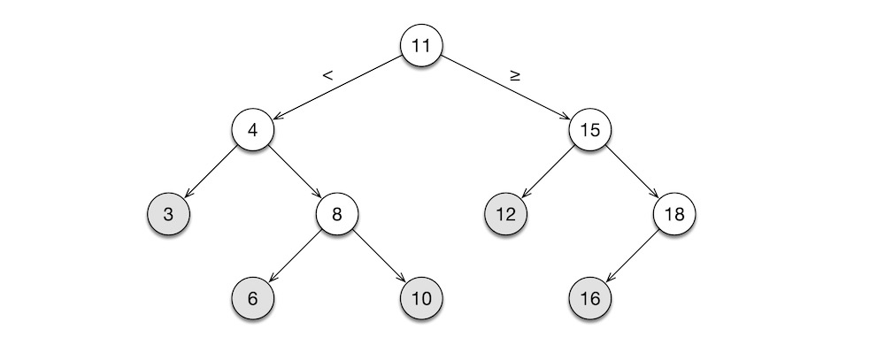

[TOC]

# INTRODUCTION

Since the birth of the [microprocessor](https://en.wikipedia.org/wiki/Microprocessor) in the 1970s, electrical engineers (EEs) have been implementing software: [digital signal processing](https://en.wikipedia.org/wiki/Digital_signal_processing) (DSP), [digital image processing](https://en.wikipedia.org/wiki/Digital_image_processing) (DIP), [process control](https://en.wikipedia.org/wiki/Process_control), and the like. Often, the target hardware platform is a tiny [microcontroller unit](https://en.wikipedia.org/wiki/Microcontroller) (MCU) with limited resources, so the code is commensurately limited in size and capability. And having spent a career among hardware bits and bobs, many EEs are unaccustomed to writing software on a large scale, and some even consider the task beneath their station.

This hands-off approach to software was the norm for several decades, because embedded software was simple, then. But today, [32-bit MCUs](https://en.wikipedia.org/wiki/Micro_Bit) with powerful processor and large memory are a commodity. Many devices come with onboard parallel processors for floating-point, audio, and graphics, along with built-in support for multiple communications protocols. When used for voice recognition, face detection, or similar tasks, a tiny modern MCU, with onboard speciality hardware, handily outperforms a top-end desktop computer from just a few years ago. As such, embedded software quickly has grown large and complex. And since just about every MCU manufacturer licenses the [ARM architecture](https://en.wikipedia.org/wiki/ARM_architecture_family), software portability across hardware products from different manufacturers has become an economic necessity, especially on large Internet of Things (IoT) projects. But given the knowledge and skills required to implement such EE-specific software, this task cannot be performed by typical IT coders who specialise in line-of-business web applications. Today's EEs must, therefore, be able to work in teams implementing large, complex software that runs on the hardware they designed. They must, therefore, master the tools and techniques of IT coders.

In this article, I describe the large-scale software development processes and practices commonly used in IT for decades. First, let me clear the air. There is no such thing as a "large, real-time, embedded software system"—at least it ought not—only large systems built out of many "small, real-time embedded software components" that monitor and control several hardware components.

For implementation examples, I use the C procedural programming (PP) language, because every practising EE today is familiar with this old, venerable language. For 50 years, C has been the definitive system programming language, and it will continue to be, for the foreseeable future. I also discuss, at a high level, object-oriented (OO) and functional programming (FP) techniques that are prevalent in modern software development. Given that EEs design computers, I will not waste your time rehashing sequential digital circuits, computer architecture, clocks, interrupts, memory-mapped I/O, communication protocols, and other familiar, hardware-related matters.

My audience is licensed, professional electrical engineers (PEs) and newly minted electrical engineering graduates (EEs) on the verge of entering the profession. By "electrical engineers", I mean both power engineers and electronic engineers. In the US, EEs are expected to possess foundational knowledge of both power (motors, generators, transmission lines, etc.) and electronics (analogue devices, digital circuits, radar systems, etc.), even if they specialise in one field or the other over the course of their careers. Also, I expect this article to be of use to mechanical, civil, and other engineering disciplines. After all, computing now permeates all aspects of engineering and, indeed, of modern life.

# SOFTWARE

These days, hardware engineers are obliged to implement large, complex software that monitor and control their hardware systems. You may have observed in your work, whenever a large hardware project is field tested, software problems usually percolate up to the top of the "issues" list. There are several reasons for this: all modern hardware projects involve software; software development is a young, immature field, compared to engineering; software design is more an art form and not quite an engineering discipline, like bridge design or radar design; there are no genuine "industry standards" in software, because every software team erects it own edifice of norms; by its very nature, no large software is free of bugs, so programming bugs cannot be regulated in the same manner as engineering malpractice; by extension, software development field, on the whole, is not amenable to regulation and licensure as does engineering; new generation of programmers are trained to work far above the hardware level and, therefore, unlike prior generations, they no longer have mechanical sympathy for the computer; software development managers, as a general rule, are not software developers, so they do not possess the essential hands-on technical skills. For these reasons, I shun the term "software engineering", for it is a misnomer, like calling an internal combustion engine a "motor".

So, if you, as an EE, find yourself in a project leadership role, recognise that the hardware team and the software team should be led using different styles. And you should educate yourself on the methods and motivations that drive software developers, as well as learn to empathise with their fears and frailties.

## *memory management*

Since this is an article aimed at EEs, let us jump into hardware-related software issues, first. No large, long-lasting (some say, legacy) software is free of bugs. Of all software bugs, memory errors are the most abundant. When Java emerged in the mid 1990s, the IT industry hopped from C++ to Java in an instant, because Java relieves programmer of the burden to manage his own memory.

Memory management is universally feared by IT business application developers. But to EEs who work with hardware, memory management is nothing extraordinary. Regardless, memory leaks are present in all large applications. Memory management, despite its conceptual simplicity, is perhaps the most error prone task in programming. So, as your programme grows in size and complexity, you must adopt a strategy for dealing with memory.

The advantage that embedded software has over business applications is simplicity of data. The simple machine-centric bit-oriented data types commonly used in real-time applications are far simpler than the exotic object hierarchies found in human-centric business applications. Embedded software typically use fixed-size buffers, like unsigned byte arrays, integer arrays, and floating-point arrays. Indeed, it is common practice in MCU programming statically to allocate buffers, and have the compiler assign stack memory to the buffer. This strategy obviates the need for dynamic, heap memory management, which is the prime source of memory fragmentation and memory leaks. Also, using static, stack memory offers a safety guarantee that the programme, at runtime, will not consume more memory than the amount the compiler had preallocated for it.

### ACCESS VIA POINTERS

Every EE who programs knows C well, especially the PP aspects and the hardware-centric features. But for completeness, I shall give a brief overview of pointers—a sore subject for most programmers, in IT at least.

At a primitive level, a computer is but an interpreter of CPU instructions. Some instructions are ALU operations: `add`, `mul`, `or`, `and`, etc. Others are flow control operations: `jump`, `call`, `halt`, etc. The rest are I/O operations: `ld`, `st`, etc. In a typical RISC architecture CPU, like the perennial [Acorn RISC Machine](https://en.wikipedia.org/wiki/ARM_architecture_family) (ARM), both the operands and the result of arithmetic-logic instructions are registers. The operand registers must first be loaded with data from RAM using `ld`, and after the operation, the contents of the result register must be stored in RAM using `st`. This is why RISC is sometimes referred to as the "load-store architecture".

Conceptually, the memory is a large, contiguous array of locations in which values maybe stored. Just as an array element is accessed via its index, a the contents of a memory location is accessed via its address. Ordinarily, the CPU accesses the RAM one word at a time: a 32-bit CPU accesses 4 bytes at a time, and a 64-bit CPU accesses 8 bytes at a time. Such "aligned" access to memory is efficient, but addressing arbitrary bytes in memory is inefficient. So, the compiler may pad data structures with zero bits to satisfy memory alignment constraints. While low-level details like this are beneath the conscientiousness of most C programmers, compiler backend writers, GPU programmers, and MCU programmers do have to pay attention to memory alignment issues.

To load the value of a variable from memory into a register, the `ld` instruction needs to know the address of the location in RAM where that variable is stored. In C, the address of that location is called the *pointer*. A pointer to a variable of the primitive `int` type has the derived type `int*`. Given a variable `v`, its pointer is obtained using the address operator `&`, as in `&v`. And conversely, given a pointer `p` to a variable, the value of that variable (contents of the memory location addressed by the pointer) is obtained using the dereferencing operator, as in `*p`.

```c
int v = 10;
int* p = &v;
*p += 5; // v == 15
```

Additionally in C, the name of an array variable and the name of the function are both pointers. Let us look at the array accessing code below.

```C
int a[] = {'a', 'b', 'c', 'd'};
int i = 2;
assert(a[i] == *(a + i)); // true
```

We can access an array element using the conventional syntax `a[i]`, as well as using the pointer dereferencing syntax `*(a + i)`. In the latter case, we are retrieving the value stored in the address `a + i`. Next, we look at how function pointers are used. Since C is a statically typed language, the compiler is able to determine how many bytes to jump with each increment of the index `i`. Because `a` is an array of `int` elements, `&a[2] - &a[1]` equals to `sizeof(int)`. That is, `++p` increments the pointer `p` by `sizeof(int)` bytes.

```c
typedef (*Proc)(int);
void proc1(int x) { ...; }
void proc2(int x) { ...; }
void proc3(int x) { ...; }

typedef struct Step {
  ...; // workflow data
  Proc proc; // pointer to a data processing option procedure
} Step;

Step s = (Step) {..., .proc=proc2};
```

Say, we are implementing a workflow engine where the type `Step` represents a single step in the workflow and the type `Proc` represents a pointer to a procedure associated with that workflow step, a procedure that takes an `int` and returns nothing. The three procedures, `proc1()`, `proc2()`, and `proc3()` are of type `Proc`. These procedures represent the different types of processing a workflow step can perform. A workflow chain can be built as an array of workflow steps. A workflow step can be configured to perform a particular procedure by setting its `proc` member to one of those procedures, as shown above. In this way, different workflow steps can be configured to perform any number of procedures. During workflow processing, this pre-configured procedure is invoked via `s.proc(x)`. Syntactically, `proc2` and `&proc2` mean the same; they both obtain the address of `proc2()` stored in memory.

### MEMORY ERRORS

But a simple, static-memory strategy is not ideal for large, complex, real-time embedded systems that must adapt to varying runtime conditions. Such systems require dynamic memory management. If you use heap memory, do be sure to match up fastidiously the `malloc()` and the `free()` calls. If you neglect to free the memory you allocated, you have a memory leak. If you will keep asking for memory chunks but never free them, the runtime will eventually run out of usable memory, and your system will crash.

And be leery of library functions, like `strdup()`, that quietly allocate a chunk of heap memory and return the pointer thereto. You, the caller, is responsible for freeing that memory. Wherever you call such a library function, mark that call with the `// alloc()` comment, so that you can use `grep` from the command line or text search in the IDE to match up the `alloc()` calls with the `free()` calls. And develop a habit of setting the pointer to `NULL`, immediately after calling `free()` on it. This way, if a freed pointer is accidentally used later, the programme will—more likely than not—cause a [segmentation fault](https://en.wikipedia.org/wiki/Segmentation_fault), thereby highlighting this pernicious bug.

Buffer overruns are another source of memory error. A buffer is overrun, when your code, while manipulating the buffer, unintentionally tramples over the memory region outside the bounds of that buffer. The behaviour of an application with a buffer overrun error is undefined, making this type of error a hacker's delight. To prevent buffer overruns, make explicit all memory uses in your programme. If your function needs to use dynamic memory, it should require the caller to provide both a preallocated buffer and the size of that buffer, and ensure that the function's code does not exceed the buffer bounds. This slight inconvenience to the caller is well worth the price for minimising exposure to memory leaks. And it is a common practice in C to use the `assert()` macro to ensure that the arguments and the preconditions of the function are as they should be.

### MEMORY-RELATED ERRORS

When performing I/O in embedded programming, there is a funny little memory-related error. MCUs use memory-mapped I/O: peripheral devices are assigned unique memory addresses. Typically, the programme communicates with a peripheral device by reading from and writing to a variable mapped to the address of the device's I/O port. A peripheral, by nature, may change its output value, without the knowledge of the MCU. So, even though the programme did not modify a variable representing the port, the value of that variable may still have changed between two places in the code. When the programme is prepared for production deployment, a good compiler will optimistically, and opportunistically, eliminate or reorder the seemingly ineffectual statements that manipulate the variable, believing that the variable's value remains unchanged between two different points in the code. This will make the programme behave in unexpected ways. By designating the port variable with the `volatile` qualifier, the compiler recognises that the value of this variable may change, even if the programme does not change it and, as such, would not optimise away the code that manipulates the variable. Failing to declare a port variable as a `volatile` memory location is an error that is easy to commit, but it is hard to debug.

Another trap that programmers fall into frequently is wrap-around error while manipulating an unsigned type. If variable `i` of type `unsigned int` were incremented or decremented past `UINT_MAX`, it wraps round to the opposite end: if the current value of `i` is `UNIT_MAX` and `i++` is performed, the new value is `0`; and if the current value of `i` is `0` and `i--` is performed, the new value is `UNIT_MAX`. Consider this code below.

```c
for (unsigned int i = --n; i >= 0; i--) { ...; }
```

This is an infinite loop, since `i` never dips below `0`. Unsigned wrap-around is actually an arithmetic error. But I mentioned it here, because programmers commonly encounter this error while bit twiddling—performing bit-wise operations on memory contents.

## *algorithm analysis*

Programmers with CS background approach problems in a different way than typical coders. When tackling any problem, coders fall on the `for` loop. CS-trained programmers, on the other hand, rely on recursion. They use recursive data structures to represent problem instances and they implement solutions using recursive functions. Moreover, programmers analyse the problem's constraints and to develop an optimal solution using mathematics, before they implement the solution on a computer. In CS, this subject is referred to as "algorithm analysis", and it employs discrete mathematics and probability. Most EEs receive little or no training in discrete structures, but given that EEs are now programming on a large scale, they should study this foundational CS subject.

### RECURSIVE DATA

An example of a recursive data structure is a tree. A node of the tree contains a pointer to objects of the same type. Trees efficiently hold hierarchical data in a parent-children relationship. Since information in real-life applications is naturally hierarchical, trees are used everywhere in programming. The organisational chart, components of a complex machine, contents of a book, a program's [abstract syntax tree](https://en.wikipedia.org/wiki/Abstract_syntax_tree) (AST), and the like, are represented using a tree.

The simplest type of tree is a binary tree which, in EE, is used to implement the [discrete wavelet transform](https://en.wikipedia.org/wiki/Discrete_wavelet_transform) (DWT). A binary tree is known in the DSP circle as cascading filter bank. EE folk draw their filter banks left to right, in the conventional signal flow direction. One child node of the DWT tree represents the next level averages (low-pass filtered) and the other child node represents the next level details (high-pass filtered). Each sub-signal has half the length of the parent. The DWT algorithm starts with the full-length signal, and recurs down the binary tree, until the base case is reach where the average sub-tree reduces to a scalar value that represents the zero frequency component (the DC level) of the original signal and the details sub-tree contains high-frequency components of the original signal. The complete DWT decomposition tree has the height of $lg(n)$, where $n$ is the length of the input signal. Hence, if the original signal is $256$ samples long, the DWT tree's height is $lg(256) = 8$. Here, $lg$ is the CS notation for $log_2$. Binary tree of 1D signal is easily extended to 2D images as [quadtree](https://en.wikipedia.org/wiki/Quadtree) and 3D volumetric data as [octree](https://en.wikipedia.org/wiki/Octree).

The "binary" in binary tree refers to the two sub-trees: the left sub-tree and the right sub-tree. A branch node's sub-tree pointers are `ltree` and `rtree`. Leaf nodes' sub-tree pointers are set to `NULL`. All nodes hold data which, in this case, is an integer `value`. A binary tree is built, node by node, starting with the root node. CS folk draw trees upside down, with the root node at the top and leaves at the bottom.

```c
typedef struct BNode BNode; // forward declaration needed for recursive pointer
struct BNode {
  BNode *ltree, *rtree; // recursive pointer
  int value;
};
```

The following figure shows a binary tree built out of `BNode` objects. The root node, the first one to be built, holds $11$ as its value. The root node's `ltree` points to the sub-tree rooted at $4$, and the `rtree` points to the sub-tree rooted at $15$. The $4$ node is the left child of the root node because $4 \lt 11$, whereas the $15$ node is the right child because $15 \ge 11$. As new nodes are added, the tree maintains this sorted order among its nodes. This tree is called the [binary search tree](https://en.wikipedia.org/wiki/Binary_search_tree).



### RECURSIVE CODE

The tree shape is a common data structure, and it appears in function implementations, as well. The binary search algorithm, shown below, has a recursive call stack. It finds a value stored in a binary search tree, like the one shown above.

```c
bool bst(const BNode* n, const int v) { // recursive function
  if (n == NULL) return false;
  if (v == n->value) return true;
  return v < n->value ? bst(n->ltree, v) : bst(n->rtree, v);
}
```

Given a binary search tree root at `n`, the function searches for the desired value `v` in the tree. The base cases (the bottom) of this recursion are when `n` is an empty tree and when `v` is found in the tree. The recursive step is either down the left sub-tree if `v` is less than the node's value or down the right sub-tree if `v` is greater than or equal to the node's value. The `bst(n->ltree, v)` and `bst(n->rtree, v)` in the last statement make explicit the recursive runtime behaviour of `bst()`.

Note the use of the `const` qualifier with the function arguments `n` and `v`. Here, `const BNode* n` means `n` is a pointer to an immutable `BNode` object. The compiler can enforce the immutability constraint, thus preventing accidental modification (side effect) to the input argument via the pointer. Likewise, `const int v` means `v` is immutable. Technically, there is no need to protect `v` against modification, since C's call-by-value function calling convention prevents the callee function from modifying the original value held by the caller. But designating `v` as immutable indicates to the reader of the code that the caller's variable is not mutated by the callee.

In the worst case, where `v` is not in the tree, the algorithm takes a maximum of $lg(n)$ steps to complete, where $n$ is the number of nodes in the tree. That is, search time for a large, million-element array is no worse than $lg(1,048,576) = 20$ steps.

Note that the incomplete binary tree above has $10$ nodes. If it were a complete tree, it would have two more nodes under $3$, two more under $12$, and one more under $18$, for a total of $15$ nodes. Hence, that complete binary tree has the height of $lg(15) \approx 4$. In a pathological case, we could end up with a tree that resembles a linked list, either having only left sub-trees or right sub-trees, throughout. If we are to search a non-existent value in this awful tree, the binary search tree algorithm degenerates to a linear list search, taking $n$ steps. Hence, it is vital that we build binary search trees that are balanced, like the one shown above. Over the past five decades, CS has invested much research effort into [self-balancing trees](https://en.wikipedia.org/wiki/Self-balancing_binary_search_tree).

To gain a deeper understanding of the recursive call structure of the binary search tree algorithm, let us trace the call `bst(t, 13)`, where `t` is the binary search tree shown above and `v` is $13$, a value that is not in this tree:

- `bst(t={11 tree root}, v=13)`
  - $13 \ge 11 \implies$`bst(t={15 right sub-tree}, v=13)`
    - $13 \lt 15 \implies$`bst(t={12 left sub-tree}, v=13)`
      - $13 \ge 12 \implies$`bst(t={NULL right sub-tree}, v=13)`
        - `return false`
      - `return false`
    - `return false`
  - `return false` $\implies$ $13$ is not in `t`

This indented call structure is the characteristic shape of a recursive function invocation. In older implementations of C compilers, function calls are far more expensive to perform than ordinary, linear statements. In those days, C aficionados—engineers and programmers alike—begrudgingly accepted these inefficient function calls out of necessity, but gleefully derided recursive functions for being embarrassingly inefficient compared to `for` loops and `goto` statements. It was once a common practice to transform recursion into iteration, and implement the resulting iterative algorithm using `for` loops. But today's sophisticated compilers can generate efficient code for a class of recursive function invocations called tail recursion. A [*tail recursion*](https://en.wikipedia.org/wiki/Tail_call) is when a function calls itself from the very last position. That is, the function performs no further computations after the recursive call. In the `bst()` function above, the `?` conditional expression is at the tail of the function, and both recursive calls are in their respective tail positions, too: the left recursion is at the tail of the then-branch and the right recursion is at the tail of the else-branch. A good modern compiler eliminates such tail calls and transforms the function into an efficient loop, using the `jmp` unconditional jump instruction. Even if a recursion is not a tail recursion at first glance, it is usually possible to transform it into a tail recursion using well-known techniques, such as the accumulator argument. So, it is nonsensical, these days, to avoid recursion.

Recursion and looping are equivalent. But the key advantages of implementing algorithms using recursive functions is code comprehensibility and guaranteed correctness. Almost all important algorithms in CS are recursive in nature. This is because the recursive structure is amenable to proof by [mathematical induction](https://en.wikipedia.org/wiki/Mathematical_induction), a simple, oft-used technique. Naturally, recursive algorithms are designed, proved, and described in formal publications using recursive equations. A recursive function that implements a recursive algorithm has a structure that mirrors the equation. This makes the code as readable as the equation it implements. More importantly, the correctness of this code can be verified by visual inspection. The algorithm has already been proven to be correct by its designer. This proof automatically guarantees the correctness of the programmer's implementation. It is common practice for programmers to validate their code by running it on test data samples. A mathematical proof of correctness is far stronger than any statistical testing.

On the flip side, the structure of a loopy code below bears no direct resemblance to the recursive algorithm it implements.

```C
bool bst(const BNode* n, const int v) { // loopy
  while (n != NULL) {
    if (v == n->value) return true;
    n = v < n->value ? n->ltree : n->rtree;
  }
  return false;
}
```

In this loopy version, the `return true` "found" result is syntactically distant from the `return false` "not found" result. Worse, the `n != NULL` "not found" check is nowhere near the "not found" result. The only way to understand fully the logical flow is to trace its execution, mentally on paper or computationally in debugger. And since the code does not match the algorithm, the programmer bears the additional responsibility of proving his code works correctly. For a simple algorithm like the binary tree search, these differences between recursion and looping is rather minor. But for a complicated algorithm, looping infrastructure (indices, pointers, and so on) muddy the logical flow to the point of incomprehensibility. For chuckles, compare the loopy [C implementation](https://rosettacode.org/wiki/Sorting_algorithms/Quicksort#C) against the recursive [Haskell implementation](https://rosettacode.org/wiki/Sorting_algorithms/Quicksort#Haskell) of the [quicksort](https://en.wikipedia.org/wiki/Quicksort) algorithm published on [Rosetta Code](https://rosettacode.org/wiki/Rosetta_Code).

If you work in a maths-heavy field like DSP, DIP, sonar, radar, and the like, it is vital that you learn to think recursively, not only when studying the algorithm but also when implementing it. After having translated the mathematical description into a correct recursive implementation and, only if it is deemed necessary for performance reasons, proceed to convert the recursive implementation into an iterative version. But inject into the iterative code plenty of comments that refer back to the correct, recursive algorithm and the original, mathematical description. Indeed, it would be useful to retain a few key sections of the recursive code in the comments of the corresponding iterative code.

Know this: in life-critical applications, correctness always trumps performance and cost.

### TIME AND SPACE COMPLEXITY

In CS, algorithmic complexity is the analytical technique used to estimate the time and space costs the algorithm incurs on the computer. Algorithmic complexity is expressed using the $O$-notation. The $O$ stands for "order", which is an estimate of cost. Between the parentheses appears an order function, which can be constant, logarithmic, linear, polynomial, exponential, factorial, and so on. The runtime of algorithms can be ranked as follows, from fastest to slowest:

- *practically immediate*—$O(1)$ means constant runtime; element lookups for arrays and hashtables, as well as some priority queues, are linear order
- *very fast*—$O(lg(n))$ means logarithmic order; binary search algorithm and others that divide the problem into two parts are logarithmic order
- *fast*—$O(n\ lg(n))$ means $log_2$ logarithmic order repeated $n$ times; the most famous algorithm in this order is the [quicksort](https://en.wikipedia.org/wiki/Quicksort)
- *acceptable*—$O(n)$ means linear order; several common algorithms that walk the list, like counting the elements of the list or reading records from a CSV file, are linear order
- *slow*—$O(nm)$ means quadratic order in the $n \times m$ 2D input, but linear order in the total number of elements $nm$ of the input; matrices (rows and columns) and graphs (vertices and edges) are 2D by nature, and both dimensions of the data structure affect the runtime of the algorithm that manipulates it
- *very slow*—$O(n^c)$ means polynomial order; many difficult algorithms in CS are polynomial order
- *practically crawling*—$O(c^n)$ means exponential order, where $c$ is a constant and $n$ represents the number of input data elements; exponential order algorithms are impracticably slow (and even slower ones, say $O(n!)$ factorial order), so approximating tricks have to be employed

Time complexity is the time it takes for the algorithm to complete the task. It is measured in steps. A step is equivalent to a recursive step or a loop iteration. The maximum time complexity of the binary search algorithm above is $O(lg(n))$. A naïve linear search algorithm that walks the length of the array, on the other hand, would take $O(n)$. Space complexity is the amount of memory the algorithm consumes in performing the task. It is a function of the number of elements of a data structure. Both the binary search and the linear search algorithms work with an array of size $n$, so they both have space complexity of $O(n)$.

Note that algorithm's time complexity is different from the execution time of its implementation. Time complexity is measured in abstract unit of "steps", whereas execution time is measured in concrete unit of "seconds". Likewise, space complexity is measured in abstract unit of data "items", but memory consumption is measured in concrete unit of "bytes".

It may, at first, be unnatural to deal with abstract units like "steps" and "items", when one is used to using "seconds" and "bytes". But by relinquishing the concrete and thinking in the abstract, we are able to compare the relative merits of different algorithms, without getting sidetracked by the differences in implementation details, such as processor brand, processor clock speed, memory size, memory clock speed, etc.

Having said that, EEs are not entirely unmoored from the real world; "seconds" and "bytes" determine the success of the application in the field. So, think abstractly when designing on paper, but think concretely when implementing on computer. Most of the practical algorithms you will encounter are polynomial time $O(n^c)$ or faster. And if an algorithm you designed is an exponential time $O(c^n)$, you should either try to find a faster solution or implement a polynomial-time approximation algorithm. I know of no exponential time algorithm usable in real-time environment.

In CS, this subject is called *complexity theory*. See my article [*Computer Science Curriculum*](../CS/Curriculum.md) for a more detailed description.

## *software organisation*

As a practical matter, software organisation is about being able to locate quickly your predecessor's old buggy code so that you may fix it and knowing where exactly to add your new buggy code so that your successor may readily find and fix it. In principle, on the other hand, software organisation is about modular design.

### DESIGN

Like in many engineering fields, concepts in software development are organised as structural (static) and behavioural (dynamic) matters. The first task in software development is to derive the design from requirements. Static design tasks are creating recursive data structures, like lists, trees, graphs, and so on, that hold the programme state. Dynamic design tasks are creating functions, usually recursive ones, that manipulates those data structures, thereby advancing the programme state. This style of writing programmes is called *functional programming* (FP), and it is used predominantly in CS academia. LISP, ML, and their descendants—Scheme, OCaml, Haskell, etc.—are FP languages.

In IT industry, *objective-oriented programming* (OO) style is used, almost exclusively. In the OO style, the static and the dynamic elements are combined into one entity called the class. A class is a record with built-in functions, which are called "methods" in OO parlance. That is, a class has both data and code. Ordinarily, data of a class can only be manipulated by its methods. An object is an instance of a class. At runtime, the programme's state is distributed across several objects, and objects interact with one another by sending messages. Collaboration amongst objects advances the programme state. Simula, Smalltalk, and their descendants—Objective-C, C++, Java, etc.—are popular OO languages.

Then there is *procedural programming* (PP) style, which is the style that originated with FORTRAN. C is a prominent PP language. OO can be considered an evolution of PP. But since the rise of C++ in the 1980s, PP style has declined in popularity. But by the 2020s, the features of C++, Java, and other OO languages have grown to an excess, and with it the attendant complexity. There is now a resurgent interest in simpler PP style. In the past few years, many new PP languages have emerged—Nim, Zig, Odin, Vale, etc.—intending to take C's place at the top of the system programming language pantheon. For the foreseeable future, C will remain at its perch at the pinnacle.

Note that currently popular languages that emerged after 2010s—Rust, Swift, Kotlin, etc.—are hybrids: they have PP, OO, and FP elements to varying degrees. In the 1960s, programming language field was bursting at the seams with innovative ideas, but there was no exchange of ideas between different camps. By the 1980s, inventions slowed down and language designers started to create "new" languages by crossing traits from different camps. C was at its peak of popularity; it was used to implement everything: applications, compilers, databases, networking protocols, operating systems. This was when the first hybrids—Objective-C (C with Smalltalk OO concepts) and C++ (C with Simula OO concepts)—emerged. Nearly all languages that came after that point are hybrids. One characteristic of hybrids is that they contain little or no innovative concepts; they are mere rehashes of existing ideas dressed in new syntax.

The arrival of C++ in the 1980s shook the IT industry to its core. The entire industry, in unison, switched from PP to OO, on the back of C++. In the 2020s, the industry is beginning to appreciate the benefits of FP, but a precipitous switch from OO to FP is highly unlikely. First, OO is entrenched in all areas of IT. Secondly, it is a formidable, practicable programming style. Thirdly, OO is intuitive and is easily learned by novices, but FP requires mathematical sophistication and CS background. OO's future in IT looks secure.

The important thing to recognise is that the syntax of the language affects convenience and cuteness, whereas its semantics provides design philosophy and organisational framework. All too often, programmers pay undue regard to the syntax. They cannot countenance the syntactic peculiarity of some language and, consequently, they never absorb the semantic innovations that the language offers. This is how LISP, ML, Smalltalk, and the like never took hold in IT; the syntax is decidedly not C. Conversely, programmers seek a new language that targets a particular programming task, but employs the old, familiar syntax. This is how JavaScript, the language of the Web, took hold in IT; the syntax is  Java (essentially C), the semantic is a mix of LISP and Smalltalk, and the target domain is the Web. I implore you to rise above the syntactic prejudices.

The bottom line is this. We can still write PP programmes in C today for system programming tasks, and we can adopt useful organisational concepts from OO and FP—in C syntax, of course.

### DATA

To organise data better, records were introduced. A record is a composite type built from a collection of primitive types. In C, a record is a `struct`. A `struct` is what is referred to as a product type in [category theory](https://en.wikipedia.org/wiki/Category_theory). The term *product* refers to the fact that the combination of all possible values a `struct` type can represent is the product the cardinalities of its constituent types. So, `struct S { bool b; char c; }` can represent $\lvert b \rvert \times \lvert c \rvert = 2 \times 256 = 512$ different values. A traditional C programme consists of several procedures that mutate a global `struct` that holds the programme state.

Another way to organise data is a disjoint union, which is called `union` in C. A `union` can hold only one of its constituents at any moment. In category theory, a `union` is designated a sum type. It is called *sum* because the combination of all possible values is a sum of the cardinalities of its constituent types. Hence, `union U { bool b; char c; }` can represent $\lvert b \rvert + \lvert c \rvert = 2 + 256 = 258$ different values.

In terms of memory usage, `sizeof(struct S)`$\ =\ $`sizeof(bool)`$\ \cup\ $`sizeof(char)`$\ = 2$ bytes, whereas `sizeof(union U)`$\ =\ $`sizeof(bool)`$\ \cap\ $`sizeof(char)`$\ = 1$ byte. Do not confuse a type's representable values with its memory consumption.

In modern, high-level, strongly-typed languages, such as TypeScript or Haskell, product types are used to represent records (`Employee`, `Inventory`, etc.), whereas sum types are used to represent choices (`False | True`, `North | East | South | West`, etc.). Records may have overlapping constituent values, such as two employees having the same first name. Choices, however, have non-overlapping constituent values, as in if a boolean variable is `False`, it cannot simultaneously be `True`.

In C, `struct` is used to represent product types, which is similar to high-level languages. But C `union` is used primarily as a memory saver, not as a sum types. 

### FUNCTIONS

C is procedural to its core. That is, the procedure is a fundamental unit of organisation in a C programme. What C programmers refer to as functions are actually procedures. A *procedure* is just a named sequenced of statements that perform a task. The procedure can be invoked wherever the task needs to be performed. The programme itself is a sequence of calls to various procedures. The programme state is usually a collection of global variables. At runtime, one procedure after another mutates the global variables, thereby advancing the programme state. For better organisation of data at runtime, C programmes use a global `struct` to bundle a hodgepodge of global data needed by various parts of the code.

Mathematically, a *function* $f: X \rightarrow Y$ is a map from the domain set $X$ to the codomain set $Y$. In pure functional languages, like Haskell, a function is an expression that maps its argument to its result, without any side-effects: no input argument mutation, no console or file I/O, no global variable mutation. C does have procedures that behave like pure functions: `cos()`, `sin()`, `exp()`, `sqrt()`, etc.

C functions, like their mathematical counterparts, can return only one value. That value can be a compound type like `struct` or `enum`, a primitive type like `int`, `float`, etc., or a pointer type like `int*`, `float*`, etc. C passes and returns `struct` parameters by value. That is, when passing a `struct` parameter to a function, C runtime makes a copy of that struct, places the copy on the function's call stack, and binds the copy to the function's argument. Similar copying occurs when the function returns a `struct` value. For large records, copying wastes time and space. For expedience, programmers often use pointer-typed arguments as both input and output.

```c
typedef struct Vec {
  int count; // number of components
  float* c; // column vector
} Vec;

extern void outerprod(const Vec* u, const Vec* v, Vec* r);
```

Given the above `Vec` type and the `outerprod()` function declarations, the programmer must allocate the result vector `r` of the appropriate size when computing the outer product of vectors `u` and `v`. He must also remember to free the result vector `r`, later. But if either `u` or `v` is not needed for subsequent computations, the programmer may opt to reuse one of them in place of `r`, as in `outerprod(u, v, u)`, thus eliminating a potential memory error and also reducing heap space fragmentation. From the perspective of `outerprod()`, the three vectors `u`, `u`, and `r` are three separate memory chunks. But from the perspective of the C runtime, the `r` pointer is an *alias* of the `u` pointer: both pointers point to the same chunk of memory.

Pointer aliases hinder the compiler's ability to optimise. If the implementer of the vector library wishes to optimise the implementation of the function `outerprod()`, he may designate the arguments with the `restrict` qualifier. In that case, reusing one of the argument pointers as a result pointer will result in a compiler error.

```c
extern void outerprod(const Vec* restrict u, const Vec* restrict v, Vec* restrict r);
```

I mentioned above that `struct` values in C are passed by copying. To eliminate this inefficiency, most C functions accept and return pointers to `struct` values. This we saw earlier in the implementation of the `bst()` binary search tree function.

### MODULES

In the 1950s, the dawn of general-purpose computers and high-level programming languages, a programme is an implementation of one algorithm contained in one file. For example, a programme may solve a differential equation, perform matrix multiplication, or something equally small and simple. This restriction was necessary, given the limited memory capacity and processor capability of those computers and languages. In short, one file worth of code must fit within the tiny memory and the code must not be too taxing for the anaemic processor.

But by the late 1960s, both hardware and software technologies had advanced enough to implement large, complex software—OSs, compilers, simulators, etc.—in high-level languages. It then became essential for programmes to be organised in a logical, disciplined manner. In those days, memory was still a costly technology, so even high-end computers did not have adequate amount of memory. The simplest way to make programmes larger, yet still fit within small memory, is to break up the programme into multiple procedures, say one sizeable procedure per file, and swap the files back-and-forth between the memory and the disc.

The 1970s saw the rise of modern computers ([CRAY-1](https://en.wikipedia.org/wiki/Cray-1), [VAX-11/780](https://en.wikipedia.org/wiki/VAX-11), [8080](https://en.wikipedia.org/wiki/Intel_8080)), modern OSs ([MVS](https://en.wikipedia.org/wiki/MVS), [UNIX](https://en.wikipedia.org/wiki/Unix), [VMS](https://en.wikipedia.org/wiki/OpenVMS)), and modern languages ([ML](https://en.wikipedia.org/wiki/Standard_ML), [Smalltalk](https://en.wikipedia.org/wiki/Smalltalk), [Scheme](https://en.wikipedia.org/wiki/Scheme_(programming_language))). These seemingly "ancient" technologies are actually modern; today's computers, OSs, and languages are their direct descendants.

C is from that era of imagination and innovation. And it is the only technology from that time that is still in widespread use today, yet has remained essentially unchanged from its original design. C became publicly available in 1972 (although it was born in 1969). It was also around this time that modular software practices were established and virtual memory became a standard OS facility. On a computer equipped with 32-bit memory hardware (VAX-11/780) and under a virtual memory capable OS (UNIX), the C compiler is able to link multiple modules and generate a single, large programme that could address $2^{32} = 4,294,967,296$ bytes, that is 4 GB. A typical VAX-11 in those days had no more than 256 KB of RAM. The memory controller hardware aids the OS's virtual memory service map the 4 GB address space down to the actual physical memory space. The virtual memory facility eliminated the need to implement the error-prone, custom module swapper. To assembly programmer of the day, the ability to program in a human-readable language like C without having to worry about module swapping—all without sacrificing runtime performance—was almost a miracle.

Under modern software organisation practices, a *module* is an organisational unit that contains conceptually related data and code. Typically, a module corresponds to a file, and the file name matches the module name. Implementations of data structures, like list, queue, hashtable, tree, graph, etc., and the associated code that manipulate them, are organised in individual modules. In C, module implementation comprises the `.h` header file that represents the module's external interface and the `.c` file that represents the module's internal implementation. The implementer expressly publishes those elements that are publicly accessible using the `extern` modifier in the `.h` file, and tags those elements that must be hidden from the public with the `static` modifier in the `.c` file.

### LIBRARIES

All C programmers reflexively use libraries, like `stdio`, `string`, or `math`. A *library* is a collection of modules compiled and archived into an archive file. There are two types of library files: `.a` static archive file and `.so` dynamic shared object file.

A library contains modules which contains constants, record types, procedures, and functions. Say, your code calls the `sin()` function. This function is defined in a module which is archived in the `libm.a` maths library. When you compile your programme, you can instruct the compiler to link the `sin()` function statically or dynamically. If you opt for static linking, the compiler (actually the linker invoked by the compiler) bakes into your programme the pre-compiled code of the `sin()` function. If you opt for dynamic linking, the compiler includes only a stub to the `sin()` function in your programme, thereby reducing the size of the executable. At runtime, when your programme calls the `sin()` function, the C runtime looks for the necessary pre-compiled code in the maths shared object file. If the shared object file is absent on the target system, your programme crashes. On the other hand, statically linked programme uses a bit more disc space, but is guaranteed to run on any target system. Given that most IoT devices are bare metal (without OS), statically linking the supporting runtime into the deployed programme is the norm in embedded systems.

Note that static linking a library into a programme does not mean the programme executable contains the entire pre-compiled library; the linker extracts from the library archive only those pieces of code needed by the programme, then links that extract into the final executable.

### SERVICES

Programmes are organised at multiple levels. At the lowest level, we have variables, records, procedures, and functions. Above them, we have modules that organise related variables, records, procedures, and functions into individual files, say one file per algorithm. Above modules, we have libraries that organise multiple modules into one linkable binaries, like maths library, graphics library, and so on. At the highest level, we have services. A *service* is an independent, full-fledged application that is expressly designed to collaborate with other applications via some inter-process communications mechanism, thereby comprising a large system built out of many independent, reusable, duplicatable subsystems. This topic is discussed below, as part of the discussion on communications.

Essentially, services are the modern analogues of UNIX commands. UNIX commands collaborate with one another by exchanging tab-separated text data via pipes. Modern services collaborate with one another by exchanging JSON text data over a networking protocol.

## *software documentation*

Today, documentation is a lost art in software development. Most practitioners spout the "code is comment" nonsense. This disdain for documentation sprang from multiple sources: coders in general are unaccustomed to writing prose, nor are they readers thereof; modern coders rely on [Reddit](https://www.reddit.com/) posts for all their answers; given the immense complexity of today's large software, there is usually no one person who understands the system in its entirety; a typical large software system comprises many independent services, which are funded and managed by different, and often competing, groups within the organisation; the "ship first, fix later" philosophy permeates the IT industry, because it justifies the needlessly-continuous deployment practice; fast-paced deployment cycles encourages programmers to take shortcuts, and the first to be cut is the documentation, which no one bothers to read in the first place. As an EE, you cannot ride roughshod over consumers of your product like that—governing regulations would not permit it. So, take documentation seriously.

This section is brief not because documentation is insignificant, but because its importance obviates the need for a lengthy discussion.

### COMMENT

Comments are the most common kind of software documentation. The purpose of a comment is to aid reading comprehension of the code. In the simplest form, a comment may simply point the reader to the page number of a textbook or a peer-reviewed paper. A more generous form would include a brief overview of the algorithm which the code implements. A comprehensive comment, which typically appears at the top of a module, may include a detailed explanation of the algorithm's purpose and the programmer's intent. Use your judgement and follow local cultural norms, when commenting your code.

### MANUAL

As an EE, you are well acquainted with hardware manufacturers' user manual, reference manual, practice guide, and so on, each document having more than a thousand pages. It is unnecessary to document software to that extent, but a modicum of writing is necessary to document demands, design, decisions, deployment, dangers, etc.

### README

Perhaps the most important kind of documentation is a guide aimed at easing the lives of new team members—a README file, if you will. It should be brief. It should be up-to-date. And it should include the purpose of the project, the design overview and choices, the organisation of the project, and the introduction to tools and techniques.

# PROCESS

Not long ago, a typical embedded programme is implemented by one person, the hardware designer, and is only a few hundred lines long. Those days are over. Some modern IoT systems are comparable in size and complexity to mid-sized enterprise systems, comprising many independent, distributed components that collaborate over the internet. As the system grows larger, so must the team. When there is more than one programmer, it is necessary to have a process.

A process is an expansive term that encompasses people, products, and projects. This term is as loaded as it is vague. In large organisations, including governmental organs, IT departments make a big show of designing and documenting extensive, rigid processes, which are used by the overseers to prod the labouring masses. On the other hand, there is no real process to speak of, in small organisations. A process's purpose is to control chaos. When it controls nothing, or when it over controls everything, the process loses its reason for existence. It is better to avoid such extremes and to take a balanced, nuanced approach to process.

## *people*

Embedded system projects should be led and managed by a seasoned EE. The role of software in embedded systems have been expanding quickly over the past few years. This means the project manager must also be familiar with software development tools and techniques. Moreover, he must know how to manage software developers who have no hardware engineering background.

Licensed, experienced EEs know how to manage hardware projects and lead hardware engineers. So I will focus here on managing and leading software developers. Unlike the programmers of the past decades, many modern coders do not have a background in mathematics, engineering, or computer science. As such, they may have difficulties in understanding EE-specific topics, like DSP, DIP, radar, etc. It is, therefore, advisable to pair each coder with a hardware engineer, and have each pair work on a specific component. Often, the engineer will design the hardware and the associated algorithms, and the coder will convert a prototype implementation of the algorithm into a production software. In due course, this pair will cross train each other.

The important thing that the chief hardware designer, namely you, must do is to not let the software design slip out of your grasp. Left unchecked, coders will create software design without regard to hardware. Once REST APIs, web servers, containers, and load balancers took hold in your project, you are about to lose control, or have lost it. If you do choose to use those software technologies, do so because you recognise their utility, not because the coders in your team demand so. Above all, document all design choices, and keep the software design up to date, just as you would the hardware design.

## *tools*

At a minimum, a software development team should have a repository that holds tested code. Note that no code base is devoid of bugs. Still, the team should hold the code base sacred and endeavour to keep it as pristine as possible.

If the code repository is sacred, the production system is divine. Nothing should be deployed to production without a review by at least a couple of different persons who possess the requisite skills and knowledge. This human touch is most important: it is the last line of defence for embedded systems that impact life and limb. Teams developing safety-critical systems should not flirt with [CI/CD](CI/CD).

Today, [GitHub](https://github.com/) is a most popular choice for repository and deployment. GitHub has many tools for managing massive projects. If your team is small, trying to use every available tool on GitHub would make your process burdensome. And know this: many process-related issues spring not from a lack of tools that control the process but from the lack of respect for the process.

Of less importance, but no less essential, is the choice of IDE. And today, that choice is Microsoft's open-source [VS Code](https://code.visualstudio.com/). Another popular open-source IDE is [Atom](https://atom.io/). Many embedded teams use the MCU manufacturer's proprietary IDE and compiler, like the [ARM Development Studio](https://developer.arm.com/Tools%20and%20Software/Arm%20Development%20Studio). Typical embedded system developers are hardware designers who are unaccustomed to, and uncomfortable with, open-source software. So, they opt for proprietary software supplied by the hardware vendors they trust. Another reason is liability. Hardware products often make their way into safety-critical systems. A failure in this environment always involves litigation, and litigation always involves apportioning of blame. Using tested, licensed, supported tools is one way embedded system designers reduce their exposure to liability.

Bottom line is this: tools do not produce products, people do, and tools should help people, not hinder them. The more tools you use, the more complicated your process becomes. So, minimise the number of tools and choose tools by their ability to reduce workload and their potential for eliminating errors, not for their apparent sophistication and their popularity among the cognoscenti.

## *user interface*

Every useful system, hardware and software, has a user interface (UI). Even those embedded systems that work without human intervention need some type of UI, either for maintenance diagnosis or for performance monitoring. By "useful", I mean simple. A simple, usable UI enables novice users to be functional and it empowers expert users to be fluent.

A simple text user interface (TUI) is often the best option for embedded system. A TUI could be, either menu driven or command driven. Menu-driven TUI is appreciated by novices, and command-drive TUI is cherished by experts. A sophisticated graphical user interface (GUI) is not only unnecessary, it is outright insupportable. A typical embedded system does not have excess resources to support complicated GUI. But even a barebones TUI often takes up more than half the resources, both during development and in production. This is because UI interacts with the most unpredictable component of the system: the human user. Most UI code is littered with error checks. And the UI is also the part that changes the most frequently, both during development and in deployment.

A *menu-driven TUI* of moderate complexity will need the following screens:

- *monitor*—overall system status monitor screen
  - *subsystems*—a number of subsystem monitoring screens organised under the main monitor screen
- *data*—data import/export screen; most IoT and autonomous systems will need remote data access
- *settings*—system configurator screen with multiple panels, each grouping a handful of related, adjustable system parameters; shutdown and reboot commands are housed on this screen
- *help*—online user's manual (optional)

Each TUI screen shows a summary of the essential pieces of information, followed by a short menu with 5 or 6 selections. Each menu item may either perform a task immediately, or it may cause the TUI to navigate to a deeper screen in the hierarchy. So, a menu-driven TUI is stateful: the system jumps from state to state, as the user interacts with the menus. A menu-driven TUI works just like a typical GUI, but with far less code, complexity, and cost.

A *command-driven TUI* is quite different from a menu-driven TUI. In general, a command-driven TUI requires far less effort than a menu-driven TUI. Moreover, a command-driven system is stateless, for the most part: most commands operate in isolation, although some commands must be issued in a particular order. The user accomplishes his task by issuing individual commands. A command-driven TUI works like Git commands issued at a Linux console.

The best approach for mid-sized embedded systems is to use a combination of command- and menu-driven TUI designs. For stateless tasks, use commands. For stateful tasks, use menus. In any case, try to steer clear of GUIs; they are costly and are not justifiable for most embedded systems.

Frequently, the users for whom you are designing the UI have little or no idea of what it ought to be. But as business experts, they do possess intimate knowledge of their business processes and they certainly know what they wish to accomplish. You, as the designer, should not foist upon the users your opinions of how the system ought to be used, but try to design the UI that best fits the users' goals. Most users cannot articulate their wants and needs, when asked. But when shown a prototype UI, they will raise strong objects as to why your design is off the mark. So, do not over design the UI at the start of the project. Instead, let it evolve along with the users' familiarity with the system and their evolving operational needs.

## *communication*

Since the 1960s, embedded systems used the asynchronous, serial communications protocol defined in the [RS-232](https://en.wikipedia.org/wiki/RS-232) standard. Today, every embedded device comes with UART (asynchronous) and USART (synchronous) serial communications chip, and the serial communications remains the most frequently used protocol to exchange data between a pair of embedded systems. Within one system, the MCU and its peripherals use [I$^2$C](https://en.wikipedia.org/wiki/I%C2%B2C) and [SPI](https://en.wikipedia.org/wiki/Serial_Peripheral_Interface) to exchange data. Separate devices collaborate over a [CAN](https://en.wikipedia.org/wiki/CAN_bus). All of these are serial protocols. These protocols differ as to the use of synchronisation, supported distances, required number of wires, and attendant software complexity. EEs knows these protocols well, so I shall not dwell upon them, here.

As size and sophistication of embedded systems grow, and with the emergence of the IoT craze, web protocols are now being used increasingly in embedded systems. The abundance of open-source frameworks makes web protocols much too enticing for average programmers. I have observed autonomous vehicle designs—production systems, mind you—that employ [JSON](https://en.wikipedia.org/wiki/JSON)-speaking [RESTful](https://en.wikipedia.org/wiki/Representational_state_transfer) web applications deployed in heavy-weight web containers, which in turn are installed on [Docker](https://en.wikipedia.org/wiki/Docker_(software)) instances, all under a commonplace desktop OS running on an off-the-shelf laptop. No software hardening; no hardware ruggedising. Web developers building embedded systems operating in harsh environments: this is indeed a novel trend.

The Web is one of the most innovative technologies in the history of software. Today's densely connected global community would not exist without the Web. Web protocols are designed for short-lived sessions—file transfers, email exchanges, ecommerce transactions, blog posts, etc. Since around 2010, web applications have been dominating enterprise software arena. Today, a line-of-business web application can be implemented in just a few hundred lines of code, using any one of the thousands of web frameworks in existence. Naturally, every new business application developed today is a web application. But this is a result of confusing expedience with effectiveness. Fast development time by no means implies fast runtime. Usually, it is quite the opposite.

Consider this. The client application is written in JavaScript and this code is interpreted by the virtual machine (VM) baked into another application—the browser—which runs atop the OS. The client and the server exchange text messages over HTTPS, which is the encrypted version of the HTTP text protocol, which runs over TCP binary protocol in the BSD Sockets networking stack, which is built into all modern OSs. Each client request must traverse this many-layered stack once on the client and once more on the server, and each server response must do it all over again. At best, a web application is an inefficient client/server implementation. At worst, it is an anathema to efficiency. Worse, each HTTP message exchange occurs over an individual TCP session; for each request, the client initiates a TCP connection with the server, over which the server sends a response, and upon receipt of said response the client terminates the connection. To get around this inherent problem of HTTP, new web protocols were created: WebSocket and Secure WebSocket, which were designed to maintain one TCP connection between the browser and the server. But WebSocket is still a bloated, text-based web protocol. Efficiency disembarked well before this event train departed the station.

Since the modern Internet came about in the early 1980s, it has run on TCP, UDP, IP, and numerous other related protocols, which are collectively part of the expansive [Internet Standard](https://en.wikipedia.org/wiki/Internet_Standard). Classic client/server applications were implemented using either TCP or UDP. But these binary protocols operate at much too low a level for modern business applications. In the business world, ease-of-implementation, time-to-market, and other economic factors trounce correctness, efficiency, and other technical factors. And enterprise applications run on massive server farms. Hence, inefficient web applications are quite effective in the business environment. But it is nonsensical for resource-constrained IoT applications to use bloated protocols like HTTP, at least not everywhere.

As is the tradition, EEs today must continue to employ their judgement in select the right protocol for the task at hand. Over short distances, conventional serial protocols are optimal. There are also short-range wireless technologies, such as [BLE](https://en.wikipedia.org/wiki/Bluetooth_Low_Energy) and [Zigbee](https://en.wikipedia.org/wiki/Zigbee). Where independent systems must collaborate over a long distance, however, Internet protocols are better. But before jumping headlong into web protocols, first consider if a Socket-based, high-level options might be better: [FTP](https://en.wikipedia.org/wiki/File_Transfer_Protocol), [SCP](https://en.wikipedia.org/wiki/Secure_copy_protocol), [`rsync`](https://en.wikipedia.org/wiki/Rsync), whatever. If those are inadequate, next consider if your own custom protocol layered over low-level [TCP](https://en.wikipedia.org/wiki/Transmission_Control_Protocol) or [UDP](https://en.wikipedia.org/wiki/User_Datagram_Protocol) might work. Only as the last resort, choose web protocols. If you have to deal with local proxy servers or must tunnel through the server's port 80 or 443, then you might as well use a readymade web framework, and call it a "good design".

Lastly, no system is ever completely hand-off; there will come a time when you need to access it, remotely over the Internet or locally via a terminal—monitoring, maintenance, data exchange, etc. I am seeing another disturbing trend here, as well. Many people are opting to implement web portals to monitor and control autonomous embedded systems. Usually, the only communication link between devices in the field and the headquarter is a high-latency, low-throughput, encrypted channel, which those devices need to collaborate amongst themselves. The monitoring web portal needs each deployed device to run a web server and securely transfer huge JSON files between each device and the control centre over the slow link. This is pure nonsense. In this situation, the sensible thing to do is to implement a custom TCP or UDP protocol and access field devices using a command-driven TUI.

Let me put it plainly: do not swing a claymore if a dagger suffices.

## *storage*

Traditional embedded devices were used in real-time applications, and they had no need to store operational data. But today, even a trivial IoT system that performs a superficial service has an AI capability—because AI, or rather the semblance thereof, sells. Any system that performs trend analysis needs a decent amount of storage. Fortunately, tiny SD cards with huge capacities are dirt cheap, so data logging has become commonplace.

The flip-side problem, of course, is managing those massive amounts of data. For *logging* periodic snapshots, a `.csv` file is about the best means. It is simple and effective. Of course, your programme must ensure to purge old log records regularly, in order to avoid running out of disc space.

But if your programme needs not only to keep data but also to read them, say for trend analysis of some kind, you should consider a more sophisticated means. [Berkley DB](https://en.wikipedia.org/wiki/Berkeley_DB) *key-value store*, offers good performance and simplicity. And since it has been around since 1986, it is a battle-tested piece of kit. Always consider Berkeley DB first, before you fall for Redis, Mongo, or some other NoSQL data store. These technologies are sophisticated, with clustering, ACID, and other fancy features. But fancy inevitably means cost, both during development and in production.

And if you need a full-fledged *relational database*, you should design the system so that only the necessary minimum amount of data are held on the embedded device, and the rest of the data are archived on a powerful server. These days, a "powerful server" in the IoT context means a [Raspberry Pi](https://www.raspberrypi.com/) running [SQLite](https://en.wikipedia.org/wiki/SQLite) on Linux. If your application has grown to this extent, you might as well rely on web technologies, like a REST API. But tread lightly; you are now on thin ice. A step or two further in that direction lies the porous border between IoT systems and enterprise web applications.

Embedded systems that operate in safety-critical environments *archive* as much operational data as possible—for monitoring operations, for analysing historical records, for planning future features, for legal protection just in case. Often, the data are stored in a database. But there is a yet-untapped resource for this purpose: Git.

Git is the most popular distributed source repository. It archives every modification made to the repository. It supports multiple users, optimistic locking, and distributed storage, all with speed and reliability. It is remarkably simple to turn Git into a data archive repository. The design of this system includes multiple, distributed servers (Pi SBCs), each serving as the archive host for the local network of embedded devices. This server organises data into files, as needed by the application. The server software makes changes to the data, when requested by its local, embedded clients. The server commits these changes when triggered by a timer or by an event. In the simplest case, you can invoke Git commands from inside a C programme: `system("git commit ...")`, for example. A Git server is much lighter than a typical database server. And Git obviates the need for the programmer to implement custom archiving processes.

Think twice before adopting a heavy-weight, relational database as the persistence tier in embedded applications. Databases are well suited to business applications with complex, inter-related data structures. But they are overkill for use with scientific experiments and engineering applications, whose data structures are embarrassingly simple. Choose tools that meet, but not exceed, the needs.

## *infrastructure*

Modern embedded systems, especially of the IoT variety, are built from many independent devices that collaborate over a network, wired or wireless. This means the system relies on the communication and lifecycle services provided by the underlying infrastructure: networks, switches, servers, monitors.

As an EE, you will not be designing, building, running, maintaining, and upgrading infrastructural components; it is the responsibility of your IT department. I mentioned the topic here, because it directly impacts your system. Before you fill out that online request to stand up one more component, consider the following.

Infrastructure in a typical IT production environment usually starts out simple, maybe even elegant. But it gradually, inexorably devolves into a huge mess that no one fully understands, nor wants to. The way to view infrastructure is not how expansive its design is but how expensive it will be to maintain over the coming decades. Infrastructure is a magical force: to deploy a service, you need multiple supporting services, and so it grows, exponentially. So, the less of it you can live with, the better off you will be. And resist the urge to turn your embedded system into an enterprise computing platform.

## *security*

In the past, embedded systems worked in isolation. Even those system with independent devices that collaborated over a local network were not connected to the Internet. But with the advent of IoT, embedded systems are now readily available for hackers to attack. Worse, most embedded systems are far less secure than a typical business web application. Security services can be taxing on the resource-constrained embedded hardware.

The most effective way to prevent Internet-borne attacks is to not connect the system to the Internet. But if Internet accessibility is a necessity, set up a hardened server within the local network, and funnel all communications through this secure server. And you should implement the server software using an established web framework with a reputation for security.

Moreover, you should employ defensive coding techniques—like using preallocated buffers and explicitly specifying buffer sizes—when implementing the software that runs on each embedded device in the network. See the resource list at the end of this article for some reference on software security.

# CONVENTIONS

Coding formatting conventions are a sore topic in programming and, I dare say, since the first [store-programme computers](https://en.wikipedia.org/wiki/Stored-program_computer) appeared in the late 1940s. Until recently, team mates fought to the death over how precisely to format the code. But today's powerful, configurable code formatters have all but eliminate such consternations. In fact, the pointlessness of format-fights have led many teams forcibly to adopt "the team format". Code format is a trifle to the compiler, but a consequential to the human. The modern consensus on code formatting is as follows:

- Each programming ecosystem has its own set of tools and conventions. Adopt them, before setting off to establish your own.
- Use an IDE, not a text editor. [VS Code](https://code.visualstudio.com/) has become the industry-standard IDE in IT, and for good reasons, too.
- Do not use `\t` tab characters to indent; use spaces, instead. Modern IDEs dislike tabs.
- Be compact: use 2-space indentation; do not sprinkle blank lines all over the code; hang block-opening brace at the end of the line, etc. Compact format fits more code on screen, which gives a clearer view of logic flow and eliminates unnecessary scrolling.
- Organise each reusable block of code in a procedure. Procedure invocation overhead is more tolerable today than in the past, thanks to smarter compilers and faster computers.
- Get it right, then get it tight. Implement a correct, simple solution first, then refactor and optimise it when the need arises. That is, the first iteration of the code should resemble the governing equations, recursion, variable names, the lot of it. Such code is readable and verifiable. Often, it needs no further improvements.
- Balance portability against maintainability. C is notorious for achieving portability by overusing macros. Macros are hard to write, hard to read, and hard to maintain. It is better to separate hardware-dependent, infrastructural code from hardware-independent, algorithmic code. Once the non-portable code has been isolated into individual modules, you can compile selectively for the chosen target using configurable build tools, such as CMake, Make, and the like.
- Read the source text. Everyone who writes scientific programmes should know the underlying theories. In all fields of science, there is a handful of textbooks that are considered holy; read at least one of them, and preferably all of them. If you work in cutting-edge area of a field, you should additionally read the latest peer-reviewed papers. Maintain a list of these texts, so that new team members could learn the material.
- There is no need to use every feature that a language offers. Opt for features that are commonly used, especially those that enhance code comprehension.
- Write predictable code. For example, do not flip and flop between the `error` and the `result` slots in the statement `return cond ? error : result`. Consistency reduces the reader's mental workload.
- Write code for readers. The largest portion of time in programming is spent reading existing, buggy code. Cutting reading time means substantive gains in team productivity.
- Write code that speaks softly. Demarcating each block of code with rows of `*` asterisked comments is childish, perhaps even churlish.
- Write substantive comments. Do not pollute the code with obvious comments. Sometimes, it suffices to cite the source text by page number and equation number. Other times, it is necessary to provide a brief summary of the algorithm. Use your judgement.

# CONCLUSION

I want EEs who read this article to take away the following points about medium- to large-scale embedded software design:

- Corral related features into reusable components.
- Build a system out of collaborating components—like Unix shell scripts built on existing commands.
- Seek out abstractions that are neither too fine nor coarse but optimal for the task at hand.
- It is easier to build than it is to maintain, so design for maintainability.
- Trends are ephemeral, principles are perennial.
- Keep it small; keep it simple; keep it elegant.
- Do right by your successors.
- Do right by your team.
- Do right by your clients.

## *resources*

- [*The C Programming Language*](https://www.amazon.com/Programming-Language-2nd-Brian-Kernighan/dp/0131103628/ref=sr_1_1?crid=357RL26HANQQN&keywords=c+programming+language&qid=1667756916&sprefix=c+programming+languag%2Caps%2C71&sr=8-1), Kernighan
- [*Effective C*](https://www.amazon.com/Effective-Introduction-Professional-Robert-Seacord/dp/1718501048/ref=sr_1_4?crid=357RL26HANQQN&keywords=c+programming+language&qid=1667756944&sprefix=c+programming+languag%2Caps%2C71&sr=8-4), Seacord
- [*Design Patterns for Embedded Systems in C*](https://www.amazon.com/Design-Patterns-Embedded-Systems-Engineering/dp/1856177076/ref=sr_1_8?keywords=embedded+c+programming&qid=1667756995&sprefix=embedded+%2Caps%2C77&sr=8-8), Douglass
- [*CERT C Coding Standard*](https://wiki.sei.cmu.edu/confluence/display/c/SEI+CERT+C+Coding+Standard), SEI
- [*Version Control with Git*](https://www.amazon.com/Version-Control-Git-Collaborative-Development/dp/1492091197/ref=sr_1_1?crid=IX978OMPHZWJ&keywords=git&qid=1667757514&s=books&sprefix=git%2Cstripbooks%2C69&sr=1-1), Ponuthorai
- [*The Pragmatic Programmer*](https://www.amazon.com/Pragmatic-Programmer-Anniversary-Journey-Mastery/dp/B0833FBNHV/ref=sr_1_40?crid=13GY4OKGQBX8T&keywords=software+architecture&qid=1667757407&sprefix=software+architecture%2Caps%2C75&sr=8-40), Thomas
- [*Discrete Mathematics with Applications*](https://www.amazon.com/Discrete-Mathematics-Applications-Susanna-Epp/dp/1337694193/ref=sr_1_3?keywords=discrete+mathematics&qid=1667757355&sprefix=discrete+%2Caps%2C77&sr=8-3), Epp
- [*Introduction to Algorithms*](https://www.amazon.com/Introduction-Algorithms-fourth-Thomas-Cormen/dp/026204630X/ref=sr_1_3?crid=2JM027S8VKPIO&keywords=algorithms&qid=1667757315&sprefix=algorithm%2Caps%2C71&sr=8-3), Cormen
