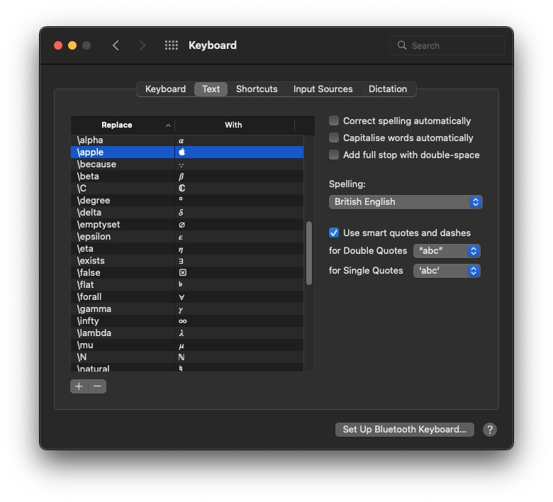
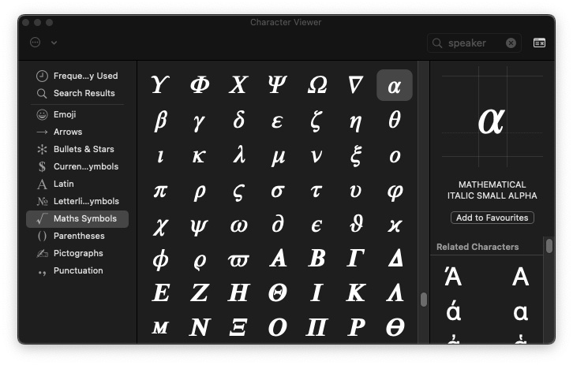

## *Using Text Replacement Facility*

All modern OSs support [Unicode](https://en.wikipedia.org/wiki/Unicode), but entering the glyphs on Windows and Linux can be a laborious process, involving dialog boxes and menu items. On macOS, however, the user can use the built-in automatic text replacements facility quickly to enter any Unicode glyphs into text documents and social media posts, without having to use the $\TeX$ typesetting system or the niggly cut-and-paste. But do note that although the technique described below can enter short, one-liners like $\omega = 2𝜋f$, it cannot empower a word processor or a web browser properly to typeset an equation like the Fourier transform below:

$$
F(\omega) = \int_{-\infty}^{+\infty}{f(t) e^{-jwt}\,dt}
$$

First, we must configure the keyboard shortcuts. We start by selecting ` → System Preferences...` menu item, which opens the **System Preferences** dialogue. There, click the `⌨️ Keyboard` icon to open the **Keyboard** dialogue. Once there, select the `[Input Sources]` panel, and select the `☑︎ Show Input menu in menu bar` option item. Now, the new, input selection menu appears on the system menu bar at the top-right corner, near the speaker volume setting menu.

At this point, you can use the `Show Emoji & Symbols` menu item from the input selection menu to open the **Character Viewer**, and start entering symbols into your document at will. The character viewer shows all the Unicode symbols the macOS supports in a well-organised fashion, grouped into categories, like ***Emoji***, ***Arrows***, ***Maths Symbols***, and so on. But we STEMers use many mathematical symbols, Greek letters, special characters, weird arrows, and odd punctuations, every time we write. As such, we are forced to prowl the categories and hunt for the symbols we need. We can copy oft-used symbols into the ***Frequently Used*** category, of course, but this single category soon overflows with hundreds of symbols, and we end up having to hunt for symbols, all over again.

Since we use the $\TeX$ typesetter when we publish papers, we are already well acquainted with the $\TeX$ commands, like `\alpha`, `\beta`, `\forall`, `\exists`, etc. So, we shall configure macOS's text replacement facility to replace `\alpha` with 𝛼 automatically, as we type. To do that, we next, go to the `[Text]` panel in the **Keyboard** dialogue, as shown below.

Press the `[+]` button at the bottom to create a new pair. Enter `\alpha` in the ***Replace*** column. Next, press the `TAB` key to move to the ***With*** column. To enter the 𝛼 symbol in this column, we must open the **Character Viewer** shown in the screenshot below. There, navigate to the ***Maths Symbols*** category, scroll down toward the bottom of the symbols page, and select the 𝛼 symbol, which is named `MATHEMATICAL ITALIC SMALL ALPHA`. Double clicking on the 𝛼 symbol inserts it into the column. Now, press the `ENTER` key.

In this way, you can configure the text replacement facility with all the Unicode symbols you commonly use. You can use a [cheatsheet](https://www.caam.rice.edu/~heinken/latex/symbols.pdf) published by any university mathematics department for a list of $\TeX$ commands. After you have configured all the symbols, you can type `\omega = 2 \pi f` in a word processor or a browser, and macOS will automatically render $\omega = 2 𝜋 f$, as you type. I remind you, again: you cannot typeset mathematics using this technique, but you can create one-liners that looks mathematical.
